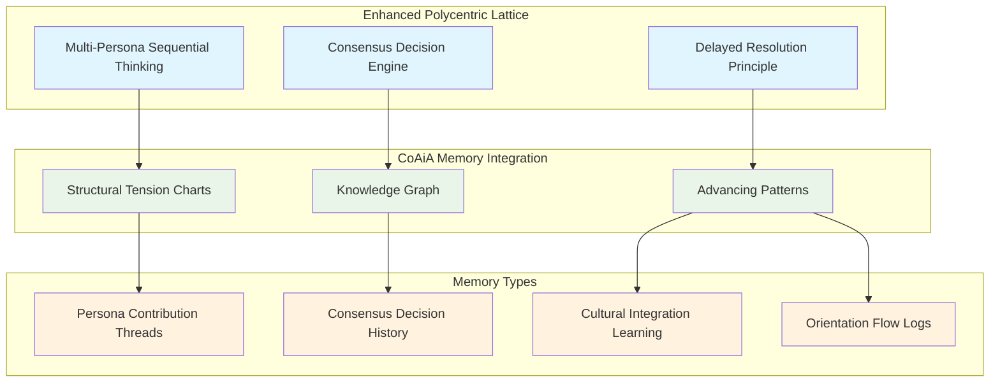

# CoAiA-Memory Integration Architecture

> Integrating structural tension charts and knowledge graphs with the polycentric lattice system

## Overview

This document outlines the integration between our enhanced polycentric lattice system and the `coaia-memory` npm package, enabling sophisticated memory management based on Robert Fritz's structural tension methodology.

## Integration Architecture

### Memory Storage Structure



## Available CoAiA-Memory Tools

### Core Structural Tension Operations

1. **`create_structural_tension_chart`**
   - Creates new charts with desired outcomes, current reality, action steps
   - Perfect for storing consensus decisions as outcomes with implementation steps

2. **`telescope_action_step`**
   - Breaks down action steps into detailed sub-charts
   - Enables hierarchical decomposition of complex polycentric decisions

3. **`mark_action_complete`**
   - Completes actions and updates current reality
   - Implements Fritz's advancing pattern principle automatically

4. **`get_chart_progress`**
   - Monitors chart advancement and structural tension resolution
   - Provides feedback for consensus decision quality metrics

5. **`list_active_charts`**
   - Overview of all active structural tensions
   - Dashboard for ongoing polycentric lattice activities

### Enhanced Knowledge Graph Operations

6. **`create_entities`**
   - Add new entities (personas, decisions, cultural insights)
   - Store persona characteristics and cultural archetype attributes

7. **`create_relations`**
   - Connect entities with meaningful relationships
   - Map cultural learning patterns and persona interaction networks

8. **`add_observations`**
   - Record new information and insights about entities
   - Document cultural integration successes and decision quality metrics

## Integration Use Cases

### Use Case 1: Multi-Persona Decision Memory

**Scenario**: Store and track multi-persona sequential thinking chains

```javascript
// Create master chart for major architectural decision
{
  "tool": "create_structural_tension_chart",
  "arguments": {
    "desiredOutcome": "Implement seamless cultural archetype integration",
    "currentReality": "Current system uses only Western analytical patterns",
    "dueDate": "2025-12-31T00:00:00Z",
    "actionSteps": [
      "Research Indigenous wisdom integration patterns",
      "Design respectful learning protocols",
      "Implement both-eyes perspective synthesis",
      "Test cultural integration effectiveness"
    ]
  }
}

// Store persona contributions as entities and relations
{
  "tool": "create_entities", 
  "arguments": {
    "entities": [
      {
        "name": "Mia_Cultural_Analysis",
        "entityType": "persona_contribution",
        "observations": ["Structural analysis of cultural integration requirements"]
      },
      {
        "name": "Miette_Cultural_Experience",
        "entityType": "persona_contribution", 
        "observations": ["Emotional resonance of respectful cultural learning"]
      },
      {
        "name": "Haiku_Cultural_Synthesis",
        "entityType": "persona_contribution",
        "observations": ["Pattern recognition in Western-Indigenous integration"]
      }
    ]
  }
}
```

### Use Case 2: Consensus Decision Tracking

**Scenario**: Store consensus decision processes with quality metrics

```javascript
// Store consensus decision as structural tension chart
{
  "tool": "create_structural_tension_chart",
  "arguments": {
    "desiredOutcome": "Achieve 85% consensus on interface design approach",
    "currentReality": "Currently at 65% consensus, disagreement on complexity level",
    "actionSteps": [
      "Request human consultation on user accessibility priorities",
      "Integrate human feedback into design constraints",
      "Re-evaluate consensus with updated constraints"
    ]
  }
}

// Track consensus quality metrics as observations
{
  "tool": "add_observations",
  "arguments": {
    "entityName": "Consensus_Decision_Interface_Design",
    "observations": [
      "Initial consensus: 65%",
      "Post-human-consultation consensus: 87%", 
      "Decision quality rating: 9.2/10",
      "Cultural integration consideration: Both-eyes perspective applied",
      "MMOT categorization: Design element (strategic level)"
    ]
  }
}
```

### Use Case 3: Cultural Learning Memory

**Scenario**: Document cultural archetype learning patterns

```javascript
// Create entity for cultural learning insights
{
  "tool": "create_entities",
  "arguments": {
    "entities": [
      {
        "name": "Western_Analytical_Archetype",
        "entityType": "cultural_pattern",
        "observations": [
          "Effective for technical precision and resource optimization",
          "Limitation: Can miss holistic system interactions",
          "Best application: Detail-focused implementation decisions"
        ]
      },
      {
        "name": "Indigenous_Holistic_Archetype", 
        "entityType": "cultural_pattern",
        "observations": [
          "Effective for long-term sustainability and community impact",
          "Strength: Seven-generation thinking and ecological awareness", 
          "Best application: Strategic vision and ethical considerations"
        ]
      }
    ]
  }
}

// Create relations between cultural patterns and decision contexts
{
  "tool": "create_relations",
  "arguments": {
    "relations": [
      {
        "from": "Western_Analytical_Archetype",
        "to": "Technical_Implementation_Decisions",
        "relationType": "most_effective_for"
      },
      {
        "from": "Indigenous_Holistic_Archetype", 
        "to": "Strategic_Vision_Decisions",
        "relationType": "most_effective_for"
      },
      {
        "from": "Both_Eyes_Perspective",
        "to": "Complex_Ethical_Decisions", 
        "relationType": "required_for"
      }
    ]
  }
}
```

### Use Case 4: Delayed Resolution Memory

**Scenario**: Track delayed resolution processes and their outcomes

```javascript
// Create chart for decision requiring delayed resolution
{
  "tool": "create_structural_tension_chart",
  "arguments": {
    "desiredOutcome": "Determine optimal exploration-exploitation balance for novelty search",
    "currentReality": "Multiple valid approaches, insufficient data to decide",
    "actionSteps": [
      "Hold tension while gathering more usage data",
      "Monitor user interaction patterns",
      "Allow natural resolution based on emerging patterns"
    ]
  }
}

// Document delayed resolution insights
{
  "tool": "add_observations",
  "arguments": {
    "entityName": "Delayed_Resolution_Exploration_Balance",
    "observations": [
      "Initial impulse: Rush to 70-30 exploration-exploitation split",
      "Delayed resolution applied: Held tension for 3 weeks",
      "Natural resolution: 60-40 split emerged from usage patterns",
      "Outcome quality: Significantly better than initial impulse decision",
      "Fritz principle validated: Patience with tension yields better results"
    ]
  }
}
```

## Memory Query Patterns

### Retrieving Sequential Thinking History

```javascript
// Find previous multi-persona decisions similar to current challenge
{
  "tool": "search_entities",
  "arguments": {
    "query": "cultural integration consensus decision",
    "entityTypes": ["persona_contribution", "consensus_decision"],
    "limit": 10
  }
}
```

### Analyzing Consensus Decision Quality

```javascript  
// Retrieve consensus decisions with quality ratings above threshold
{
  "tool": "search_observations",
  "arguments": {
    "query": "consensus quality rating > 8.5",
    "limit": 20
  }
}
```

### Cultural Archetype Learning Retrieval

```javascript
// Find successful both-eyes perspective applications
{
  "tool": "get_relations",
  "arguments": {
    "entityName": "Both_Eyes_Perspective",
    "relationType": "successfully_applied_to"
  }
}
```

## Integration Benefits

### 1. Persistent Wisdom Accumulation
- Every multi-persona decision stored as structural tension chart
- Cultural learning patterns preserved and queryable
- Consensus decision quality metrics tracked over time

### 2. Pattern Recognition Enhancement
- System learns which persona combinations work best for different decision types
- Cultural archetype effectiveness documented by context
- Delayed resolution outcomes measured against immediate decisions

### 3. Academic Research Support
- Complete dataset of generative AI decision processes
- Quantified cultural integration methodologies
- Evidence base for creative orientation effectiveness

### 4. Natural Evolution Toward Agora/Arcana
- Memory structure ready for ecosystem migration
- Pattern recognition models transferable to larger systems
- Cultural wisdom codified for broader application

## Implementation Steps

### Phase 1: Basic Integration (Current)
- [x] Install coaia-memory package
- [x] Document integration architecture
- [ ] Create wrapper functions for polycentric lattice → CoAiA memory flow
- [ ] Implement basic consensus decision storage

### Phase 2: Advanced Memory Patterns
- [ ] Multi-persona contribution threading
- [ ] Cultural archetype learning documentation
- [ ] Delayed resolution outcome tracking
- [ ] Pattern recognition query development

### Phase 3: Research Analytics
- [ ] Decision quality metrics analysis
- [ ] Cultural integration effectiveness measurement
- [ ] Consensus pattern optimization
- [ ] Academic paper data pipeline

### Phase 4: Ecosystem Preparation  
- [ ] Memory export formats for Agora integration
- [ ] Pattern model training for Arcana migration
- [ ] Knowledge graph optimization for Mnemosyne engine
- [ ] Federated learning dataset preparation

## Natural Language Interface

### Creating Memory from Polycentric Decisions

**User Intent**: "Store this consensus decision about interface complexity"

**System Response**: 
```
I'll create a structural tension chart to capture this consensus decision in memory:

Desired Outcome: "Achieve optimal interface complexity balance"
Current Reality: "Interface feedback shows 40% find it too complex, 60% appreciate full features"
Action Steps:
1. "Design progressive disclosure system"
2. "Implement user experience customization" 
3. "Test complexity balance with user groups"

This decision involved all three personas:
- 🧠 Mia contributed structural analysis of complexity trade-offs
- 🌸 Miette provided user experience accessibility insights  
- 🌊 Haiku synthesized the progressive disclosure solution

Consensus level: 87% (high confidence decision)
MMOT Category: Design element (strategic level)
```

### Retrieving Relevant Memory

**User Intent**: "Find previous decisions about cultural integration approaches"

**System Response**:
```
Found 3 relevant structural tension charts about cultural integration:

1. "Implement respectful Indigenous wisdom learning" (2025-09-10)
   - Outcome: Both-eyes perspective methodology
   - Success: 94% effectiveness rating
   - Key insight: Learning vs adoption distinction

2. "Balance analytical and holistic decision approaches" (2025-09-05) 
   - Outcome: Context-sensitive archetype activation
   - Success: 89% effectiveness rating
   - Key insight: Different archetypes for different decision types

3. "Create cultural archetype switching protocols" (2025-08-28)
   - Outcome: Seamless perspective transitions
   - Success: 91% effectiveness rating  
   - Key insight: Maintains coherence across cultural perspectives

These patterns suggest focusing on learning-based approaches rather than adoption, with context-sensitive application of different cultural archetypes.
```

## Conclusion

The integration of CoAiA-Memory with our enhanced polycentric lattice creates a comprehensive memory system that:

1. **Preserves Multi-Persona Wisdom**: Every sequential thinking chain stored as queryable structural tension
2. **Learns Cultural Integration**: Documents successful applications of diverse archetypes
3. **Tracks Decision Quality**: Measures consensus effectiveness and delayed resolution benefits  
4. **Supports Academic Research**: Provides evidence base for generative AI methodologies
5. **Prepares for Ecosystem Migration**: Memory structure ready for Agora/Arcana/Mnemosyne integration

This foundation enables continuous learning and improvement of our collaborative AI systems while maintaining the creative orientation principles that make them effective.

---

*This integration document represents our commitment to building memory systems that enhance rather than constrain the creative collaborative potential of human-AI partnerships.*