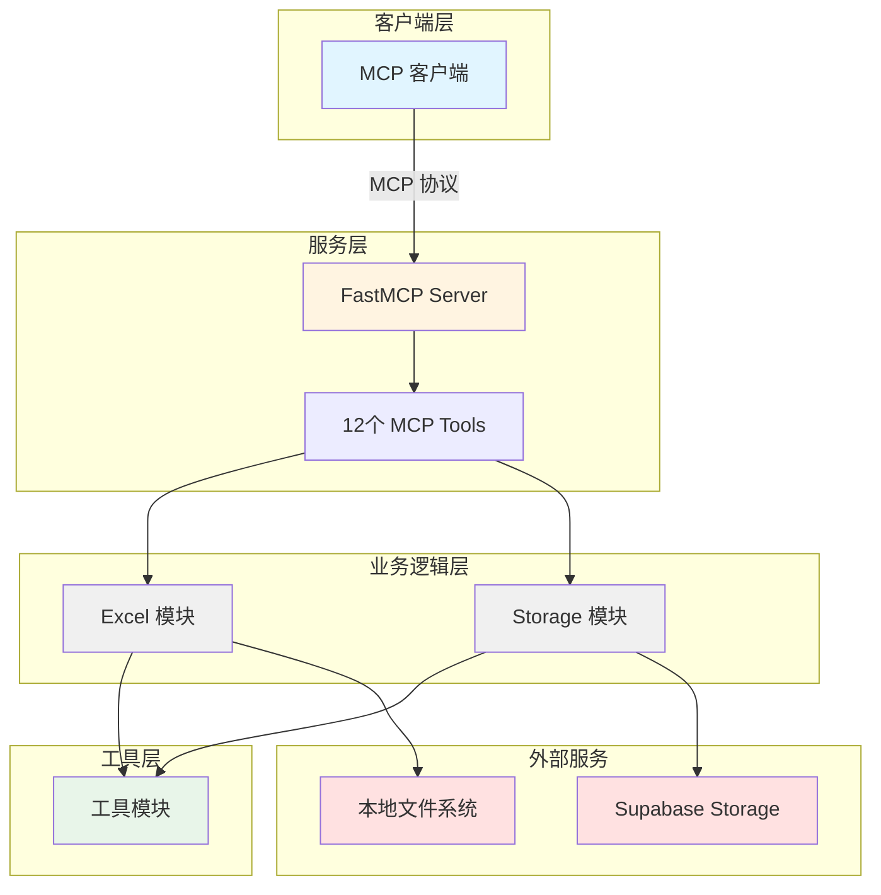
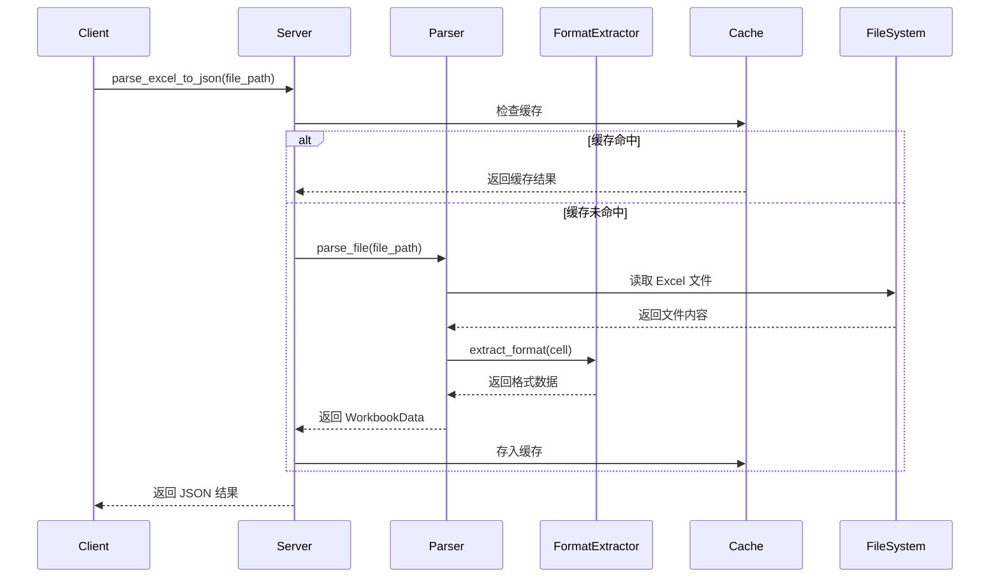
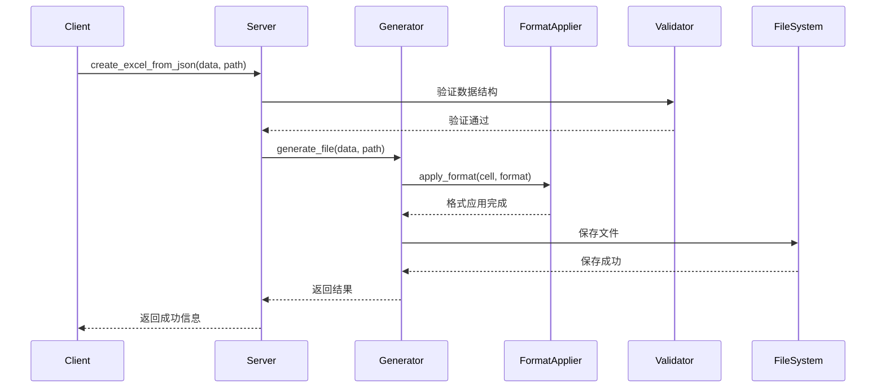

# Excel MCP Server 架构文档

本文档详细描述 Excel MCP Server 的系统架构、设计理念和技术实现。

## 📋 目录

- [系统概述](#系统概述)
- [架构设计](#架构设计)
- [核心模块](#核心模块)
- [数据流](#数据流)
- [技术栈](#技术栈)
- [设计模式](#设计模式)
- [性能优化](#性能优化)
- [安全性](#安全性)

---

## 系统概述

### 项目定位

Excel MCP Server 是一个基于 Model Context Protocol (MCP) 的 Excel 文件处理服务器，提供：

- **Excel 文件解析**：将 Excel 文件转换为 JSON 格式
- **Excel 文件生成**：从 JSON 数据创建 Excel 文件
- **格式编辑**：修改单元格格式、合并单元格、设置行高列宽
- **公式计算**：支持 20+ 常用 Excel 公式
- **工作表管理**：创建、删除、重命名、复制、移动工作表
- **文件合并**：合并多个 Excel 文件
- **云存储集成**：与 Supabase Storage 无缝集成

### 核心特性

- ✅ **无依赖 Office**：不需要安装 Microsoft Office 或 WPS
- ✅ **完整格式支持**：保留字体、颜色、边框、对齐等所有格式
- ✅ **高性能**：LRU 缓存、并发处理、流式 I/O
- ✅ **类型安全**：完整的 Pydantic 模型验证
- ✅ **可扩展**：模块化设计，易于添加新功能
- ✅ **生产就绪**：完善的错误处理、日志记录、监控

---

## 架构设计

### 整体架构



### 分层架构

```mermaid
graph LR
    subgraph "Layer 1: 接口层"
        A1[MCP Tools]
    end
    
    subgraph "Layer 2: 业务层"
        B1[Excel Parser]
        B2[Excel Generator]
        B3[Format Editor]
        B4[Formula Manager]
        B5[Sheet Manager]
        B6[File Merger]
        B7[Storage Manager]
    end
    
    subgraph "Layer 3: 核心层"
        C1[Format Extractor]
        C2[Format Applier]
        C3[Cell Merger]
        C4[Dimension Adjuster]
        C5[Formula Engine]
        C6[Data Validator]
        C7[Stream Processor]
    end
    
    subgraph "Layer 4: 工具层"
        D1[Cache]
        D2[Logger]
        D3[Error Handler]
        D4[Validator]
        D5[Monitor]
        D6[Concurrency]
    end
    
    A1 --> B1
    A1 --> B2
    A1 --> B3
    A1 --> B4
    A1 --> B5
    A1 --> B6
    A1 --> B7
    
    B1 --> C1
    B2 --> C2
    B3 --> C1
    B3 --> C2
    B4 --> C5
    B5 --> C3
    B6 --> C7
    
    C1 --> D1
    C2 --> D2
    C3 --> D3
    C4 --> D4
    C5 --> D5
    C6 --> D6
    C7 --> D1
```



---

## 核心模块

### 1. 服务层 (Server Layer)

**文件**：`src/mcp_excel_supabase/server.py`

**职责**：
- 创建 FastMCP 服务器实例
- 注册 12 个 MCP 工具
- 处理客户端请求
- 统一错误处理和日志记录

**关键代码**：
```python
from mcp.server.fastmcp import FastMCP

mcp = FastMCP("Excel-Supabase-Server")

@mcp.tool()
def parse_excel_to_json(file_path: str, extract_formats: bool = True):
    # 工具实现
    pass
```

---

### 2. Excel 模块 (Excel Module)

**目录**：`src/mcp_excel_supabase/excel/`

#### 2.1 Excel Parser（解析器）

**文件**：`excel/parser.py`

**职责**：
- 读取 Excel 文件（.xlsx）
- 提取工作表、行、单元格数据
- 调用 Format Extractor 提取格式
- 返回 Pydantic 模型

**依赖**：
- `openpyxl`：读取 Excel 文件
- `format_extractor.py`：提取格式
- `utils/cache.py`：缓存解析结果

#### 2.2 Excel Generator（生成器）

**文件**：`excel/generator.py`

**职责**：
- 从 JSON 数据创建 Excel 文件
- 调用 Format Applier 应用格式
- 保存文件到本地

**依赖**：
- `openpyxl`：创建 Excel 文件
- `format_applier.py`：应用格式
- `data_validator.py`：验证数据

#### 2.3 Format Editor（格式编辑器）

**文件**：`excel/format_editor.py`

**职责**：
- 修改单元格格式（字体、颜色、边框、对齐）
- 批量格式化
- 保留未修改的格式

**依赖**：
- `openpyxl`：操作 Excel 文件
- `format_extractor.py`：读取原格式
- `format_applier.py`：应用新格式

#### 2.4 Cell Merger（单元格合并器）

**文件**：`excel/cell_merger.py`

**职责**：
- 合并单元格
- 取消合并单元格
- 验证合并范围

**依赖**：
- `openpyxl`：操作合并单元格
- `utils/validator.py`：验证单元格范围

#### 2.5 Dimension Adjuster（尺寸调整器）

**文件**：`excel/dimension_adjuster.py`

**职责**：
- 设置行高
- 设置列宽
- 批量调整尺寸

**依赖**：
- `openpyxl`：操作行高列宽

#### 2.6 Formula Manager（公式管理器）

**文件**：`excel/formula_manager.py`

**职责**：
- 设置单元格公式
- 调用 Formula Engine 计算公式
- 处理公式错误

**依赖**：
- `openpyxl`：设置公式
- `formula_engine.py`：计算公式

#### 2.7 Formula Engine（公式引擎）

**文件**：`excel/formula_engine.py`

**职责**：
- 解析 Excel 公式
- 计算公式结果
- 支持 20+ 常用函数
- 检测循环引用

**依赖**：
- `formulas`：公式计算库

**支持的函数**：
- 数学：SUM, AVERAGE, MIN, MAX, ROUND, ABS, SQRT, POWER
- 统计：COUNT, COUNTA, COUNTIF
- 逻辑：IF, AND, OR, NOT
- 文本：CONCATENATE, LEFT, RIGHT, MID, LEN, UPPER, LOWER

#### 2.8 Sheet Manager（工作表管理器）

**文件**：`excel/sheet_manager.py`

**职责**：
- 创建工作表
- 删除工作表
- 重命名工作表
- 复制工作表
- 移动工作表

**依赖**：
- `openpyxl`：操作工作表

#### 2.9 File Merger（文件合并器）

**文件**：`excel/file_merger.py`

**职责**：
- 合并多个 Excel 文件
- 处理重名工作表（rename/skip/overwrite）
- 保留或忽略格式

**依赖**：
- `openpyxl`：读写 Excel 文件
- `stream_processor.py`：流式处理大文件

#### 2.10 Format Extractor（格式提取器）

**文件**：`excel/format_extractor.py`

**职责**：
- 从 openpyxl Cell 对象提取格式
- 转换为 Pydantic 模型
- 处理字体、填充、边框、对齐、数字格式

#### 2.11 Format Applier（格式应用器）

**文件**：`excel/format_applier.py`

**职责**：
- 将 Pydantic 格式模型应用到 openpyxl Cell
- 设置字体、填充、边框、对齐、数字格式

#### 2.12 Data Validator（数据验证器）

**文件**：`excel/data_validator.py`

**职责**：
- 验证工作簿数据结构
- 验证单元格数据类型
- 验证格式数据

#### 2.13 Stream Processor（流式处理器）

**文件**：`excel/stream_processor.py`

**职责**：
- 流式读取大文件
- 流式写入大文件
- 减少内存占用

---

### 3. Storage 模块 (Storage Module)

**目录**：`src/mcp_excel_supabase/storage/`

#### 3.1 Storage Client（存储客户端）

**文件**：`storage/client.py`

**职责**：
- 初始化 Supabase 客户端
- 管理认证
- 提供统一的存储接口

**依赖**：
- `supabase-py`：Supabase Python SDK

#### 3.2 File Uploader（文件上传器）

**文件**：`storage/uploader.py`

**职责**：
- 上传文件到 Supabase Storage
- 处理大文件上传
- 生成公开 URL

#### 3.3 File Downloader（文件下载器）

**文件**：`storage/downloader.py`

**职责**：
- 从 Supabase Storage 下载文件
- 处理大文件下载
- 验证文件完整性

#### 3.4 File Manager（文件管理器）

**文件**：`storage/manager.py`

**职责**：
- 列出文件
- 搜索文件
- 删除文件
- 获取文件元数据

---

### 4. 工具模块 (Utils Module)

**目录**：`src/mcp_excel_supabase/utils/`

#### 4.1 Cache（缓存）

**文件**：`utils/cache.py`

**职责**：
- LRU 缓存实现
- 缓存解析结果
- 缓存公式计算结果

**实现**：
```python
from functools import lru_cache

@lru_cache(maxsize=128)
def cached_parse(file_path: str):
    # 缓存解析结果
    pass
```

#### 4.2 Logger（日志记录器）

**文件**：`utils/logger.py`

**职责**：
- 结构化日志记录
- 日志级别管理
- 日志文件轮转

**配置**：
```python
import logging

logger = logging.getLogger(__name__)
logger.setLevel(logging.INFO)
```

#### 4.3 Error Handler（错误处理器）

**文件**：`utils/error_handler.py`

**职责**：
- 统一错误处理
- 错误码映射
- 错误信息格式化

#### 4.4 Errors（错误定义）

**文件**：`utils/errors.py`

**职责**：
- 定义自定义异常类
- 错误码体系（E001-E599）

**错误码分类**：
- E001-E099：配置和认证错误
- E101-E199：文件操作错误
- E201-E299：数据验证错误
- E301-E399：公式相关错误
- E401-E499：工作表操作错误
- E501-E599：网络和超时错误

#### 4.5 Validator（验证器）

**文件**：`utils/validator.py`

**职责**：
- 参数验证
- 数据类型验证
- 范围验证

#### 4.6 Monitor（监控器）

**文件**：`utils/monitor.py`

**职责**：
- 性能监控
- 资源使用监控
- 错误率统计

#### 4.7 Concurrency（并发处理）

**文件**：`utils/concurrency.py`

**职责**：
- 线程池管理
- 并发任务调度
- 批量处理优化

---

### 5. 数据模型 (Schemas)

**文件**：`src/mcp_excel_supabase/tools/schemas.py`

**职责**：
- 定义所有 Pydantic 模型
- 输入输出数据验证
- 类型安全保证

**主要模型**：
- `WorkbookData`：工作簿数据
- `SheetData`：工作表数据
- `RowData`：行数据
- `CellData`：单元格数据
- `CellFormat`：单元格格式
- `ParseExcelOutput`：解析输出
- `CreateExcelOutput`：生成输出
- 等 24 个模型

---

## 数据流

### 解析 Excel 文件流程



### 生成 Excel 文件流程



---

## 技术栈

### 核心依赖

| 库 | 版本 | 用途 |
|---|------|------|
| Python | 3.9+ | 编程语言 |
| FastMCP | latest | MCP 服务器框架 |
| openpyxl | 3.1.2+ | Excel 文件操作 |
| supabase-py | latest | Supabase 客户端 |
| formulas | latest | 公式计算引擎 |
| pydantic | 2.0+ | 数据验证 |

### 开发工具

| 工具 | 用途 |
|------|------|
| pytest | 单元测试 |
| pytest-cov | 代码覆盖率 |
| black | 代码格式化 |
| ruff | 代码检查 |
| mypy | 类型检查 |

---

## 设计模式

### 1. 单一职责原则 (SRP)

每个模块只负责一个功能：
- `Parser` 只负责解析
- `Generator` 只负责生成
- `FormatEditor` 只负责格式编辑

### 2. 依赖注入 (DI)

通过构造函数注入依赖：
```python
class ExcelParser:
    def __init__(self, format_extractor: FormatExtractor):
        self.format_extractor = format_extractor
```

### 3. 策略模式 (Strategy)

文件合并时的重名处理策略：
- `RenameStrategy`：重命名
- `SkipStrategy`：跳过
- `OverwriteStrategy`：覆盖

### 4. 工厂模式 (Factory)

创建不同类型的格式对象：
```python
class FormatFactory:
    @staticmethod
    def create_font_format(data: dict) -> FontFormat:
        return FontFormat(**data)
```

### 5. 装饰器模式 (Decorator)

缓存装饰器：
```python
@lru_cache(maxsize=128)
def parse_file(file_path: str):
    # 解析逻辑
    pass
```

---

## 性能优化

### 1. 缓存策略

**LRU 缓存**：
- 缓存解析结果（最多 128 个文件）
- 缓存公式计算结果
- 自动淘汰最少使用的缓存

**实现**：
```python
from functools import lru_cache

@lru_cache(maxsize=128)
def cached_operation(key: str):
    # 耗时操作
    pass
```

### 2. 并发处理

**线程池**：
- 批量处理单元格格式
- 并发上传/下载文件
- 最大线程数：CPU 核心数 × 2

**实现**：
```python
from concurrent.futures import ThreadPoolExecutor

with ThreadPoolExecutor(max_workers=8) as executor:
    futures = [executor.submit(process_cell, cell) for cell in cells]
```

### 3. 流式处理

**大文件处理**：
- 逐行读取，避免一次性加载
- 流式写入，减少内存占用
- 适用于 10MB+ 文件

### 4. 性能基准

| 操作 | 文件大小 | 时间 | 目标 |
|------|---------|------|------|
| 解析 | 1 MB | 0.598s | < 2s |
| 生成 | 1 MB | 0.423s | < 2s |
| 格式化 | 1000 单元格 | 0.089s | < 0.5s |
| 合并 | 10 文件 | 0.12s | < 1s |

---

## 安全性

### 1. 输入验证

- 所有输入使用 Pydantic 验证
- 文件路径验证（防止路径遍历）
- 单元格范围验证

### 2. 错误处理

- 捕获所有异常
- 不暴露敏感信息
- 返回统一的错误格式

### 3. 认证授权

- Supabase Service Role Key 管理
- 环境变量存储敏感信息
- 不在代码中硬编码密钥

### 4. 日志安全

- 不记录敏感数据
- 日志文件权限控制
- 定期清理旧日志

---

## 扩展性

### 添加新工具

1. 在 `excel/` 或 `storage/` 中创建新模块
2. 在 `tools/schemas.py` 中定义输入输出模型
3. 在 `server.py` 中注册新工具

```python
@mcp.tool()
def new_tool(param: str) -> Dict[str, Any]:
    # 实现逻辑
    pass
```

### 添加新公式

在 `excel/formula_engine.py` 中添加函数支持：
```python
SUPPORTED_FUNCTIONS = {
    'SUM': lambda *args: sum(args),
    'NEW_FUNC': lambda *args: custom_logic(args)
}
```

---

## 下一步

- **开发文档**：[development.md](development.md) - 了解如何参与开发
- **API 参考**：[api.md](api.md) - 查看完整 API 文档
- **故障排查**：[troubleshooting.md](troubleshooting.md) - 解决常见问题

---

**文档版本**：1.0.0  
**最后更新**：2025-10-20  
**维护者**：Excel MCP Server Team

