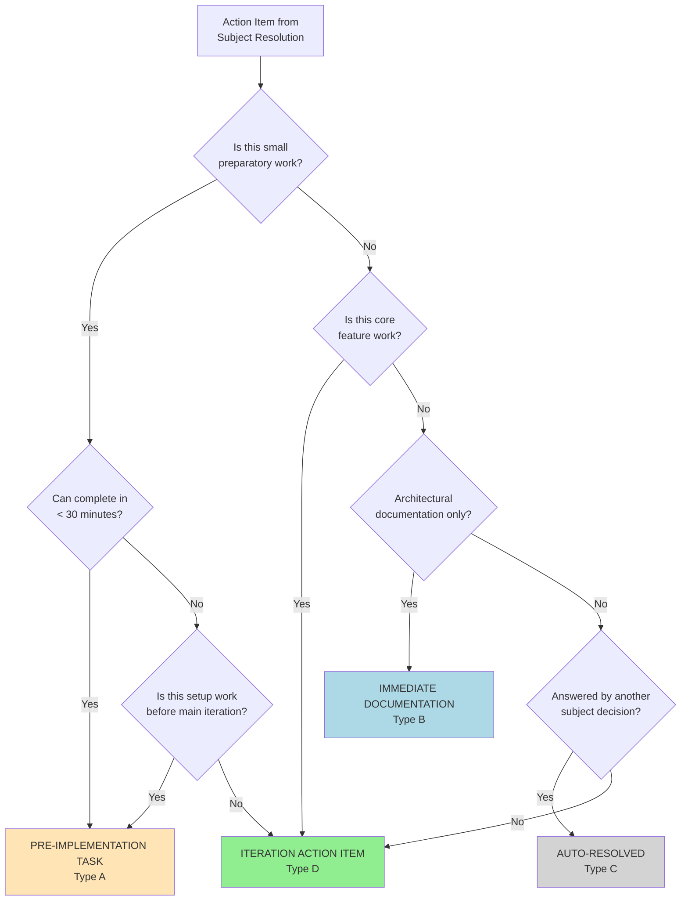
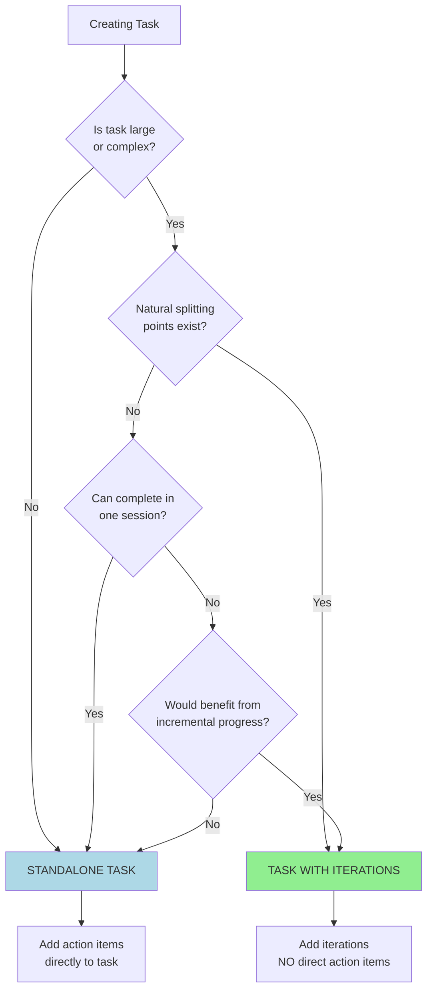
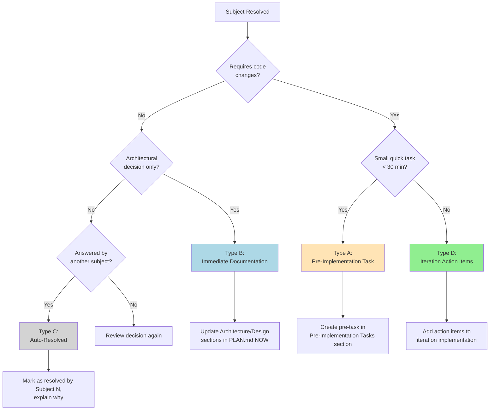
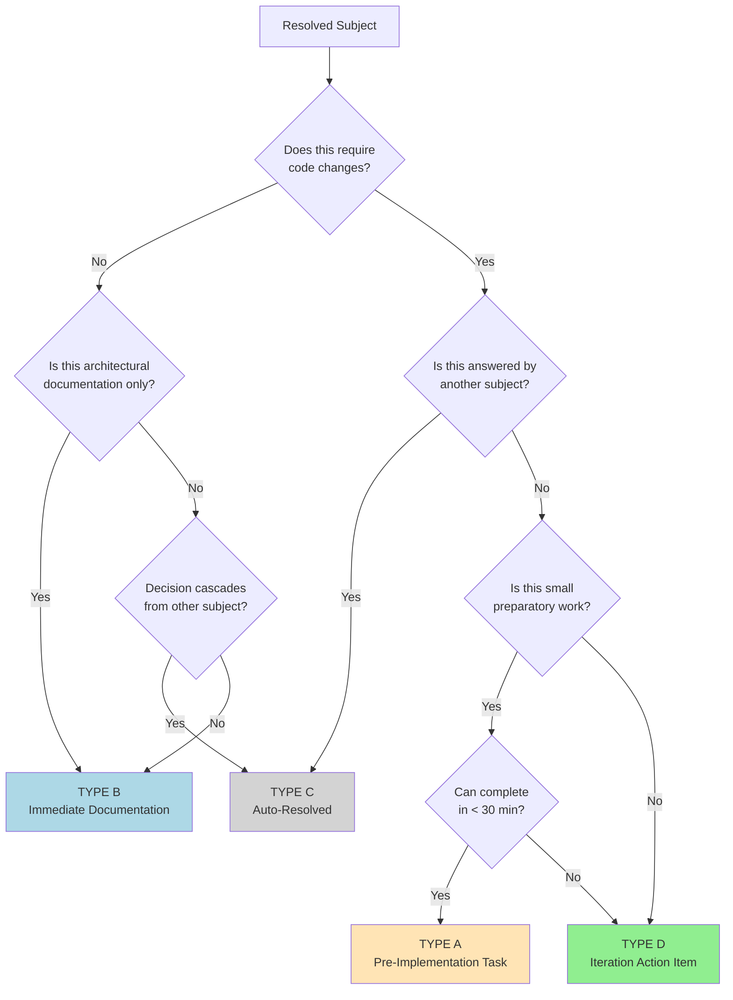

<!-- AI_SCAN:QUICK_REFERENCE:1-544 -->
# Quick Reference for AI (Read This First!!)

> **Purpose**: This section provides essential Flow framework knowledge in ~540 lines (~27k tokens) instead of reading the entire 4092-line file (~205k tokens). Read this first, then use the Section Index to jump to specific sections only when needed.

---

<!-- AI_SCAN:CORE_HIERARCHY:12-28 -->
## Core Hierarchy

```
PHASE → TASK → ITERATION → BRAINSTORM → IMPLEMENTATION → COMPLETE
```

**Structure**:
- **PHASE**: High-level milestone (e.g., "Core Implementation", "Testing")
- **TASK**: Feature/component to build (e.g., "Database Schema", "API Endpoints")
- **ITERATION**: Incremental buildout (e.g., "V1: Basic validation", "V2: Advanced rules")
- **BRAINSTORM**: Design before code (subjects → decisions → action items)
- **IMPLEMENTATION**: Execute action items from brainstorming

**Golden Rule**: Brainstorm → Pre-Tasks → Implementation (never skip brainstorming for complex work)

---

<!-- AI_SCAN:STATUS_MARKERS_QUICK:30-48 -->
## Status Markers

| Marker | Meaning | When to Use |
|--------|---------|-------------|
| ✅ | COMPLETE | Finished and verified (frozen, skip re-verification) |
| ⏳ | PENDING | Not started yet |
| 🚧 | IN PROGRESS | Currently working on this |
| 🎨 | READY | Brainstorming done, ready to implement |
| ❌ | CANCELLED | Decided against (must document WHY) |
| 🔮 | DEFERRED | Moved to V2/V3/later (must document WHY + WHERE) |
| 🎯 | ACTIVE | Current focus (optional, used in some contexts) |

**Rules**:
- Every Phase/Task/Iteration/Subject MUST have a status marker
- ✅ COMPLETE items are verified & frozen (skip re-verification)
- ❌ CANCELLED and 🔮 DEFERRED must document reason

---

<!-- AI_SCAN:TASK_STRUCTURE_QUICK:50-108 -->
## Task Structure Rules

**The Golden Rule**: Tasks must be **EITHER** Standalone **OR** have Iterations - **NEVER BOTH**

### Pattern 1: Standalone Task (Direct Action Items)

```markdown
#### Task 5: Update Documentation ⏳

**Action Items**:
- [ ] Update README.md
- [ ] Fix typos in guide
- [ ] Add examples
```

**When to Use**:
- Straightforward work (5-10 simple steps)
- No design decisions needed
- Can complete in one session
- Single focus

### Pattern 2: Task with Iterations (NO Direct Action Items)

```markdown
#### Task 7: Implement Payment Gateway 🚧

**Purpose**: Integrate Stripe API for payment processing

---

##### Iteration 1: API Setup ⏳

**Goal**: Configure Stripe SDK and credentials

[Brainstorming → Implementation]

---

##### Iteration 2: Payment Processing 🚧

**Goal**: Implement charge creation and webhooks

[Currently implementing...]
```

**When to Use**:
- Large/complex task
- Needs design decisions (brainstorming required)
- Multiple stages (V1 → V2 → V3)
- Want incremental shipping

**NEVER**:
- ❌ Task with BOTH action items AND iterations (creates confusion about completion criteria)

**Exception**:
- ✅ Pre-implementation tasks (from brainstorming) are allowed
- Pre-tasks completed BEFORE iterations start
- Structure: Task → Iteration → Brainstorming → Pre-tasks → Implementation

---

<!-- AI_SCAN:SUBJECT_RESOLUTION:112-129 -->
## Subject Resolution Types

When brainstorming, every resolved subject falls into ONE of these types:

| Type | Name | When | Action | Example |
|------|------|------|--------|---------|
| **A** | Pre-Implementation Task | Small code changes needed BEFORE iteration | Create pre-task (< 30 min work) | Fix interface, rename file, update enum |
| **B** | Immediate Documentation | Architectural decision, no code yet | Update Architecture section NOW | Design pattern choice, API contract |
| **C** | Auto-Resolved | Answered by another subject's decision | Mark as resolved by Subject N | Cascade decisions |
| **D** | Iteration Action Items | Substantial feature work that IS the iteration | Action items become iteration implementation | Build API endpoint, implement validator |

**Decision Flow**:
1. Does subject require code changes?
   - **NO** → Type B (Documentation) or Type C (Auto-resolved)
   - **YES** → Continue to #2
2. Is it small quick task (< 30 min)?
   - **YES** → Type A (Pre-task)
   - **NO** → Type D (Iteration work)

---

<!-- AI_SCAN:COMMON_PATTERNS:134-207 -->
## Common Patterns Quick Reference

### Brainstorming Pattern

```markdown
### **Brainstorming Session - [Topic]**

**Subjects to Discuss**:
1. ⏳ Subject 1
2. ⏳ Subject 2

**Resolved Subjects**:

---

### ✅ Subject 1: [Name]

**Decision**: [Your decision]

**Resolution Type**: A / B / C / D

**Action Items** (if Type A or D):
- [ ] Action item 1
- [ ] Action item 2
```

**Workflow**:
1. `/flow-brainstorm-start` - Create session
2. `/flow-next-subject` - Resolve each subject (choose Type A/B/C/D)
3. **When all subjects resolved** → Suggest `/flow-brainstorm-review` (NOT `/flow-brainstorm-complete`!)
4. `/flow-brainstorm-review` - AI suggests iterations/pre-tasks based on decisions
5. Complete any pre-tasks → Then `/flow-brainstorm-complete`
6. `/flow-implement-start` - Begin coding

**CRITICAL**: After resolving last subject, ALWAYS suggest `/flow-brainstorm-review` first. This command creates iterations and identifies pre-implementation work. Only after review is complete should you suggest `/flow-brainstorm-complete`.

### Pre-Implementation Tasks Pattern

```markdown
### **Pre-Implementation Tasks:**

#### ⏳ Task 1: [Name] (PENDING)

**Objective**: [What this accomplishes]

**Action Items**:
- [ ] Item 1
- [ ] Item 2

**Files to Modify**:
- path/to/file.ts (what to change)
```

**When to Use**:
- Small preparatory work discovered during brainstorming
- Must be completed BEFORE `/flow-brainstorm-complete`
- Examples: Interface changes, file renames, bug fixes

### Implementation Pattern

```markdown
### **Implementation - Iteration [N]: [Name]**

**Status**: 🚧 IN PROGRESS

**Action Items**: See resolved subjects above

**Implementation Notes**:
[Document discoveries during work]

**Files Modified**:
- `path/to/file.ts` - Description of changes

**Verification**: [How you verified it works]
```

---

<!-- AI_SCAN:SECTION_INDEX:212-240 -->
## Section Index (Use Read Tool with Offset/Limit)

**How to Use**: Instead of reading the entire file, use `Read(file, offset=X, limit=Y)` to read only the section you need.

| Section | Lines | What It Covers |
|---------|-------|----------------|
| **Philosophy & Principles** | 361-456 | Core metaphor, principles, scope boundary rule |
| **Framework Structure** | 464-590 | Hierarchy, testing strategy section |
| **Task Structure Rules** | 597-920 | Golden rule, standalone vs iterations, examples |
| **Development Workflow** | 928-967 | Step-by-step workflow (decide → brainstorm → implement) |
| **Complete Flow Workflow** | 977-1523 | 11-step workflow, decision trees, command reference |
| **Brainstorming Session Pattern** | 1531-2156 | Structure, resolution types A/B/C/D, dynamic subjects |
| **Implementation Pattern** | 2162-2195 | Guidelines, verification, file tracking |
| **Version Management** | 2203-2230 | V1/V2/V3 approach, deferring complexity |
| **Status Markers** | 2238-2327 | Marker reference, smart verification, lifecycle |
| **Status Management** | 2328-2379 | Single source of truth, long-running projects |
| **Progress Dashboard** | 2382-2729 | Template, when to use, update rules |
| **Plan File Template** | 2731-2928 | Complete template structure |
| **Archiving & Splitting** | 2929-3337 | Managing large PLAN.md files (2000+ lines) |
| **Backlog Management** | 3407-3682 | Moving pending tasks out of active plan (token efficiency) |
| **Iteration Lifecycle** | 3338-3405 | State transitions, examples |
| **Command Overview** | 3685-3854 | All 28 commands organized by category |
| **Quick Reference Guide** | 3868-4247 | Decision trees, cheat sheets, common patterns |
| **Bidirectional References** | 3534-3867 | Command-framework integration |

**Pro Tip**: Most common sections you'll need:
- Creating task → Read lines 597-920 (Task Structure Rules)
- Starting brainstorm → Read lines 1531-1700 (Brainstorming Pattern)
- Resolving subject → Read lines 1570-1660 (Resolution Types)
- Updating status → Read lines 2238-2327 (Status Markers)
- Lost/confused → Read lines 977-1300 (Complete Workflow)

---

## When to Read Full Sections

Use this guide to know when to dive deep into specific sections:

| Your Task | Read This Section | Lines | Why |
|-----------|------------------|-------|-----|
| **Creating new PLAN.md** | Plan File Template | 2731-2928 | Template structure, required sections |
| **Adding phase** | Development Workflow | 928-967 | Phase naming, purpose, scope |
| **Adding task** | Task Structure Rules | 597-920 | Standalone vs iterations decision |
| **Adding iteration** | Development Workflow | 928-967 | Iteration goals, action items |
| **Starting brainstorm** | Brainstorming Session Pattern | 1531-1680 | Subject creation, resolution types |
| **Resolving subject** | Subject Resolution Types | 1570-1680 | Types A/B/C/D, when to use each |
| **Completing iteration** | Implementation Pattern | 2162-2195 | Verification, completion criteria |
| **Updating status** | Status Markers | 2238-2327 | Correct marker usage, lifecycle |
| **Lost/confused** | Complete Workflow | 977-1300 | Decision trees, command reference |
| **Managing large PLAN** | Archiving & Splitting | 2929-3337 | When/how to split files |
| **Managing pending tasks** | Backlog Management | 3407-3682 | Moving tasks to backlog (token efficiency) |
| **Command behavior** | Command Overview | 3421-3590 | What each command does |

---

## AI Reading Strategy (IMPORTANT!)

### ❌ **DON'T DO THIS**:
- Reading entire 4092-line file (~205k tokens)
- Reading framework when not needed
- Reading same sections repeatedly

### ✅ **DO THIS INSTEAD**:

**Step 1**: Read Quick Reference (this section, lines 1-544, ~27k tokens)

**Step 2**: Identify what you need from Section Index

**Step 3**: Read ONLY that section using offset/limit:
```
Read(framework/DEVELOPMENT_FRAMEWORK.md, offset=597, limit=323)  # Task Structure Rules
```

**Step 4**: Skip framework entirely if not needed (e.g., `/flow-status` works from PLAN.md only)

**Token Savings**: 75-87% reduction (27-50k tokens vs 205k)

---

## Framework Reading Requirements by Command

**Category A - MUST READ Quick Reference** (~10 commands):
- `/flow-blueprint` - Needs patterns to generate plan structure
- `/flow-migrate` - Needs structure to convert existing docs
- `/flow-verify-plan` - Needs rules to validate plan consistency
- `/flow-brainstorm-start` - Needs subject resolution patterns
- `/flow-next-subject` - Needs resolution type guidance (A/B/C/D)
- `/flow-brainstorm-complete` - Needs completion criteria
- `/flow-task-add` - Needs task structure rules
- `/flow-iteration-add` - Needs iteration patterns

**Category B - NO FRAMEWORK NEEDED** (~15 commands):
- `/flow-status` - Dashboard-first approach, reads PLAN.md only ✅ PERFECT EXAMPLE
- `/flow-summarize` - Reads PLAN.md structure only
- `/flow-next` - Uses Dashboard + iteration markers
- `/flow-implement-start` - Simple state transition
- `/flow-implement-complete` - Simple state transition
- `/flow-phase-start/complete` - Simple state transition
- `/flow-task-start/complete` - Simple state transition
- All simple PLAN.md state management commands

---

## Key Principles (Core Rules to Remember)

1. **Plan File as Single Source of Truth** - Everything documented in `.flow/PLAN.md`
2. **Brainstorm Before Code** - Design decisions upfront reduce refactoring
3. **Progressive Disclosure** - Focus only on what's needed NOW, defer V2/V3
4. **State Preservation** - Checkboxes and status markers track all progress
5. **Minimal Refactoring** - Small iterations, complete before moving to next
6. **Scope Boundary Rule** - NEVER fix out-of-scope issues without user permission

---

## Testing Strategy Section (CRITICAL)

Every PLAN.md MUST have a Testing Strategy section that defines:
- **Methodology**: How you test (simulation, unit tests, TDD, manual QA)
- **Location**: Where test files live
- **Naming Convention**: Exact pattern (e.g., `{service}.scripts.ts` NOT `test.{service}.ts`)
- **When to create**: New file vs add to existing
- **Tooling**: What tools/frameworks you use

**Why**: AI must follow YOUR testing conventions exactly (prevents convention violations)

---

## Scope Boundary Rule (CRITICAL)

🚨 **STOP → NOTIFY → DISCUSS → AWAIT USER APPROVAL**

**When to Trigger**: You discover NEW issues during brainstorming or implementation that are NOT part of the current iteration's scope.

**The 4-Step Response Pattern**:

1. **STOP** immediately - Don't make assumptions or proceed
2. **NOTIFY** user - Present the discovered issue(s) clearly
3. **DISCUSS** - Provide structured options (A/B/C/D format)
4. **AWAIT USER APPROVAL** - Never proceed without explicit user decision

**Exception**: Syntax errors or blocking bugs in files you must modify (document what you fixed)

---

### Response Template (Use This Format)

When you discover scope boundary violations, use this structured response:

```markdown
🚨 SCOPE BOUNDARY ALERT

I've discovered NEW issue(s) that are NOT part of the current iteration's scope:

**Issue 1: [Name]**
- **Problem**: [What's wrong or missing]
- **Impact**: [How it affects current/future work]
- **Location**: [File/component if applicable]

[Repeat for additional issues...]

---

## What Should We Do?

According to Scope Boundary Rule, I must:

1. ✅ STOP - Done, I've stopped
2. ✅ NOTIFY - Done, I've identified the issue(s)
3. ❓ DISCUSS - Your turn!

**Your Options**:

- **A**: Create pre-implementation task (< 30 min work, blocking current iteration)
- **B**: Add as new brainstorming subject (design needed before implementation)
- **C**: Handle immediately as part of this work (if you approve)
- **D**: Defer to separate iteration (handle after current work complete)

**What's your call?**
```

---

### Real-World Example (RED Project - Perfect Execution)

**Context**: During `/flow-next-subject` while designing skill generation system, AI discovered 3 NEW issues not part of current iteration.

**AI's Response** (Framework-Aware, CORRECT):

```markdown
🚨 SCOPE BOUNDARY ALERT

I've discovered NEW issues that are NOT part of the current iteration's scope:

**Issue 1: I_Ability Interface Missing Fields**
- **Problem**: Interface missing `tier`, `affixes`, and `creator` fields
- **Impact**: Can't properly filter/validate abilities during generation
- **Location**: `src/interfaces/I_Ability.ts`

**Issue 2: Array vs Dictionary Performance**
- **Problem**: Using arrays for ability lookups (O(n) complexity)
- **Impact**: Performance degrades with large ability counts (1000+)
- **Location**: Ability collections throughout skill generation

**Issue 3: Definition vs Metadata Separation**
- **Problem**: Unclear boundary between ability definition and instance metadata
- **Impact**: Risk of data duplication and inconsistent state
- **Location**: Skill model design

---

## What Should We Do?

According to Scope Boundary Rule, I must:

1. ✅ STOP - Done, I've stopped
2. ✅ NOTIFY - Done, I've identified the issues
3. ❓ DISCUSS - Your turn!

**Your Options**:

- **A**: Create pre-implementation task to fix I_Ability interface (< 30 min work)
- **B**: Add as new brainstorming subject (#4) to design the solution
- **C**: Handle immediately as part of this subject (if you approve)
- **D**: Defer to separate iteration after this one

**What's your call?**
```

**User's Decision**: Option A (pre-task) for Issue 1, Option D (defer) for Issues 2 & 3

**Why This Was Perfect**:
- ✅ AI stopped and didn't make assumptions
- ✅ Clear, structured presentation of issues
- ✅ Actionable options with implications
- ✅ User stayed in control of priorities
- ✅ Fast development with guardrails

---

### Good vs Bad Behavior

#### ❌ BAD: Scope Creep Without Permission

```markdown
I noticed the I_Ability interface is missing some fields, so I went ahead and added them.
Also refactored the ability storage to use a Map for better performance.
Let me know if you want me to change anything.
```

**Why This Is Bad**:
- Made decisions without user input
- Changed scope silently
- User loses control of priorities
- May solve wrong problem

#### ✅ GOOD: Stop and Ask

```markdown
🚨 SCOPE BOUNDARY ALERT

I've discovered the I_Ability interface is missing `tier`, `affixes`, and `creator` fields
needed for skill generation.

**Your Options**:
- **A**: Fix interface now as pre-task (< 30 min)
- **B**: Design in new brainstorming subject
- **C**: Handle immediately (if you approve)
- **D**: Defer to later iteration

**What's your call?**
```

**Why This Is Good**:
- Stopped immediately
- Clear problem statement
- Structured options
- User makes the decision

---

### When NOT to Trigger (Exceptions)

**1. Syntax Errors in Modified Files**:
```markdown
✅ ALLOWED: Fixed TypeScript error in PaymentService.ts (missing return type)
❌ NOT ALLOWED: Refactored entire PaymentService to use async/await
```

**2. Import Statements for New Code**:
```markdown
✅ ALLOWED: Added `import { Logger } from './logger'` for new logging code
❌ NOT ALLOWED: Reorganized all imports alphabetically across the file
```

**3. Trivial Formatting in Lines You're Editing**:
```markdown
✅ ALLOWED: Fixed indentation on line you're modifying
❌ NOT ALLOWED: Reformatted entire file with Prettier
```

**Rule**: Document any scope exceptions in Implementation Notes.

---

### Why This Pattern Matters

**Vibe-Coding with Guardrails**:
- **Fast development** - AI finds issues proactively
- **User control** - User decides priorities
- **No scope creep** - Clear boundaries
- **Better decisions** - User has context AI doesn't

**Human Stays in Driver's Seat**:
- User knows project constraints (deadlines, complexity, tech debt)
- User has business context (what's actually important)
- User understands team dynamics (who's working on what)
- AI provides analysis, user provides judgment

---

### Implementation in Commands

All brainstorming and implementation commands include Scope Boundary Rule reminders:

- `/flow-brainstorm-start`, `/flow-brainstorm-subject`, `/flow-next-subject`
- `/flow-implement-start`, `/flow-implement-complete`
- Any command that involves code changes or design decisions

See command definitions in SLASH_COMMANDS.md for specific implementations.

---

**End of Quick Reference** - Full documentation continues below ⬇️

---

<!-- AI_SCAN:PHILOSOPHY_PRINCIPLES:361-456 -->
# Domain-Driven Design with Agile Iterative Philosophy

**A spec-driven iterative development framework for building complex features with minimal refactoring.**

---

## Philosophy

This framework combines **Domain-Driven Design** principles with an **Agile iterative approach** to software development. The core analogy is building the human body:

1. **Skeleton first** - Create the basic structure and foundational components
2. **Add veins** - Implement core data flow and connections
3. **Add flesh** - Layer on complexity incrementally
4. **Add fibers** - Refine and optimize

By splitting development into minuscule, well-planned iterations, you build a strong foundation and expand complexity over time while keeping refactoring to a minimum.

---

## Core Principles

### 1. Plan File as Single Source of Truth

- Every feature/project/issue has a dedicated `.flow/PLAN.md` file
- Flow manages the plan from the `.flow/` directory in your project root
- The plan file survives across sessions and maintains complete context
- All decisions, brainstorming results, and implementation progress are documented
- AI agents and humans can resume work from any point by reading the plan

**File Structure**:
```
your-project/
├── .flow/
│   ├── PLAN.md              # Flow-managed plan (single source of truth)
│   └── DEVELOPMENT_FRAMEWORK.md (optional - project-specific framework guide)
├── src/
├── tests/
└── ...
```

**Getting Started**:
- **New project**: Use `/flow-blueprint [description]` to create fresh `.flow/PLAN.md`
- **Existing project**: Use `/flow-migrate [file]` to convert existing documentation to Flow format
- Both commands create `.flow/PLAN.md` and take full control of plan management

### 2. Iterative Development Loop

```
PHASE → TASK → ITERATION → BRAINSTORM → IMPLEMENTATION → COMPLETE
                   ↓           ↓              ↓
               (repeat)   (subjects)    (action items)
```

### 3. Progressive Disclosure

- Each iteration focuses ONLY on what's needed NOW
- Future complexity is deferred to V2/V3/etc.
- Prevents scope creep and over-engineering

### 4. State Preservation

- Every step updates the plan file with checkboxes (✅ ⏳ 🚧)
- Timestamps and status markers track progress
- Complete audit trail of all decisions

### 5. Minimal Refactoring

- Brainstorm BEFORE implementing to make correct decisions upfront
- Split complex features into small, testable iterations
- Each iteration is complete and stable before moving to next

### 6. Scope Boundary Rule (CRITICAL)

**🚨 NEVER fix out-of-scope issues without explicit user permission.**

When working within **any Flow scope** (Phase/Task/Iteration/Brainstorming/Pre-Implementation Task), if you discover a NEW issue that is NOT part of the current work:

1. **STOP** current work immediately
2. **NOTIFY** user of the new issue discovered
3. **DISCUSS** with user what to do:
   - Add as new brainstorming subject?
   - Create new pre-implementation task?
   - Defer to next iteration?
   - Handle immediately (only if user explicitly approves)?
4. **ONLY** proceed with user's explicit approval

**Examples of scope violations**:
- Working on Pre-Implementation Task 2 (fix validation bug), discover Test 3 has unrelated placeholder parsing issue → **STOP, ask user**
- Implementing Iteration 5 (add error handling), notice Iteration 2 code has typo → **STOP, ask user**
- Resolving brainstorm Subject 3 (API design), realize database schema needs refactoring → **STOP, ask user**

**Why this matters**:
- Prevents scope creep and uncontrolled changes
- Maintains Flow's intentional progression
- Preserves user's ability to prioritize work
- Keeps iterations focused and reviewable
- Avoids "fixing" things that may be intentional or have hidden dependencies

**The only exception**: Fixing issues that are **directly blocking** the current task (e.g., syntax error in file you must modify). Even then, document what you fixed and why.

### 7. UX Principles for Flow Commands

**Purpose**: These principles guide all command behavior to ensure consistent, token-efficient, user-friendly interactions.

**The 6 UX Principles**:

**1. Token Efficiency First**
- Minimize rejection messages (< 80 tokens)
- Avoid verbose templates/examples unless first-time user
- Use compact previews, not full explanations
- Every token counts - reject fast, create efficiently
- Example: Dry-run preview (200-500 tokens) vs full generation (5000+ tokens) = 90%+ savings

**2. Never Block for Cosmetic Reasons**
- Phase/task commands accept minimal input
- Use [TBD] placeholders, don't reject
- User controls quality (can fill or leave incomplete)
- Cosmetic sections shouldn't block workflow
- Example: `/flow-phase-add "Testing"` → Creates phase with [TBD] fields, doesn't reject

**3. Progressive Disclosure**
- Show complexity only when needed
- First rejection: educational (with examples)
- Subsequent rejections: minimal (just example)
- Advanced features: available but not pushed
- Don't overwhelm with options upfront
- Example: First error shows template, next errors show just one-line example

**4. Explicit > Implicit**
- Honor user's explicit structure (create it)
- Don't auto-generate from vague input (suggest instead)
- Confirmations for large operations (blueprint), not small ones (phase/task)
- User's explicit intent always wins
- Example: `/flow-blueprint` with "Phase 1:", "Task 2:" → CREATE; without → SUGGEST

**5. Guide, Don't Dictate**
- Suggest next commands after creation
- Show what was created (summary)
- Don't force workflow (user chooses path)
- Provide options, let user decide
- Example: After `/flow-brainstorm-complete` → Suggest `/flow-implement-start` but don't auto-run it

**6. Honest Communication**
- Use [TBD] when info is missing (don't fake it)
- Show what AI inferred vs what user provided
- Clear distinction between suggestion and creation
- Transparency builds trust
- Example: "Strategy: [Inferred from description]" vs "Strategy: [TBD - fill this in]"

**Application to Commands**:

**For `/flow-blueprint`**:
- Token efficiency: Dry-run preview is compact (< 500 tokens)
- Explicit > Implicit: Mode B creates explicit structure, Mode A suggests
- Guide, don't dictate: Show next commands after creation
- Honest communication: Show what was extracted vs inferred

**For `/flow-phase-add` & `/flow-task-add`**:
- Never block: Accept minimal input, use [TBD] placeholders
- Token efficiency: No verbose rejections, just accept and create
- Honest communication: Mark [TBD] clearly, extract rich context when provided
- Guide, don't dictate: Create what's asked, suggest refinement after

**For All Commands**:
- Progressive disclosure: First error shows examples, subsequent errors are minimal
- Token efficiency: All responses < 200 tokens unless generating structure
- Explicit > Implicit: No assumptions, honor user's explicit input

---

<!-- AI_SCAN:FRAMEWORK_STRUCTURE:464-590 -->
## Framework Structure

### Hierarchy

```
📋 PLAN.md (Feature/Project Plan File)
├── Overview (purpose, goals, scope)
├── Architecture (high-level design, components, dependencies)
├── Testing Strategy (methodology, tooling, verification approach) ⭐ NEW
├── Progress Dashboard (current status, completion %, deferred items)
├── 📊 PHASE (High-level milestone)
│   ├── 📦 TASK (Feature/component to build)
│   │   ├── 🔄 ITERATION (Incremental buildout)
│   │   │   ├── 💭 BRAINSTORMING SESSION
│   │   │   │   ├── Subject 1 (Design decision)
│   │   │   │   ├── Subject 2 (Design decision)
│   │   │   │   └── Subject N...
│   │   │   │       └── Action Items (checkboxes)
│   │   │   └── 🛠️ IMPLEMENTATION
│   │   │       └── Execute action items
│   │   │   └── ✅ VERIFICATION (per Testing Strategy)
│   │   └── ✅ ITERATION COMPLETE
│   └── 🎯 TASK COMPLETE
└── 🏆 PHASE COMPLETE
```

### Testing Strategy Section (REQUIRED)

**Purpose**: Define HOW you verify implementations so AI follows YOUR testing conventions exactly.

**Must Include**:
1. **Methodology**: How you test (simulation, unit tests, TDD, integration, manual QA, etc.)
2. **Location**: Where test files live (directory path)
3. **Naming Convention**: Test file naming pattern (CRITICAL - AI must follow exactly)
4. **When to create**: When to create NEW test files vs. add to existing
5. **When to add**: When to add test cases to existing files
6. **Tooling**: What tools/frameworks you use (Jest, Vitest, custom scripts, etc.)

**Common Approaches**:

- **Simulation-based (per-service pattern)**: Each service has its own orchestration file
  - Example: `scripts/{service}.scripts.ts` (blue.scripts.ts, green.scripts.ts, red.scripts.ts)
  - AI creates `scripts/gold.scripts.ts` if working on new "gold" service
  - AI adds to `scripts/blue.scripts.ts` if file already exists
  - **Convention matters**: `{service}.scripts.ts` NOT `test.{service}.*.ts`

- **Simulation-based (single file)**: All tests in one orchestration file
  - Example: `scripts/run.scripts.ts` handles all services
  - AI adds test cases to existing file, never creates new test files

- **Unit tests after implementation**: Write tests after code works
  - Example: `__tests__/{feature}.test.ts` created after iteration complete
  - AI creates `__tests__/payment-gateway.test.ts` for new features
  - AI adds test cases to existing file if feature already tested

- **TDD (Test-Driven Development)**: Write tests before implementation
  - Example: Red → Green → Refactor cycle
  - AI creates `tests/{feature}.spec.ts` first, then implements to make it pass

- **Integration/E2E focused**: Minimal unit tests, focus on workflows
  - Example: `e2e/{workflow}.spec.ts` for critical user journeys
  - AI creates new E2E test for each major workflow

- **Manual QA only**: No automated tests
  - AI never creates test files, provides manual verification checklist instead

**Why This Matters**:
- **Prevents convention violations**: AI won't create `test.blue.validation.ts` when your pattern is `blue.scripts.ts`
- **Respects file structure**: AI knows WHERE to create test files (scripts/ vs __tests__ vs e2e/)
- **Follows naming patterns**: AI matches YOUR naming convention exactly
- **Knows when to create vs. add**: AI creates new files for new features, adds to existing for enhancements
- **Ensures verification happens at the right time**: During iteration, after, or before (TDD)

**Example 1 - Per-Service Simulation** (like RED project):
```markdown
## Testing Strategy

**Methodology**: Simulation-based orchestration per service

**Approach**:
- Each service has its own orchestration file: `scripts/{service}.scripts.ts`
- **Naming Convention**: `{service}.scripts.ts` (e.g., `blue.scripts.ts`, `green.scripts.ts`, `red.scripts.ts`)
- **Location**: `scripts/` directory
- **When to create**: If `scripts/{service}.scripts.ts` doesn't exist for new service, create it
- **When to add**: If file exists, add new test cases to existing orchestration
- Tests simulate real-world usage patterns (spell generation, validation, etc.)

**Test Execution**:
```bash
bun run scripts/run.scripts.ts           # Run all services
bun run scripts/{service}.scripts.ts      # Run specific service
```

**File Structure**:
```
scripts/
├── run.scripts.ts        # Main orchestration (runs all services)
├── blue.scripts.ts       # Blue service tests
├── green.scripts.ts      # Green service tests
├── red.scripts.ts        # Red service tests
└── gold.scripts.ts       # Gold service tests (create if new service)
```

**IMPORTANT**:
- ❌ Do NOT create `test.{service}.*.ts` files (wrong naming pattern)
- ❌ Do NOT create files outside `scripts/` directory (wrong location)
- ✅ DO follow `{service}.scripts.ts` pattern exactly
- ✅ DO create new `{service}.scripts.ts` for new services
```

**Example 2 - Unit Tests After Implementation**:
```markdown
## Testing Strategy

**Methodology**: Unit tests after implementation using Jest

**Approach**:
- Unit tests created AFTER implementation is verified manually
- **Naming Convention**: `{feature}.test.ts` (e.g., `payment-gateway.test.ts`)
- **Location**: `__tests__/` directory
- **When to create**: After iteration implementation complete and working
- **When to add**: If feature already has test file, add new test cases

**Test Execution**: `npm test`

**IMPORTANT**:
- ✅ Create `__tests__/new-feature.test.ts` for new features
- ✅ Add test cases to `__tests__/existing-feature.test.ts` for enhancements
- ❌ Do NOT create tests before implementation (we're not doing TDD)
```

---

<!-- AI_SCAN:TASK_STRUCTURE:597-920 -->
## Task Structure Rules

### The Golden Rule: Standalone OR Iterations, Never Both

**Every task must follow ONE of these two patterns:**

#### Pattern 1: Standalone Task (Direct Action Items)

**Structure**:
```markdown
#### Task N: [Task Name] ⏳

**Status**: PENDING
**Purpose**: [What this task accomplishes]

**Action Items**:
- [ ] Action item 1
- [ ] Action item 2
- [ ] Action item 3
```

**When to Use**:
- ✅ Task is straightforward with clear steps
- ✅ No design decisions needed
- ✅ Can complete in one work session
- ✅ Small scope (5-10 simple steps)
- ✅ Single focus (e.g., "Migrate constants", "Update README")

**Examples**:
- "Migrate constants from Blue to shared file" (5 simple steps)
- "Update documentation with new API endpoints" (straightforward)
- "Rename service files to match naming convention" (clear steps)
- "Install dependencies and configure linter" (setup task)

---

#### Pattern 2: Task with Iterations (NO Direct Action Items)

**Structure**:
```markdown
#### Task N: [Task Name] ⏳

**Status**: PENDING
**Purpose**: [What this task accomplishes]

**Scope**: [High-level description]

---

##### Iteration 1: [Iteration Name] ⏳

**Status**: PENDING
**Goal**: [What this iteration builds]

[Brainstorming → Implementation → Complete]

---

##### Iteration 2: [Iteration Name] ⏳

**Status**: PENDING
**Goal**: [What this iteration builds]

[Brainstorming → Implementation → Complete]
```

**When to Use**:
- ✅ Task is large or complex
- ✅ Needs design decisions (brainstorming required)
- ✅ Multiple stages of implementation (V1 → V2 → V3)
- ✅ Natural splitting points exist
- ✅ Want to ship incremental progress

**Examples**:
- "Implement Green Service" → Iteration 1: Tier Generation, Iteration 2: Validation, Iteration 3: Testing
- "Build Payment Gateway Integration" → Iteration 1: API Setup, Iteration 2: Payment Processing, Iteration 3: Webhooks
- "Add Error Handling System" → Iteration 1: Basic Errors, Iteration 2: Retry Logic, Iteration 3: Logging

---

### ❌ Anti-Pattern: Task with BOTH Action Items AND Iterations

**NEVER DO THIS**:

```markdown
#### Task 5: Implement Validation System ⏳

**Status**: PENDING

**Action Items**:  ← ❌ WRONG: Task has both action items...
- [ ] Design validation rules
- [ ] Create validator interface

---

##### Iteration 1: Basic Validation ⏳  ← ❌ ...AND iterations!

**Status**: PENDING
**Goal**: Implement basic input validation
```

**Why This is Wrong**:
- ❓ Unclear what "task complete" means (action items done? iterations done? both?)
- ❓ Are action items prerequisites for iterations or parallel work?
- ❓ Should iterations start immediately or after action items?
- 🚫 Creates confusion and ambiguity

**How to Fix**:

**Option A** - Make it standalone (if simple):
```markdown
#### Task 5: Implement Basic Validation ⏳

**Action Items**:
- [ ] Design validation rules
- [ ] Create validator interface
- [ ] Implement basic input validation
- [ ] Add unit tests
```

**Option B** - Make it have iterations (if complex):
```markdown
#### Task 5: Implement Validation System ⏳

**Purpose**: Build comprehensive validation system with retry logic

---

##### Iteration 1: Design & Interface ⏳

**Goal**: Design validation rules and create validator interface

[Brainstorming → Implementation]

---

##### Iteration 2: Basic Validation ⏳

**Goal**: Implement basic input validation

[Implementation]
```

---

### Exception: Pre-Implementation Tasks

**Tasks with iterations CAN have pre-implementation tasks** (from brainstorming):

```markdown
#### Task 7: Implement Error Handling 🚧

**Status**: IN PROGRESS

---

##### Iteration 1: Basic Error Types 🚧

**Status**: IN PROGRESS

### **Brainstorming Session - Error Handling Design**

[Subjects resolved...]

### **Pre-Implementation Tasks:**  ← ✅ ALLOWED: Pre-tasks from brainstorming

#### ✅ Task 1: Update I_Error interface (COMPLETE)
#### ✅ Task 2: Rename error.ts to errorHandler.ts (COMPLETE)

### **Implementation - Iteration 1**

**Action Items**: See resolved subjects above (Type 2 items from brainstorming)
```

**Why Pre-Tasks Are Allowed**:
- Pre-tasks are NOT task-level action items
- Pre-tasks come FROM brainstorming (Type A resolutions)
- Pre-tasks are completed BEFORE iteration implementation starts
- Structure: Task → Iteration → Brainstorming → Pre-tasks → Implementation

**Pre-Task Scope**:
- ✅ Small preparatory work (< 30 min)
- ✅ Setup before iteration (interface changes, file renames, bug fixes)
- ✅ Blocking issues that must be fixed first

---

### Decision Guide: Should This Be Standalone or Have Iterations?

Ask yourself these questions:

| Question | Standalone Task | Task with Iterations |
|----------|----------------|---------------------|
| **Is this task complex?** | No, straightforward | Yes, needs design |
| **Design decisions needed?** | No | Yes (brainstorming required) |
| **Can complete in one session?** | Yes | No, needs splitting |
| **Natural splitting points?** | No | Yes (V1 → V2, stages) |
| **Want incremental shipping?** | No, ship all at once | Yes, ship by iteration |
| **How many steps?** | 5-10 simple steps | Many complex steps |

**Rule of Thumb**:
- **If you need brainstorming** → Use iterations
- **If steps are obvious** → Use standalone
- **If task is one concept** → Use standalone
- **If task has multiple stages** → Use iterations

---

### Examples of Well-Structured Tasks

#### Good Example 1: Standalone Task

```markdown
#### Task 3: Migrate Constants to Shared File ⏳

**Status**: PENDING
**Purpose**: Move all service constants to shared constants file for reusability

**Action Items**:
- [ ] Create src/shared/constants.ts file
- [ ] Move Blue service constants
- [ ] Move Green service constants
- [ ] Move Red service constants
- [ ] Update imports in all services
- [ ] Verify no build errors
```

**Why This Works**: Clear, simple, straightforward steps. No design decisions. Can complete in one session.

---

#### Good Example 2: Task with Iterations

```markdown
#### Task 5: Implement Green Service 🚧

**Status**: IN PROGRESS
**Purpose**: Build Green service for tier generation with validation and selection

**Scope**: Create complete Green service following RED pattern with tier generation, filtering, selection, and validation logic.

---

##### Iteration 1: Tier Generation ✅

**Status**: COMPLETE
**Completed**: 2025-09-30
**Goal**: Generate spell tiers based on tier type and constraints

[Brainstorming → Implementation → Complete]

---

##### Iteration 2: Spell Filtering ⏳

**Status**: PENDING
**Goal**: Filter spells by tier and element type

---

##### Iteration 3: Spell Selection 🚧

**Status**: IN PROGRESS
**Goal**: Select spells using weight-based constraint solver

[Currently implementing...]
```

**Why This Works**: Large complex task split into focused iterations. Each iteration has clear goal. Natural progression (generate → filter → select).

---

#### Bad Example 1: Task with Both

```markdown
❌ BAD:

#### Task 8: Implement Validation System ⏳

**Action Items**:  ← Mixing task-level action items...
- [ ] Design validation rules
- [ ] Create interfaces

##### Iteration 1: Basic Validation ⏳  ← ...with iterations

**Goal**: Implement basic input validation
```

**Fix**: Choose standalone OR iterations, not both.

---

#### Bad Example 2: Iteration Disguised as Standalone

```markdown
❌ BAD:

#### Task 10: Implement Complete Payment Gateway ⏳

**Action Items**:
- [ ] Set up Stripe SDK
- [ ] Design API endpoints  ← This needs brainstorming!
- [ ] Implement payment processing  ← This is large!
- [ ] Add webhook handlers  ← Multiple stages needed!
- [ ] Create retry logic  ← Complex algorithm!
- [ ] Add error handling  ← Another full feature!
- [ ] Write integration tests
```

**Fix**: This should be a task with iterations, each tackling one stage.

---

### Summary: Task Structure Checklist

Before creating a task, ask:

- [ ] Does this task need design decisions? **YES** → Use iterations
- [ ] Can I complete this in one session? **NO** → Use iterations
- [ ] Does this have natural splitting points? **YES** → Use iterations
- [ ] Are all steps obvious and simple? **YES** → Use standalone
- [ ] Is this one focused concept? **YES** → Use standalone

**Remember**: Standalone OR iterations, never both. Pre-implementation tasks (from brainstorming) are the only exception.

---

<!-- AI_SCAN:DEVELOPMENT_WORKFLOW:928-967 -->
## Development Workflow

### Step 1: Decide What to Work On

Choose the scope:

- **Phase**: Major milestone (e.g., "Core Implementation")
- **Task**: Specific feature/component (e.g., "Implement Green Service")
- **Iteration**: Incremental piece (e.g., "Iteration 1: Tier Generation")

### Step 2: Brainstorm

Break down the iteration into **subjects to discuss**:

- Architecture decisions
- Implementation approach
- Edge cases and constraints
- Data structures
- Algorithm choices

For each subject:

1. Discuss options (Option A, B, C...)
2. Document rationale
3. Make a decision
4. Create **action items** (checkboxes)

### Step 3: Implementation

Work through action items sequentially:

- Check off each item as completed
- Update plan file with results
- Add notes/discoveries during implementation

### Step 4: Mark Complete

- All action items checked → Iteration complete
- All iterations complete → Task complete
- All tasks complete → Phase complete

### Step 5: Repeat

Move to next iteration, applying lessons learned.

---

<!-- AI_SCAN:COMPLETE_WORKFLOW:977-1523 -->
## Complete Flow Workflow

This section documents the complete end-to-end Flow workflow from project initialization to completion, including all decision points and command usage.

### Overview: The Flow Journey

```mermaid
graph TD
    A[Start] --> B{New or Existing?}
    B -->|New Project| C[/flow-blueprint]
    B -->|Existing Docs| D[/flow-migrate]
    C --> E[Review Generated Plan]
    D --> E
    E --> F{Need More Structure?}
    F -->|Yes| G[/flow-phase-add<br/>/flow-task-add]
    F -->|No| H[Ready to Start]
    G --> H
    H --> I[/flow-phase-start]
    I --> J[/flow-task-start]
    J --> K{Complex Task?}
    K -->|Yes - Need Design| L[/flow-brainstorm-start]
    K -->|No - Straightforward| M{Split Work?}
    L --> N[Resolve Subjects]
    N --> O{Pre-tasks Needed?}
    O -->|Yes| P[Complete Pre-tasks]
    O -->|No| Q[/flow-brainstorm-complete]
    P --> Q
    Q --> M
    M -->|Yes| R[/flow-iteration-add]
    M -->|No| S[Work on Task Action Items]
    R --> T[/flow-implement-start]
    T --> U[Complete Implementation]
    S --> V[/flow-task-complete]
    U --> W[/flow-implement-complete]
    W --> X{More Iterations?}
    X -->|Yes| R
    X -->|No| V
    V --> Y{More Tasks?}
    Y -->|Yes| J
    Y -->|No| Z[/flow-phase-complete]
    Z --> AA{More Phases?}
    AA -->|Yes| I
    AA -->|No| AB[Project Complete]
```

### Step-by-Step Workflow

#### 1. Initialize Project

**Command**: `/flow-blueprint [description]` OR `/flow-migrate [file-path]`

**Purpose**: Create `.flow/PLAN.md` with initial structure

**What Happens**:
- **flow-blueprint**: AI generates phases/tasks/iterations based on feature description
- **flow-migrate**: Converts existing documentation to Flow format

**Output**: `.flow/PLAN.md` created with project structure

**Next Step**: Review generated plan, add/modify phases and tasks if needed

---

#### 1a. Blueprint Modes (Understanding /flow-blueprint Behavior)

**Purpose**: `/flow-blueprint` has two modes based on input - understanding these modes helps you provide the right level of detail.

**Mode A: SUGGEST Structure** (AI Designs the Plan)

**Trigger**: You provide a description WITHOUT explicit structure markers

**Examples**:
```bash
/flow-blueprint "Payment gateway integration"
/flow-blueprint "User authentication system"
/flow-blueprint "Build a real-time chat application"
```

**What Happens**:
1. AI reads your description
2. AI may ask clarifying questions (testing strategy, reference implementations, etc.)
3. AI generates suggested phases/tasks/iterations based on best practices
4. You review and modify as needed

**Best For**:
- New projects where you want AI to suggest structure
- Features where you're exploring the best approach
- When you want framework guidance on how to break down work

**Example Output**:
```markdown
✨ Created .flow/PLAN.md for "Payment Gateway Integration"

**Generated Structure**:
- Phase 1: Foundation (API integration, basic flow)
- Phase 2: Core Implementation (webhooks, retry logic)
- Phase 3: Testing & Validation

Use `/flow-status` to see current state
Use `/flow-brainstorm-start [topic]` to begin first iteration
```

---

**Mode B: CREATE Explicit Structure** (You Design the Plan)

**Trigger**: You provide explicit structure markers in your description

**Structure Markers**:
- "Phase 1:", "Phase 2:", etc.
- "Task 1:", "Task 2:", etc.
- "Iteration 1:", "Iteration 2:", etc.
- Bullet lists suggesting phases/tasks/iterations

**Examples**:
```bash
/flow-blueprint "Payment Gateway

Phase 1: Foundation
- Task 1: Setup Stripe SDK
- Task 2: Create payment models

Phase 2: Implementation
- Task 1: Payment processing
  - Iteration 1: Basic flow
  - Iteration 2: Error handling
- Task 2: Webhook integration"
```

**What Happens**:
1. AI detects explicit structure in your input
2. AI shows dry-run preview of what will be created
3. You confirm (yes/no)
4. AI creates your exact structure with [TBD] for missing metadata

**Best For**:
- You already know the phases/tasks breakdown
- Migrating from another planning system
- You have specific work breakdown preferences
- Quick project setup without AI suggestions

**Example Dry-Run Preview**:
```markdown
📋 Detected explicit structure. I will create:

**Phase 1: Foundation** ⏳
- Task 1: Setup Stripe SDK ⏳
- Task 2: Create payment models ⏳

**Phase 2: Implementation** ⏳
- Task 1: Payment processing ⏳
  - Iteration 1: Basic flow ⏳
  - Iteration 2: Error handling ⏳
- Task 2: Webhook integration ⏳

Missing metadata will use [TBD] placeholders (refine later).

Proceed? (yes/no)
```

**If you say "yes"**:
```markdown
✨ Created .flow/PLAN.md from your explicit structure

**Structure**: 2 phases, 3 tasks, 2 iterations (as you specified)

**[TBD] placeholders used for**:
- Phase strategies
- Task purposes
- Testing strategy

💡 Refine [TBD] sections during brainstorming or use `/flow-plan-update`

Use `/flow-status` to see current state
```

---

**Choosing the Right Mode**:

| Use Mode A (SUGGEST) If... | Use Mode B (CREATE) If... |
|----------------------------|---------------------------|
| You want AI to suggest best practices | You already have a work breakdown |
| You're exploring different approaches | You know exactly what phases/tasks you need |
| You want framework guidance | You're migrating from another system |
| You're new to the project domain | You have specific organizational preferences |
| You want comprehensive Testing Strategy generated | You'll define Testing Strategy later |

**Pro Tip**: Start with Mode A for new projects (get AI suggestions), then use `/flow-phase-add` and `/flow-task-add` to refine the structure. This combines AI guidance with your domain expertise.

---

#### 2. Add Structure (Optional)

**Commands**: `/flow-phase-add [description]`, `/flow-task-add [description]`

**Purpose**: Add additional phases or tasks not generated by blueprint

**When to Use**:
- Blueprint missed important milestones (add phase)
- Need to break down work further (add task)
- Discovered new requirements during planning

**Output**: Updated PLAN.md with new structure

**Next Step**: Start working on first phase

---

#### 3. Start Phase

**Command**: `/flow-phase-start [phase-number]`

**Purpose**: Mark phase as 🚧 IN PROGRESS

**When to Use**: Ready to begin work on the phase

**What Happens**:
- Phase status changes from ⏳ PENDING → 🚧 IN PROGRESS
- Progress Dashboard updated to point to this phase

**Output**: Phase marked in progress

**Next Step**: Start first task in the phase

---

#### 4. Start Task

**Command**: `/flow-task-start [task-number]`

**Purpose**: Mark task as 🚧 IN PROGRESS

**When to Use**: Ready to begin work on the task

**Decision Point**: Does this task need design decisions?
- **YES (complex task)** → Go to Step 5 (Brainstorming)
- **NO (straightforward task)** → Go to Step 6 (Optional Iterations) or directly to Step 8 (Work on Action Items)

**Output**: Task marked in progress

**Next Step**: Brainstorm (if complex) or work directly (if simple)

---

#### 5. Brainstorm (Optional - for Complex Tasks)

**Command**: `/flow-brainstorm-start [topics]`

**Purpose**: Design before coding - make architectural decisions upfront

**When to Use**:
- Task requires architectural decisions
- Multiple implementation approaches possible
- Edge cases need discussion
- Data structure choices needed
- Algorithm selection required

**When to Skip**:
- Task is straightforward (e.g., "Update README")
- No design decisions needed
- Implementation approach is obvious

**Workflow**:

```
/flow-brainstorm-start "API design, data structure, error handling"
  ↓
AI creates subjects from your topics
  ↓
/flow-next-subject (discuss first subject)
  ↓
Resolve subject → Document decision → Create action items
  ↓
Repeat for all subjects
  ↓
/flow-brainstorm-review
  ↓
AI suggests follow-up work:
  - Type A: Pre-implementation tasks (small quick fixes)
  - Type B: Immediate documentation updates
  - Type C: Auto-resolved subjects
  - Type D: Iteration action items (feature work)
  ↓
Complete any pre-implementation tasks
  ↓
/flow-brainstorm-complete
```

**Subject Resolution Types**:

| Type | Name | When | Action | Example |
|------|------|------|--------|---------|
| **A** | Pre-Implementation Task | Small code changes needed BEFORE iteration | Create pre-task (< 30 min work) | Fix interface, rename file, migrate enum |
| **B** | Immediate Documentation | Architectural decision, no code yet | Update Architecture section NOW | Design pattern choice, API contract |
| **C** | Auto-Resolved | Answered by another subject's decision | Mark as resolved by Subject N | Cascade decisions |
| **D** | Iteration Action Items | Substantial feature work that IS the iteration | Action items become iteration implementation | Build API endpoint, implement validator |

**Output**: Brainstorming complete, iteration marked 🎨 READY

**Next Step**: Optional iterations (Step 6) or direct implementation (Step 8)

---

#### 5a. Action Items Categorization (Critical for Implementation Planning)

**Purpose**: After brainstorming, you have a list of action items from resolved subjects. Understanding which TYPE each action item is determines WHEN and WHERE the work happens.

**The 3 Types of Action Items**:

##### Type 1: Pre-Implementation Tasks (Blockers)

**What**: Work that MUST be done BEFORE starting the main iteration implementation.

**Characteristics**:
- Blocks the main work (can't proceed without it)
- Usually refactoring, infrastructure setup, or bug fixes
- Typically quick wins (< 30 minutes each)
- Discovered during design discussions

**Examples**:
- Refactor legacy auth module to use new interface
- Fix broken test suite that will interfere with new work
- Setup database migration infrastructure
- Extract duplicated code into shared utility
- Rename confusing variable that will be used in iteration

**Where They Go**: Separate "Pre-Implementation Tasks" section in the iteration

**When Completed**: BEFORE running `/flow-implement-start`

**PLAN.md Structure**:
```markdown
##### Iteration 1: User Authentication 🚧

**Brainstorming**: ✅ COMPLETE

**Pre-Implementation Tasks**:

###### ⏳ Task 1: Refactor Legacy Auth Module
- [ ] Extract auth logic to AuthService interface
- [ ] Update controllers to use interface

###### ⏳ Task 2: Fix Session Store Tests
- [ ] Update mocked session store
- [ ] Add missing test cases

**Implementation**: ⏳ PENDING (waiting for pre-tasks)
```

##### Type 2: Implementation Work (The Iteration Itself)

**What**: The actual work of the current iteration - this IS the main work.

**Characteristics**:
- The core feature/functionality being built
- What the iteration is named after
- The bulk of the work
- Can't be deferred to later

**Examples**:
- Implement JWT generation endpoint
- Add refresh token rotation logic
- Create password hashing utility
- Build login form validation
- Add authentication middleware

**Where They Go**: Action items IN the iteration's Implementation section

**When Completed**: DURING implementation (after running `/flow-implement-start`)

**PLAN.md Structure**:
```markdown
##### Iteration 1: User Authentication 🚧

**Implementation**: 🚧 IN PROGRESS

**Action Items**: See resolved subjects above (Type 2 items)

**Implementation Notes**:
- Implemented JWT generation using jose library
- Added refresh token rotation with 7-day expiry
- [Document progress here as you work]

**Files Modified**:
- `src/auth/jwt.ts` - JWT generation and validation
- `src/auth/refresh.ts` - Token rotation logic
```

##### Type 3: New Iterations (Future Work)

**What**: Follow-up work for future iterations - important but not blocking current work.

**Characteristics**:
- Discovered during brainstorming but not part of current iteration
- V2/V3 features, optimizations, edge cases
- Can be done later without blocking current work
- Often improvements or enhancements

**Examples**:
- Add OAuth provider support (V2 feature)
- Implement rate limiting for login attempts (V3 optimization)
- Add biometric authentication (future enhancement)
- Support multi-factor authentication (V2 feature)
- Add session analytics dashboard (V3 feature)

**Where They Go**: New iterations created with `/flow-iteration-add`

**When Completed**: In future iterations (separate from current work)

**PLAN.md Structure**:
```markdown
##### Iteration 1: User Authentication ✅
[Current iteration work]

##### Iteration 2: OAuth Integration ⏳
**Goal**: Add OAuth provider support (Google, GitHub)
**Action Items**:
- [ ] Implement OAuth callback handler
- [ ] Add provider configuration
- [ ] Create OAuth middleware
```

---

#### Decision Tree for Categorization

When reviewing brainstorming action items, ask these questions in order:

**Question 1**: Does this BLOCK the main work?
- YES → **Type 1: Pre-Implementation Task**
  - Example: "Can't implement JWT auth until we refactor the old auth module"
- NO → Continue to Question 2

**Question 2**: Is this THE main work of this iteration?
- YES → **Type 2: Implementation Work**
  - Example: "Implementing JWT generation IS the iteration goal"
- NO → Continue to Question 3

**Question 3**: Is this future work that can wait?
- YES → **Type 3: New Iteration**
  - Example: "OAuth is nice to have but not required for basic auth"
- NO → You may have misunderstood - review questions again

**If Still Uncertain**: ASK THE USER!
- Present the action item
- Explain your reasoning for each type
- Let the user decide

---

#### Examples of Categorization

**Scenario**: Brainstorming for "Payment Gateway Integration" iteration

**Resolved Subjects Generated These Action Items**:
1. Extract payment config to environment variables
2. Implement Stripe payment intent creation
3. Add webhook signature verification
4. Fix broken webhook endpoint from previous work
5. Add retry logic with exponential backoff
6. Support PayPal integration
7. Add payment analytics dashboard
8. Create payment refund endpoint

**Categorization**:

**Type 1 - Pre-Implementation Tasks** (do BEFORE starting):
- Item 1: Extract payment config to environment variables (blocks main work, uses hardcoded values)
- Item 4: Fix broken webhook endpoint from previous work (blocks testing)

**Type 2 - Implementation Work** (do DURING iteration):
- Item 2: Implement Stripe payment intent creation (core iteration work)
- Item 3: Add webhook signature verification (core iteration work)
- Item 5: Add retry logic with exponential backoff (core iteration work)
- Item 8: Create payment refund endpoint (core iteration work)

**Type 3 - New Iterations** (do LATER):
- Item 6: Support PayPal integration (V2 feature, separate provider)
- Item 7: Add payment analytics dashboard (V3 feature, not required for MVP)

**Result**:
- 2 pre-implementation tasks → Complete before `/flow-implement-start`
- 4 implementation items → Work on after `/flow-implement-start`
- 2 new iterations → Create with `/flow-iteration-add` for future work

---

**Key Insight**: This categorization happens DURING `/flow-brainstorm-review`. The AI should present suggested categorization and ask the user to confirm before proceeding.

---

#### 6. Add Iterations (Optional - for Split Work)

**Command**: `/flow-iteration-add [description]`

**Purpose**: Break task into smaller incremental buildouts

**When to Use**:
- Task is large and needs splitting
- Multiple stages of implementation (V1 → V2 → V3)
- Want to ship incremental progress

**When to Skip**:
- Task is small enough to complete in one go
- No natural splitting points

**Decision**: **Task Structure Rules** (CRITICAL)

**Option 1: Standalone Task** (NO iterations)
- Task has direct action items
- Work is straightforward
- Example: "Migrate constants" with 5 simple steps

**Option 2: Task with Iterations** (NO direct task action items)
- Task has NO direct action items, ONLY iterations
- Complex work split into stages
- Example: "Implement Green Service" → Iteration 1: Tier Gen, Iteration 2: Validation

**NEVER: Task with BOTH**
- ❌ Don't mix task action items AND iterations
- ❌ Creates confusion about what "task complete" means

**Exception**: Pre-Implementation Tasks
- Tasks with iterations CAN have pre-tasks (from brainstorming)
- Pre-tasks completed BEFORE iterations start
- Structure: Task → Brainstorming → Pre-tasks → Iterations

**Output**: Iteration(s) created

**Next Step**: Start implementation (Step 7)

---

#### 7. Implement Iteration

**Command**: `/flow-implement-start`

**Purpose**: Begin coding/building the iteration

**When to Use**: Brainstorming complete (or skipped) and ready to code

**Workflow**:
```
/flow-implement-start
  ↓
Work through action items
  ↓
Check off items as complete
  ↓
Update implementation notes
  ↓
Verify work (tests, manual checks)
  ↓
/flow-implement-complete
```

**Output**: Iteration marked ✅ COMPLETE

**Next Step**:
- **More iterations** → Add next iteration (Step 6) or implement next (Step 7)
- **All iterations done** → Complete task (Step 9)

---

#### 8. Work on Task Action Items (for Standalone Tasks)

**No Command** - Direct implementation

**Purpose**: Complete task without iterations

**When to Use**: Task is standalone (has direct action items, no iterations)

**Workflow**:
```
Work through task action items
  ↓
Check off items as complete
  ↓
Verify work
  ↓
/flow-task-complete
```

**Output**: Task marked ✅ COMPLETE

**Next Step**: More tasks (Step 4) or complete phase (Step 10)

---

#### 9. Complete Task

**Command**: `/flow-task-complete`

**Purpose**: Mark task as ✅ COMPLETE

**When to Use**: All iterations/action items done and verified

**What Happens**:
- Task status changes to ✅ COMPLETE
- Progress Dashboard updated
- Auto-advances to next task (if available)

**Output**: Task marked complete

**Next Step**:
- **More tasks in phase** → Start next task (Step 4)
- **All tasks done** → Complete phase (Step 10)

---

#### 10. Complete Phase

**Command**: `/flow-phase-complete`

**Purpose**: Mark phase as ✅ COMPLETE

**When to Use**: All tasks in phase done

**What Happens**:
- Phase status changes to ✅ COMPLETE
- Progress Dashboard updated
- Auto-advances to next phase (if available)

**Output**: Phase marked complete

**Next Step**:
- **More phases** → Start next phase (Step 3)
- **All phases done** → Project complete! 🎉

---

#### 11. Project Complete

**No Command** - All phases done

**What Now?**:
- Create new blueprint for next feature
- Migrate new documentation
- Add new phase to extend current project
- Archive completed work

---

### Decision Trees

#### Decision Tree 1: Should I Brainstorm or Go Straight to Implementation?

```mermaid
graph TD
    A[Starting Task] --> B{Architectural<br/>decisions needed?}
    B -->|Yes| C{Multiple implementation<br/>approaches?}
    B -->|No| D[Skip Brainstorming]
    C -->|Yes| E[USE BRAINSTORMING]
    C -->|No| F{Edge cases or<br/>constraints to discuss?}
    F -->|Yes| E
    F -->|No| G{Data structure or<br/>algorithm choices?}
    G -->|Yes| E
    G -->|No| D
    D --> H[Go directly to implementation]
    E --> I[/flow-brainstorm-start]

    style E fill:#90EE90
    style D fill:#FFB6C1
```

**Use Brainstorming When**:
- ✅ Architectural decisions needed
- ✅ Multiple implementation approaches
- ✅ Complex edge cases to discuss
- ✅ Data structure choices required
- ✅ Algorithm selection needed
- ✅ Uncertain about best approach

**Skip Brainstorming When**:
- ✅ Task is straightforward (e.g., "Update README", "Fix typo")
- ✅ Implementation approach is obvious
- ✅ No design decisions needed
- ✅ Simple refactoring with clear steps

---

#### Decision Tree 2: Should This Be a Pre-Task or Iteration?



**Pre-Implementation Task (Type A)** when:
- ✅ Interface change needed
- ✅ File rename required
- ✅ Bug fix discovered
- ✅ Enum → const migration
- ✅ Quick setup work (< 30 min)

**Iteration Action Item (Type D)** when:
- ✅ Building core feature logic
- ✅ Implementing API endpoints
- ✅ Creating UI components
- ✅ Adding validation system
- ✅ Feature work that IS the iteration

---

#### Decision Tree 3: Should This Task Be Standalone or Have Iterations?



**Standalone Task** when:
- ✅ Small scope (5-10 simple steps)
- ✅ Single focus (e.g., "Migrate constants")
- ✅ No natural splitting points
- ✅ Can complete in one session

**Task with Iterations** when:
- ✅ Large scope (multi-stage buildout)
- ✅ Complex work (needs design decisions)
- ✅ Natural splitting points (V1 → V2 → V3)
- ✅ Want incremental shipping

**NEVER**:
- ❌ Task with BOTH action items AND iterations
- ❌ Creates confusion about completion criteria

---

### Command Reference by Workflow Phase

| Workflow Phase | Commands | Purpose |
|----------------|----------|---------|
| **Initialization** | `/flow-blueprint`<br/>`/flow-migrate` | Start new project or migrate docs |
| **Structure** | `/flow-phase-add`<br/>`/flow-task-add` | Add phases and tasks |
| **Phase Lifecycle** | `/flow-phase-start`<br/>`/flow-phase-complete` | Start and complete phases |
| **Task Lifecycle** | `/flow-task-start`<br/>`/flow-task-complete` | Start and complete tasks |
| **Brainstorming** | `/flow-brainstorm-start`<br/>`/flow-next-subject`<br/>`/flow-brainstorm-subject`<br/>`/flow-brainstorm-review`<br/>`/flow-brainstorm-complete` | Design before coding |
| **Iterations** | `/flow-iteration-add`<br/>`/flow-implement-start`<br/>`/flow-implement-complete` | Split work and implement |
| **Navigation** | `/flow-status`<br/>`/flow-next`<br/>`/flow-next-subject`<br/>`/flow-next-iteration` | Find your way |
| **Validation** | `/flow-verify-plan`<br/>`/flow-summarize` | Verify and overview |

---

### Common Workflow Patterns

#### Pattern 1: Simple Standalone Task

```
1. /flow-task-start 5
2. Work on task action items
3. Check off items as complete
4. /flow-task-complete
```

**Use when**: Task is straightforward, no design needed, no iterations

---

#### Pattern 2: Task with Brainstorming (No Iterations)

```
1. /flow-task-start 7
2. /flow-brainstorm-start "API design, error handling"
3. /flow-next-subject (resolve all subjects)
4. /flow-brainstorm-review
5. Complete pre-tasks (if any)
6. /flow-brainstorm-complete
7. Work on action items from brainstorming
8. /flow-task-complete
```

**Use when**: Need design decisions, but no iteration splitting needed

---

#### Pattern 3: Task with Iterations (Full Workflow)

```
1. /flow-task-start 3
2. /flow-iteration-add "Iteration 1: Basic validation"
3. /flow-brainstorm-start "validation rules, error messages"
4. /flow-next-subject (resolve subjects)
5. /flow-brainstorm-review
6. Complete pre-tasks
7. /flow-brainstorm-complete
8. /flow-implement-start
9. Complete action items
10. /flow-implement-complete
11. Repeat 2-10 for more iterations
12. /flow-task-complete
```

**Use when**: Complex task needs splitting + design decisions

---

#### Pattern 4: Task with Iterations (No Brainstorming)

```
1. /flow-task-start 8
2. /flow-iteration-add "Iteration 1: Setup infrastructure"
3. /flow-implement-start
4. Complete action items
5. /flow-implement-complete
6. /flow-iteration-add "Iteration 2: Core logic"
7. /flow-implement-start
8. Complete action items
9. /flow-implement-complete
10. /flow-task-complete
```

**Use when**: Need splitting but no design decisions (straightforward work)

---

### Quick Reference: What Command Do I Run Next?

Use `/flow-next` for smart context-aware suggestions, or refer to this table:

| Current State | Next Command | Why |
|---------------|--------------|-----|
| Just ran `/flow-blueprint` | `/flow-phase-start 1` | Start first phase |
| Phase ⏳ PENDING | `/flow-phase-start [N]` | Begin phase work |
| Phase 🚧 IN PROGRESS, no task started | `/flow-task-start [N]` | Start first task |
| Task 🚧 IN PROGRESS, need design | `/flow-brainstorm-start` | Design before code |
| Brainstorming, subjects ⏳ | `/flow-next-subject` | Resolve next subject |
| All subjects ✅, pre-tasks needed | Work on pre-tasks | Complete setup work |
| Brainstorming done, pre-tasks ✅ | `/flow-brainstorm-complete` | Finish brainstorming |
| Iteration 🎨 READY | `/flow-implement-start` | Start coding |
| Iteration 🚧 IMPLEMENTING | Complete action items | Do the work |
| All action items ✅ | `/flow-implement-complete` | Finish iteration |
| Iteration ✅, more work needed | `/flow-iteration-add` | Add next iteration |
| All iterations ✅ | `/flow-task-complete` | Finish task |
| All tasks ✅ | `/flow-phase-complete` | Finish phase |
| All phases ✅ | Project complete! 🎉 | Celebrate |

---

<!-- AI_SCAN:BRAINSTORMING_PATTERN:1531-2156 -->
## Brainstorming Session Pattern

### Structure

```markdown
### **Brainstorming Session - [Topic Name]**

**Subjects to Discuss** (tackle one at a time):

1. ⏳ **Subject Name** - Brief description
2. ⏳ **Subject Name** - Brief description
3. ⏳ **Subject Name** - Brief description
   ...

**Resolved Subjects**:

---

### ✅ **Subject 1: [Name]**

**Decision**: [Your decision here]

**Rationale**:

- Reason 1
- Reason 2
- Reason 3

**Options Considered**:

- **Option A**: Description (✅ CHOSEN / ❌ REJECTED)
- **Option B**: Description (✅ CHOSEN / ❌ REJECTED)

**Resolution Type**: A / B / C / D

**Action Items** (if Type A or D):

- [ ] Action item 1
- [ ] Action item 2
- [ ] Action item 3

---

### ✅ **Subject 2: [Name]**

[Repeat pattern...]
```

### Subject Resolution Types

**Every resolved subject falls into ONE of these types:**

**Type A: Pre-Implementation Task** 🔧
- **When**: Decision requires SMALL code changes BEFORE implementing the iteration
- **Scope**: Quick tasks (< 30 minutes), preparatory work, setup - NOT feature building
- **Examples**:
  - Interface/type changes (add field to interface)
  - File renames or moves
  - Bug fixes discovered during brainstorming
  - Enum → const migrations
  - Dependency updates
  - Test infrastructure setup
- **Action**: Create new task in "### **Pre-Implementation Tasks:**" section
- **Template**:
  ```markdown
  #### ⏳ Task [N]: [Name] (PENDING)

  **Objective**: [What this accomplishes]

  **Root Cause** (if bug): [Why this is needed]

  **Solution**: [How to fix/implement]

  **Action Items**:
  - [ ] Specific step 1
  - [ ] Specific step 2

  **Files to Modify**:
  - path/to/file.ts (what to change)
  ```

**Type B: Immediate Documentation** 📝
- **When**: Architectural decision with NO code changes yet
- **Examples**: Design patterns, data structure choices, API contracts
- **Action**: Update Architecture/Design sections in PLAN.md NOW
- **Result**: Decision documented, implementation happens during iteration

**Type C: Auto-Resolved** 🔄
- **When**: Subject answered by another subject's decision (cascade effect)
- **Examples**: "If we use Pattern X, then Question Y is answered"
- **Action**: Mark as "Auto-resolved by Subject [N]", explain why
- **Result**: No separate action needed, decision flows from parent subject

**Type D: Iteration Action Items** 🎯
- **When**: Decision requires substantial feature work that IS the iteration itself
- **Scope**: Core feature building, NOT preparatory work
- **Examples**:
  - Implementing API endpoints
  - Building UI components
  - Creating validation system
  - Adding error handling logic
  - Developing parser/transformer
  - Building core business logic
- **Action**: Action items become part of iteration implementation (NOT pre-tasks)
- **Distinction**: Pre-tasks are "setup work" (rename, fix, change). Iteration work is "feature building" (implement, create, build).

---

### Decision Matrix: Is This Pre-Task (Type A) or Iteration Work (Type D)?

Ask these questions to determine the correct type:

| Question | Type A (Pre-Task) | Type D (Iteration) |
|----------|-------------------|-------------------|
| **Time to complete?** | < 30 minutes | 30+ minutes |
| **Is this setup/preparation?** | Yes | No |
| **Is this core feature work?** | No | Yes |
| **Can skip without breaking iteration?** | No (blocks iteration) | Yes (IS the iteration) |
| **Examples** | Fix interface, rename file, update enum | Build API, implement validator, create UI |

**Rule of Thumb**:
- ✅ **Pre-Task**: If you can finish it in one coffee break, it's a pre-task
- ✅ **Iteration**: If it's the actual feature you're building, it's iteration work

**Anti-Patterns to Avoid**:

❌ **Don't make iterations into pre-tasks**:
```markdown
BAD:
#### Pre-Implementation Task 1: Implement validation system

GOOD:
Action Items (in iteration implementation):
- [ ] Implement validation system
- [ ] Add error messages
- [ ] Create test cases
```

❌ **Don't make pre-tasks into iterations**:
```markdown
BAD:
##### Iteration 2: Rename Blue.ts to BlueService.ts

GOOD:
#### Pre-Implementation Task 1: Rename Blue.ts to BlueService.ts
```

---

### Examples from Real Flow Projects

**RED RPG Skill Generation Project**:
```markdown
Subject 1 (Architecture): Add `foundational: boolean` property to spell tiers
→ Resolution Type: B (Immediate Documentation)
→ Action: Updated architecture section with new property definition
→ Why: Design decision, no code changes yet

Subject 3 (Interface Change): Update I_Tier interface with foundational field
→ Resolution Type: A (Pre-Implementation Task)
→ Action: Created pre-task to update interface (< 5 min work)
→ Why: Small preparatory change needed before building tier generator

Subject 4 (Core Feature): Implement tier generation algorithm with weight constraints
→ Resolution Type: D (Iteration Action Items)
→ Action: Action items added to iteration implementation
→ Why: This IS the iteration - building the core feature

Subject 7 (Bug Fix): Conversion placeholder requires 2+ elements validation
→ Resolution Type: A (Pre-Implementation Task)
→ Action: Created Task 3 with code changes, test cases, files to modify
→ Why: Bug discovered during design, needs fixing before iteration starts

Subjects 2, 5-6: Element semantics, validation rules
→ Resolution Type: C (Auto-Resolved by Subject 1)
→ Action: Marked as "answered by Subject 1's foundational decision"
→ Why: Subject 1's decision cascaded to answer these questions
```

**Payment Gateway Integration Project**:
```markdown
Subject 1 (API Design): REST endpoints structure and authentication
→ Resolution Type: D (Iteration Action Items)
→ Action: Build endpoints as part of iteration
→ Why: Core feature work, substantial implementation effort

Subject 2 (Dependency): Install Stripe SDK
→ Resolution Type: A (Pre-Implementation Task)
→ Action: npm install stripe (2 min task)
→ Why: Quick setup work needed before building integration

Subject 3 (Error Handling Strategy): Retry logic with exponential backoff
→ Resolution Type: B (Immediate Documentation)
→ Action: Document strategy in Architecture section
→ Why: Design decision, actual implementation comes later in iteration
```

### Brainstorming Guidelines

1. **One subject at a time** - Don't overwhelm yourself
2. **Document all options** - Even rejected ones (future reference)
3. **Explain rationale** - Why did you choose this approach?
4. **Choose resolution type** - Type A (Pre-Task), Type B (Documentation), Type C (Auto-Resolved), or Type D (Iteration Work)
5. **Mark resolved** - Use ✅ to track progress
6. **Add subjects dynamically** - New topics can emerge during discussion

### Dynamic Subject Addition

**Subjects are NOT fixed upfront** - you can add new subjects as you work through brainstorming:

```markdown
**Subjects to Discuss**:

1. ✅ **API Design** - RESOLVED
2. 🚧 **Data Structure** - CURRENT (discussing now)
3. ⏳ **Error Handling** - PENDING
4. ⏳ **Type Conversion** - NEW (just added!)
5. ⏳ **Validation Strategy** - NEW (discovered during Subject 2)
```

**When to Add Subjects**:

- During discussion of current subject, you realize another topic needs addressing
- While resolving one subject, dependencies on other decisions become clear
- When analyzing code/reference, new questions arise
- After resolving a subject, implications suggest new topics

**How to Add**:

1. **IMMEDIATELY update PLAN.md**: Add new numbered item to "Subjects to Discuss" list with ⏳ status
2. Mark it as "NEW" or add brief context about why it was added
3. Continue with current subject - don't jump to new one immediately

**IMPORTANT**: Always update the "Subjects to Discuss" list in PLAN.md BEFORE continuing the discussion. This ensures you don't lose track of topics.

**Example**:
```markdown
User: "I now dislike the names... let's think about naming convention"

AI: "Great point! Let me add this as a subject to our brainstorming session first."

[AI updates PLAN.md:]

**Subjects to Discuss**:
1. 🚧 **Placeholder Detection Strategy** - CURRENT
2. ⏳ **Naming Convention** - NEW (emerged during Subject 1 discussion)
3. ⏳ **Handler Registration** (Q2 from Subject 1) - DEFERRED

AI: "Added Subject 2: Naming Convention to the list. Now, back to Subject 1..."
```

### Pre-Implementation Tasks During Brainstorming

**IMPORTANT**: When pre-implementation needs are discovered **during brainstorming**, DOCUMENT them immediately but DO NOT implement them yet.

**Workflow**:

1. **During brainstorming** (while discussing subjects)
2. User identifies pre-implementation need (e.g., "we need to create a validation stub in Blue")
3. **AI adds Pre-Implementation Tasks section** to PLAN.md:
   ```markdown
   ### **Pre-Implementation Tasks:**

   #### ⏳ Task 1: [Description] (PENDING)

   **Objective**: [What this task accomplishes]

   **Action Items**:
   - [ ] Item 1
   - [ ] Item 2
   ```
4. **Continue brainstorming** other subjects
5. **After all subjects resolved** → Complete pre-implementation tasks
6. **Mark pre-tasks as ✅ COMPLETE** with verification notes
7. **Then run `/flow-brainstorm-complete`**

**Example During Brainstorming**:

```markdown
User: "Before we continue, create a pre-implementation task to add a validation
      stub in Blue.validateSlotData() that returns true for now."

AI: "Added pre-implementation task. Continuing with Subject 1..."

### **Pre-Implementation Tasks:**

#### ⏳ Task 1: Create Blue Validation Stub (PENDING)

**Objective**: Add Blue.validateSlotData() method that returns true (placeholder
              for future validation logic)

**Action Items**:
- [ ] Add validateSlotData(slotData: I_SlotData): boolean method to Blue.ts
- [ ] Return true (stub implementation)
- [ ] Add TODO comment for future validation logic
- [ ] Create corresponding iteration in PLAN.md for actual implementation

---

[Continue brainstorming subjects...]
```
4. Address new subjects in order after completing current discussion

**Example Flow**:

```
Discussing Subject 2: Parser Architecture
  → Realize we need to decide on placeholder syntax first
  → Add "Subject 4: Placeholder Syntax Design" to list
  → Finish Subject 2 discussion
  → Move to Subject 3
  → Eventually get to Subject 4
```

**Benefits**:

- Captures insights as they emerge
- Prevents forgetting important topics
- Maintains focus on current subject
- Natural, organic planning process

---

### Subject Resolution Flowchart

After resolving each subject, determine which resolution type applies:



**Decision Path**:

1. **Does subject require code changes?**
   - **NO** → Check if architectural decision only
     - **YES** → **Type B** (Immediate Documentation)
     - **NO** → Check if answered by another subject
       - **YES** → **Type C** (Auto-Resolved)
       - **NO** → Review decision (might be Type B or C)
   - **YES** → Check if small quick task (< 30 min)
     - **YES** → **Type A** (Pre-Implementation Task)
     - **NO** → **Type D** (Iteration Action Items)

---

### Using `/flow-brainstorm-review`

**When**: After all subjects are resolved (all marked ✅)

**Purpose**: Review all brainstorming decisions and suggest follow-up work

**Command**: `/flow-brainstorm-review`

**What It Does**:

1. **Analyzes all resolved subjects** - Reads through all ✅ subjects
2. **Identifies action items** - Extracts all action items from subjects
3. **Categorizes by resolution type** - Groups items by Type A/B/C/D
4. **Suggests follow-up work**:
   - **Type A items** → Suggests creating pre-implementation tasks
   - **Type B items** → Confirms architecture sections updated
   - **Type C items** → Notes auto-resolved dependencies
   - **Type D items** → Confirms iteration implementation ready

**Example Output**:

```
📊 Brainstorming Review for Iteration 5:

✅ All 7 subjects resolved!

📦 Type A (Pre-Implementation Tasks) - 2 found:
  - Subject 3: Update I_Tier interface with foundational field
  - Subject 7: Fix validation placeholder bug (2+ elements required)

  Suggestion: Create 2 pre-implementation tasks before starting iteration.

📝 Type B (Immediate Documentation) - 1 found:
  - Subject 1: Add `foundational: boolean` property

  Action required: Update Architecture section in PLAN.md with new property.

🔄 Type C (Auto-Resolved) - 3 found:
  - Subjects 2, 5, 6: Answered by Subject 1's foundational decision

  No action needed - dependencies resolved.

🎯 Type D (Iteration Action Items) - 1 found:
  - Subject 4: Implement tier generation algorithm

  These will be implemented during iteration (main feature work).

📋 Next Steps:
1. Complete Type A pre-tasks (2 tasks)
2. Update Architecture section (Type B)
3. Run `/flow-brainstorm-complete` when done
4. Run `/flow-implement-start` to begin iteration
```

**Benefits**:
- Ensures no action items forgotten
- Clear categorization of follow-up work
- Validates brainstorming completeness before implementation
- Helps decide when to create pre-tasks vs when to implement directly

---

### After Brainstorming: Complete Workflow

**Once all subjects are resolved**, follow this workflow to move from brainstorming to implementation:

#### Step 1: Review Brainstorming Results

**Command**: `/flow-brainstorm-review`

**Actions**:
- Analyze all ✅ resolved subjects
- Identify action items by type (A/B/C/D)
- Determine what work needs to happen

#### Step 2: Handle Type A (Pre-Implementation Tasks)

**If Type A items exist**:

1. Create pre-implementation tasks in PLAN.md:
   ```markdown
   ### **Pre-Implementation Tasks:**

   #### ⏳ Task 1: [Name] (PENDING)

   **Objective**: [What this accomplishes]

   **Action Items**:
   - [ ] Item 1
   - [ ] Item 2

   **Files to Modify**:
   - path/to/file.ts
   ```

2. Complete each pre-task:
   - Work through action items
   - Mark items as complete ✅
   - Add verification notes

3. Mark pre-task as ✅ COMPLETE

**If no Type A items**:
- Skip to Step 3

#### Step 3: Handle Type B (Immediate Documentation)

**If Type B items exist**:

1. Update Architecture/Design sections in PLAN.md immediately
2. Document architectural decisions
3. Add design pattern explanations

**If no Type B items**:
- Skip to Step 4

#### Step 4: Verify All Pre-Work Complete

**Check**:
- [ ] All Type A pre-tasks completed (if any)
- [ ] All Type B documentation updated (if any)
- [ ] All Type C auto-resolved subjects documented
- [ ] Type D items identified for iteration implementation

#### Step 5: Complete Brainstorming

**Command**: `/flow-brainstorm-complete`

**What happens**:
- Marks brainstorming session as ✅ COMPLETE
- Changes iteration status to 🎨 READY FOR IMPLEMENTATION
- Updates Progress Dashboard

**Validation**: Command will ERROR if:
- ❌ Unresolved subjects remain (⏳ status)
- ❌ Pre-implementation tasks incomplete (⏳ status)

#### Step 6: Begin Implementation

**Command**: `/flow-implement-start`

**What happens**:
- Changes iteration status to 🚧 IN PROGRESS (IMPLEMENTING)
- Creates Implementation section in PLAN.md
- Copies action items (mostly Type D items)

**Now**: Work through Type D action items (core feature work)

---

### Complete Brainstorming Example

**Example: Iteration 5 - Tier Generation**

```markdown
### **Brainstorming Session - Tier Generation Design**

**Subjects to Discuss**:
1. ✅ Foundational Property Design
2. ✅ Tier Generation Algorithm
3. ✅ Interface Update Strategy
4. ✅ Validation Bug Fix

**Resolved Subjects**:

---

### ✅ Subject 1: Foundational Property Design

**Decision**: Add `foundational: boolean` to I_Tier interface

**Resolution Type**: B (Immediate Documentation)

**Action**: Update Architecture section in PLAN.md

---

### ✅ Subject 2: Tier Generation Algorithm

**Decision**: Use weighted random selection with constraint solver

**Resolution Type**: D (Iteration Action Items)

**Action Items**:
- [ ] Implement generateTiers() method
- [ ] Add weight-based constraint solver
- [ ] Create selection algorithm

---

### ✅ Subject 3: Interface Update

**Decision**: Add foundational field to I_Tier

**Resolution Type**: A (Pre-Implementation Task)

**Action**: Create pre-task to update interface (< 5 min work)

---

### ✅ Subject 4: Validation Bug Fix

**Decision**: Fix placeholder validation requiring 2+ elements

**Resolution Type**: A (Pre-Implementation Task)

**Action**: Create pre-task with bug fix

---

[User runs /flow-brainstorm-review]

AI: "Found 2 Type A tasks, 1 Type B update, 1 Type D implementation.
     Creating pre-tasks..."

---

### **Pre-Implementation Tasks:**

#### ✅ Task 1: Update I_Tier Interface (COMPLETE)

**Objective**: Add foundational: boolean field

**Action Items**:
- [x] Add foundational field to interface
- [x] Update type exports

**Verification**: TypeScript compiles with no errors

---

#### ✅ Task 2: Fix Validation Placeholder Bug (COMPLETE)

**Objective**: Require 2+ elements for conversion placeholders

**Action Items**:
- [x] Update validation logic
- [x] Add test case

**Verification**: Test passes

---

[User runs /flow-brainstorm-complete - pre-tasks done ✅]

AI: "Brainstorming complete! Iteration 5 is 🎨 READY FOR IMPLEMENTATION"

[User runs /flow-implement-start]

### **Implementation - Iteration 5: Tier Generation**

**Action Items**: See resolved subjects above (Type 2/D items)

**Implementation Notes**:
- Implementing generateTiers() method...
- Adding weight-based constraint solver...

[User works through Type D action items - core feature work]
```

**Key Points**:
- **Pre-tasks (A) done BEFORE** `/flow-brainstorm-complete`
- **Documentation (B) updated** during brainstorming
- **Auto-resolved (C) noted** but no action needed
- **Iteration work (D) implemented** after `/flow-implement-start`

---

<!-- AI_SCAN:IMPLEMENTATION_PATTERN:2162-2195 -->
## Implementation Pattern

### Structure

```markdown
### **Implementation - Iteration [N]: [Name]**

**Status**: 🚧 IN PROGRESS / ✅ COMPLETE

**Action Items**: See resolved subjects above (Type 2/D items from brainstorming)

**Implementation Notes**:

[Document discoveries, challenges, solutions during implementation]

**Files Modified**:

- `path/to/file.ts` - Description of changes
- `path/to/file.ts` - Description of changes

**Verification**: [How you verified it works - tests, manual checks, etc.]

**Completed**: [Date] (when status is ✅ COMPLETE)

---
```

### Implementation Guidelines

1. **Reference action items, don't duplicate** - Action items live in subject resolutions; Implementation section references them
2. **Document progress** - Use Implementation Notes to track what you're doing, challenges, discoveries
3. **Check boxes in subjects** - Mark action items complete in the subject resolutions where they're defined
4. **Verify before completing** - Test/validate your work
5. **Update file list** - Track what changed
6. **No duplication** - Never copy action items to implementation section; use "See resolved subjects above"

---

<!-- AI_SCAN:VERSION_MANAGEMENT:2203-2230 -->
## Version Management

Features can be split into versions:

- **V1**: Minimum viable implementation (simple, functional)
- **V2**: Enhanced implementation (optimizations, edge cases)
- **V3**: Advanced features (rarely needed)

### When to Version

**Use V1 for:**

- Core functionality that must work
- Simple, testable implementations
- Proving the concept

**Defer to V2:**

- Performance optimizations
- Advanced edge cases
- Complex algorithms
- Nice-to-have features

**Mark in Plan:**

```markdown
**V1 Implementation**: [Description]
**V2 Enhancements** (Deferred to Phase 4):

- [ ] Optimization 1
- [ ] Feature 2
```

---

<!-- AI_SCAN:STATUS_MARKERS:2238-2327 -->
## Status Markers

**CRITICAL**: Status markers are **MANDATORY** at every level (Phase, Task, Iteration, Brainstorm, Subject). They are the ground truth for your project state.

### Marker Reference

| Marker | Meaning          | Usage                                           | Documentation Required       | Verification         |
| ------ | ---------------- | ----------------------------------------------- | ---------------------------- | -------------------- |
| ✅     | Complete         | Finished and verified (frozen, no re-verify)    | Completion date              | Skipped (frozen)     |
| ⏳     | Pending          | Not started yet                                 | None                         | Verified             |
| 🚧     | In Progress      | Currently working on this                       | None                         | Verified             |
| 🎨     | Ready            | Brainstorming done, ready to implement          | None                         | Verified             |
| ❌     | Cancelled        | Decided against (task/iteration/subject)        | **WHY** (mandatory!)         | Verified             |
| 🔮     | Deferred         | Moved to V2/V3/later phase                      | **WHY + WHERE** (mandatory!) | Verified             |

### Required Documentation

**For ❌ CANCELLED items:**

Must include reason for cancellation:

```markdown
##### Iteration 8: Custom Retry Logic ❌

**Status**: CANCELLED
**Reason**: SDK already handles retry logic with exponential backoff. Reimplementing would be redundant and error-prone.
**Cancelled on**: 2025-09-30
```

**For 🔮 DEFERRED items:**

Must include reason AND destination:

```markdown
##### Iteration 10: Name Generation 🔮

**Status**: DEFERRED to Phase 4 (V2)
**Reason**: Requires 124 name components with weighted selection system. Core generation must be proven first.
**Deferred to**: Phase 4, Task 11
**Deferred on**: 2025-10-01
```

### Mandatory Markers

**Every level MUST have a status marker:**

```markdown
### Phase 1: Foundation ✅

**Status**: COMPLETE
**Completed**: 2025-09-30

#### Task 1: Setup & Integration ✅

**Status**: COMPLETE
**Completed**: 2025-09-28

##### Iteration 1: Project Setup ✅

**Status**: COMPLETE
**Completed**: 2025-09-28

### **Brainstorming Session - API Setup** ✅

**Status**: COMPLETE

**Subjects to Discuss**:
1. ✅ **Credential Management** - RESOLVED
2. ❌ **Custom HTTP Client** - REJECTED (SDK is better)
3. 🔮 **Advanced Retry** - DEFERRED to V2
```

### Smart Verification

**Token-efficient validation:**

Commands verify only **active work** (🚧 ⏳ 🎨 ❌ 🔮) and skip completed items (✅):

- ✅ **COMPLETE** items = Verified when completed, now frozen (skipped)
- 🚧 **IN PROGRESS** items = Verify markers match Progress Dashboard
- ⏳ **PENDING** items = Verify markers exist
- ❌ **CANCELLED** items = Verify reason is documented
- 🔮 **DEFERRED** items = Verify reason and destination documented

**Example:**

```
🔍 Verification:
✅ Phase 2 marker: 🚧 IN PROGRESS ✓
✅ Task 5 marker: 🚧 IN PROGRESS ✓
✅ Iteration 6 marker: 🚧 IN PROGRESS ✓

⏭️  Skipped: 15 completed items (verified & frozen)
```

---

## Status Management Best Practices

### Single Source of Truth for Status

**CRITICAL**: Your PLAN.md should have **EXACTLY ONE** authoritative status indicator.

**Where to put status:**
- At the top of the file, in the metadata section
- Format: `**Status**: [Current phase/iteration]`
- Example: `**Status**: Phase 2, Task 5, Iteration 7 - In Progress`

**What NOT to do:**
- ❌ Creating multiple "Progress Tracking" or "Current Status" sections
- ❌ Adding status summaries at the bottom of the file
- ❌ Leaving old status sections when updating to new status

### Maintaining Status in Long-Running Projects

As your project grows (1000+ lines), status management becomes critical:

1. **Update status in-place** - Don't create new status sections, update the existing one at the top
2. **Use status markers** - Let ✅ ⏳ 🚧 markers indicate completion, don't duplicate this info
3. **Archive old summaries** - If you create progress summaries, move them to a "Status History" appendix
4. **Use slash commands** - `/flow-status` dynamically reads your PLAN.md and reports TRUE current state

### Status Section Template

```markdown
**Created**: 2025-10-01
**Status**: Phase 2, Task 5, Iteration 7 - In Progress
**Version**: V1
**Last Updated**: 2025-10-03
```

Update `**Status**` and `**Last Updated**` as you progress. **NEVER** add a second status section.

### Verification

Before starting a new AI session or after a long break:

1. Run `/flow-status` - See computed current state from PLAN.md
2. Run `/flow-verify-plan` - Verify PLAN.md matches actual project files
3. Update the `**Status**` line at top if needed

---

<!-- AI_SCAN:PROGRESS_DASHBOARD:2382-2729 -->
## Progress Dashboard (Required for Complex Projects)

### When to Use

**Required for:**
- ✅ Projects with 10+ iterations across multiple phases
- ✅ V1/V2/V3 version planning with deferred features
- ✅ Long-running development (weeks/months)
- ✅ Large PLAN.md files (2000+ lines)

**Optional for:** Simple 2-3 iteration features (single status line may suffice)

### Purpose

The Progress Dashboard is **your mission control** - a single section at the top of PLAN.md that shows the big picture and points to current work. It works with status markers to create a rigorous progress tracking system:

- **Progress Dashboard** = Always visible pointer + overview (manual)
- **Status Markers** = Ground truth at every level (mandatory)
- **`/flow-status`** = Current position verification (computed, active work only)
- **`/flow-summarize`** = Full structure overview (computed, includes deferred/cancelled)

### Template

Insert this section **after Overview, before Architecture**:

```markdown
## 📋 Progress Dashboard

**Last Updated**: [Date]

**Current Work**:
- **Phase**: [Phase 2 - Core Implementation](#phase-2-core-implementation-)
- **Task**: [Task 5 - Error Handling](#task-5-error-handling-)
- **Iteration**: [Iteration 6 - Circuit Breaker](#iteration-6-circuit-breaker-) 🚧 IN PROGRESS

**Completion Status**:
- Phase 1: ✅ 100% | Phase 2: 🚧 75% | Phase 3: ⏳ 0%

**Progress Overview**:
- ✅ **Iteration 1-5**: [Grouped completed items] (verified & frozen)
- 🚧 **Iteration 6**: Circuit Breaker ← **YOU ARE HERE**
- ⏳ **Iteration 7**: Blue Validation
- ⏳ **Iteration 8-9**: [Pending work]
- 🔮 **Iteration 10**: Name Generation (DEFERRED to V2 - complexity)

**V1 Remaining Work**:
1. Complete Iteration 6
2. Implement Iteration 7
3. Implement Iteration 9

**V2 Deferred Items**:
1. Iteration 10: Name Generation (moved - complexity)
2. Task 12: Advanced Features (out of V1 scope)

**Cancelled Items**:
1. Task 8: Custom HTTP Client (REJECTED - SDK is better)

---
```

### Key Elements

1. **Jump links** - Navigate to current work in large files using inline markdown links: `[Phase 2 - Core Implementation](#phase-2-core-implementation-)`
2. **YOU ARE HERE** - Crystal clear current position with arrow marker
3. **Completion %** - Quick progress view per phase
4. **Grouped completed items** - Token-efficient (marked "verified & frozen")
5. **Deferred/Cancelled tracking** - Explicit scope decisions with reasons

### Positioning in PLAN.md

```markdown
# [Feature] - Development Plan

> **📖 Framework Guide**: See DEVELOPMENT_FRAMEWORK.md

**Created**: [Date]
**Version**: V1

---

## Overview
[Purpose, Goals, Scope]

---

## 📋 Progress Dashboard    ← INSERT HERE (after Overview, before Architecture)

[Dashboard content]

---

## Architecture
[High-level design, components]

---

## Development Plan         ← STATUS MARKERS AT EVERY LEVEL

### Phase 1: Foundation ✅

**Status**: COMPLETE
**Completed**: 2025-09-30

#### Task 1: Setup ✅

**Status**: COMPLETE
...
```

### ⚠️ Avoiding Duplicate Progress Tracking

**IMPORTANT**: The Progress Dashboard is the **ONLY** progress tracking section in your PLAN.md.

**Do NOT create:**
- ❌ Separate "Implementation Tasks" section with current phase/iteration
- ❌ "Current Status" section elsewhere in the file
- ❌ Multiple progress trackers at different locations
- ❌ Status pointers like "Search for 'Current Phase' below" (use jump links instead)

**If migrating an existing plan:**
- `/flow-migrate` and `/flow-update-plan-version` will clean up duplicate sections
- Old progress trackers will be removed
- Status pointers will be converted to jump links: `[Progress Dashboard](#-progress-dashboard)`

**Single Source of Truth:**
- **Progress Dashboard** = Always-visible overview with jump links
- **Status Markers** = Ground truth at every level (✅ ⏳ 🚧 🎨 ❌ 🔮)
- **Commands** = Computed verification (`/flow-status`, `/flow-summarize`)

### ⚠️ WHERE to Add Iteration Progress (CRITICAL)

**Common Mistake**: When showing task/iteration progress, AIs often create NEW sections ABOVE the Progress Overview instead of updating WITHIN it.

**❌ WRONG - Creating New Section Above Progress Overview:**

```markdown
## 📋 Progress Dashboard

**Current Task 11 Iterations**:        ← ❌ NEW SECTION (WRONG!)
- Iteration 1: Complete
- Iteration 2: In Progress
- Iteration 3: Pending

**Progress Overview**:                  ← Existing section ignored
- ✅ Phase 1: Complete
- 🚧 Phase 2: In Progress
  - Task 11: Name Generation
```

**✅ CORRECT - Update WITHIN Existing Progress Overview:**

```markdown
## 📋 Progress Dashboard

**Progress Overview**:                  ← Update THIS section
- ✅ Phase 1: Complete
- 🚧 Phase 2: In Progress
  - 🚧 Task 11: Name Generation        ← Expand this task
    - ✅ Iteration 1: Complete
    - 🚧 Iteration 2: In Progress
    - ⏳ Iteration 3: Pending
```

**Rules for Updating Progress Dashboard:**

1. **NEVER create new sections** above or below Progress Overview
2. **ALWAYS update WITHIN** the existing Progress Overview section
3. **Expand task items** by adding iteration details as indented sub-bullets
4. **Keep it hierarchical**: Phase → Task → Iterations (indented)
5. **Remove iteration details** when task completes (keep summary only)

**CRITICAL - Iteration List Format (when showing task iterations):**
- **Task line**: `- 🚧 **Task 11**: Name Generation (3/5 iterations)` ← Shows iteration count
- **Iteration sub-bullets** (indented under task):
  ```markdown
  - 🚧 **Task 11**: Name Generation (3/5 iterations)
    - ✅ **Iteration 1**: Basic Templates - COMPLETE
    - ✅ **Iteration 2**: Advanced Placeholders - COMPLETE
    - 🚧 **Iteration 3**: Validation System - IN PROGRESS ← **CURRENT**
    - ⏳ **Iteration 4**: Testing - PENDING
    - ⏳ **Iteration 5**: Optimization - PENDING
  ```
- **Each iteration must be listed** with number, name, and status
- **Update task count** when adding iterations: `(3/5 iterations)` → `(3/6 iterations)`

**Example - Showing Iteration Progress:**

When user asks "Show me Task 11's iteration progress in the dashboard", do this:

```markdown
**Progress Overview**:
- ✅ Phase 1: Foundation (3/3 tasks)
- 🚧 Phase 2: Core Features ← **YOU ARE HERE**
  - ✅ Task 10: Data Structure (complete)
  - 🚧 Task 11: Name Generation (3/5 iterations)
    - ✅ Iteration 1: Basic name templates
    - ✅ Iteration 2: Advanced placeholders
    - 🚧 Iteration 3: Validation system ← **CURRENT**
    - ⏳ Iteration 4: Testing & edge cases
    - ⏳ Iteration 5: Performance optimization
  - ⏳ Task 12: Export system (pending)
```

**NOT this:**

```markdown
## Task 11 - Name Generation Progress    ← ❌ WRONG (new section!)

Current Status: Iteration 3 of 5
- ✅ Iteration 1: Basic name templates
- ✅ Iteration 2: Advanced placeholders
...

**Progress Overview**:                   ← Original section ignored
- Phase 2: In Progress
```

### Maintaining the Dashboard

**Update triggers:**
- ✅ Completing an iteration
- ✅ Starting new iteration
- ✅ Deferring items to V2 (🔮)
- ✅ Cancelling items (❌)

**Maintenance steps:**
1. **Last Updated** - Change date when modifying
2. **← YOU ARE HERE** - Move to current iteration
3. **Completion %** - Recalculate per phase
4. **Jump links** - Update to current work
5. **Deferred/Cancelled sections** - Add items with reasons

### Verification (Smart & Token-Efficient)

**Hierarchy of truth:**
1. **Status markers** (✅ ⏳ 🚧 🎨 ❌ 🔮) = Ground truth
2. **Progress Dashboard** = Derived from markers (pointer)
3. **Commands** = Verify dashboard matches markers

**Smart verification (skips completed items):**

Commands verify only **active work**:
- 🚧 IN PROGRESS - Verify markers match dashboard
- ⏳ PENDING - Verify markers exist
- ❌ CANCELLED - Verify reason documented
- 🔮 DEFERRED - Verify reason + destination documented
- ✅ **COMPLETE - SKIPPED** (verified when completed, now frozen)

**When conflict:**
- Trust status markers (ground truth)
- Update dashboard to match
- Commands warn about mismatch

### Benefits

1. **Always visible** - No command execution, immediately scannable
2. **Token-efficient** - Completed items marked "verified & frozen" (skip re-verification)
3. **Single location** - Lives in PLAN.md (single source of truth)
4. **Navigate large files** - Jump links to current work (critical for 2000+ line files)
5. **Scope clarity** - Deferred/Cancelled sections show evolution
6. **Session continuity** - New AI sessions see full context
7. **Stakeholder friendly** - Copy/paste for reports

### Real-World Example

From a 3747-line game engine PLAN.md:

```markdown
## 📋 Progress Dashboard

**Last Updated**: 2025-10-03

**Current Work**:
- **Phase**: [Phase 2 - Core Implementation](#phase-2-core-implementation-)
- **Task**: [Task 5 - Green Service](#task-5-green-service-)
- **Iteration**: [Iteration 7 - Blue Validation](#iteration-7-blue-validation-) 🚧 IN PROGRESS

**Completion Status**:
- Phase 1: ✅ 100% | Phase 2: 🚧 95% | Phase 3: ⏳ 0%

**Progress Overview**:
- ✅ **Iteration 1-6**: Tier gen, slots, filtering, selection, parsing, integration (verified & frozen)
- 🚧 **Iteration 7**: Blue Validation (input guards) ← **YOU ARE HERE**
- ⏳ **Iteration 9**: Red API Layer (wraps Blue → Green)

**V1 Remaining Work**:
1. Complete Iteration 7 (Blue validation)
2. Implement Iteration 9 (Red wrapper)
3. Phase 3: Testing & iteration

**V2 Deferred Items** (Phase 4):
1. Iteration 8: Name Generation (124 components - complexity)
2. Task 12: 12 new placeholders (conditionals, resources)
3. Task 13: Potency system (stats-based formulas)
4. Task 14: Points & Luck (budget modifiers)
5. Task 15: Database persistence
6. Task 16: Damage variance (±10%)
7. Task 17: Game integration

**Cancelled Items**:
None

---
```

**Why this works:**
- Immediately see 95% done, 1 iteration active
- Jump link goes straight to Iteration 7 (in 3747-line file!)
- Completed items marked "verified & frozen" (commands skip them)
- 7 V2 items explicitly deferred with reasons
- Clear "YOU ARE HERE" + next steps

---

## Common Pitfalls

### Pitfall 1: Multiple Status Sections

**Problem**: In long projects (weeks/months), developers often add "Progress Tracking" sections at the bottom of PLAN.md. Over time, these become stale while the top status is updated, creating conflicting information.

**Example**:
```markdown
# Top of file (line 10):
**Status**: Phase 2, Task 5, Iteration 7 - In Progress

# Bottom of file (line 3600):
## Progress Tracking
Current Phase: Phase 1 - Foundation Setup (COMPLETE ✅)
Next Task: Task 5 - Implement Blue (Validator)
```

**Result**: New AI sessions read the stale bottom section and think you're at Iteration 1 when you're actually at Iteration 7.

**Solution**:
- Maintain single status line at top
- Use `/flow-status` to verify current state
- Archive old progress notes to "Status History (Archive)" section if needed

### Pitfall 2: Confusing Tasks vs Iterations

**Problem**: High-level "Tasks" (e.g., Task 7: Implement Green) don't map 1:1 to "Iterations" (Iteration 7: Red Orchestration). This naming overlap confuses status tracking.

**Example**:
- Task 7 is "Implement Green Service"
- Iteration 7 is "Red Orchestration" (different component!)

**Solution**:
- Use `/flow-status` to see the hierarchy clearly
- Status line should show both: `**Status**: Task 7 (Green Service), Iteration 5 (Template Parsing) - Complete`
- Don't rely on numbers alone; include names for clarity

### Pitfall 3: Not Verifying Status at Session Start

**Problem**: When starting a new AI session or compacting conversation, AI may scan PLAN.md and misinterpret current state (especially in 2000+ line files).

**Solution**:
- **ALWAYS** run `/flow-status` at the start of new AI sessions
- Run `/flow-verify-plan` to ensure PLAN.md matches actual code
- Explicitly state to AI: "We're on Iteration X, here's the context"

---

<!-- AI_SCAN:PLAN_TEMPLATE:2731-2928 -->
## Plan File Template

**Complete Example**: See `.flow/EXAMPLE_PLAN.md` for a full working example of a payment gateway integration project showing multiple completed iterations, brainstorming sessions, bug discoveries, and improvements.

### Basic Template Structure

```markdown
# [Feature/Project Name] - Development Plan

**Created**: [Date]
**Status**: [Current phase/iteration]
**Version**: V1

---

## Overview

**Purpose**: [What does this feature/project do?]

**Goals**:

- Goal 1
- Goal 2
- Goal 3

**Scope**: [What's included, what's excluded]

---

## Architecture

**High-Level Design**:
[Brief description of architecture, patterns, key components]

**Key Components**:

1. Component A - Description
2. Component B - Description
3. Component C - Description

**Dependencies**:

- Dependency 1
- Dependency 2

---

## Development Plan

### Phase 1: [Phase Name] ⏳

**Strategy**: [Overall approach for this phase]

**Goal**: [What this phase achieves]

---

#### Task 1: [Task Name] ⏳

**Status**: PENDING
**Purpose**: [What this task accomplishes]

---

##### Iteration 1: [Iteration Name] ⏳

**Status**: PENDING
**Goal**: [What this iteration builds]

---

### **Brainstorming Session - [Topic]**

**Subjects to Discuss**:

1. ⏳ **Subject Name** - Description
2. ⏳ **Subject Name** - Description
3. ⏳ **Subject Name** - Description

**Resolved Subjects**:

---

### ✅ **Subject 1: [Name]**

**Decision**: [Decision here]

**Rationale**:

- Reason 1
- Reason 2

**Action Items**:

- [ ] Action item 1
- [ ] Action item 2
- [ ] Action item 3

---

### **Implementation - Iteration 1**

**Status**: 🚧 IN PROGRESS

**Action Items**: See resolved subjects above

**Implementation Notes**:

[Document your implementation progress, discoveries, and challenges here]

**Files Modified**:

- `path/to/file.ts` - Changes

**Verification**: [How verified]

---

##### Iteration 2: [Iteration Name] ⏳

[Repeat pattern...]

---

#### Task 2: [Task Name] ⏳

[Repeat pattern...]

---

### Phase 2: [Phase Name] ⏳

[Repeat pattern...]

---

## Testing Strategy

**V1 Testing**:

- [ ] Test case 1
- [ ] Test case 2

**V2 Testing** (Deferred):

- [ ] Advanced test 1
- [ ] Advanced test 2

---

## Future Enhancements (V2+)

**Phase 4: Enhancement & Polish** (FUTURE)

**Deferred Features**:

- [ ] Feature 1
- [ ] Optimization 2
- [ ] Advanced capability 3

---

## Notes & Learnings

**Design Decisions**:

- Decision 1 and why
- Decision 2 and why

**Challenges Encountered**:

- Challenge 1 and solution
- Challenge 2 and solution

**Improvements Over Original** (if refactoring):

- Improvement 1
- Improvement 2

---

## Changelog

**[Date]** - Phase 1, Task 1, Iteration 1 complete

- Implemented X
- Added Y
- Fixed Z

**[Date]** - Brainstorming session for Iteration 2

- Resolved 5 subjects
- Created 12 action items

---
```

---

## Pre-Implementation Pattern

Before starting iteration implementation, identify if preparatory work is needed.

### When to Use Pre-Implementation Tasks

Pre-implementation tasks are preparatory work that must be completed BEFORE the main iteration implementation can begin:

- **Refactoring required** - System needs restructuring before new code
- **System-wide changes** - Updates affecting multiple files (e.g., enum → const conversion)
- **Data structure updates** - Interface/type changes needed across codebase
- **Bug fixes discovered during brainstorming** - Issues found during design that must be fixed first
- **Dependency changes** - Library updates or new dependencies to add
- **Test infrastructure** - Test setup needed before TDD implementation

### How to Document

Add pre-implementation tasks AFTER brainstorming session, BEFORE implementation:

```markdown
### **Pre-Implementation Tasks:**

#### ✅ Task 1: [Description] (COMPLETED)

**Objective**: [What this task accomplishes]

**Changes Made**:

- Change 1
- Change 2

**Verification**: [How verified]

---

#### ⏳ Task 2: [Description] (PENDING)

**Objective**: [What this task accomplishes]

**Action Items**:

- [ ] Action item 1
- [ ] Action item 2

---
```

### Completion Rule

**IMPORTANT**: Mark brainstorming session as complete ONLY after all pre-implementation tasks are done.

**Flow**:

1. Complete brainstorming session → Create pre-tasks (if needed)
2. Complete all pre-tasks → Mark brainstorming ✅ COMPLETE
3. Brainstorming complete → Ready for main iteration implementation

---

## Bugs Discovered Pattern

When analyzing reference implementations or during brainstorming, you may discover bugs in existing code. Document these clearly as part of your iteration planning.

### When to Document Bugs

- **During brainstorming** when analyzing reference code
- **When planning refactoring** work
- **As part of pre-implementation tasks**
- **When the bug discovery changes your design decisions**

### How to Document

Add bugs discovered section during brainstorming, typically BEFORE pre-implementation tasks:

````markdown
### 🐛 **Bugs Discovered in Original Implementation**

#### Bug 1: [Short Description] (Critical/Major/Minor)

**Location**: `path/to/file.ts:line_number`

**Problem**:

```typescript
// ❌ Original code (WRONG):
const result = array[Math.random() * (array.length - 1)];
// Off-by-one error: last element never selected!
```
````

**Fix**:

```typescript
// ✅ Corrected code:
const result = array[Math.random() * array.length];
// Now all elements have equal probability
```

**Impact**: Subtle bias in random selection affecting game balance

**Action**: Add to pre-implementation tasks

---

#### Bug 2: [Short Description]

[Repeat pattern...]

````

### Improvements Over Original Pattern

When rewriting/refactoring existing code, document what you improved:

```markdown
### ✅ **Improvements Over Original**

1. **Bug Fixes**:
   - Fixed random selection off-by-one error
   - Corrected prevention logic (.every → .some)

2. **Performance**:
   - Single-pass filtering (original used 3 loops)
   - O(1) Set lookups instead of O(n) array searches

3. **Code Quality**:
   - Added comprehensive JSDoc comments
   - Removed dead code (unused parameters)
   - Strict TypeScript types (no 'any')

4. **Developer Experience**:
   - Rich error metadata instead of throwing
   - Extensive logging for debugging
   - Public methods for testing

5. **Safety**:
   - Infinite loop protection (max iterations)
   - Weight budget validation
   - Bidirectional constraint checking
````

### Benefits

**Bug Discovery Documentation**:

- Creates audit trail of improvements
- Helps team understand why changes were made
- Prevents reintroducing the same bugs
- Demonstrates thorough analysis

**Improvements Tracking**:

- Shows value of refactoring effort
- Guides future improvements
- Celebrates wins and learnings
- Provides reference for similar work

---

## Best Practices

### 1. Keep Iterations Small

- Target 1-3 days of work per iteration
- Each iteration should be independently testable
- Prefer many small iterations over few large ones

### 2. Brainstorm Before Coding

- ALWAYS brainstorm before implementation
- Document all options, even rejected ones
- Create concrete action items from decisions

### 3. Update the Plan Continuously

- Check boxes as you complete work
- Add notes during implementation
- Document surprises and learnings

### 4. Use Clear Status Markers

- Make it obvious what's done, what's pending, what's in progress
- Use emoji markers consistently (✅ ⏳ 🚧 🎨)

### 5. Defer Complexity

- V1 should be simple and functional
- Mark complex features as V2/V3
- Don't over-engineer early iterations

### 6. Validate Before Completing

- Every iteration should be verified (tests, manual checks, etc.)
- Document verification method
- Don't mark complete until proven working

### 7. Learn and Adapt

- Document challenges and solutions
- Track improvements over original implementations
- Apply learnings to future iterations

### 8. Proactively Update PLAN.md

- When using slash commands, PLAN.md updates happen automatically
- When working manually (without slash commands), AI agents should:
  - **Automatically update PLAN.md** after completing significant milestones (iterations, phases, tasks)
  - **Suggest updates** when test results or implementation details should be documented
  - **Check for staleness** - if implementation diverges from plan, update the plan
- The plan file is the source of truth and must stay synchronized with actual progress

### 9. Brainstorming Completion Workflow (CRITICAL)

**When AI resolves subjects naturally** (without using slash commands):

After resolving the LAST subject in brainstorming session:
- ✅ DO: Suggest `/flow-brainstorm-review` to review all decisions
- ❌ DON'T: Suggest `/flow-brainstorm-complete` directly

**The correct sequence**:
1. All subjects resolved → Suggest `/flow-brainstorm-review`
2. Review creates pre-tasks → Work on pre-tasks immediately
3. All pre-tasks complete → Suggest `/flow-brainstorm-complete`
4. Brainstorming complete → Suggest `/flow-implement-start`

**When pre-implementation tasks exist**:
- If pre-tasks are ⏳ PENDING → Suggest working on them, NOT `/flow-brainstorm-complete`
- If pre-tasks are ✅ COMPLETE → Suggest `/flow-brainstorm-complete`
- NEVER suggest `/flow-brainstorm-complete` if uncompleted pre-tasks exist

**Example natural conversation**:
```
AI resolves last subject → marks it ✅
AI: "All subjects resolved! Next: Use `/flow-brainstorm-review` to review
     all decisions and identify any pre-implementation work needed."

User runs /flow-brainstorm-review
AI: "I recommend creating 3 pre-implementation tasks..."
User: "Yes, create them"
AI creates pre-tasks in PLAN.md

AI: "Pre-tasks created. Let's start with Task 1: [description]. Ready to begin?"
User works on pre-tasks...

All pre-tasks complete → AI: "All pre-tasks complete! Use
    `/flow-brainstorm-complete` to mark brainstorming done and move to
    implementation."
```

**Why this matters**: `/flow-brainstorm-complete` will BLOCK if pre-tasks are incomplete. The AI should guide users through the correct workflow to avoid confusion.

### 10. Plan File Size Management

**When PLAN.md becomes too large** (2000+ lines or 10+ completed tasks), it can cause:
- Slow AI processing (token-heavy context)
- Difficult navigation
- Performance bottleneck for slash commands

**Solution**: Use `/flow-plan-split` to archive old completed work while preserving full project history.

#### Recent Context Window Strategy

**Keep in PLAN.md**:
- Current task + 3 previous tasks (regardless of status)
- All non-complete tasks (⏳ 🚧 ❌ 🔮) regardless of age

**Archive to .flow/ARCHIVE.md**:
- All ✅ COMPLETE tasks older than "current - 3"

**Example** (Current = Task 13):
- **Keep**: Tasks 10 ✅, 11 ✅, 12 ✅, 13 🚧 (current + 3 previous)
- **Archive**: Tasks 1-9 (only if ✅ COMPLETE)
- **Keep old non-complete**: Task 5 ❌ CANCELLED stays in PLAN.md even though old

#### ARCHIVE.md Structure

```markdown
# Project Archive

This file contains completed tasks archived from PLAN.md to reduce file size.

**Archive Info**:
- All content preserved (nothing deleted)
- Organized by Phase → Task → Iteration
- Reference: See PLAN.md Progress Dashboard for full project history

**Last Updated**: 2025-10-03
**Tasks Archived**: 9

---

### Phase 1: Foundation Setup ✅

**Status**: COMPLETE
**Completed**: 2025-09-30

#### Task 1: Migrate Constants ✅

**Status**: COMPLETE
**File**: `src/core/red/common/consts.ts`

[Full task content including iterations, brainstorming, implementation...]

#### Task 2: Define Enums ✅

[Full task content...]
```

#### Progress Dashboard with 📦 Markers

After splitting, Progress Dashboard shows FULL project history with archive markers:

```markdown
**Progress Overview**:
- ✅ **Phase 1**: Foundation Setup (complete)
  - ✅📦 Task 1: Migrate Constants (archived)
  - ✅📦 Task 2: Define Enums (archived)
  - ✅📦 Task 3: Define Types (archived)
  - ✅📦 Task 4: Refactor Constants (archived)
- ✅ **Phase 2**: Core Implementation
  - ✅📦 Tasks 1-6: [Names] (archived - outside recent context)
  - ✅ Task 7: Feature X (recent context - full details in PLAN.md)
  - ✅ Task 8: Feature Y (recent context - full details in PLAN.md)
  - ✅ Task 9: Feature Z (recent context - full details in PLAN.md)
  - 🚧 Task 10: Feature W (current - full details in PLAN.md)
```

**Key insight**: 📦 marker indicates "details in ARCHIVE.md" but progress record stays in PLAN.md.

#### Phase Headers After Archiving

When all tasks in a phase are archived:

```markdown
### Phase 1: Foundation Setup ✅

**Status**: COMPLETE (tasks archived)
**Completed**: 2025-09-30
**Tasks**: 4 tasks (📦 archived)
```

Phase structure preserved even when content archived.

#### Before/After Example

**Before Split** (PLAN.md at 4,400 lines):
```markdown
### Phase 1: Foundation Setup ✅

#### Task 1: Migrate Constants ✅
[150 lines of brainstorming, iterations, implementation]

#### Task 2: Define Enums ✅
[120 lines of content]

#### Task 3: Define Types ✅
[180 lines of content]
...
[Tasks 1-9: ~1,800 lines total]
```

**After Split** (PLAN.md at ~2,600 lines):
```markdown
### Phase 1: Foundation Setup ✅

**Status**: COMPLETE (tasks archived)
**Tasks**: 4 tasks (📦 archived)

### Phase 2: Core Implementation ✅

**Status**: COMPLETE (6 tasks archived, 3 kept in recent context)

[Tasks 1-6 removed - ~900 lines saved]

#### Task 7: Feature X ✅
[Full content - in recent context window]

#### Task 8: Feature Y ✅
[Full content - in recent context window]

#### Task 9: Feature Z ✅
[Full content - in recent context window]

#### Task 10: Feature W 🚧
[Full content - current task]
```

**Result**: ~1,800 lines archived, 40% reduction, recent context preserved.

#### When to Split

**Guidelines**:
- PLAN.md exceeds 2000 lines
- 10+ completed tasks exist
- Navigation becoming difficult
- AI mentioning large context/token usage

**How to Split**:
1. User runs `/flow-plan-split` when ready
2. Command calculates threshold (current - 3)
3. Archives old completed tasks
4. Updates Progress Dashboard with 📦 markers
5. Creates/appends to ARCHIVE.md

**No Automation**: Splitting is manual (user controls when it happens). AI can mention file size organically but won't auto-split.

---

## Example: Iteration Lifecycle

### Starting State

```markdown
##### Iteration 4: Affix Selection 🚧 IN PROGRESS

**Brainstorming Session**:
**Subjects to Discuss**:

1. ⏳ Constraint solver algorithm
2. ⏳ Prevention rule validation
3. ⏳ Weight budget handling
```

### During Brainstorming

```markdown
**Subjects to Discuss**:

1. ✅ Constraint solver algorithm
2. 🚧 Prevention rule validation (CURRENT)
3. ⏳ Weight budget handling

**Resolved Subjects**:

### ✅ Subject 1: Constraint solver algorithm

**Decision**: Use greedy selection with backtracking
**Action Items**:

- [ ] Implement main selection loop
- [ ] Add infinite loop protection
- [ ] Create rich metadata for failures
```

### During Implementation

```markdown
**Implementation - Iteration 4**:

**Action Items**:

- [x] Implement main selection loop
- [x] Add infinite loop protection (MAX_ITERATIONS = 1000)
- [ ] Create rich metadata for failures

**Files Modified**:

- `src/services/Green.ts` - Added generateAffixes() method
```

### Completion

```markdown
##### Iteration 4: Affix Selection ✅ COMPLETE

**Implementation Results**:

- 3 methods implemented (196 lines)
- 8 test cases passing
- Weight budget constraint solver working correctly

**Verification**: All 8 tests passed, partial successes expected (constraint solver limiting overpowered combos)
```

---

## Backlog Management

**When PLAN.md contains too many pending tasks that you won't work on soon**, they create noise and consume tokens without adding value to current work. The backlog system lets you move future work out of the active plan while preserving all context.

### Purpose

**Backlog solves the "cluttered plan" problem**:
- You have 9 tasks (1000+ lines) that won't be touched for weeks/months
- These tasks are important (you don't want to delete them)
- But they clutter your active PLAN.md and waste AI tokens
- Solution: Move them to `.flow/BACKLOG.md` temporarily

**Key Insight**: Backlog is for **token efficiency**, not prioritization. Tasks in backlog aren't "low priority" - they're just "not now".

### File Location

`.flow/BACKLOG.md` - Sits alongside PLAN.md and ARCHIVE.md

### Structure

**BACKLOG.md contains**:
1. **Progress Dashboard** - Unnumbered task list (just titles + iteration counts)
2. **Task Sections** - Full task content (exactly as it appeared in PLAN.md, **WITH original task numbers**)

**Example**:

```markdown
# Project Backlog

This file contains tasks moved from PLAN.md to reduce active plan size while preserving all context.

**Backlog Info**:
- Tasks retain original numbers for easy reference
- Full content preserved (brainstorming, iterations, everything)
- Pull tasks back to active plan when ready to work on them

**Last Updated**: 2025-10-04
**Tasks in Backlog**: 9

---

## 📋 Backlog Dashboard

**Tasks Waiting**:
- **Task 14**: Potency system
- **Task 15**: Points & Luck systems
- **Task 16**: Database persistence
- **Task 17**: Damage variance
- **Task 18**: Game integration
- **Task 19**: Attribute Guarantee - HIGH
- **Task 20**: Context Modifiers - CRITICAL
- **Task 21**: Affix Synergy - MEDIUM
- **Task 22**: Retry Handler - HIGH

---

### Phase 4: Enhancement & Polish (V2)

#### Task 14: Potency system ⏳

**Status**: PENDING
**Purpose**: Implement potency scaling system for dynamic spell power

[Full task content with iterations, brainstorming, etc...]

---

#### Task 15: Points & Luck systems ⏳

**Status**: PENDING
**Purpose**: Add points allocation and luck mechanics

[Full task content...]

---

[... Tasks 16-22 ...]
```

### Backlog vs Archive

**Different purposes, different use cases**:

| Aspect | **BACKLOG.md** | **ARCHIVE.md** |
|--------|---------------|---------------|
| **Purpose** | Reduce active plan clutter (token efficiency) | Historical record (completed work) |
| **Status** | ⏳ PENDING tasks (future work) | ✅ COMPLETE tasks (past work) |
| **Temporary?** | YES (tasks move back to PLAN.md) | NO (permanent archive) |
| **Task Numbers** | Keep original numbers | Keep original numbers |
| **When to use** | Too many pending tasks cluttering plan | Old completed tasks no longer relevant |
| **Visibility** | NOT shown in Progress Dashboard | Shown with 📦 marker in dashboard |

**Example scenario**:
- Phase 4 has Tasks 11-22
- Currently on Task 13
- Tasks 14-22 are pending but won't start for weeks
- **Backlog** Tasks 14-22 (pending future work)
- **Archive** Tasks 1-9 (completed past work)
- **Keep in PLAN.md** Tasks 10-13 (recent context)

### Workflow: Moving to Backlog

**Command**: `/flow-backlog-add <task-number>` or `/flow-backlog-add <start>-<end>`

**What happens**:
1. Remove task from PLAN.md (leaves gap in numbering)
2. Add task to BACKLOG.md (full content, original number)
3. Reset status to ⏳ PENDING (fresh start when pulled back)
4. Update BACKLOG.md dashboard

**Example**:

```bash
# Move single task
/flow-backlog-add 14

# Move range
/flow-backlog-add 14-22
```

**Before** (PLAN.md):
```markdown
### Phase 4: Enhancement & Polish

#### Task 13: V2 Placeholders ✅
[content]

#### Task 14: Potency system ⏳
[content - 100 lines]

#### Task 15: Points & Luck ⏳
[content - 80 lines]
```

**After** (PLAN.md):
```markdown
### Phase 4: Enhancement & Polish

#### Task 13: V2 Placeholders ✅
[content]

[Task 14 moved to backlog]
[Task 15 moved to backlog]
```

**BACKLOG.md** now contains Tasks 14-15 with full content.

### Workflow: Viewing Backlog

**Command**: `/flow-backlog-view`

**What happens**:
1. Read BACKLOG.md Progress Dashboard
2. Display task list with numbers

**Example output**:

```
📦 Backlog Contents (9 tasks):

Phase 4: Enhancement & Polish (V2)
  - Task 14: Potency system
  - Task 15: Points & Luck systems
  - Task 16: Database persistence
  - Task 17: Damage variance
  - Task 18: Game integration
  - Task 19: Attribute Guarantee - HIGH
  - Task 20: Context Modifiers - CRITICAL
  - Task 21: Affix Synergy - MEDIUM
  - Task 22: Retry Handler - HIGH

Use /flow-backlog-pull <task-number> to move a task back to active plan.
```

### Workflow: Pulling from Backlog

**Command**: `/flow-backlog-pull <task-number> [instruction-text]`

**What happens**:
1. Remove task from BACKLOG.md (completely, no trace)
2. Insert into PLAN.md with **next available task number in active phase**
3. Position according to instruction (or default: after last task in phase)
4. Update BACKLOG.md dashboard

**Examples**:

```bash
# Pull task, insert at end of active phase (default)
/flow-backlog-pull 14

# Pull task, insert after specific task (but renumber sequentially)
/flow-backlog-pull 14 insert after task 13
```

**Numbering behavior**:

If active phase is Phase 4 with Tasks 11, 12, 13:
- Pull Task 14 from backlog → becomes **Task 14** (next available number)
- Positioned after Task 13 (default)
- Even if instruction says "after task 13", number is still 14

If active phase is Phase 4 with Tasks 11, 12, 13, and there are 20 tasks total:
- Pull Task 17 from backlog → becomes **Task 14** (next in sequence)
- Old Task 17 number discarded
- Always sequential numbering in active phase

**Why renumber?** Keeps active plan clean and sequential. Old task number (from backlog) is just a reference identifier.

### Key Rules

1. **Only full tasks can be backlogged** - No phases, no standalone iterations
2. **Tasks keep original numbers in BACKLOG.md** - Easy reference, no confusion
3. **Tasks get renumbered when pulled back** - Next available number in active phase
4. **Gaps left in PLAN.md numbering** - User can ask AI to renumber if desired (saves tokens otherwise)
5. **Status reset to ⏳ PENDING** - Fresh start when pulled from backlog
6. **No dashboard visibility** - Backlog is "out of sight, out of mind" (use `/flow-backlog-view` to see)
7. **Always insert into active phase** - Unless user specifies otherwise in instruction text

### When to Use Backlog

**Use backlog when**:
- ✅ PLAN.md has many pending tasks you won't touch soon (weeks/months away)
- ✅ File size growing but tasks aren't ready to archive (not complete)
- ✅ Want to focus on current work without distraction
- ✅ Token efficiency matters (large context windows)

**Don't use backlog for**:
- ❌ Completed tasks → Use archive instead
- ❌ Tasks starting this week → Keep in active plan
- ❌ Just 1-2 tasks → Not worth the overhead

### Example: Full Backlog Lifecycle

**Scenario**: Phase 4 has Tasks 11-22, currently on Task 13

**Step 1: Move to backlog**
```bash
/flow-backlog-add 14-22
```

**Result**:
- PLAN.md: Tasks 11, 12, 13 (current + 2 recent)
- BACKLOG.md: Tasks 14-22 (future work, 1000 lines)
- Token savings: ~50k tokens per AI request

**Step 2: Complete Task 13, ready for Task 14**
```bash
/flow-task-complete  # Complete Task 13
```

**Step 3: Pull Task 14 from backlog**
```bash
/flow-backlog-pull 14
```

**Result**:
- PLAN.md: Tasks 11, 12, 13 ✅, 14 ⏳ (pulled from backlog, renumbered as 14)
- BACKLOG.md: Tasks 15-22 (8 tasks remaining)

**Step 4: Later, pull Task 15**
```bash
/flow-backlog-pull 15 insert after task 14
```

**Result**:
- PLAN.md: Tasks 11, 12, 13, 14, 15 (Task 15 pulled, becomes 15)
- BACKLOG.md: Tasks 16-22 (7 tasks remaining)

### Commands Summary

| Command | Purpose | Example |
|---------|---------|---------|
| `/flow-backlog-add <task>` | Move task(s) to backlog | `/flow-backlog-add 14` or `/flow-backlog-add 14-22` |
| `/flow-backlog-view` | Show backlog contents | `/flow-backlog-view` |
| `/flow-backlog-pull <task> [instruction]` | Pull task back to active plan | `/flow-backlog-pull 14` or `/flow-backlog-pull 14 insert after 13` |

---

## Integration with Slash Commands

This framework is designed to work with slash commands that automate plan file updates.

**Prefix**: All commands use `flow-` prefix to prevent conflicts with other frameworks.

**Total Commands**: 28 commands organized into 7 categories

**Design Principles**:
- ✅ **Consistent Naming**: All separators use hyphens (no underscores)
- ✅ **Symmetric Lifecycle**: Every hierarchy level has add → start → complete
- ✅ **Clear Intent**: Suffix indicates action (`-add`, `-start`, `-complete`)
- ✅ **Auto-Update**: All state-changing commands update Progress Dashboard atomically

---

### 1. Plan Initialization (3 commands)

**Use Case**: Start a new project or migrate existing documentation

- `/flow-blueprint [feature-description]` - **START HERE**: Generate initial PLAN.md with skeleton structure (phases/tasks/iterations). AI will ask for reference implementation, testing methodology, and project constraints.
- `/flow-migrate [file-path]` - Migrate existing PRD/PLAN/TODO to Flow format (creates backup, preserves all content)
- `/flow-plan-update` - Update existing PLAN.md to latest Flow framework structure (moves Progress Dashboard, standardizes markers)

---

### 2. Phase Lifecycle (3 commands)

**Use Case**: Manage top-level project milestones (e.g., "Foundation", "Core Implementation", "Testing")

**Symmetric Triplet** (create → start → complete):
- `/flow-phase-add [description]` - Create new phase structure in PLAN.md
- `/flow-phase-start` - Mark current phase as 🚧 IN PROGRESS (when first task starts)
- `/flow-phase-complete` - Mark current phase as ✅ COMPLETE (when all tasks done, auto-advances to next phase)

**Why Symmetric?** Users need explicit control over phase boundaries. "Adding" a phase doesn't mean you're ready to start it.

---

### 3. Task Lifecycle (3 commands)

**Use Case**: Manage work units within a phase (e.g., "Database Schema", "API Endpoints", "Error Handling")

**Symmetric Triplet** (create → start → complete):
- `/flow-task-add [description]` - Create new task structure under current phase
- `/flow-task-start` - Mark current task as 🚧 IN PROGRESS (when first iteration starts)
- `/flow-task-complete` - Mark current task as ✅ COMPLETE (when all iterations done, auto-advances to next task)

**Why Symmetric?** Tasks are work units that need clear start/end boundaries, not just structure.

---

### 4. Iteration Lifecycle (6 commands)

**Use Case**: Build a single feature increment through brainstorming → implementation

**Symmetric Lifecycle** (create → design → build → complete):
- `/flow-iteration-add [description]` - Create new iteration structure under current task

**Brainstorming Phase** (design before code):
- `/flow-brainstorm-start [optional: topics]` - Begin brainstorming with user-provided subjects (free-form text or interactive)
- `/flow-brainstorm-subject [name]` - Add new subject to discuss during brainstorming
- `/flow-next-subject` - Show next unresolved subject, discuss, capture decision, mark ✅ resolved
- `/flow-brainstorm-review` - Review all resolved subjects, suggest follow-up work (iterations/pre-tasks)
- `/flow-brainstorm-complete` - Close brainstorming, mark iteration as 🎨 READY FOR IMPLEMENTATION (only after pre-tasks done)

**Implementation Phase** (build the code):
- `/flow-implement-start` - Begin implementation, mark iteration as 🚧 IN PROGRESS (implementing)
- `/flow-implement-complete` - Mark iteration as ✅ COMPLETE, auto-advance to next iteration

**Why Two Phases?** Flow's core value is "design before code" - brainstorming must be distinct from implementation.

---

### 5. Navigation Commands (3 commands)

**Use Case**: Find your way through the plan, understand what's next

**Consistent Pattern** - `/flow-next-X` shows details about next X in sequence:

- `/flow-next` - **Smart universal navigator**: Analyzes PLAN.md state and suggests appropriate next command
  - "What should I do next?" → Context-aware suggestion
  - If iteration is ⏳ → suggests `/flow-brainstorm-start`
  - If iteration is 🎨 → suggests `/flow-implement-start`
  - If iteration is ✅ → suggests next iteration or `/flow-iteration-add`

- `/flow-next-subject` - **Brainstorming navigator**: Shows next unresolved subject (⏳) in current brainstorming session
  - "What subject should I discuss next?" → Displays subject name + description
  - Specific to brainstorming phase

- `/flow-next-iteration` - **Task navigator**: Shows next pending iteration (⏳) in current task
  - "What iteration should I work on next?" → Displays iteration goal + approach
  - Helps user understand upcoming work

**Relationship**: Work together - run `/flow-next` for suggestion → run `/flow-next-iteration` for details

---

### 6. Status & Validation (5 commands)

**Use Case**: Understand project state, verify accuracy, manage context

- `/flow-status` - Show current position (phase → task → iteration → status) + verify Progress Dashboard consistency
  - Smart verification: skips ✅ COMPLETE items (verified & frozen), only checks active work
  - Suggests next action based on current status

- `/flow-summarize` - Generate high-level overview of entire project structure (all phases/tasks/iterations)
  - Bird's eye view with completion percentages
  - Compact format showing completed vs pending work
  - Useful for status reports and V1/V2 planning

- `/flow-verify-plan` - Verify PLAN.md is synchronized with actual codebase state
  - Checks if completed action items actually exist in code
  - Identifies unreported work (modified files not in PLAN)
  - Run before compacting or starting new session

- `/flow-compact` - Generate comprehensive context transfer report for new AI session
  - Zero context loss handoff
  - Includes decisions, progress, challenges, next steps
  - Critical for conversation continuity

- `/flow-rollback` - Undo last change to PLAN.md (limited to one step)
  - Emergency undo for accidental changes
  - Uses changelog to identify last change

---

### 7. Backlog Management (3 commands)

**Use Case**: Manage pending tasks that won't be worked on soon (token efficiency)

- `/flow-backlog-add <task>` or `/flow-backlog-add <start>-<end>` - Move task(s) from PLAN.md to BACKLOG.md
  - Reduces active plan size (1000+ lines → backlog)
  - Preserves full task content (iterations, brainstorming, everything)
  - Tasks retain original numbers in backlog for easy reference
  - Leaves gap in PLAN.md numbering (token savings)

- `/flow-backlog-view` - Show backlog dashboard (tasks waiting)
  - Lightweight view of what's in backlog
  - Shows task numbers and names
  - No impact on PLAN.md dashboard (out of sight, out of mind)

- `/flow-backlog-pull <task> [instruction]` - Pull task from backlog back to active plan
  - Renumbers task sequentially in active phase
  - Position based on instruction or default (end of phase)
  - Removes from backlog completely (no trace)
  - Fresh start with ⏳ PENDING status

**Key Insight**: Backlog is for **token efficiency**, not prioritization. Tasks aren't "low priority" - they're just "not now" (weeks/months away).

**When to use**:
- ✅ PLAN.md has 9+ pending tasks you won't touch for weeks
- ✅ File size growing but tasks aren't ready to archive (not complete)
- ✅ Want to focus on current work without distraction

**Don't use for**:
- ❌ Completed tasks → Use `/flow-plan-split` to archive instead
- ❌ Tasks starting this week → Keep in active plan

---

## Bidirectional Reference System

Flow uses a **three-layer bidirectional reference architecture** to ensure AI agents always consult the framework before making structural changes to PLAN.md. This prevents redundant documentation, enforces consistency, and enables better error recovery.

**Core Principle**: DEVELOPMENT_FRAMEWORK.md is the **single source of truth** for all patterns, rules, and conventions. All other documents (PLAN.md headers, CLAUDE.md detection logic, slash commands) **reference** the framework rather than duplicating its content.

---

### The Three Reference Layers

**Layer 1: PLAN.md Header Reference** 🔗
- **Location**: Top of every `.flow/PLAN.md` file
- **Purpose**: Warn AI agents to read framework BEFORE editing PLAN structure
- **Audience**: Any AI working with an existing PLAN.md
- **Pattern**: Reference with quick links to critical sections

**Example** (from `/flow-blueprint` and `/flow-migrate`):
```markdown
# Project Name - Development Plan

> **📖 Framework Guide**: See [DEVELOPMENT_FRAMEWORK.md](DEVELOPMENT_FRAMEWORK.md) for methodology and patterns
>
> **⚠️ IMPORTANT**: Before making structural changes to this PLAN.md, consult DEVELOPMENT_FRAMEWORK.md to understand:
> - Plan file structure (phases → tasks → iterations)
> - Status markers (✅ ⏳ 🚧 🎨 ❌ 🔮)
> - Brainstorming patterns (subject resolution types A/B/C/D)
> - Implementation patterns (pre-tasks, iteration lifecycle)

**Created**: 2025-10-03
**Version**: V1
```

**Why This Works**:
- ✅ Visible at top of every PLAN.md (AI sees it immediately)
- ✅ Links to framework with specific section reminders
- ✅ Prevents structural mistakes (wrong hierarchy, invented markers, etc.)
- ✅ Self-documenting - new contributors see framework reference first

---

**Layer 2: CLAUDE.md Detection Logic** 🤖
- **Location**: Project-level `CLAUDE.md` file
- **Purpose**: Auto-detect Flow usage and enforce framework consultation
- **Audience**: AI agents working in ANY project (Flow-enabled or not)
- **Pattern**: IF/THEN detection rules + framework section mapping

**Example** (from Flow's CLAUDE.md):
```markdown
### Automatic Detection

**When working in ANY project, if you detect `.flow/PLAN.md` exists:**

1. **STOP** before making any structural changes to PLAN.md
2. **READ** `DEVELOPMENT_FRAMEWORK.md` from one of these locations (in order):
   - `.flow/DEVELOPMENT_FRAMEWORK.md` (project-specific)
   - `.claude/DEVELOPMENT_FRAMEWORK.md` (project root)
   - `./DEVELOPMENT_FRAMEWORK.md` (project root)
   - `~/.claude/flow/DEVELOPMENT_FRAMEWORK.md` (global installation)
3. **UNDERSTAND** the framework patterns before editing PLAN.md
4. **FOLLOW** the framework conventions exactly

### Detection Rules

IF file_exists('.flow/PLAN.md'):
    THEN project_uses_flow = TRUE
    THEN read_framework_guide()
    THEN follow_flow_conventions()
```

**Framework Section Mapping Table**:
```markdown
| Task | Framework Section | Lines | What to Learn |
|------|-------------------|-------|---------------|
| Creating new PLAN.md | Plan File Template | 2363-2560 | Template structure, required sections |
| Adding phase | Development Workflow | 567-613 | Phase naming, purpose, scope |
| Adding task | Task Structure Rules | 238-566 | Standalone vs iterations decision |
| Adding iteration | Development Workflow | 567-613 | Iteration goals, action items |
| Starting brainstorm | Brainstorming Session Pattern | 1167-1797 | Subject creation, resolution types |
| Resolving subject | Subject Resolution Types | 1215-1313 | Types A/B/C/D, when to use each |
| Completing iteration | Implementation Pattern | 1798-1836 | Verification, completion criteria |
| Updating status | Status Markers | 1872-1968 | Correct marker usage, lifecycle |
| Lost/confused | Complete Flow Workflow | 614-940 | Decision trees, command reference |
```

**Why This Works**:
- ✅ Automatic - no user action required
- ✅ Applies to ALL projects (global AI behavior)
- ✅ Section mapping provides fast navigation (line numbers!)
- ✅ Catches AI before making structural mistakes

---

**Layer 3: Slash Command Framework References** 📋
- **Location**: Every slash command definition in `framework/SLASH_COMMANDS.md`
- **Purpose**: Point command executors to canonical patterns
- **Audience**: AI agents executing specific Flow commands
- **Pattern**: "Framework Reference" section with line numbers and descriptions

**Example** (from `/flow-task-add`):
```markdown
**Purpose**: Add a new task to the current phase in PLAN.md.

**Framework Reference**: See "Task Structure Rules" section in DEVELOPMENT_FRAMEWORK.md (lines 238-566) for the Golden Rule (Standalone OR Iterations, Never Both), task patterns, and decision guide.
```

**Example** (from `/flow-brainstorm-start`):
```markdown
**Purpose**: Begin a brainstorming session for the current iteration with subjects provided by the user.

**Framework Reference**: See "Brainstorming Session Pattern" section in DEVELOPMENT_FRAMEWORK.md (lines 1167-1797) for complete workflow, subject resolution types (A/B/C/D), and pre-implementation task patterns.
```

**All 25 Commands Have References**:
1. `/flow-blueprint` → Plan File Template (2363-2560)
2. `/flow-migrate` → Plan File Template (2363-2560)
3. `/flow-task-add` → Task Structure Rules (238-566)
4. `/flow-brainstorm-start` → Brainstorming Session Pattern (1167-1797)
5. `/flow-implement-start` → Implementation Pattern (1798-1836)
6. `/flow-status` → Progress Dashboard (2015-2314) + Status Markers (1872-1968)
... (20 more commands - see SLASH_COMMANDS.md for complete mapping)

**Why This Works**:
- ✅ Command-specific guidance (only relevant sections)
- ✅ Line numbers enable fast lookup (jump directly to pattern)
- ✅ Brief descriptions explain what's covered
- ✅ Every command enforces framework consultation

---

### Benefits of Bidirectional References

**1. Prevents Documentation Redundancy** 📝
- ❌ **Before**: Commands duplicated framework patterns (inconsistency risk)
- ✅ **After**: Commands reference framework (single source of truth)
- **Result**: Framework updates propagate automatically (no sync needed)

**Example**:
```markdown
# Before (redundant)
## /flow-task-add
**Pattern**: Tasks can be standalone OR have iterations, NEVER both.
Standalone tasks have action items. Tasks with iterations have NO action items...
[300 more lines duplicating Task Structure Rules section]

# After (reference-based)
## /flow-task-add
**Framework Reference**: See "Task Structure Rules" section (lines 238-566)
[Framework contains canonical pattern, command just points to it]
```

---

**2. Self-Documenting Architecture** 🏗️
- ✅ PLAN.md headers explain what Flow is
- ✅ CLAUDE.md detection shows how to use Flow
- ✅ Commands point to canonical patterns
- ✅ New contributors understand system by reading references

**Discovery Flow**:
```
User opens PLAN.md
  → Sees framework reference header at top
  → Reads DEVELOPMENT_FRAMEWORK.md to understand structure
  → Uses slash commands (which also reference framework)
  → Makes correct structural changes (framework-aware)
```

---

**3. Better Error Recovery** 🔧
- AI agents can "recover" from mistakes by re-reading framework
- Section mapping table (Layer 2) provides fast navigation
- Line numbers enable precise lookup (no searching needed)

**Example Recovery Scenario**:
```
AI creates task with BOTH action items AND iterations (❌ wrong)
  ↓
User: "This violates the Golden Rule"
  ↓
AI: *reads Task Structure Rules (238-566)*
  ↓
AI: "You're right - Task Structure Rules line 240 says 'Standalone OR Iterations, Never Both'"
  ↓
AI: *fixes structure* (converts to proper pattern)
```

---

**4. Enforces Consistency Across Sessions** 🔄
- Different AI agents always consult same framework
- No "drift" in interpretation of Flow patterns
- Framework version tracks with plan file

**Cross-Session Consistency**:
```
Session 1 (AI Agent A): Creates task using Task Structure Rules (238-566)
Session 2 (AI Agent B): Edits same task, reads same section (238-566)
Result: Both agents follow identical pattern (no inconsistency)
```

---

### Implementation Timeline

**Iteration 1** (Design): ✅ COMPLETE
- Brainstormed bidirectional reference approach
- Chose Option E (three-layer system)
- Planned Iterations 2-6

**Iteration 2** (PLAN Header): ✅ COMPLETE
- Added framework reference header to `/flow-blueprint` command
- Added framework reference header to `/flow-migrate` command
- Result: All new PLAN.md files now include reference header

**Iteration 3** (CLAUDE.md Detection): ✅ COMPLETE
- Added "Flow Framework Integration" section to CLAUDE.md (~126 lines)
- Included detection rules, section mapping table, behavior expectations
- Result: AI auto-detects Flow usage and consults framework

**Iteration 4** (Command References): ✅ COMPLETE
- Added "Framework Reference" section to all 25 slash commands
- Each reference includes: section name, line range, brief description
- Result: Every command now points to canonical framework pattern

**Iteration 5** (Documentation): 🚧 IN PROGRESS
- Document the bidirectional reference system (this section!)
- Explain three layers, benefits, implementation timeline
- Result: Framework documents its own reference architecture

**Iteration 6** (Build Validation): ⏳ PENDING
- Add validation to `build-standalone.sh`
- Verify all commands have valid framework references
- Fail build if line numbers are invalid or references missing

---

### Usage Guidelines for AI Agents

**When you see `.flow/PLAN.md`**:
1. ✅ **DO** read DEVELOPMENT_FRAMEWORK.md before structural changes
2. ✅ **DO** use section mapping table to find relevant patterns
3. ✅ **DO** cite framework sections when explaining patterns (e.g., "Task Structure Rules line 240 says...")
4. ✅ **DO** trust framework as source of truth (not memory/assumptions)

**When executing slash commands**:
1. ✅ **DO** read the Framework Reference section in command definition
2. ✅ **DO** jump to specified line numbers in DEVELOPMENT_FRAMEWORK.md
3. ✅ **DO** follow framework patterns exactly (don't invent variations)
4. ✅ **DO** update PLAN.md according to framework conventions

**When recovering from errors**:
1. ✅ **DO** re-read framework section for the pattern you violated
2. ✅ **DO** explain what you learned from framework (quote line numbers)
3. ✅ **DO** fix mistake according to canonical pattern
4. ✅ **DO** verify fix matches framework convention

---

### Cross-References

**Related Framework Sections**:
- **Framework Structure** (lines 105-179) - Complete hierarchy and required sections
- **Task Structure Rules** (lines 238-566) - Golden Rule, standalone vs iterations
- **Brainstorming Session Pattern** (lines 1167-1797) - Subject resolution workflow
- **Implementation Pattern** (lines 1798-1836) - Pre-tasks, iteration lifecycle
- **Status Markers** (lines 1872-1968) - All 7 markers with lifecycle rules
- **Quick Reference Guide** (lines 3223-3602) - Decision trees, command cheat sheet

**Related Files**:
- `.flow/PLAN.md` - Contains framework reference header (Layer 1)
- `CLAUDE.md` - Contains detection rules and section mapping (Layer 2)
- `framework/SLASH_COMMANDS.md` - Contains command-level references (Layer 3)

---

## Command Usage Flow

**Typical workflow for a new iteration**:

```
1. /flow-iteration-add "Feature name"
2. /flow-brainstorm-start "API design, database schema, auth flow, testing strategy"
   (AI extracts 4 subjects from your input)
3. /flow-next-subject
   (discuss first subject, AI captures decision and marks ✅ resolved)
4. /flow-next-subject
   (repeat for remaining subjects)
5. /flow-brainstorm-review
   (review all decisions, AI suggests creating iterations/pre-tasks for major work)
6. User creates follow-up work based on review suggestions
7. /flow-brainstorm-complete
8. /flow-implement-start
9. Work through action items, check off as complete
10. /flow-implement-complete
11. /flow-status (verify and move to next iteration)
```

**Helper commands at any time**:
- `/flow-status` - Where am I?
- `/flow-next` - What should I do?
- `/flow-next-iteration` - What's coming next?

---

## Command Design Rationale

**Why 25 commands instead of fewer?**
- Explicit is better than implicit - users want clear control
- Symmetric naming is predictable and discoverable
- Each command has single responsibility (no overloading)

**Why hyphens instead of underscores?**
- Standard in CLI tools (kubectl, docker, gh, npm)
- Consistent with existing Flow commands
- Easier to type and read

**Why `-add` suffix for structure commands?**
- Makes intent crystal clear ("I'm creating new structure, not starting work")
- Distinguishes from `-start` (begin work) and `-complete` (finish work)
- Eliminates confusion about command purpose

**Why auto-update Progress Dashboard?**
- Dashboard is "mission control" - must NEVER be stale
- Manual updates lead to inconsistency
- Real-time state is core Flow promise

---

See `.claude/commands/` for complete slash command implementations.

---

<!-- AI_SCAN:QUICK_REFERENCE_GUIDE:3868-4247 -->
## Quick Reference Guide

### Decision Tree 4: What Subject Resolution Type Is This?

When resolving a brainstorming subject, use this tree to determine the correct resolution type:



**Type A: Pre-Implementation Task** 🔧
- Small code changes (< 30 min)
- Preparatory work before iteration
- Examples: Fix interface, rename file, migrate enum
- Action: Create pre-task, complete BEFORE `/flow-brainstorm-complete`

**Type B: Immediate Documentation** 📝
- Architectural decision, no code yet
- Design pattern choice, API contract
- Examples: Choose architecture, define schema
- Action: Update Architecture/Design section NOW

**Type C: Auto-Resolved** ↪️
- Answered by another subject's decision
- Cascade decisions
- Examples: "Database choice" resolved by "Use PostgreSQL"
- Action: Mark resolved, reference deciding subject

**Type D: Iteration Action Items** 🎯
- Substantial feature work that IS the iteration
- Core feature building
- Examples: Implement validator, build API, create UI
- Action: Action items become iteration implementation (after `/flow-implement-start`)

---

### Decision Tree 5: What Command Do I Run Next?

Use this comprehensive decision tree to determine your next command based on current state:

```mermaid
graph TD
    A[What should I do?] --> B{Have PLAN.md?}
    B -->|No| C{Have existing docs<br/>PRD/SPEC/TODO?}
    B -->|Yes| D{Current phase<br/>status?}
    C -->|Yes| E[/flow-migrate]
    C -->|No| F[/flow-blueprint]
    E --> D
    F --> D
    D -->|⏳ PENDING| G[/flow-phase-start]
    D -->|🚧 IN PROGRESS| H{Current task<br/>status?}
    D -->|✅ COMPLETE| I{More phases?}
    G --> H
    H -->|No task| J[/flow-task-start N]
    H -->|⏳ PENDING| J
    H -->|🚧 IN PROGRESS| K{Need design<br/>decisions?}
    H -->|🎨 READY| L[/flow-implement-start]
    H -->|✅ COMPLETE| M{More tasks<br/>in phase?}
    I -->|Yes| N[/flow-phase-add]
    I -->|No| O[Project Complete!]
    J --> K
    K -->|Yes| P{Brainstorm<br/>status?}
    K -->|No| Q{Has iterations?}
    M -->|Yes| R[/flow-task-start next]
    M -->|No| S[/flow-phase-complete]
    P -->|Not started| T[/flow-brainstorm-start]
    P -->|Subject ⏳| U[/flow-next-subject]
    P -->|All subjects ✅| V[/flow-brainstorm-review]
    P -->|Review done| W{Pre-tasks exist?}
    Q -->|Yes| X{Current iteration<br/>status?}
    Q -->|No| Y[Work on task items]
    S --> I
    T --> U
    V --> W
    W -->|Yes| Z[Complete pre-tasks]
    W -->|No| AA[/flow-brainstorm-complete]
    X -->|⏳ PENDING| AB[/flow-implement-start]
    X -->|🚧 IN PROGRESS| AC[Complete action items]
    X -->|✅ COMPLETE| AD{More iterations?}
    Y --> AE{Task complete?}
    Z --> AA
    AA --> L
    L --> AC
    AC --> AF[/flow-implement-complete]
    AD -->|Yes| AG[/flow-iteration-add]
    AD -->|No| AH[/flow-task-complete]
    AE -->|Yes| AH
    AE -->|No| Y
    AF --> AD
    AG --> AB
    AH --> M

    style E fill:#FFE4B5
    style F fill:#FFE4B5
    style T fill:#ADD8E6
    style L fill:#90EE90
    style O fill:#FFD700
```

**Key Decision Points**:

1. **No PLAN.md yet?** → Start with `/flow-blueprint` or `/flow-migrate`
2. **Phase ⏳ PENDING?** → Run `/flow-phase-start`
3. **Task 🚧 IN PROGRESS but no brainstorm?** → Decide: brainstorm or direct work
4. **Brainstorm subjects ⏳?** → Run `/flow-next-subject` until all resolved
5. **All subjects ✅?** → Run `/flow-brainstorm-review` then handle pre-tasks
6. **Iteration 🎨 READY?** → Run `/flow-implement-start`
7. **Iteration 🚧 IN PROGRESS?** → Complete action items then `/flow-implement-complete`

**Lost? Run these commands**:
- `/flow-status` - See exactly where you are
- `/flow-next` - Get AI's suggestion for next step
- `/flow-next-iteration` - Preview what's coming next

---

### Status Marker Reference

Flow uses emoji status markers throughout the PLAN.md to track progress at every level (phases, tasks, iterations, action items, subjects).

| Marker | Name | Meaning | Typical Usage |
|--------|------|---------|---------------|
| ⏳ | **PENDING** | Not started yet, waiting | Default state for new phases/tasks/iterations |
| 🚧 | **IN PROGRESS** | Currently being worked on | Active work happening now |
| 🎨 | **READY FOR IMPLEMENTATION** | Brainstorming complete, ready to code | Iteration after `/flow-brainstorm-complete` |
| ✅ | **COMPLETE** | Finished successfully | Work done, verified, moving on |
| ❌ | **CANCELLED** | Abandoned, not pursuing | Decision to skip this work |
| 🔮 | **FUTURE** | Deferred to later version (V2/V3) | Documented but not implemented yet |
| 🎯 | **ACTIVE SUBJECT** | Currently discussing this subject | One subject at a time during brainstorming |

**Status Flow Examples**:

**Phase Lifecycle**:
```
⏳ PENDING → 🚧 IN PROGRESS → ✅ COMPLETE
```

**Task Lifecycle (with brainstorming)**:
```
⏳ PENDING → 🚧 IN PROGRESS → 🎨 READY → ✅ COMPLETE
```

**Iteration Lifecycle**:
```
⏳ PENDING → 🎨 READY → 🚧 IN PROGRESS → ✅ COMPLETE
```

**Subject Lifecycle**:
```
⏳ PENDING → 🎯 ACTIVE → ✅ RESOLVED
```

**Action Items**:
```
- [ ] Not started (unchecked)
- [x] Complete (checked)
```

---

### Command Cheat Sheet

**Quick command reference organized by frequency of use**:

#### Most Common Commands (Daily Use)

| Command | When to Use | Output |
|---------|-------------|--------|
| `/flow-status` | "Where am I?" | Current position, next steps |
| `/flow-next` | "What should I do?" | AI suggests next command |
| `/flow-implement-start` | Begin iteration work | Mark 🎨 → 🚧, create implementation section |
| `/flow-implement-complete` | Finish iteration | Mark 🚧 → ✅, update dashboard |
| `/flow-next-subject` | Discuss next brainstorming subject | Resolve subject, capture decision |

#### Structure Commands (Project Setup)

| Command | When to Use | Output |
|---------|-------------|--------|
| `/flow-blueprint` | Start new project from scratch | Generate complete PLAN.md |
| `/flow-migrate` | Import existing PRD/SPEC/TODO | Convert to Flow PLAN.md |
| `/flow-phase-add` | Add major development phase | New phase ⏳ PENDING |
| `/flow-task-add` | Add work unit to phase | New task ⏳ PENDING |
| `/flow-iteration-add` | Split task into stages | New iteration ⏳ PENDING |

#### Lifecycle Commands (Start/Complete)

| Command | When to Use | Output |
|---------|-------------|--------|
| `/flow-phase-start` | Begin work on phase | ⏳ → 🚧 |
| `/flow-phase-complete` | Finish phase | 🚧 → ✅ |
| `/flow-task-start` | Begin work on task | ⏳ → 🚧 |
| `/flow-task-complete` | Finish task | 🚧 → ✅ |

#### Brainstorming Commands (Design Phase)

| Command | When to Use | Output |
|---------|-------------|--------|
| `/flow-brainstorm-start` | Start design discussion | Extract subjects from topics |
| `/flow-next-subject` | Discuss & resolve subject | Capture decision, mark ✅ |
| `/flow-brainstorm-subject` | Add new subject on-the-fly | Append to subject list |
| `/flow-brainstorm-review` | Review all decisions | Suggest pre-tasks/iterations |
| `/flow-brainstorm-complete` | Finish brainstorming | Mark 🎨 READY |

#### Navigation Commands (Find Your Way)

| Command | When to Use | Output |
|---------|-------------|--------|
| `/flow-status` | Check current position | Where you are, what's next |
| `/flow-next` | Get next step suggestion | AI recommends command |
| `/flow-next-iteration` | Preview upcoming work | Show next iteration details |
| `/flow-next-subject` | Move to next brainstorm subject | Resolve next ⏳ subject |

#### Validation Commands (Quality Assurance)

| Command | When to Use | Output |
|---------|-------------|--------|
| `/flow-verify-plan` | Check PLAN matches code | Find inconsistencies |
| `/flow-summarize` | Get project overview | Phase/task/iteration summary |

#### Utility Commands (Special Cases)

| Command | When to Use | Output |
|---------|-------------|--------|
| `/flow-plan-update` | Update plan structure | Migrate to latest format |
| `/flow-rollback` | Undo last change | Restore previous state |

---

### Common Pattern Templates

Quick copy-paste templates for common Flow patterns:

#### Template 1: Standalone Task (No Iterations)

```markdown
#### Task N: [Task Name] 🚧

**Status**: IN PROGRESS
**Started**: 2025-10-03
**Purpose**: [Clear objective statement]

**Scope**:
- [Action item 1]
- [Action item 2]
- [Action item 3]

**Files to Modify**:
- `path/to/file1.ts` - [What changes]
- `path/to/file2.ts` - [What changes]

**Verification**: [How to verify task is complete]
```

**Use when**: Simple task, no design decisions, no iterations needed

---

#### Template 2: Task with Iterations

```markdown
#### Task N: [Task Name] 🚧

**Status**: IN PROGRESS
**Started**: 2025-10-03
**Purpose**: [Clear objective statement]

**Scope**: Complex task split into incremental iterations

##### Iteration 1: [First Stage] ⏳

**Status**: PENDING
**Goal**: [What this iteration achieves]

**Action Items**:
- [ ] [Step 1]
- [ ] [Step 2]

**Files to Modify**:
- `path/to/file.ts` - [Changes]

##### Iteration 2: [Second Stage] ⏳

**Status**: PENDING
**Goal**: [What this iteration achieves]

**Action Items**:
- [ ] [Step 1]
- [ ] [Step 2]
```

**Use when**: Large task needs splitting, natural V1 → V2 → V3 progression

---

#### Template 3: Brainstorming Session

```markdown
### **Brainstorming - Iteration N: [Name]**

**Status**: 🚧 IN PROGRESS
**Started**: 2025-10-03

**Topics**: [List of topics to discuss]

**Subjects**:

#### Subject 1: [Topic Name] ⏳

**Status**: PENDING
**Question**: [What needs to be decided?]

**Options Considered**:
1. [Option A] - [Pros/cons]
2. [Option B] - [Pros/cons]

**Decision**: [To be filled after discussion]

**Resolution Type**: A / B / C / D

**Action Items**:
- [ ] [Step 1]
- [ ] [Step 2]

#### Subject 2: [Topic Name] ⏳

[Repeat pattern]
```

**Use when**: Complex task needs design decisions before coding

---

#### Template 4: Pre-Implementation Task

```markdown
### **Pre-Implementation Tasks - Iteration N: [Name]**

**Purpose**: Small preparatory work to complete BEFORE starting main iteration

**Tasks**:

#### Pre-Task 1: [Task Name] ⏳

**Status**: PENDING
**Scope**: [What needs to be done]
**Time Estimate**: < 30 minutes
**Why Needed**: [Blocks iteration work how?]

**Action Items**:
- [ ] [Quick step 1]
- [ ] [Quick step 2]

**Files to Modify**:
- `path/to/file.ts` - [Change]

**Verification**: [How to verify]
```

**Use when**: Brainstorming identifies small blocking work (Type A resolution)

---

## Summary

This framework provides:

✅ **Structure** - Clear hierarchy from phases to action items
✅ **Context** - Plan file preserves all decisions and progress
✅ **Flexibility** - Iterations can be any size, versions defer complexity
✅ **Traceability** - Complete audit trail of what/why/how
✅ **Resumability** - Anyone (human or AI) can pick up where you left off
✅ **Quality** - Brainstorming before coding reduces refactoring
✅ **Simplicity** - Simple loop: brainstorm → implement → complete → repeat

By following this framework, you build complex features incrementally with minimal refactoring, complete documentation, and clear progress tracking.

---

**Version**: 1.1.0
**Last Updated**: 2025-10-03
