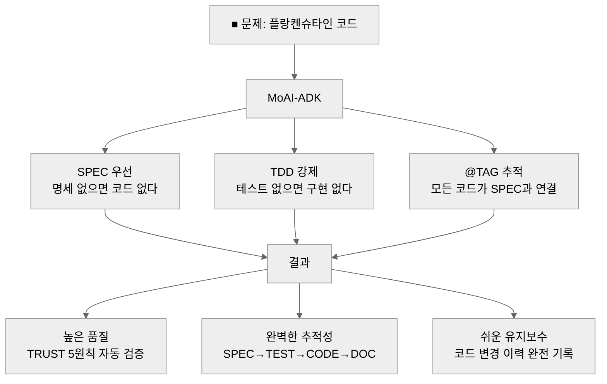
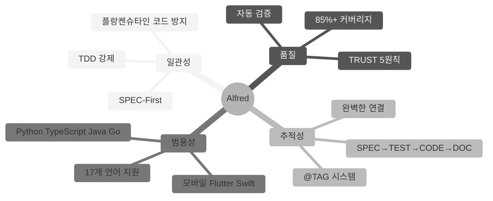
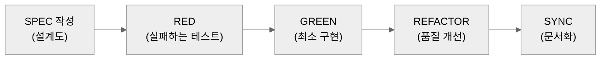
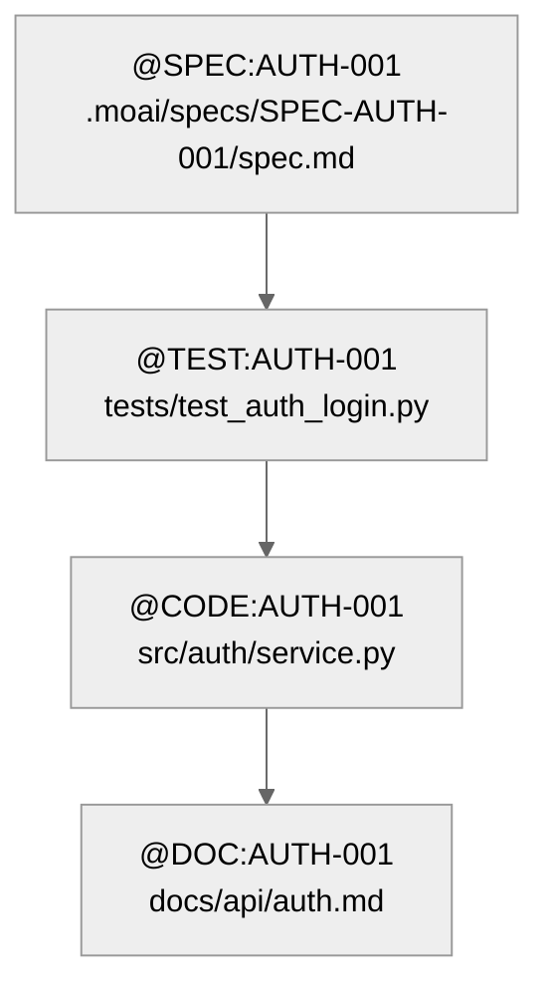
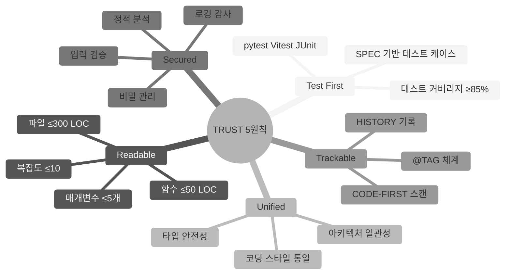
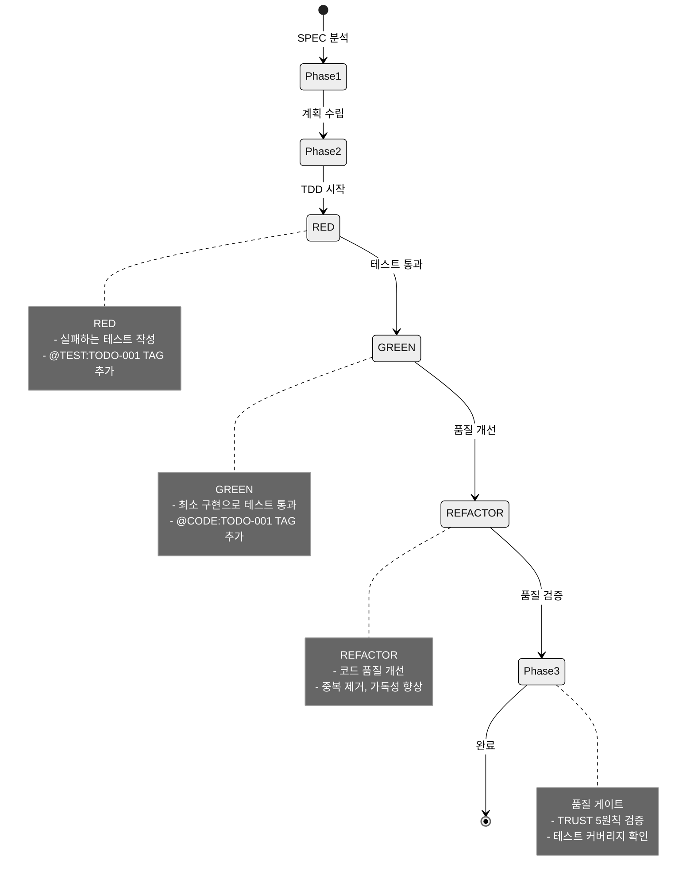
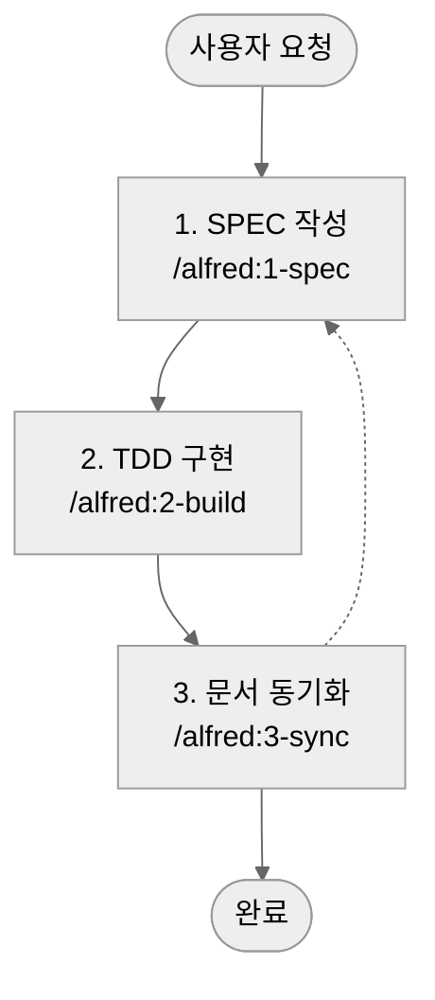

# MoAI-ADK (Agentic Development Kit)

[](https://pypi.org/project/moai-adk/)
[](https://opensource.org/licenses/MIT)
[](https://www.python.org/)
[](https://github.com/modu-ai/moai-adk/actions/workflows/moai-gitflow.yml)
[](https://codecov.io/gh/modu-ai/moai-adk)
[](https://github.com/modu-ai/moai-adk)

## MoAI-ADK: 모두의AI 에이전틱 코딩 개발 프레임워크

**안내**: MoAI-ADK는 모두의AI 연구실에서 집필 중인 "(가칭) 에이전틱 코딩" 서적의 별책 부록 오픈 소스 프로젝트입니다.


> **"SPEC이 없으면 CODE도 없다."**

---

## 목차

- [이런 문제 겪고 계신가요?](#이런-문제-겪고-계신가요)
- [Meet Alfred](#meet-alfred---12개-ai-에이전트-팀)
- [5분 만에 이해하는 핵심 개념](#5분-만에-이해하는-핵심-개념)
- [Quick Start](#quick-start-3분-실전)
- [첫 번째 프로젝트: Todo API](#첫-번째-프로젝트-todo-api-만들기)
- [3단계 워크플로우](#3단계-워크플로우)
- [실전 시나리오](#실전-시나리오)
- [AI 모델 선택 가이드](#ai-모델-선택-가이드)
- [CLI Reference](#cli-reference)
- [출력 스타일](#alfreds-output-styles)
- [언어 지원](#universal-language-support)
- [TRUST 5원칙](#trust-5원칙)
- [FAQ](#faq)
- [문제 해결](#문제-해결)

---

## ■ 이런 문제 겪고 계신가요?

### AI 코딩의 현실

- **"AI가 만든 코드, 나중에 유지보수 불가능..."**
  - 같은 기능을 매번 다르게 구현
  - 코드 스타일이 파일마다 제각각
  - 테스트 코드는 없고 버그는 많음

- **"같은 질문 반복해도 매번 다른 답변..."**
  - 이전 대화 내용을 기억하지 못함
  - 일관된 아키텍처를 유지하기 어려움
  - 프로젝트 전체 맥락을 놓침

- **"코드는 많은데 문서는 없고, 추적 불가능..."**
  - 왜 이렇게 만들었는지 알 수 없음
  - 코드 변경 이력 추적 불가
  - 요구사항과 코드가 따로 놈

- **"프롬프트 엔지니어링에만 하루가 다 갔어요..."**
  - 완벽한 프롬프트를 찾기 위해 수십 번 시도
  - AI에게 매번 같은 제약사항을 반복 설명
  - 코드 품질을 수동으로 검증

### MoAI-ADK는 이렇게 해결합니다



---

## ■ Meet Alfred - AI 에이전트 팀

안녕하세요, 모두의AI SuperAgent **Alfred**입니다!


저는 MoAI-ADK의 SuperAgent이자 중앙 오케스트레이터 AI입니다. **AI 에이전트 팀**(Alfred + 다수 전문 에이전트)을 조율하여 Claude Code 환경에서 완벽한 개발 지원을 제공합니다.

### ▶ 흥미로운 사실: AI가 만든 AI 개발 도구

이 프로젝트의 모든 코드는 **100% AI에 의해 작성**되었습니다.

- **AI 협업 설계**: GPT-5 Pro와 Claude 4.1 Opus가 함께 아키텍처를 설계
- **Agentic Coding 적용**: AI 에이전트 팀(Alfred + 다수 전문 에이전트)이 자율적으로 SPEC 작성, TDD 구현, 문서 동기화 수행
- **투명성**: 완벽하지 않은 부분을 숨기지 않고, 커뮤니티와 함께 개선해나가는 오픈소스

### Alfred가 제공하는 4가지 핵심 가치



#### 1. 일관성 (Consistency)

**SPEC → TDD → Sync** 3단계 파이프라인으로 플랑켄슈타인 코드 방지

#### 2. 품질 (Quality)

**TRUST 5원칙** 자동 적용 및 검증 (Test First, Readable, Unified, Secured, Trackable)

#### 3. 추적성 (Traceability)

**@TAG 시스템**으로 `@SPEC → @TEST → @CODE → @DOC` 완벽 연결

#### 4. 범용성 (Universality)

**모든 주요 언어 지원** (Python, TypeScript, Java, Go, Rust, Dart, Swift, Kotlin 등)

---

## ■ 5분 만에 이해하는 핵심 개념

### 1. SPEC-First: 설계도 먼저 그리기

**비유**: 집을 짓기 전에 설계도를 그리듯이, 코드를 쓰기 전에 SPEC을 작성합니다.



#### EARS 구문으로 명세 작성 (실제 예시)

**EARS (Easy Approach to Requirements Syntax)**: 체계적인 요구사항 작성 방법론

```markdown
# @SPEC:AUTH-001: JWT 인증 시스템

## Ubiquitous (기본 기능)
- 시스템은 사용자 인증 기능을 제공해야 한다

## Event-driven (이벤트 기반)
- WHEN 사용자가 유효한 자격증명으로 로그인하면,
  시스템은 JWT 토큰을 발급해야 한다
- WHEN 토큰이 만료되면,
  시스템은 401 에러를 반환해야 한다

## State-driven (상태 기반)
- WHILE 사용자가 인증된 상태일 때,
  시스템은 보호된 리소스 접근을 허용해야 한다

## Optional (선택적 기능)
- WHERE 리프레시 토큰이 제공되면,
  시스템은 새로운 액세스 토큰을 발급할 수 있다

## Constraints (제약사항)
- IF 잘못된 토큰이 제공되면,
  시스템은 접근을 거부해야 한다
- 액세스 토큰 만료시간은 15분을 초과하지 않아야 한다
```

**실습**: Claude Code에서 직접 해보기

```bash
/alfred:1-spec "JWT 기반 사용자 로그인 API"
# Alfred가 위 형식으로 SPEC을 자동 생성합니다
```

---

### 2. @TAG 추적: 코드와 문서를 실로 엮기

**비유**: 책의 색인처럼, 모든 코드를 SPEC과 연결합니다.



#### 실제 코드 예시

```python
# tests/test_auth_login.py
# @TEST:AUTH-001 | SPEC: SPEC-AUTH-001.md

def test_login_success():
    """사용자가 유효한 자격증명으로 로그인하면 JWT 토큰을 발급해야 한다"""
    response = login(username="user@example.com", password="valid_pass")
    assert response.status_code == 200
    assert "access_token" in response.json()
```

```python
# src/auth/service.py
# @CODE:AUTH-001 | SPEC: SPEC-AUTH-001.md | TEST: tests/test_auth_login.py

def login(username: str, password: str) -> TokenResponse:
    """JWT 토큰 발급 로직"""
    if not validate_credentials(username, password):
        raise UnauthorizedError()

    token = generate_jwt_token(username)
    return TokenResponse(access_token=token)
```

#### TAG 검증 실습 (실제로 해볼 수 있는 명령어)

```bash
# 1. 모든 TAG 스캔
rg '@(SPEC|TEST|CODE|DOC):' -n .moai/specs/ tests/ src/ docs/

# 2. 특정 도메인 TAG 확인
rg '@SPEC:AUTH' -n .moai/specs/

# 3. 고아 TAG 탐지 (CODE는 있는데 SPEC이 없는 경우)
rg '@CODE:AUTH-001' -n src/          # CODE 있음
rg '@SPEC:AUTH-001' -n .moai/specs/  # SPEC 있는지 확인
```

---

### 3. TRUST 품질: 5가지 원칙으로 코드 품질 보장

**비유**: 자동차 안전검사처럼, 코드도 5가지 기준으로 검사합니다.



#### 코드 제약 구체적 예시

```python
# ✅ 좋은 예: 함수 ≤50 LOC, 매개변수 ≤5개
def create_user(
    username: str,
    email: str,
    password: str,
    role: str = "user",
    is_active: bool = True
) -> User:
    """사용자 생성 (40 LOC)"""
    # 입력 검증
    if not username or len(username) < 3:
        raise ValueError("Username must be at least 3 characters")

    if not email or "@" not in email:
        raise ValueError("Invalid email address")

    # 비밀번호 해싱
    hashed_password = hash_password(password)

    # 사용자 생성
    user = User(
        username=username,
        email=email,
        password=hashed_password,
        role=role,
        is_active=is_active
    )

    # DB 저장
    db.session.add(user)
    db.session.commit()

    return user


# ❌ 나쁜 예: 함수 > 50 LOC, 매개변수 > 5개
def create_user_with_profile_and_settings_and_notifications(
    username, email, password, role, is_active, profile_data,
    settings_data, notification_preferences, theme, language
):
    """100 LOC 넘는 거대 함수..."""
    # ... 너무 많은 책임 ...
```

---

## ■ Quick Start (3분 실전)

### ▶ 준비물

- ✅ Python 3.13+
- ✅ **uv** (필수 - pip보다 10-100배 빠름)
- ✅ Claude Code 실행 중
- ✅ Git 설치 (선택사항)

### ▶ 3단계로 시작하기

#### 1. uv 설치 (필수)

**uv는 pip보다 10-100배 빠른 Python 패키지 관리자입니다** (Rust 기반).

```bash
# macOS/Linux
curl -LsSf https://astral.sh/uv/install.sh | sh

# Windows (PowerShell)
powershell -c "irm https://astral.sh/uv/install.ps1 | iex"

# 설치 확인
uv --version
```

#### 2. moai-adk 설치 (10초)

```bash
uv pip install moai-adk

# 설치 확인
moai-adk --version
```

#### 3. 프로젝트 시작 (1분)

**새 프로젝트:**

```bash
moai-adk init my-project
cd my-project
claude
```

**기존 프로젝트:**

```bash
cd existing-project
moai-adk init .
claude
```

**Claude Code에서 초기화:**

```text
/alfred:0-project
```

**첫 기능 개발:**

```text
/alfred:1-spec "사용자 인증 기능"
/alfred:2-build AUTH-001
/alfred:3-sync
```

### ▶ 완료!

**생성된 것들:**

- ✅ `.moai/specs/SPEC-AUTH-001/spec.md` (명세)
- ✅ `tests/test_auth_login.py` (테스트)
- ✅ `src/auth/service.py` (구현)
- ✅ `docs/api/auth.md` (문서)
- ✅ `@SPEC → @TEST → @CODE → @DOC` TAG 체인

---

## ■ 첫 번째 프로젝트: Todo API 만들기

### Step 1: SPEC 작성 (5분)

**Alfred에게 요청**:

```bash
/alfred:1-spec "할 일 추가, 조회, 수정, 삭제 API"
```

**Alfred가 생성하는 것**:

- `.moai/specs/SPEC-TODO-001/spec.md` (EARS 구문)
- `.moai/specs/SPEC-TODO-001/plan.md` (구현 계획)
- `feature/SPEC-TODO-001` 브랜치 (Team 모드)
- Draft PR (Team 모드)

**생성된 SPEC 예시**:

```yaml
---
id: TODO-001
version: 0.0.1
status: draft
created: 2025-10-17
updated: 2025-10-17
author: @Goos
priority: high
---

# @SPEC:TODO-001: Todo API

## Ubiquitous
- 시스템은 할 일 CRUD 기능을 제공해야 한다

## Event-driven
- WHEN 사용자가 새 할 일을 생성하면, 시스템은 고유 ID를 부여해야 한다
- WHEN 사용자가 할 일을 완료 처리하면, 시스템은 completed_at 타임스탬프를 기록해야 한다

## Constraints
- 할 일 제목은 1-200자여야 한다
- 할 일은 작성자만 수정/삭제할 수 있어야 한다
```

---

### Step 2: TDD 구현 (10분)

**Alfred에게 요청**:

```bash
/alfred:2-build TODO-001
```

**Alfred의 3단계 TDD 프로세스**:



**생성된 파일들**:

```text
tests/test_todo_api.py          # @TEST:TODO-001
src/todo/service.py             # @CODE:TODO-001:DOMAIN
src/todo/models.py              # @CODE:TODO-001:DATA
src/todo/routes.py              # @CODE:TODO-001:API
```

---

### Step 3: 문서 동기화 (2분)

**Alfred에게 요청**:

```bash
/alfred:3-sync
```

**Alfred가 자동 수행**:

1. **품질 검증** (Haiku 에이전트)
   - TRUST 5원칙 준수 확인
   - TAG 체인 무결성 검증

2. **문서 동기화** (Haiku 에이전트)
   - API 문서 자동 생성 (`docs/api/todo.md`)
   - @DOC:TODO-001 TAG 추가

3. **PR 준비** (Team 모드)
   - Draft → Ready 전환
   - CI/CD 확인
   - (선택) `--auto-merge`로 자동 병합

**생성된 문서**:

```markdown
# @DOC:TODO-001: Todo API

## API Endpoints

### POST /api/todos

할 일 생성

**Request**:

```json
{
  "title": "장보기",
  "description": "우유, 빵"
}
```

**Response**:

```json
{
  "id": "uuid-123",
  "title": "장보기",
  "completed": false,
  "created_at": "2025-10-17T10:00:00Z"
}
```

---

### ▶ 완료! 15분 만에 Todo API 완성

**생성된 것들**:

- ✅ `.moai/specs/SPEC-TODO-001/` (명세, 계획, 수락 기준)
- ✅ `tests/test_todo_api.py` (테스트 - 커버리지 87%)
- ✅ `src/todo/` (구현 - 3개 파일, 총 180 LOC)
- ✅ `docs/api/todo.md` (API 문서)
- ✅ `@SPEC → @TEST → @CODE → @DOC` TAG 체인

**검증 명령어**:

```bash
# TAG 체인 확인
rg '@(SPEC|TEST|CODE|DOC):TODO-001' -n

# 테스트 실행
pytest tests/test_todo_api.py -v

# API 문서 확인
cat docs/api/todo.md
```

---

## ■ 3단계 워크플로우

Alfred의 핵심은 **체계적인 3단계 워크플로우**입니다.



### 1. SPEC - 명세 작성

**명령어**: `/alfred:1-spec "JWT 기반 사용자 로그인 API"`

**Alfred가 자동 수행:**

- EARS 형식 명세 자동 생성
- `@SPEC:ID` TAG 부여
- Git 브랜치 자동 생성 (Team 모드)
- Draft PR 생성 (Team 모드)
- HISTORY 섹션 자동 추가

**산출물:**

- `.moai/specs/SPEC-AUTH-001/spec.md`
- `.moai/specs/SPEC-AUTH-001/plan.md`
- `.moai/specs/SPEC-AUTH-001/acceptance.md`

### 2. BUILD - TDD 구현

**명령어**: `/alfred:2-build AUTH-001`

**Alfred가 자동 수행 (3개 에이전트 협업):**

- **Phase 1 (implementation-planner)**: SPEC 분석, 라이브러리 선정, TAG 체인 설계
- **Phase 2 (tdd-implementer)**: RED → GREEN → REFACTOR TDD 사이클
  - **RED**: 실패하는 테스트 작성 (@TEST:ID)
  - **GREEN**: 최소 구현으로 테스트 통과 (@CODE:ID)
  - **REFACTOR**: 코드 품질 개선
- **Phase 3 (quality-gate)**: TRUST 5원칙 자동 검증 (Pass/Warning/Critical)
- **Phase 4 (git-manager)**: 단계별 Git 커밋 (TDD 완료 시 1회)

**산출물:**

- `tests/test_auth_login.py` (테스트 코드)
- `src/auth/service.py` (구현 코드)
- `@TEST:AUTH-001` → `@CODE:AUTH-001` TAG 체인
- 품질 검증 리포트

### 3. SYNC - 문서 동기화

**명령어**: `/alfred:3-sync`

**Alfred가 자동 수행:**

- **Phase 1 (quality-gate)**: 동기화 전 빠른 품질 검증 (조건부, 변경 라인 >50줄)
- **Phase 2 (doc-syncer)**: Living Document 업데이트
- **Phase 3 (tag-agent)**: TAG 시스템 무결성 검증
- **Phase 4 (git-manager)**: sync-report.md 생성, PR Ready 전환 (Team 모드)
- **선택적 자동 머지** (`--auto-merge`): CI/CD 확인 후 자동 병합

**산출물:**

- `docs/api/auth.md` (API 문서)
- `.moai/reports/sync-report.md`
- `@DOC:AUTH-001` TAG 추가

---

## ■ 실전 시나리오

### 시나리오 1: 긴급 버그 수정 (Hotfix)

**상황**: 프로덕션에서 로그인 에러 발생!

```bash
# 옵션 1: 표준 방식 (권장)
git checkout develop
git checkout -b hotfix/auth-error
# ... 수정 ...
git push origin hotfix/auth-error
# PR 생성: hotfix -> develop -> main

# 옵션 2: 직접 main 수정 (허용, 하지만 권장 안 함)
git checkout main
# ... 수정 ...
git commit -m "Fix critical auth bug"
git push origin main  # ⚠️ Advisory 경고 표시되지만 진행됨
```

**Alfred의 Advisory 경고**:

```text
⚠️  ADVISORY: Non-standard GitFlow detected

Current branch: hotfix/auth-error
Target branch: main

Recommended GitFlow workflow:
  1. Push to hotfix and create PR to develop
  2. Merge into develop after code review
  3. When develop is stable, create PR from develop to main
  4. Release manager merges develop -> main with tag

✓ Push will proceed (flexibility mode enabled)
```

---

### 시나리오 2: 새 기능 개발 (Feature)

```bash
# 1. develop에서 최신 코드 받기
git checkout develop
git pull origin develop

# 2. Claude Code에서 SPEC 작성
/alfred:1-spec "사용자 프로필 이미지 업로드"
# → feature/SPEC-PROFILE-001 브랜치 자동 생성
# → Draft PR 자동 생성 (feature → develop)

# 3. TDD 구현
/alfred:2-build PROFILE-001

# 4. 문서 동기화 + 자동 머지
/alfred:3-sync --auto-merge
# → 문서 동기화
# → PR Ready 전환
# → CI/CD 확인
# → PR 자동 머지 (squash)
# → develop 체크아웃
# → 다음 작업 준비 완료 ✅
```

---

## ■ AI 모델 선택 가이드

MoAI-ADK는 **Haiku 4.5**와 **Sonnet 4.5** 두 가지 AI 모델을 전략적으로 활용하여 **최적의 성능과 비용 효율**을 제공합니다.

### 패스트 모드 vs 스마트 모드

Claude Code에서 `/model` 명령어로 전체 세션의 기본 모델을 변경할 수 있습니다:

```text
# 패스트 모드 (빠른 응답, 반복 작업)
/model haiku

# 스마트 모드 (복잡한 판단, 설계)
/model sonnet
```

### 12개 에이전트의 모델 배치 전략

Alfred는 **작업 특성**에 따라 각 에이전트에 최적 모델을 할당합니다:

#### ▶ Haiku 에이전트 (6개) - 패스트 모드

**빠른 응답이 필요한 반복 작업 및 패턴 매칭**

| 에이전트            | 역할            | 왜 Haiku?                                    |
| ------------------- | --------------- | -------------------------------------------- |
| **doc-syncer** 📖    | 문서 동기화     | 패턴화된 문서 업데이트, Living Document 생성 |
| **tag-agent** 🏷️     | TAG 시스템 관리 | 반복적 패턴 매칭, TAG 체인 검증              |
| **git-manager** 🚀   | Git 워크플로우  | 정형화된 Git 명령어 실행, 브랜치/PR 생성     |
| **trust-checker** ✅ | TRUST 원칙 검증 | 규칙 기반 체크리스트 확인                    |
| **quality-gate** 🛡️  | 품질 검증       | TRUST 원칙 자동 검증, 빠른 품질 게이트       |
| **Explore** 🔍       | 코드베이스 탐색 | 대량 파일 스캔, 키워드 검색                  |

**장점**:

- **속도 2~5배 향상**: 실시간 응답 (수 초 → 1초 이내)
- **비용 67% 절감**: 반복 작업이 많은 프로젝트에 효과적
- **높은 정확도**: 패턴화된 작업에서 Sonnet과 동등한 품질

#### ▶ Sonnet 에이전트 (6개) - 스마트 모드

**복잡한 판단과 창의적 설계가 필요한 작업**

| 에이전트                     | 역할             | 왜 Sonnet?                           |
| ---------------------------- | ---------------- | ------------------------------------ |
| **spec-builder** 🏗️           | SPEC 작성        | EARS 구조 설계, 복잡한 요구사항 분석 |
| **implementation-planner** 📋 | 구현 전략 수립   | 아키텍처 설계, 라이브러리 선정       |
| **tdd-implementer** 🔬        | TDD 구현         | RED-GREEN-REFACTOR, 복잡한 리팩토링  |
| **debug-helper** 🔍           | 디버깅           | 런타임 오류 분석, 해결 방법 도출     |
| **cc-manager** 🛠️             | Claude Code 설정 | 워크플로우 최적화, 복잡한 설정       |
| **project-manager** 📂        | 프로젝트 초기화  | 전략 수립, 복잡한 의사결정           |

**장점**:

- **높은 품질**: 복잡한 코드 품질 보장
- **깊은 이해**: 맥락 파악 및 창의적 해결책 제시
- **정확한 판단**: 아키텍처 결정, 설계 선택

### 사용 시나리오별 권장 모델

| 시나리오           | 권장 모델 | 이유                          |
| ------------------ | --------- | ----------------------------- |
| **새 프로젝트 시작** | Sonnet    | SPEC 설계, 아키텍처 결정 필요 |
| **반복 개발**      | Haiku     | 이미 정해진 패턴 반복 구현    |
| **버그 수정**      | Sonnet    | 원인 분석 및 해결 방법 도출   |
| **문서 작성**      | Haiku     | Living Document 동기화        |
| **코드 탐색**      | Haiku     | 파일 검색, TAG 조회           |
| **리팩토링**       | Sonnet    | 구조 개선, 복잡한 변경        |

### 모델 전환 팁

```text
# 새 기능 설계 시작
/model sonnet
/alfred:1-spec "사용자 인증 시스템"

# SPEC 승인 후 TDD 구현
/alfred:2-build AUTH-001

# 구현 완료 후 문서 동기화 (자동으로 Haiku 사용)
/alfred:3-sync

# 다음 기능 설계
/model sonnet
/alfred:1-spec "결제 시스템"
```

**Pro Tip**: Alfred는 각 에이전트를 호출할 때 자동으로 최적 모델을 사용하므로, **세션 전체 모델 변경은 선택사항**입니다. 기본 설정(Sonnet)으로도 충분히 효율적입니다.

---

## ■ CLI Reference

### 프로젝트 관리

```bash
# 새 프로젝트 생성
moai-adk init project-name

# 기존 프로젝트에 설치
moai-adk init .

# 프로젝트 상태 확인
moai-adk status

# 프로젝트 업데이트
moai-adk update

# 시스템 진단
moai-adk doctor

# 버전 확인
moai-adk --version

# 도움말
moai-adk --help
```

### Alfred 커맨드 (Claude Code 내)

#### 기본 커맨드

```text
# 프로젝트 초기화
/alfred:0-project

# SPEC 작성
/alfred:1-spec "기능 설명"
/alfred:1-spec SPEC-001 "수정 내용"

# TDD 구현
/alfred:2-build SPEC-001
/alfred:2-build all

# 문서 동기화
/alfred:3-sync
/alfred:3-sync --auto-merge
/alfred:3-sync force
```

#### 커맨드별 에이전트 & 모델 매핑

각 Alfred 커맨드는 적절한 에이전트를 호출하며, **자동으로 최적 모델**을 사용합니다:

| 커맨드              | 에이전트 (Phase)                                              | 모델                       | 작업 특성                                | 예상 시간 |
| ------------------- | ------------------------------------------------------------- | -------------------------- | ---------------------------------------- | --------- |
| `/alfred:0-project` | project-manager 📂                                             | 세션 기본 모델             | 프로젝트 전략 수립, 복잡한 의사결정      | 1~2분     |
| `/alfred:1-spec`    | spec-builder 🏗️                                                | 세션 기본 모델             | EARS 명세 설계, 요구사항 분석            | 2~3분     |
| `/alfred:2-build`   | implementation-planner 📋 → tdd-implementer 🔬 → quality-gate 🛡️ | 세션 기본 모델 + **Haiku** | SPEC 분석 → TDD 구현 → 품질 검증 (3단계) | 3~5분     |
| `/alfred:3-sync`    | quality-gate 🛡️ → doc-syncer 📖 → tag-agent 🏷️                   | **Haiku 지정**             | 사전 검증 → 문서 동기화 → TAG 검증       | 30초~1분  |

#### 온디맨드 에이전트 호출

특정 에이전트를 직접 호출할 수도 있습니다:

```text
# Haiku 에이전트 (빠른 작업)
@agent-tag-agent "AUTH 도메인 TAG 목록 조회"
@agent-git-manager "브랜치 생성 및 PR 생성"
@agent-trust-checker "TRUST 원칙 준수 여부 확인"
@agent-quality-gate "코드 품질 검증 실행"
@agent-Explore "JWT 인증 관련 코드 위치 탐색"

# Sonnet 에이전트 (복잡한 작업)
@agent-spec-builder "SPEC-AUTH-001 메타데이터 검증"
@agent-implementation-planner "AUTH-001 구현 계획 수립"
@agent-tdd-implementer "AUTH-001 TDD 구현 실행"
@agent-debug-helper "TypeError 런타임 오류 원인 분석"
@agent-cc-manager "Claude Code 설정 최적화"
```

#### 모델별 성능 비교

| 작업 유형       | Haiku (패스트) | Sonnet (스마트) | 실제 적용                  |
| --------------- | -------------- | --------------- | -------------------------- |
| **SPEC 작성**   | 1분            | 2~3분           | 세션 기본 모델 사용        |
| **TDD 구현**    | 2분            | 3~5분           | 세션 기본 모델 사용        |
| **문서 동기화** | 30초           | 1~2분           | ✅ Haiku 지정 (3-sync)      |
| **TAG 검증**    | 10초           | 30초            | ✅ Haiku 지정 (tag-agent)   |
| **Git 작업**    | 5초            | 15초            | ✅ Haiku 지정 (git-manager) |
| **디버깅**      | 1분            | 2~3분           | 세션 기본 모델 사용        |

**핵심 설계**:

- `/alfred:0-project`, `/alfred:1-spec`, `/alfred:2-build`: **사용자가 선택한 세션 기본 모델** 사용
  - `/model sonnet` (기본값): 높은 품질, 복잡한 판단
  - `/model haiku`: 빠른 속도, 반복 작업
- `/alfred:3-sync` 및 Haiku 에이전트: **자동으로 Haiku 모델** 사용 (패턴화된 작업)

**사용자 제어**: `/model` 명령어로 0~2번 커맨드의 품질과 속도를 자유롭게 조절할 수 있습니다.

---

## ■ Alfred's Output Styles

Alfred는 작업 특성과 사용자 경험 수준에 따라 **3가지 출력 스타일**을 제공합니다. Claude Code에서 `/output-style` 명령어로 언제든지 전환할 수 있습니다.

### 3가지 표준 스타일

#### 1. Agentic Coding (기본값)

**대상**: 실무 개발자, 팀 리더, 아키텍트

Alfred SuperAgent가 11개 전문 에이전트를 조율하여 빠른 개발과 협업을 자동으로 전환하는 통합 코딩 모드입니다.

**두 가지 작업 방식**:

- **Fast Mode (기본)**: 빠른 개발, 구현 위주 작업
  - SPEC → TDD → SYNC 자동화
  - 간결한 기술 커뮤니케이션
  - 최소 설명, 최대 효율
  - TRUST 5원칙 자동 검증
- **Collab Mode (자동 전환)**: "협업", "브레인스토밍", "설계", "리뷰" 키워드 감지 시
  - 질문 기반 대화
  - 트레이드오프 분석
  - 아키텍처 다이어그램 제공
  - 실시간 코드 리뷰

**핵심 원칙**:

- SPEC 우선: 모든 작업은 @SPEC:ID부터 시작
- TAG 무결성: `rg` 스캔 기반 실시간 검증
- TRUST 준수: 5원칙 자동 검증 및 품질 게이트
- 다중 언어: 17개 언어 지원 (Python, TypeScript, JavaScript, Java, Go, Rust, Dart, Swift, Kotlin, PHP, Ruby, C++, C, C#, Haskell, Shell, Lua)

**사용**:

```text
/output-style agentic-coding
```

---

#### 2. MoAI ADK Learning

**대상**: MoAI-ADK를 처음 사용하는 개발자

MoAI-ADK의 핵심 개념과 3단계 워크플로우를 친절하게 설명하여 빠르게 익힐 수 있도록 돕는 학습 모드입니다.

**핵심 철학**: "명세 없으면 코드 없다, 테스트 없으면 구현 없다"

**3가지 핵심 개념**:

1. **SPEC-First**: 코드 작성 전 명세를 먼저 작성
   - EARS 구문 (5가지 패턴)으로 요구사항 작성
   - Ubiquitous, Event-driven, State-driven, Optional, Constraints
2. **@TAG 추적성**: 모든 코드를 SPEC과 연결
   - `@SPEC → @TEST → @CODE → @DOC` 체계
   - CODE-FIRST 원칙 (코드 직접 스캔)
3. **TRUST 품질**: 5가지 원칙으로 코드 품질 보장
   - Test First, Readable, Unified, Secured, Trackable

**학습 내용**:

- 각 개념을 실생활 비유로 쉽게 설명
- 3단계 워크플로우 단계별 학습
- 실제 예시로 SPEC 작성 연습
- FAQ로 자주 묻는 질문 해결

**사용**:

```text
/output-style moai-adk-learning
```

---

#### 3. Study with Alfred

**대상**: 새로운 기술/언어/프레임워크를 배우려는 개발자

Alfred가 함께 배우는 친구처럼 새로운 기술을 쉽게 설명하고, 실습을 도와주는 학습 모드입니다.

**학습 4단계**:

1. **What (이게 뭐야?)** → 기본 개념 이해
   - 한 줄 요약
   - 실생활 비유
   - 핵심 개념 3가지

2. **Why (왜 필요해?)** → 사용 이유와 장점
   - 문제 상황
   - 해결 방법
   - 실제 사용 사례

3. **How (어떻게 써?)** → 실습 중심 학습
   - 최소 예제 (Hello World)
   - 실용적 예제 (CRUD API)
   - 자주 묻는 질문

4. **Practice (실전 적용)** → MoAI-ADK와 통합
   - SPEC → TEST → CODE 흐름으로 실습
   - Alfred가 단계별 안내
   - 완성된 코드 품질 검증

**특징**:

- 복잡한 개념을 쉽게 풀어서 설명
- 실생활 비유로 이해도 향상
- 단계별로 함께 실습
- 자주 묻는 질문에 답변

**사용**:

```text
/output-style study-with-alfred
```

---

### 스타일 전환 가이드

**언제 전환할까요?**

| 상황                | 권장 스타일             | 이유                             |
| ------------------- | ----------------------- | -------------------------------- |
| **실무 개발**       | Agentic Coding          | Fast/Collab 자동 전환, 효율 중심 |
| **MoAI-ADK 학습**   | MoAI ADK Learning       | SPEC-First, TAG, TRUST 개념 이해 |
| **새 기술 학습**    | Study with Alfred       | What-Why-How-Practice 4단계      |
| **반복 작업**       | Agentic Coding (Fast)   | 최소 설명, 빠른 실행             |
| **팀 협업**         | Agentic Coding (Collab) | 트레이드오프 분석, 브레인스토밍  |

**스타일 전환 예시**:

```text
# MoAI-ADK 처음 시작 시
/output-style moai-adk-learning

# 새로운 프레임워크 배울 때
/output-style study-with-alfred
"FastAPI를 배우고 싶어요"

# 실무 개발 시작
/output-style agentic-coding
/alfred:1-spec "사용자 인증 시스템"
```

---

## ■ Universal Language Support

Alfred는 **17개 주요 프로그래밍 언어**를 지원하며, 각 언어에 최적화된 도구 체인을 자동으로 선택합니다.

### 지원 언어 & 도구 (17개 언어)

#### 백엔드 & 시스템 (8개)

| 언어           | 테스트 프레임워크 | 린터/포매터     | 빌드 도구      | 타입 시스템 |
| -------------- | ----------------- | --------------- | -------------- | ----------- |
| **Python**     | pytest            | ruff, black     | uv, pip        | mypy        |
| **TypeScript** | Vitest, Jest      | Biome, ESLint   | npm, pnpm, bun | Built-in    |
| **Java**       | JUnit             | Checkstyle      | Maven, Gradle  | Built-in    |
| **Go**         | go test           | gofmt, golint   | go build       | Built-in    |
| **Rust**       | cargo test        | rustfmt, clippy | cargo          | Built-in    |
| **Kotlin**     | JUnit             | ktlint          | Gradle         | Built-in    |
| **PHP**        | PHPUnit           | PHP CS Fixer    | Composer       | PHPStan     |
| **Ruby**       | RSpec             | RuboCop         | Bundler        | Sorbet      |

#### 모바일 & 프론트엔드 (3개)

| 언어/프레임워크    | 테스트 프레임워크 | 린터/포매터      | 빌드 도구     | 플랫폼            |
| ------------------ | ----------------- | ---------------- | ------------- | ----------------- |
| **Dart (Flutter)** | flutter test      | dart analyze     | flutter       | iOS, Android, Web |
| **Swift**          | XCTest            | SwiftLint        | xcodebuild    | iOS, macOS        |
| **JavaScript**     | Jest, Vitest      | ESLint, Prettier | webpack, Vite | Web, Node.js      |

#### 시스템 & 스크립트 (6개)

| 언어        | 테스트 프레임워크 | 린터/포매터     | 빌드 도구       | 특징              |
| ----------- | ----------------- | --------------- | --------------- | ----------------- |
| **C++**     | Google Test       | clang-format    | CMake           | 고성능 시스템     |
| **C**       | CUnit             | clang-format    | Make, CMake     | 임베디드, 시스템  |
| **C#**      | NUnit, xUnit      | StyleCop        | MSBuild, dotnet | .NET 생태계       |
| **Haskell** | HUnit             | stylish-haskell | Cabal, Stack    | 함수형 프로그래밍 |
| **Shell**   | Bats              | shellcheck      | -               | 자동화 스크립트   |
| **Lua**     | busted            | luacheck        | -               | 임베디드 스크립팅 |

### 자동 언어 감지

Alfred는 프로젝트 루트의 설정 파일을 자동으로 감지하여 언어와 도구 체인을 선택합니다:

| 감지 파일                            | 언어         | 추가 감지                             |
| ------------------------------------ | ------------ | ------------------------------------- |
| `pyproject.toml`, `requirements.txt` | Python       | `setup.py`, `poetry.lock`             |
| `package.json` + `tsconfig.json`     | TypeScript   | `yarn.lock`, `pnpm-lock.yaml`         |
| `package.json` (tsconfig 없음)       | JavaScript   | `webpack.config.js`, `vite.config.js` |
| `pom.xml`, `build.gradle`            | Java         | `settings.gradle`, `build.gradle.kts` |
| `go.mod`                             | Go           | `go.sum`                              |
| `Cargo.toml`                         | Rust         | `Cargo.lock`                          |
| `pubspec.yaml`                       | Dart/Flutter | `flutter/packages/`                   |
| `Package.swift`                      | Swift        | `Podfile`, `Cartfile`                 |
| `build.gradle.kts` + `kotlin`        | Kotlin       | `settings.gradle.kts`                 |
| `composer.json`                      | PHP          | `composer.lock`                       |
| `Gemfile`                            | Ruby         | `Gemfile.lock`                        |
| `CMakeLists.txt`                     | C++          | `conanfile.txt`                       |
| `Makefile`                           | C            | `*.c`, `*.h`                          |
| `*.csproj`                           | C#           | `*.sln`                               |
| `*.cabal`                            | Haskell      | `stack.yaml`                          |
| `*.sh`                               | Shell        | `.bashrc`, `.zshrc`                   |
| `*.lua`                              | Lua          | `luarocks`                            |

### 언어별 TRUST 5원칙 적용

모든 언어는 동일한 TRUST 5원칙을 따르며, 언어별 최적 도구를 자동 사용합니다:

#### 주요 언어 TRUST 도구

| 원칙           | Python      | TypeScript             | Java       | Go       | Rust        | Ruby     |
| -------------- | ----------- | ---------------------- | ---------- | -------- | ----------- | -------- |
| **T**est First | pytest      | Vitest/Jest            | JUnit      | go test  | cargo test  | RSpec    |
| **R**eadable   | ruff, black | Biome, ESLint          | Checkstyle | gofmt    | rustfmt     | RuboCop  |
| **U**nified    | mypy        | Built-in               | Built-in   | Built-in | Built-in    | Sorbet   |
| **S**ecured    | bandit      | eslint-plugin-security | SpotBugs   | gosec    | cargo-audit | Brakeman |
| **T**rackable  | @TAG        | @TAG                   | @TAG       | @TAG     | @TAG        | @TAG     |

#### 추가 언어 TRUST 도구

| 원칙           | PHP          | C++          | C#                 |
| -------------- | ------------ | ------------ | ------------------ |
| **T**est First | PHPUnit      | Google Test  | NUnit              |
| **R**eadable   | PHP CS Fixer | clang-format | StyleCop           |
| **U**nified    | PHPStan      | Built-in     | Built-in           |
| **S**ecured    | RIPS         | cppcheck     | Security Code Scan |
| **T**rackable  | @TAG         | @TAG         | @TAG               |

**공통 원칙**:

- 모든 언어는 `@TAG 시스템`으로 SPEC→TEST→CODE→DOC 추적성 보장
- 언어별 표준 도구 체인을 자동 감지 및 적용
- TRUST 5원칙은 모든 프로젝트에 일관되게 적용

### 다중 언어 프로젝트 지원

**Monorepo 및 혼합 언어 프로젝트**도 완벽 지원:

```text
my-project/
├── backend/          # Python (FastAPI)
│   ├── pyproject.toml
│   └── src/
├── frontend/         # TypeScript (React)
│   ├── package.json
│   └── src/
└── mobile/           # Dart (Flutter)
    ├── pubspec.yaml
    └── lib/
```

Alfred는 각 디렉토리의 언어를 자동 감지하고 적절한 도구 체인을 사용합니다.

---

## ■ TRUST 5원칙

Alfred가 모든 코드에 자동으로 적용하는 품질 기준입니다.

### T - Test First (테스트 우선)

- SPEC 기반 테스트 케이스 작성
- TDD RED → GREEN → REFACTOR 사이클
- 테스트 커버리지 ≥ 85%

### R - Readable (가독성)

- 파일 ≤ 300 LOC
- 함수 ≤ 50 LOC
- 매개변수 ≤ 5개
- 복잡도 ≤ 10

### U - Unified (통일성)

- 타입 안전성 또는 런타임 검증
- 아키텍처 일관성
- 코딩 스타일 통일

### S - Secured (보안)

- 입력 검증
- 로깅 및 감사
- 비밀 관리
- 정적 분석

### T - Trackable (추적성)

- `@SPEC → @TEST → @CODE → @DOC` TAG 체인
- CODE-FIRST 원칙 (코드 직접 스캔)
- HISTORY 섹션 기록

### 자동 검증

```text
# TDD 구현 완료 후 자동 실행
/alfred:2-build AUTH-001

# 또는 수동 실행
/alfred:3-sync

# trust-checker 에이전트가 자동으로 검증:
# ✅ Test Coverage: 87% (목표: 85%)
# ✅ Code Constraints: 모든 파일 300 LOC 이하
# ✅ TAG Chain: 무결성 확인 완료
```

---

## ■ 업그레이드 가이드

### 1단계: 패키지 업데이트

```bash
moai-adk update

# 또는
uv pip install --upgrade moai-adk
```

### 2단계: 프로젝트 업데이트

```bash
cd your-project
moai-adk init .
```

**자동 백업**: 업데이트 전 `.moai-backups/{timestamp}/`에 자동 백업 생성

### 3단계: Claude Code 최적화

```text
$ claude
> /alfred:0-project
```

병합 프롬프트에서 **Merge** 선택 → 기존 문서 유지 + 새 템플릿 추가

### 검증 체크리스트

```bash
# 상태 확인
moai-adk status

## 출력 예시:
╭────── Project Status ──────╮
│   Mode          team       │
│   Locale        ko         │
│   SPECs         23         │
│   Branch        develop    │
│   Git Status    Clean      │
╰────────────────────────────╯
```

```bash
# 시스템 진단
moai-adk doctor

## 출력 예시:
Running system diagnostics...
┏━━━━━━━━━━━━━━━━━━━━━━━━━━━━━━━━━━━━━━━━━━┳━━━━━━━━┓
┃ Check                                    ┃ Status ┃
┡━━━━━━━━━━━━━━━━━━━━━━━━━━━━━━━━━━━━━━━━━━╇━━━━━━━━┩
│ Python >= 3.13                           │   ✓    │
│ Git installed                            │   ✓    │
│ Project structure (.moai/)               │   ✓    │
│ Config file (.moai/config.json)          │   ✓    │
└──────────────────────────────────────────┴────────┘
```

---

## ■ FAQ

### Q1: MoAI-ADK는 어떤 프로젝트에 적합한가요?

**A**: 다음과 같은 프로젝트에 적합합니다:

- ✅ 새로운 프로젝트 (그린필드)
- ✅ 기존 프로젝트 (레거시 도입)
- ✅ 개인 프로젝트 (Personal 모드)
- ✅ 팀 프로젝트 (Team 모드, GitFlow 지원)
- ✅ 모든 주요 프로그래밍 언어

### Q2: Claude Code가 필수인가요?

**A**: 네, MoAI-ADK는 Claude Code 환경에서 동작하도록 설계되었습니다. Claude Code는 Anthropic의 공식 CLI 도구로, AI 에이전트 시스템을 완벽하게 지원합니다.

### Q3: 기존 프로젝트에 도입할 수 있나요?

**A**: 네, `moai-adk init .` 명령으로 기존 프로젝트에 안전하게 설치할 수 있습니다. Alfred는 기존 코드 구조를 분석하여 `.moai/` 폴더에 문서와 설정만 추가합니다.

### Q4: Personal 모드와 Team 모드의 차이는?

**A**:

- **Personal 모드**: 로컬 작업 중심, 체크포인트만 생성
- **Team 모드**: GitFlow 지원, Draft PR 자동 생성, develop 브랜치 기반

### Q5: SPEC 메타데이터는 어떻게 관리하나요?

**A**: `.moai/memory/spec-metadata.md`에 전체 가이드가 있습니다.

- **필수 7개**: id, version, status, created, updated, author, priority
- **선택 9개**: category, labels, depends_on, blocks, related_specs, related_issue, scope
- **HISTORY 섹션**: 모든 변경 이력 기록 (필수)

### Q6: TDD 단계별로 커밋하나요?

**A**: 아니요, v0.3.0부터 **TDD 전체 사이클(RED→GREEN→REFACTOR) 완료 후 1회만 커밋**합니다. 이전처럼 각 단계별로 3번 커밋하지 않습니다.

### Q7: Context Engineering이란?

**A**:

- **JIT Retrieval**: 필요한 순간에만 문서 로드 (초기 컨텍스트 최소화)
- **Explore 에이전트**: 대규모 코드베이스 효율적 탐색

### Q8: 자동 백업은 어떻게 작동하나요?

**A**:

- **Template Processor**: 업데이트 전 `.moai-backups/alfred-{timestamp}/` 자동 백업
- **Event-Driven Checkpoint**: 위험한 작업 전 자동 checkpoint 생성
- **보존 정책**: 최대 10개 유지, 7일 후 자동 정리

### Q9: /model 명령어를 사용해야 하나요?

**A**: **선택사항**입니다. Alfred는 이미 각 에이전트에 최적 모델을 할당했으므로:

- ✅ **기본 설정 유지** (권장): Alfred가 자동으로 작업별 최적 모델 사용
- ⚡ **패스트 모드**: `/model haiku` - 반복 작업 시 전체 세션을 Haiku로
- 🧠 **스마트 모드**: `/model sonnet` - 복잡한 판단이 계속 필요할 때

**Pro Tip**: 기본 설정으로도 Haiku/Sonnet이 혼합 사용되므로 성능과 비용이 이미 최적화되어 있습니다.

### Q10: Haiku와 Sonnet의 비용 차이는?

**A**:

- **Haiku**: $1 / 1M 입력 토큰, $5 / 1M 출력 토큰
- **Sonnet**: $3 / 1M 입력 토큰, $15 / 1M 출력 토큰
- **절감 효과**: Haiku 에이전트 사용 시 **비용 67% 절감**

**예시 (100만 토큰 기준)**:

- 100% Sonnet: $18 (입력 + 출력)
- MoAI-ADK (혼합): $6~$9 (작업 특성에 따라)
- **절감액**: $9~$12 (50~67%)

---

## ■ 문제 해결

### 설치 문제

```bash
# Python 버전 확인 (3.13+ 필요)
python --version

# uv 설치 확인
uv --version

# uv가 없다면 먼저 설치 (필수)
# macOS/Linux:
curl -LsSf https://astral.sh/uv/install.sh | sh

# Windows:
powershell -c "irm https://astral.sh/uv/install.ps1 | iex"

# moai-adk 재설치
uv pip install moai-adk --force-reinstall
```

### 초기화 문제

```bash
# 프로젝트 상태 확인
moai-adk status
```

**출력 예시**:

```text
╭────── Project Status ──────╮
│   Mode          team       │
│   Locale        ko         │
│   SPECs         23         │
│   Branch        develop    │
│   Git Status    Clean      │
╰────────────────────────────╯
```

```bash
# 시스템 진단
moai-adk doctor
```

**출력 예시**:

```text
Running system diagnostics...

┏━━━━━━━━━━━━━━━━━━━━━━━━━━━━━━━━━━━━━━━━━━┳━━━━━━━━┓
┃ Check                                    ┃ Status ┃
┡━━━━━━━━━━━━━━━━━━━━━━━━━━━━━━━━━━━━━━━━━━╇━━━━━━━━┩
│ Python >= 3.13                           │   ✓    │
│ Git installed                            │   ✓    │
│ Project structure (.moai/)               │   ✓    │
│ Config file (.moai/config.json)          │   ✓    │
└──────────────────────────────────────────┴────────┘
```

```bash
# 강제 재초기화 (문제가 있을 경우)
moai-adk init . --force
```

### Claude Code 문제

```text
# 설정 확인
ls -la .claude/

# Alfred 커맨드 확인
ls -la .claude/commands/alfred/

# 출력 스타일 확인
/output-style agentic-coding
```

### 일반적인 에러

#### 에러: "moai-adk: command not found"

```bash
# PATH 확인 및 전체 경로 사용
~/.local/bin/moai-adk --version

# 또는 pip로 재설치
pip install --force-reinstall moai-adk
```

#### 에러: ".moai/ 디렉토리를 찾을 수 없습니다"

```bash
# 초기화 실행
moai-adk init .

# 또는 Claude Code에서
/alfred:0-project
```

#### 에러: "SPEC ID 중복"

```bash
# 기존 SPEC 확인
rg "@SPEC:" -n .moai/specs/

# 새로운 ID 사용
/alfred:1-spec "새 기능 설명"
```

---

## ■ 문서 및 지원

### 공식 문서

- **GitHub Repository**: https://github.com/modu-ai/moai-adk
- **PyPI Package**: https://pypi.org/project/moai-adk/
- **Issue Tracker**: https://github.com/modu-ai/moai-adk/issues
- **Discussions**: https://github.com/modu-ai/moai-adk/discussions

### 커뮤니티

- **GitHub Discussions**: 질문, 아이디어, 피드백 공유
- **Issue Tracker**: 버그 리포트, 기능 요청

### 기여하기

MoAI-ADK는 오픈소스 프로젝트입니다. 여러분의 기여를 환영합니다!

1. Fork the repository
2. Create your feature branch (`git checkout -b feature/amazing-feature`)
3. Commit your changes (`git commit -m 'Add amazing feature'`)
4. Push to the branch (`git push origin feature/amazing-feature`)
5. Open a Pull Request

### 라이선스

MIT License - 자유롭게 사용하실 수 있습니다.

---

## ■ 감사의 말

MoAI-ADK는 다음 프로젝트와 커뮤니티의 도움으로 만들어졌습니다:

- **모두의AI Community**: 지속적인 피드백과 개선 아이디어

---

**Made with ❤️ by MoAI Team**

**🎩 Alfred**: "여러분의 개발 여정을 함께하겠습니다!"
