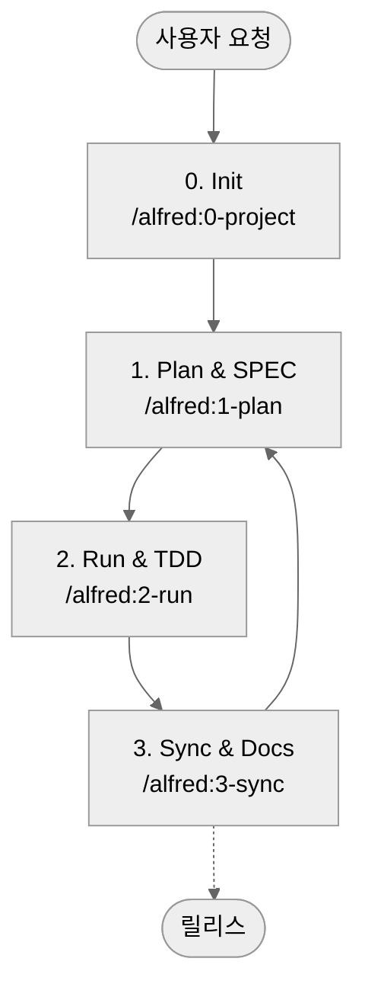

# MoAI-ADK (Agentic Development Kit)

[한국어](README.md) | [English](README.en.md) | [ไทย](README.th.md) | [日本語](README.ja.md) | [中文](README.zh.md) | [हिन्दी](README.hi.md)

[](https://pypi.org/project/moai-adk/)
[](https://opensource.org/licenses/MIT)
[](https://www.python.org/)
[](https://github.com/modu-ai/moai-adk/actions/workflows/moai-gitflow.yml)
[](https://codecov.io/gh/modu-ai/moai-adk)
[](https://github.com/modu-ai/moai-adk)

> **MoAI-ADK는 AI와 함께 명세(SPEC) → 테스트(TDD) → 코드 → 문서를 자연스럽게 잇는 개발 워크플로우를 제공합니다.**

---

## 1. MoAI-ADK 한눈에 보기

| 질문 | 바로 보기 |
| --- | --- |
| 처음 접했는데 무엇인가요? | [MoAI-ADK란?](#moai-adk란) |
| 어떻게 시작하나요? | [5분 Quick Start](#5-분-quick-start) |
| 기본 흐름이 궁금해요 | [기본 워크플로우 (0 → 3)](#기본-워크플로우-0--3) |
| Plan / Run / Sync 명령은 무엇을 하나요? | [핵심 명령 요약](#핵심-명령-요약) |
| SPEC·TDD·TAG가 뭐죠? | [핵심 개념 쉽게 이해하기](#핵심-개념-쉽게-이해하기) |
| 에이전트/Skills가 궁금해요 | [Sub-agent & Skills 개요](#sub-agent--skills-개요) |
| 더 깊이 공부하고 싶어요 | [추가 자료](#추가-자료) |

---

## MoAI-ADK란?

MoAI-ADK(MoAI Agentic Development Kit)는 **AI가 개발 과정 전체를 도와주는 오픈소스 툴킷**입니다. “먼저 SPEC(요구사항 명세)을 만들고, 테스트(TDD)로 확인한 뒤, 문서와 코드가 항상 동기화된다”는 원칙을 Alfred SuperAgent가 대신 지켜 줍니다.

입문자라도 다음 세 가지만 기억하면 됩니다.

1. **무엇을 만들지(SPEC)** 먼저 말한다.
2. **테스트 먼저 작성(TDD)** 후 코드를 채운다.
3. **문서/README/CHANGELOG**까지 자동으로 맞춰 둔다.

이 과정을 `/alfred` 명령 네 가지로 반복하면 전체 프로젝트가 일관되게 정리됩니다.

---

## 왜 필요한가요?

| 고민 | MoAI-ADK가 도와주는 방법 |
| --- | --- |
| “AI가 만든 코드를 믿기 어렵다” | 명세 → 테스트 → 구현 → 문서가 한 TAG 체인으로 연결됩니다. |
| “프로젝트 전체 맥락이 없어서 같은 질문을 반복한다” | Alfred가 핵심 문서와 히스토리를 기억하고 다시 안내합니다. |
| “프롬프트 작성이 어렵다” | `/alfred` 명령과 준비된 Skills가 표준화된 프롬프트를 대신 제공합니다. |
| “문서와 코드가 따로 놀아요” | `/alfred:3-sync`가 README/CHANGELOG/Living Doc을 자동으로 맞춥니다. |

---

## 5-분 Quick Start

```bash
# 1. (선택) uv 설치 — pip보다 훨씬 빠른 Python 패키지 관리자
curl -LsSf https://astral.sh/uv/install.sh | sh

# 2. MoAI-ADK 설치 (tool 모드: 전역-격리 실행)
uv tool install moai-adk

# 3. 새 프로젝트 시작
moai-adk init my-project
cd my-project

# 4. Claude Code(또는 CLI)에서 Alfred 호출
claude  # Claude Code 실행 후 아래 명령 사용
/alfred:0-project "프로젝트 이름"
```

> 🔍 확인용 명령: `moai-adk doctor` — Python/uv 버전, `.moai/` 구조, 에이전트/Skills 구성이 모두 준비됐는지 점검합니다.

---

## MoAI-ADK 최신 버전 유지하기

### 버전 확인
```bash
# 현재 설치된 버전 확인
moai-adk --version

# PyPI에서 최신 버전 확인
uv tool list  # moai-adk의 현재 버전 확인
```

### 업그레이드 하기

#### 방법 1: moai-adk 자체 업데이트 명령어 (가장 간단)
```bash
# MoAI-ADK 자체 업데이트 명령어 - 에이전트/Skills 템플릿도 함께 업데이트
moai-adk update

# 업데이트 후 프로젝트에 새 템플릿 적용 (선택)
moai-adk init .
```

#### 방법 2: uv tool 명령어로 업그레이드

**특정 도구만 업그레이드 (권장)**
```bash
# moai-adk만 최신 버전으로 업그레이드
uv tool upgrade moai-adk
```

**모든 설치된 도구 업그레이드**
```bash
# 모든 uv tool 도구를 최신 버전으로 업그레이트
uv tool update
```

**특정 버전으로 설치**
```bash
# 특정 버전으로 재설치 (예: 0.4.2)
uv tool install moai-adk==0.4.2
```

### 업데이트 후 확인
```bash
# 1. 설치된 버전 확인
moai-adk --version

# 2. 프로젝트 정상 작동 확인
moai-adk doctor

# 3. 기존 프로젝트에 새 템플릿 적용 (필요한 경우)
cd your-project
moai-adk init .  # 기존 코드는 유지, .moai/ 구조와 템플릿만 업데이트

# 4. Alfred에서 업데이트된 기능 확인
cd your-project
claude
/alfred:0-project  # 새로운 언어 선택 기능 등을 확인
```

> 💡 **Tip**:
> - `moai-adk update`: MoAI-ADK 패키지 버전 업데이트 + 에이전트/Skills 템플릿 동기화
> - `moai-adk init .`: 기존 프로젝트에 새 템플릿 적용 (코드는 안전하게 유지)
> - 두 명령을 함께 실행하면 완전한 업데이트가 완료됩니다.
> - 주요 업데이트(minor/major)가 나오면 위 절차를 실행하여 새로운 에이전트/Skills를 활용할 수 있습니다.

---

## 기본 워크플로우 (0 → 3)

Alfred는 네 개의 명령으로 프로젝트를 반복 개발합니다.



### 0. INIT — 프로젝트 준비
- 프로젝트 소개, 타깃, 언어, 모드(locale) 질문
- `.moai/config.json`, `.moai/project/*` 문서 5종 자동 생성
- 언어 감지 및 추천 Skill Pack 배치 (Foundation + Essentials + Domain/Language)
- 템플릿 정리, 초깃 Git/백업 체크

### 1. PLAN — 무엇을 만들지 합의
- EARS 템플릿으로 SPEC 작성 (`@SPEC:ID` 포함)
- Plan Board, 구현 아이디어, 위험 요소 정리
- Team 모드라면 브랜치/초기 Draft PR 자동 생성

### 2. RUN — 테스트 주도 개발(TDD)
- Phase 1 `implementation-planner`: 라이브러리, 폴더, TAG 설계
- Phase 2 `tdd-implementer`: RED(실패 테스트) → GREEN(최소 구현) → REFACTOR(정리)
- quality-gate가 TRUST 5 원칙, 커버리지 변화를 검증

### 3. SYNC — 문서 & PR 정리
- Living Document, README, CHANGELOG 등 문서 동기화
- TAG 체인 검증 및 orphan TAG 복구
- Sync Report 생성, Draft → Ready for Review 전환, `--auto-merge` 옵션 지원

---

## 핵심 명령 요약

| 명령 | 무엇을 하나요? | 대표 산출물 |
| --- | --- | --- |
| `/alfred:0-project` | 프로젝트 설명 수집, 설정·문서 생성, Skill 추천 | `.moai/config.json`, `.moai/project/*`, 초기 보고서 |
| `/alfred:1-plan <설명>` | 요구사항 분석, SPEC 초안, Plan Board 작성 | `.moai/specs/SPEC-*/spec.md`, plan/acceptance 문서, feature 브랜치 |
| `/alfred:2-run <SPEC-ID>` | TDD 실행, 테스트/구현/리팩토링, 품질 검증 | `tests/`, `src/` 구현, 품질 리포트, TAG 연결 |
| `/alfred:3-sync` | 문서/README/CHANGELOG 동기화, TAG/PR 상태 정리 | `docs/`, `.moai/reports/sync-report.md`, Ready PR |

> ❗ 모든 명령은 **Phase 0(선택) → Phase 1 → Phase 2 → Phase 3** 순환 구조를 유지합니다. 실행 중 상태와 다음 단계 제안은 Alfred가 자동으로 보고합니다.

---

## 핵심 개념 쉽게 이해하기

### SPEC-First (요구사항 먼저)
- **왜?** 집을 짓기 전에 설계도가 필요하듯, 구현 전에 무엇을 만들지 정리합니다.
- **어떻게?** `/alfred:1-plan`이 EARS 형식으로 “WHEN… THEN…“ 구조를 갖춘 SPEC을 만들어 줍니다.
- **결과**: `@SPEC:ID` 태그가 있는 문서 + Plan Board + Acceptance 기준.

### TDD (Test-Driven Development)
- **RED**: 실패하는 테스트를 먼저 작성합니다.
- **GREEN**: 테스트가 통과하도록 가장 단순한 코드를 작성합니다.
- **REFACTOR**: 코드 구조를 다듬고 중복을 제거합니다.
- `/alfred:2-run`이 이 과정을 자동으로 진행하며 RED/GREEN/REFACTOR 커밋 로그를 남깁니다.

### TAG 시스템
- `@SPEC:ID` → `@TEST:ID` → `@CODE:ID` → `@DOC:ID` 순서로 연결됩니다.
- 코드 어디에서든 TAG만 검색하면 관련 SPEC·테스트·문서를 한 번에 추적할 수 있습니다.
- `/alfred:3-sync`가 TAG 인벤토리를 점검하고 orphan TAG를 알려줍니다.

### TRUST 5 원칙
1. **Test First** — 테스트는 항상 먼저 작성
2. **Readable** — 짧은 함수, 일관된 스타일 유지
3. **Unified** — 아키텍처와 타입/계약을 일관되게 유지
4. **Secured** — 입력 검증, 비밀정보 보호, 정적 분석 수행
5. **Trackable** — TAG, Git 히스토리, 문서가 함께 움직임

> 더 자세한 규칙은 `.moai/memory/development-guide.md`에서 확인하세요.

---

## 첫 번째 실습: Todo API 예제

1. **Plan**
   ```bash
   /alfred:1-plan "할 일 추가, 조회, 수정, 삭제 API"
   ```
   Alfred가 SPEC(`.moai/specs/SPEC-TODO-001/spec.md`)과 plan/acceptance 문서를 만들어 줍니다.

2. **Run**
   ```bash
   /alfred:2-run TODO-001
   ```
   테스트(`tests/test_todo_api.py`), 구현(`src/todo/`), 리포트가 자동 생성됩니다.

3. **Sync**
   ```bash
   /alfred:3-sync
   ```
   `docs/api/todo.md`, TAG 체인, Sync Report가 업데이트됩니다.

4. **검증 명령**
   ```bash
   rg '@(SPEC|TEST|CODE|DOC):TODO-001' -n
   pytest tests/test_todo_api.py -v
   cat docs/api/todo.md
   ```

> 15분이면 SPEC → TDD → 문서가 모두 연결된 Todo API가 완성됩니다.

---

## Sub-agent & Skills 개요

Alfred는 **19명의 팀**(SuperAgent 1 + Core Sub-agent 10 + 0-project Sub-agent 6 + Built-in 2)과 **44개의 Claude Skills**를 조합해 작업합니다.

### Core Sub-agents (Plan → Run → Sync)

| Sub-agent | 모델 | 역할 |
| --- | --- | --- |
| project-manager 📋 | Sonnet | 프로젝트 초기화, 메타데이터 인터뷰 |
| spec-builder 🏗️ | Sonnet | Plan 보드, EARS SPEC 작성 |
| code-builder 💎 | Sonnet | `implementation-planner` + `tdd-implementer`로 TDD 전체 수행 |
| doc-syncer 📖 | Haiku | Living Doc, README, CHANGELOG 동기화 |
| tag-agent 🏷️ | Haiku | TAG 인벤토리, orphan 탐지 |
| git-manager 🚀 | Haiku | GitFlow, Draft/Ready, Auto Merge |
| debug-helper 🔍 | Sonnet | 실패 분석, fix-forward 전략 |
| trust-checker ✅ | Haiku | TRUST 5 품질 게이트 |
| quality-gate 🛡️ | Haiku | 커버리지 변화 및 릴리스 차단 조건 검토 |
| cc-manager 🛠️ | Sonnet | Claude Code 세션 최적화, Skill 배포 |

### Skills (Progressive Disclosure)
- **Foundation (6)**: TRUST, TAG, SPEC, EARS, Git, Language 감지
- **Essentials (4)**: Debug, Refactor, Review, Performance
- **Domain (10)**: Backend, Web API, Security, Data, Mobile 등
- **Language (23)**: Python, TypeScript, Go, Rust, Java, Swift 등 주요 언어 패키지
- **Claude Code Ops (1)**: 세션 설정, Output Style 관리

> Skills는 `.claude/skills/` 디렉터리에 저장된 500단어 이하 가이드입니다. 필요할 때만 로드되어 컨텍스트 비용을 줄입니다.

---

## AI 모델 선택 가이드

| 상황 | 기본 모델 | 이유 |
| --- | --- | --- |
| 명세/설계/리팩토링/문제 해결 | **Claude 4.5 Sonnet** | 깊은 추론과 구조화된 작성에 강함 |
| 문서 동기화, TAG 검사, Git 자동화 | **Claude 4.5 Haiku** | 빠른 반복 작업, 문자열 처리에 강함 |

- 패턴화된 작업은 Haiku로 시작하고, 복잡한 판단이 필요하면 Sonnet으로 전환하세요.
- 수동으로 모델을 변경했다면 “왜 전환했는지” 로그에 남겨두면 협업에 도움이 됩니다.

---

## 자주 묻는 질문 (FAQ)

- **Q. 기존 프로젝트에 설치해도 되나요?**
  - A. 가능합니다. `moai-adk init .` 을 실행하면 기존 코드를 건드리지 않고 `.moai/` 구조만 추가합니다.
- **Q. 테스트 실행은 어떻게 하나요?**
  - A. `/alfred:2-run`이 먼저 실행하고, 필요하면 `pytest`, `pnpm test` 등 언어별 명령을 다시 실행하세요.
- **Q. 문서가 항상 최신인지 확인하는 방법은?**
  - A. `/alfred:3-sync`가 Sync Report를 생성합니다. Pull Request에서 보고서를 확인하세요.
- **Q. 수동으로 진행할 수도 있나요?**
  - A. 가능하지만, SPEC → TEST → CODE → DOC 순서를 지키고 TAG를 꼭 남겨야 합니다.

---

## 추가 자료

| 목적 | 리소스 |
| --- | --- |
| Skills 세부 구조 | `docs/skills/overview.md` 및 Tier별 문서 |
| Sub-agent 상세 | `docs/agents/overview.md` |
| 워크플로우 가이드 | `docs/guides/workflow/` (Plan/Run/Sync) |
| 개발 가드라인 | `.moai/memory/development-guide.md`, `.moai/memory/spec-metadata.md` |
| 업데이트 계획 | `CHANGELOG.md`, `UPDATE-PLAN-0.4.0.md` |

---

## 커뮤니티 & 지원

- GitHub Repo: <https://github.com/modu-ai/moai-adk>
- Issues & Discussions: 버그, 기능 요청, 아이디어 공유 환영합니다.
- PyPI: <https://pypi.org/project/moai-adk/>
- 문의: 프로젝트 내 `CONTRIBUTING.md` 가이드를 참고하세요.

> 🙌 “SPEC 없이는 CODE도 없다” — Alfred와 함께 일관된 AI 개발 문화를 경험해 보세요.
