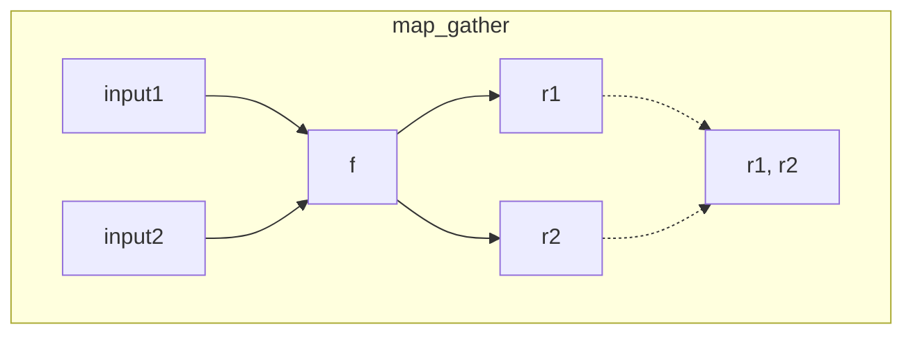

### **Functional**

Functional are a set of functions developed for concurrent processing.

Functional offers a sync API for executing multiple concurrent tasks.

Functional calls the `Executor` a class that manages an async event loop and a threadpool, distributing tasks among them and returning futures.

Although they are inside `nn`, the functions to be used are not limited to `nn.Module` and can be used for any function.

```python
import msgflux.nn.functional as F

print(F.__all__)
```

### **Map Gather**



```python
print(F.map_gather)
```

```python
def add(x, y):
    return x + y
results = F.map_gather(add, args_list=[(1, 2), (3, 4), (5, 6)])
print(results) # (3, 7, 11)
```

```python
def multiply(x, y=2):
    return x * y
results = F.map_gather(multiply, args_list=[(1,), (3,), (5,)], kwargs_list=[{"y": 3}, {"y": 4}, {"y": 5}])
print(results) # (3, 12, 25)
```

### **Scatter Gather**

```python
print(F.scatter_gather)
```

```python

```

```python

```

```python

```

```python

```


```python

```


::: msgflux.nn.functional.scatter_gather

::: msgflux.nn.functional.msg_scatter_gather

::: msgflux.nn.functional.bcast_gather

::: msgflux.nn.functional.msg_bcast_gather

::: msgflux.nn.functional.wait_for

::: msgflux.nn.functional.wait_for_event

::: msgflux.nn.functional.background_task