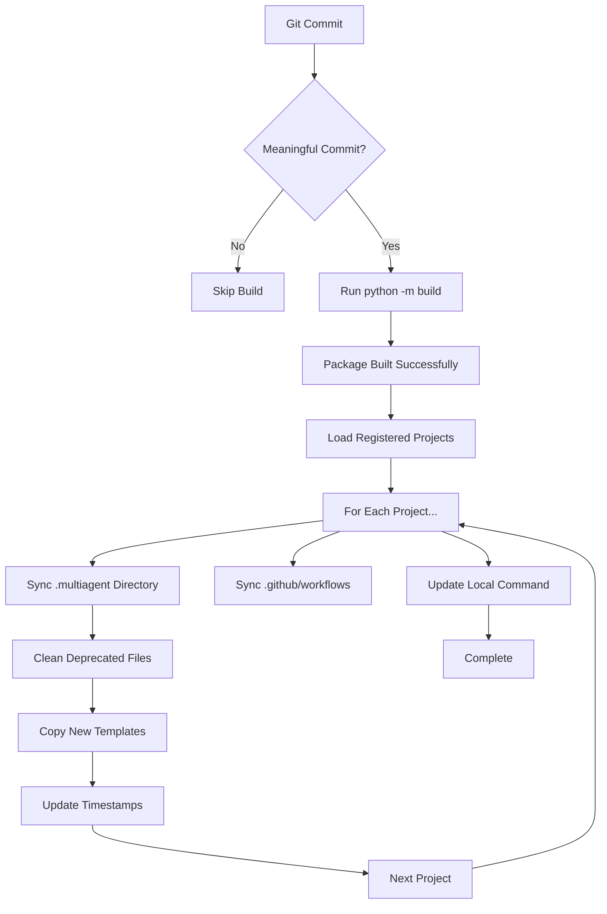

# Git Hooks System Documentation

## Overview

The MultiAgent framework uses a **tracked Git hooks system** that provides automated build triggers, template synchronization, and professional commit guidance. Unlike traditional Git hooks stored in `.git/hooks/` (which are local and untracked), our hooks are stored in `scripts/hooks/` and tracked by Git, ensuring all team members share the same automation.

## How It Works

### Hook Storage & Configuration

```bash
# Traditional approach (what we DON'T use)
.git/hooks/pre-push     # ❌ Untracked, local only

# MultiAgent approach (what we DO use)  
scripts/hooks/pre-push  # ✅ Tracked, shared across team
scripts/hooks/post-commit # ✅ Tracked, shared across team
```

When you run `multiagent init`, the system:
1. Creates `scripts/hooks/` directory
2. Installs hook files with proper permissions
3. Runs `git config core.hooksPath ./scripts/hooks`
4. Cleans up any old hooks in `.git/hooks/`

### Active Hooks

#### 1. Pre-Push Hook (`scripts/hooks/pre-push`)
**Purpose**: Professional commit strategy guidance

**When it runs**: Before `git push` operations on main branch

**What it does**:
- Counts commits to be pushed
- If 1 or fewer commits, suggests accumulating 3-6 commits for richer release notes
- Provides 3-second countdown to proceed or cancel
- Demonstrates conventional commit patterns

**Example output**:
```bash
Professional Commit Strategy Guidance
Commits to push: 1
For richer release notes, consider accumulating 3-6 commits
Rich Release Pattern:
   git commit -m 'fix(component): specific issue'
   git commit -m 'feat(feature): new capability'
   git commit -m 'docs: update guide'
   git push  # <- Rich release (3+ bullets)

🚀 Continue anyway? Proceeding in 3 seconds...
   Press Ctrl+C to cancel, or wait to continue
3 2 1 
```

#### 2. Post-Commit Hook (`scripts/hooks/post-commit`)
**Purpose**: Auto-build and template synchronization

**When it runs**: After every `git commit` in multiagent-core projects

**What it does**:
1. **Analyzes commit message** to determine if build is needed
2. **Skips build for**: `test:`, `style:`, `wip:`, `temp:`, `[skip ci]`, `[ci skip]`
3. **Triggers build for**: State markers (`[WORKING]`, `[STABLE]`, `[WIP]`, `[COMPLETE]`) or conventional commits (`feat:`, `fix:`, `docs:`, `chore:`, `build:`, `ci:`, `refactor:`, `perf:`, etc.)
4. **Runs Python build**: `python3 -m build`
5. **Updates all projects**: Syncs templates to registered projects
6. **Updates local command**: `pipx install -e . --force`

**Example output**:
```bash
[AUTO-BUILD] Detected meaningful commit - triggering build...
[AUTO-BUILD] Running python -m build to update all projects...
[AUTO-BUILD] Build completed successfully!
[AUTO-BUILD] All registered projects have been updated
[AUTO-BUILD] Updating local multiagent command...
[AUTO-BUILD] Local multiagent command updated successfully!
```

## Installation

### Automatic Installation
```bash
# Git hooks are installed automatically with multiagent init
multiagent init

# Output includes:
# Installing git hooks...
# Creating shared Git hooks in: /path/to/project/scripts/hooks
# Configuring Git to use project hooks directory...
# Git configured to use ./scripts/hooks
# Git hooks installed successfully!
# - Hooks location: scripts/hooks/ (tracked by Git)
# - pre-push: Professional commit strategy guidance
# - post-commit: Auto-build and template sync
# - Shared across all team members automatically
```

### Manual Installation
If hooks aren't working, you can manually configure:

```bash
# Ensure hooks directory exists
mkdir -p scripts/hooks

# Configure Git to use tracked hooks
git config core.hooksPath ./scripts/hooks

# Set proper permissions (if hooks exist)
chmod +x scripts/hooks/*
```

## Template Synchronization Flow

The post-commit hook triggers a sophisticated template sync system:



### What Gets Synced
- **Templates**: All files in `.multiagent/templates/` (AGENTS.md, CLAUDE.md, etc.)
- **Prompts**: Agent startup files (`.txt` format, removes deprecated `.md`)
- **Docs**: Documentation structure and agent workflows
- **Workflows**: GitHub Actions workflows (prefixed with `worktree-` or `multiagent-`)
- **Core Files**: Configuration, scripts, and utilities

## Project Registration

Projects are automatically registered for updates when you run `multiagent init`:

```bash
# Registration happens automatically and creates/updates:
~/.multiagent.json
```

**Registration file format**:
```json
{
  "projects": {
    "/home/user/Projects/my-project": {
      "registered": "2025-09-24T10:07:38.899054",
      "last_updated": "2025-09-24T15:28:53.453193"
    }
  },
  "last_updated": "2025-09-24T15:28:53.453193"
}
```

## Troubleshooting

### Hooks Not Running
```bash
# Check if hooks path is configured
git config core.hooksPath

# Should output: ./scripts/hooks

# If not configured, set it:
git config core.hooksPath ./scripts/hooks
```

### Missing Hook Files
```bash
# Check if hook files exist
ls -la scripts/hooks/

# If missing, re-run multiagent init:
multiagent init --no-interactive
```

### Permission Issues
```bash
# Fix hook permissions
chmod +x scripts/hooks/pre-push
chmod +x scripts/hooks/post-commit

# Verify permissions
ls -la scripts/hooks/
# Should show: -rwxr-xr-x (executable)
```

### Build Failures
If the post-commit hook build fails:

```bash
# Check if in multiagent-core project (build only works here)
pwd

# Manual build test
python3 -m build

# Check Python environment
python3 --version
pip list | grep build
```

### Template Sync Issues
```bash
# Manual template sync test
python3 -c "
from multiagent_core.auto_updater import update_all_deployments
update_all_deployments()
"

# Check registered projects
python3 -c "
import json
from pathlib import Path
with open(Path.home() / '.multiagent.json') as f:
    data = json.load(f)
for project in data.get('projects', []):
    print(f\"  - {project.get('name', 'unknown')}: {project.get('path', 'no path')}\")
"
```

## Benefits

### ✅ Team Consistency
- **Shared automation**: All team members get the same hooks
- **Version controlled**: Hook changes are tracked in Git
- **No manual setup**: Hooks install automatically with `multiagent init`

### ✅ Auto-Synchronization  
- **Template updates**: Changes in multiagent-core automatically sync to all projects
- **Dependency tracking**: Projects stay in sync with framework updates
- **Clean migrations**: Deprecated files are automatically removed

### ✅ Professional Workflow
- **Commit guidance**: Pre-push hook encourages rich commit histories
- **Build automation**: Post-commit hook eliminates manual build steps
- **Quality gates**: Failed builds don't break the commit, but alert developers

## Advanced Configuration

### Skipping Auto-Build
To skip auto-build for specific commits:

```bash
# Use conventional commit types that skip builds
git commit -m "test: add unit test"     # Skipped
git commit -m "style: fix formatting"  # Skipped
git commit -m "wip: work in progress"  # Skipped

# Or use skip flags
git commit -m "feat: new feature [skip ci]"   # Skipped
git commit -m "fix: bug fix [ci skip]"        # Skipped
```

### Custom Hook Extensions
You can extend hooks by modifying files in `scripts/hooks/`:

```bash
# Edit existing hooks (be careful - affects all team members)
scripts/hooks/pre-push      # Modify pre-push behavior
scripts/hooks/post-commit   # Modify auto-build behavior

# Add new hooks
scripts/hooks/pre-commit    # Runs before commits
scripts/hooks/post-merge    # Runs after merges
```

**Note**: Any changes to hook files affect all team members since they're tracked in Git.

## Migration from Old System

If you have projects with old `.git/hooks/` files:

1. **Automatic cleanup**: New `multiagent init` removes old hooks automatically
2. **Manual cleanup**: Remove old hooks manually if needed:
   ```bash
   rm -f .git/hooks/pre-push .git/hooks/post-commit
   ```
3. **Verify configuration**: Ensure `git config core.hooksPath` points to `./scripts/hooks`

The new system is backwards compatible and will cleanly replace the old system.