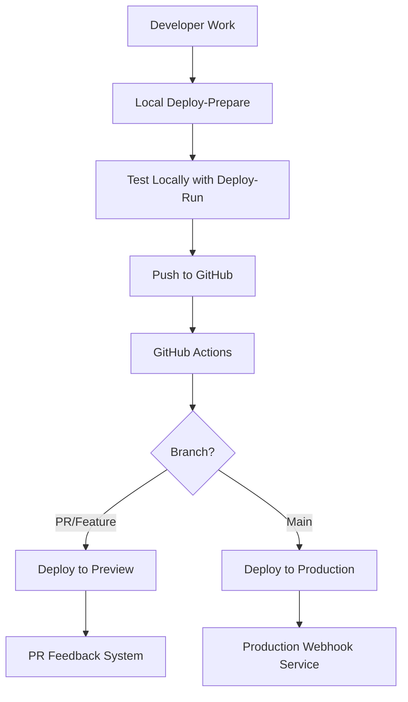

# Deployment Strategy for MultiAgent Core

## Overview

A **hybrid deployment approach** combining local preparation with GitHub Actions automation.

## Two-Phase Deployment Strategy

### Phase 1: Local Deployment Preparation (What we've built)
- **Purpose**: Developer-driven configuration generation
- **Tools**: `/deploy-prepare`, `/deploy-validate`, `/deploy-run`
- **Output**: `deployment/` directory with configs
- **When**: During development, before pushing to GitHub

### Phase 2: GitHub Actions Deployment (Production)
- **Purpose**: Automated deployment on merge to main
- **Triggers**: Push to main, PR merge, manual dispatch
- **Target**: Production environment (Vercel, AWS, or self-hosted)
- **When**: After PR approval and merge

## Recommended Architecture



## Implementation Plan

### 1. Local Development Flow
```bash
# Developer generates configs locally
/deploy-prepare specs/002-system-context-we

# Validates and tests
/deploy-validate
/deploy-run up

# Commits deployment configs
git add deployment/
git commit -m "[WORKING] feat: Add deployment configuration"
git push origin feature-branch
```

### 2. GitHub Actions Workflows

#### A. PR Preview Deployment (`deploy-preview.yml`)
```yaml
name: Deploy PR Preview

on:
  pull_request:
    types: [opened, synchronize]
    paths:
      - 'deployment/**'
      - '.multiagent/**'
      - 'specs/**'

jobs:
  deploy-preview:
    runs-on: ubuntu-latest
    steps:
      - uses: actions/checkout@v4

      - name: Validate Deployment Config
        run: |
          bash .multiagent/deployment/scripts/validate-deployment.sh

      - name: Build Docker Image
        run: |
          docker build -f deployment/docker/Dockerfile -t pr-feedback:${{ github.sha }} .

      - name: Deploy to Preview Environment
        run: |
          # Option 1: Deploy to Vercel Preview
          vercel --token=${{ secrets.VERCEL_TOKEN }} \
                 --build-env GITHUB_TOKEN=${{ secrets.GITHUB_TOKEN }} \
                 --build-env CLAUDE_API_KEY=${{ secrets.CLAUDE_API_KEY }}

          # Option 2: Deploy to AWS Lambda (serverless)
          # serverless deploy --stage preview

      - name: Comment Preview URL
        uses: actions/github-script@v7
        with:
          script: |
            github.rest.issues.createComment({
              issue_number: context.issue.number,
              owner: context.repo.owner,
              repo: context.repo.repo,
              body: '🚀 Preview deployed: https://pr-${{ github.event.pull_request.number }}.preview.app'
            })
```

#### B. Production Deployment (`deploy-production.yml`)
```yaml
name: Deploy to Production

on:
  push:
    branches: [main]
    paths:
      - 'deployment/**'
  workflow_dispatch:

jobs:
  deploy-production:
    runs-on: ubuntu-latest
    environment: production

    steps:
      - uses: actions/checkout@v4

      - name: Run Production Tests
        run: |
          bash .multiagent/deployment/scripts/check-production-readiness.sh
          bash .multiagent/deployment/scripts/scan-mocks.sh

      - name: Build and Push Docker Image
        run: |
          docker build -f deployment/docker/Dockerfile -t multiagent-core:latest .
          docker tag multiagent-core:latest ${{ secrets.DOCKER_REGISTRY }}/multiagent-core:${{ github.sha }}
          docker push ${{ secrets.DOCKER_REGISTRY }}/multiagent-core:${{ github.sha }}

      - name: Deploy to Production
        run: |
          # Option 1: Deploy to Kubernetes
          kubectl apply -f deployment/k8s/
          kubectl set image deployment/multiagent-feedback \
                  multiagent-feedback=${{ secrets.DOCKER_REGISTRY }}/multiagent-core:${{ github.sha }}

          # Option 2: Deploy to Vercel Production
          # vercel --prod --token=${{ secrets.VERCEL_TOKEN }}

      - name: Verify Deployment
        run: |
          curl -f https://api.yourdomain.com/health || exit 1

      - name: Update GitHub Deployment Status
        uses: actions/github-script@v7
        with:
          script: |
            await github.rest.repos.createDeployment({
              owner: context.repo.owner,
              repo: context.repo.repo,
              ref: context.sha,
              environment: 'production',
              description: 'Deployed to production'
            });
```

### 3. Environment-Specific Configurations

#### Development (Local)
- **Generated by**: `/deploy-prepare`
- **Config**: `deployment/configs/.env.development`
- **Purpose**: Local testing with Docker Compose
- **Webhook URL**: ngrok tunnel for GitHub webhooks

#### Preview (PR)
- **Generated by**: GitHub Actions
- **Config**: Secrets in GitHub
- **Purpose**: Test PR changes
- **Webhook URL**: `https://pr-{number}.preview.app/webhook`

#### Production
- **Generated by**: GitHub Actions
- **Config**: GitHub Secrets + K8s ConfigMaps
- **Purpose**: Live PR feedback system
- **Webhook URL**: `https://api.yourdomain.com/webhook`

## Deployment Options

### Option 1: Serverless (Recommended for PR Feedback)
**Best for**: Event-driven webhook processing

```bash
# Deploy to Vercel (automatic from GitHub)
vercel --prod

# Or AWS Lambda
serverless deploy --stage production
```

**Pros**:
- Auto-scaling
- Pay per execution
- No server management
- Perfect for webhook handlers

### Option 2: Container-Based (Current Setup)
**Best for**: Full control and complex processing

```bash
# Deploy to Kubernetes
kubectl apply -f deployment/k8s/

# Or Docker Swarm
docker stack deploy -c deployment/docker/docker-compose.yml multiagent
```

**Pros**:
- Full control
- Can run background jobs
- Better for stateful operations

### Option 3: Hybrid
**Best overall approach**:
- Vercel/Lambda for webhook endpoints
- Kubernetes for processing workers
- GitHub Actions for orchestration

## Secrets Management

### GitHub Secrets Required
```bash
# Core secrets
GITHUB_TOKEN          # For API access
CLAUDE_API_KEY        # For Claude SDK
SLACK_BOT_TOKEN       # For notifications

# Deployment secrets
VERCEL_TOKEN          # For Vercel deployment
DOCKER_REGISTRY       # For container registry
KUBECONFIG           # For Kubernetes deployment
```

### Setting Secrets
```bash
# Via GitHub CLI
gh secret set CLAUDE_API_KEY --body "$CLAUDE_API_KEY"
gh secret set VERCEL_TOKEN --body "$VERCEL_TOKEN"
```

## Migration Path

### Step 1: Keep Current Local Tools
- `/deploy-prepare` - Generates configs
- `/deploy-validate` - Validates configs
- `/deploy-run` - Local testing

### Step 2: Add GitHub Workflows
1. Create `.github/workflows/deploy-preview.yml`
2. Create `.github/workflows/deploy-production.yml`
3. Test with feature branch

### Step 3: Production Rollout
1. Merge deployment configs to main
2. GitHub Actions automatically deploys
3. Monitor webhook endpoints

## Benefits of This Approach

1. **Separation of Concerns**
   - Local tools for development
   - GitHub Actions for production
   - Clear boundaries

2. **Progressive Deployment**
   - Test locally first
   - Preview on PR
   - Production on merge

3. **Flexibility**
   - Can deploy anywhere (Vercel, AWS, K8s)
   - Not locked to one platform
   - Easy to switch providers

4. **Security**
   - Secrets stay in GitHub
   - No local production credentials
   - Automated security scanning

5. **Developer Experience**
   - Local tools for quick iteration
   - Automated deployment on merge
   - No manual production access needed

## Recommended Next Steps

1. **Immediate**: Continue using local deployment tools
2. **Next Sprint**: Add preview deployment workflow
3. **Following Sprint**: Add production deployment workflow
4. **Future**: Add monitoring and rollback automation

## Summary

- **Local `/deploy-*` commands**: For development and config generation
- **GitHub Actions**: For actual deployment to cloud
- **Best practice**: Local prep → GitHub review → Automated deployment

This gives you the best of both worlds: developer control during development and automated, secure production deployments.