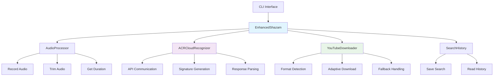
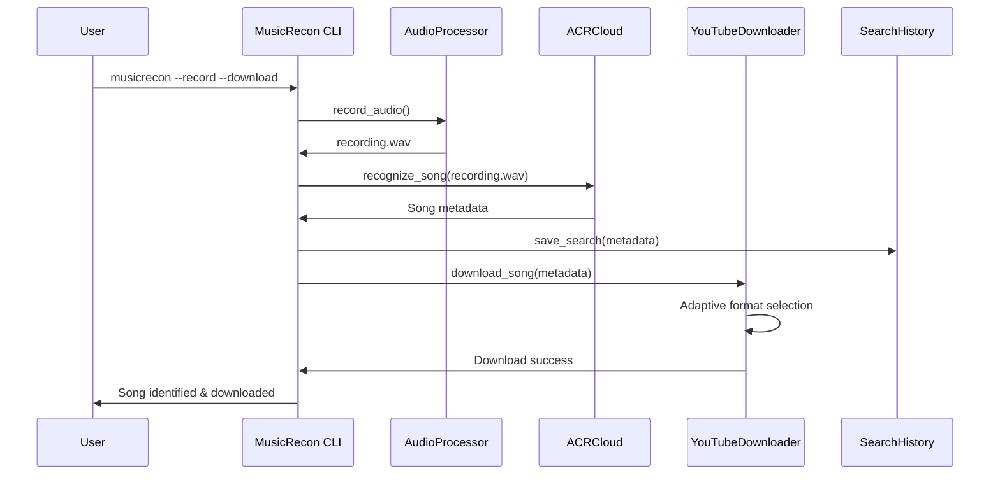
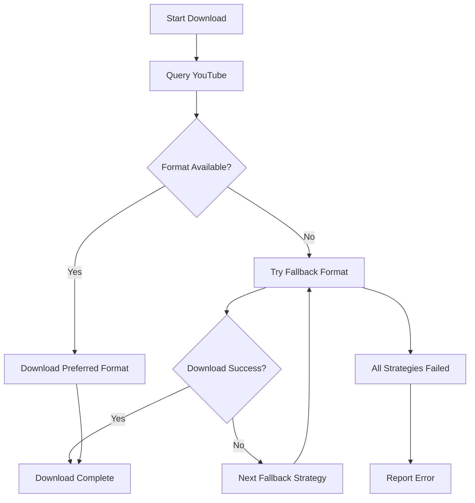

# MusicRecon 🎵

**Advanced Audio Recognition & Music Discovery Tool**

[](https://www.python.org/downloads/)
[](LICENSE)
[](https://github.com/psf/black)

MusicRecon is a powerful command-line tool that identifies songs from audio recordings, searches your music history, and downloads recognized tracks from YouTube. Think Shazam meets YouTube-DL in a robust, feature-packed Python package.

## 🌟 Features

### 🎤 Real-time Audio Recognition
- Record audio directly from your microphone
- Identify songs using ACRCloud's advanced audio fingerprinting
- Support for various audio formats (WAV, MP3, FLAC, etc.)

### 📁 File-based Recognition
- Analyze existing audio files
- Automatic audio trimming for optimal recognition
- Batch processing capabilities

### 💾 Smart Download System
- Download identified songs from YouTube
- Audio-only or video downloads
- Multiple quality presets
- Robust format fallback system

### 📊 Search History
- Persistent search history storage
- View previous recognitions
- JSON-based history format

### 🛠 Technical Excellence
- Resilient error handling and retry mechanisms
- Comprehensive logging with colored output
- Modular, extensible architecture
- Cross-platform compatibility

## 📦 Installation

### Prerequisites
- Python 3.8 or higher
- FFmpeg (for audio processing)

#### Install FFmpeg
**Ubuntu/Debian:**
```bash
sudo apt update && sudo apt install ffmpeg
```

**macOS:**
```bash
brew install ffmpeg
```

**Windows:**
Download from [FFmpeg official website](https://ffmpeg.org/download.html) and add to PATH.

### Install MusicRecon

#### Option 1: Install from PyPI (Coming Soon)
```bash
pip install MusicRecon
```

#### Option 2: Install from Source
```bash
git clone https://github.com/skye-cyber/MusicRecon.git
cd MusicRecon
pip install -e .
```

#### Option 3: Manual Installation
```bash
pip install requests sounddevice wavio youtube-dl pydub colorama
```

## 🚀 Quick Start

### Basic Usage

**Record and identify a song:**
```bash
musicrecon --record
```

**Identify from audio file:**
```bash
musicrecon --search path/to/audio.wav
```

**Identify and download:**
```bash
musicrecon --search song.wav --download
```

**Download specific song:**
```bash
musicrecon --download "Coldplay - Adventure Of A Lifetime"
```

### Advanced Usage

**Record 15 seconds and download as video:**
```bash
musicrecon --record --duration 15 --download --video --quality high
```

**Show search history:**
```bash
musicrecon --history
```

**Verbose logging:**
```bash
musicrecon --record --verbose
```

## 📋 Usage Examples

```bash
# Simple recording and identification
musicrecon -r

# Identify from file and download audio
musicrecon -s recording.wav -D

# Download specific song as high-quality video
musicrecon -D "Artist - Song Name" -v -q high

# Record 20 seconds and download medium quality video
musicrecon -r -d 20 -D -v -q medium

# View last 10 searches
musicrecon -H
```

## 🏗 System Architecture



## 🔧 How It Works



## ⚙️ Configuration

### ACRCloud API Setup

MusicRecon uses ACRCloud for audio recognition. You'll need to:

1. Sign up at [ACRCloud](https://www.acrcloud.com/)
2. Create an audio recognition project
3. Get your Access Key and Secret
4. Update the credentials in `super_shazam.py`:

```python
self.recognizer = ACRCloudRecognizer(
    access_key='YOUR_ACCESS_KEY',
    access_secret='YOUR_ACCESS_SECRET',
    region_url='https://identify-eu-west-1.acrcloud.com/v1/identify'
)
```

### File Structure

```
├── musicrecon
│   ├── audio_processor.py
│   ├── cli.py
│   ├── config.py
│   ├── downloader.py
│   ├── history_manager.py
│   ├── __init__.py
│   ├── recognizer.py
│   └── super_shazam.py
```

## 🔄 Download Process



## 🎯 Command Reference

### Global Options
- `--verbose, -V`: Enable debug logging
- `--history, -H`: Show search history

### Recognition Options
- `--record, -r`: Record audio from microphone
- `--search, -s PATH`: Analyze audio file
- `--duration, -d SECONDS`: Recording duration (default: 10)

### Download Options
- `--download, -D [QUERY]`: Download song (optional specific query)
- `--video, -v`: Download video instead of audio
- `--quality, -q LEVEL`: Video quality (best/high/medium/low)

## 🐛 Troubleshooting

### Common Issues

**"Requested format is not available"**
- MusicRecon automatically tries fallback formats
- Use `--quality medium` for more compatible formats
- The tool includes robust format detection

**"No result" from ACRCloud**
- Ensure audio is clear and has sufficient volume
- Try recording longer samples (15-20 seconds)
- Check your ACRCloud API credentials

**FFmpeg not found**
- Install FFmpeg system-wide
- Ensure it's in your system PATH

**Microphone access denied**
- Grant microphone permissions to your terminal
- On macOS: System Preferences > Security & Privacy > Privacy > Microphone

### Debug Mode
Enable verbose logging to see detailed process information:
```bash
musicrecon --record --download --verbose
```

## 📊 Output Examples

### Successful Recognition
```
- INFO - Recording 10 seconds of audio...
- INFO - Recording saved to: recording.wav
- INFO - Identifying song...
🎵 Found: Blinding Lights by The Weeknd
- INFO - Downloading: The Weeknd Blinding Lights
- INFO - Download completed successfully!
```

### Search History
```
- INFO - Last 5 searches:
  2024-01-15T14:30:45: Blinding Lights - The Weeknd
  2024-01-15T14:28:12: Dance Monkey - Tones and I
  2024-01-15T14:25:33: Shape of You - Ed Sheeran
```

## 🔮 Future Enhanceances

- [ ] Spotify/Apple Music integration
- [ ] Batch file processing
- [ ] GUI interface
- [ ] Playlist generation
- [ ] Music recommendation engine
- [ ] Cloud synchronization
- [ ] API server mode

## 🤝 Contributing

We welcome contributions! Please see our [Contributing Guidelines](CONTRIBUTING.md) for details.

1. Fork the repository
2. Create a feature branch (`git checkout -b feature/amazing-feature`)
3. Commit your changes (`git commit -m 'Add amazing feature'`)
4. Push to the branch (`git push origin feature/amazing-feature`)
5. Open a Pull Request

## 📄 License

This project is licensed under the MIT License - see the [LICENSE](LICENSE) file for details.

## 🙏 Acknowledgments

- [ACRCloud](https://www.acrcloud.com/) for audio recognition API
- [yt-dlp](https://github.com/yt-dlp/yt-dlp) for YouTube downloads
- [pydub](https://github.com/jiaaro/pydub) for audio processing
- [sounddevice](https://python-sounddevice.readthedocs.io/) for audio recording

## 📞 Support

If you encounter any problems or have questions:

1. Check the [troubleshooting](#troubleshooting) section
2. Search existing [GitHub Issues](https://github.com/skye-cyber/MusicRecon/issues)
3. Create a new issue with detailed information

---

**MusicRecon** - Your intelligent audio companion 🎶

*Identify, Discover, Download*
