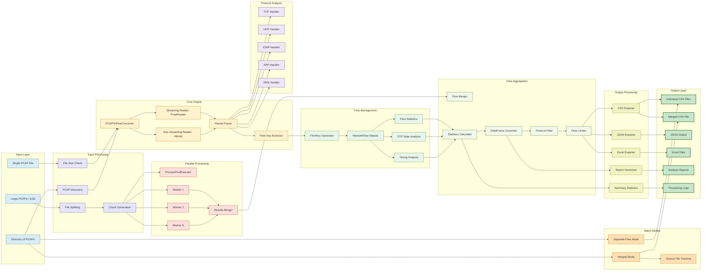

# NexusFlowMeter

[](https://badge.fury.io/py/nexusflowmeter)
[](https://pypi.org/project/nexusflowmeter/)
[](https://opensource.org/licenses/MIT)
[](https://pepy.tech/project/nexusflowmeter)

**NexusFlowMeter** is a high-performance network flow analysis tool that converts packet capture (PCAP) files into comprehensive flow-based insights. Unlike traditional packet-by-packet analysis, NexusFlowMeter aggregates network traffic into flows, providing deeper understanding of network behavior, communication patterns, and traffic characteristics.
```
  Contributions are welcome! Please feel free to submit pull requests, report bugs, or suggest features.
```

## Architecture


## Installation

### From PyPI (Recommended)

```bash
pip install nexusflowmeter
```

### From Source

```bash
git clone https://github.com/Collgamer0008/NexusFlowMeter.git
cd NexusFlowMeter
pip install -r requirements.txt

```

## Dependencies
- ```scapy ``` - Packet manipulation library
- ```pandas``` - Data analysis and manipulation
- ```openpyxl``` - Excel file support (optional)

## NexusFlowMeter CLI Usage

```bash
 nexusflowmeter [-h] [-d DIRECTORY] [-c OUTPUT_DIR] [--merge] [--protocols PROTOCOLS] [--max-flows MAX_FLOWS]
                      [--output-format {csv,json,xlsx}] [--quick-preview QUICK_PREVIEW] [--split-by-protocol]
                      [--stream] [--chunk-size CHUNK_SIZE] [--flow-timeout FLOW_TIMEOUT] [--max-workers MAX_WORKERS]
                      [--verbose]
                      [pcap_file] [output_file]

Convert PCAP files to flow-based analysis (CSV, JSON, Excel)

positional arguments:
  pcap_file                               Input PCAP file path (for single file processing)
  output_file                             Output file path (for single file processing)

options:
  -h, --help                              show this help message and exit
  -d DIRECTORY, --directory DIRECTORY     Input directory containing PCAP files (for batch processing)
                                      
  -c OUTPUT_DIR, --output-dir OUTPUT_DIR  Output directory (for batch processing)
                        
  --merge                                 Merge all PCAP files into single output (directory processing only)
  --protocols PROTOCOLS                   Comma-separated list of protocols to include (tcp,udp,icmp,arp,dns,all)
                        
  --max-flows MAX_FLOWS                   Maximum number of flows to analyze
                        
  --output-format {csv,json,xlsx}, -of {csv,json,xlsx}
                                          Output file format (default: csv)

  --quick-preview QUICK_PREVIEW           Show first N flows before conversion (single file only)
                        
  --split-by-protocol                     Create separate files for each protocol (single file only)
  --stream                                Use streaming mode (PcapReader) instead of loading the whole file into memory
  --chunk-size CHUNK_SIZE                 Chunk size in MB for large files (default: 1024MB = 1GB)
                        
  --flow-timeout FLOW_TIMEOUT             Flow timeout in seconds (default: 60)
                        
  --max-workers MAX_WORKERS               Maximum parallel workers for chunk processing (default: 4)
                        
  --report-dir DIRECTORY               Directory to save analysis reports (default: in the same directory as csv)

  --verbose                               Enable verbose logging

```


---

### Positional Arguments

| Argument      | Description |
|---------------|-------------|
| `pcap_file`   | Input PCAP file path (for single file processing) |
| `output_file` | Output file path (for single file processing) |
| `-d /folder_path/` | Input folder path containing PCAPs (for multiple file processing) |
| `-c /folder_path/` | Output folder path for extracted CSVs (for multiple file processing) |
| `--report-dir /folder_path/` | Directory to save analysis reports (default: in the same directory as csv) |

Examples
```bash
    Single file conversion:
      nexusflowmeter capture.pcap flows.csv

    Directory processing:
      nexusflowmeter -d ./pcaps/ -c ./out/                    # Convert each PCAP in the folder to separate CSV
      nexusflowmeter -d ./pcaps/ -c ./out/ --merge            # Merge all PCAPs into one CSV
      nexusflowmeter -d ./pcaps/ -c ./out/ --output-format json  # Convert to JSON format

    Save report to desired location:
      nexusflowmeter capture.pcap flows.csv --report-dir ./reports/
```

### Options

| Option | Description |
|--------|-------------|
| `-h, --help` | Show help message and exit |
| `-d DIRECTORY, --directory DIRECTORY` | Input directory containing PCAP files (for batch processing) |
| `-c OUTPUT_DIR, --output-dir OUTPUT_DIR` | Output directory (for batch processing) |
| `--merge` | Merge all PCAP files into single output (directory processing only) |
| `--protocols PROTOCOLS` | Comma-separated list of protocols to include (`tcp,udp,icmp,arp,dns,all`) |
| `--max-flows MAX_FLOWS` | Maximum number of flows to analyze |
| `--output-format {csv,json,xlsx}`, `-of {csv,json,xlsx}` | Output file format (default: `csv`) |
| `--quick-preview QUICK_PREVIEW` | Show first N flows before conversion (single file only) |
| `--split-by-protocol` | Create separate files for each protocol (single file only) |
| `--stream` | Use streaming mode (`PcapReader`) instead of loading the whole file into memory (recommended for memory constrained systems) |
| `--chunk-size CHUNK_SIZE` | Chunk size in MB for large files (default: `1024MB = 1GB`) |
| `--flow-timeout FLOW_TIMEOUT` | Flow timeout in seconds (default: `60`) |
| `--max-workers MAX_WORKERS` | Maximum parallel workers for chunk processing (default: `4`) |
| `--report-dir DIRECTORY` | Directory to save analysis reports (default: in the same directory as csv) |
| `--verbose` | Enable verbose logging |

Examples
```bash
    nexusflowmeter capture.pcap flows.json --output-format json  OR
    nexusflowmeter capture.pcap flows.json -of json


    nexusflowmeter capture.pcap flows --split-by-protocol
    nexusflowmeter capture.pcap flows.csv --quick-preview 5
    nexusflowmeter capture.pcap tcp_flows.xlsx --output-format xlsx --protocols tcp
```


## Flow Features Extracted  

NexusFlowMeter generates **34** per-flow statistics useful for traffic analysis, anomaly detection, and ML feature extraction.  

| Feature | Description |
|---------|-------------|
| **flow_id** | Unique identifier for the flow (`src_ip:src_port <-> dst_ip:dst_port protocol`) |
| **src_ip, dst_ip** | Source and destination IP addresses |
| **src_port, dst_port** | Source and destination ports |
| **protocol** | Transport or network protocol (TCP, UDP, ICMP, etc.) |
| **start_time, end_time** | Timestamps marking the beginning and end of the flow |
| **duration_seconds** | Duration of the flow |
| **total_packets** | Total number of packets in the flow |
| **forward_packets, backward_packets** | Packets in forward (src→dst) and backward (dst→src) directions |
| **is_bidirectional** | Indicates if packets exist in both directions |
| **forward_backward_ratio** | Ratio of forward to backward packet counts |
| **total_bytes** | Total bytes transferred in the flow |
| **forward_bytes, backward_bytes** | Bytes in forward and backward directions |
| **total_payload_bytes** | Total payload size excluding headers |
| **forward_payload_bytes, backward_payload_bytes** | Payload bytes split by direction |
| **packets_per_second** | Packet transmission rate |
| **bytes_per_second** | Byte transfer rate |
| **min_packet_size, max_packet_size** | Smallest and largest packet sizes observed |
| **avg_packet_size** | Average packet size |
| **avg_inter_arrival_ms** | Average packet inter-arrival time (milliseconds) |
| **min_inter_arrival_ms, max_inter_arrival_ms** | Minimum and maximum inter-arrival times |
| **tcp_flags** | Summary of TCP flags observed (e.g., SYN, FIN, ACK) |
| **syn_count, fin_count, rst_count, ack_count** | Count of specific TCP flags |
| **connection_state** | State of the TCP connection (e.g., Established, Closed) |

---

## What makes this tool unique? 

NexusFlowMeter includes several **productivity-focused options** which makes using this tool very convinient and easy.  

###  Directory & Batch Processing  
- **Feature**: Process an entire folder of PCAP files at once.  
- **Example**:  
  ```bash
  convert all pcaps in the folder to individual csvs
    nexusflowmeter -d ./pcaps/ -c ./out/
  
  convert all pcaps in the folder into a single file
    nexusflowmeter -d ./pcaps/ -c ./out/ --merge
  ```
###  Protocol Filtering  
- **Feature**: Focus only on specific protocols (TCP, UDP, ICMP, ARP, DNS, or all) i.e, extracted file contains flow with mentioned protocol only.  
- **Example**:  
  ```bash
  nexusflowmeter capture.pcap tcp_flows.csv --protocols tcp
  ```
###  Quick Preview  
- **Feature**: View the first N flows before committing to full conversion.  
- **Example**:  
  ```bash
  nexusflowmeter capture.pcap flows.csv --quick-preview 5
  ```
  Prints the first 5 flows in the console.
  
###  Split by Protocol  
- **Feature**: Automatically create separate output files for each protocol. 
- **Example**:  
  ```bash
  nexusflowmeter capture.pcap flows --split-by-protocol
  ```
  Generates files like flows_tcp.csv, flows_udp.csv, etc.

###  Streaming Mode  
- **Feature**: Processes packets using a stream reader instead of loading the entire PCAP into memory (1000 pkts/sec). Useful for large captures and memory contrained systems. 
- **Example**:  
  ```bash
  nexusflowmeter capture.pcap flows.csv --stream
  ```
  
###  Chunked Processing  
- **Feature**: Split very large PCAPs into chunks (in MB) for parallel or memory-efficient processing (default : 1024 MB). 
- **Example**:  
  ```bash
  nexusflowmeter capture.pcap flows.csv --chunk-size 512
  ```
  Processes the file in 512 MB chunks.
  ```bash
  nexusflowmeter capture.pcap flows.csv --chunk-size 512 --max-workers 5
  ```
  Processes the file in 512 MB chunks parallely , here 5 seperate processes.

  ###  Output Formats  
- **Feature**: Export results in CSV, JSON, or Excel (XLSX). 
- **Example**:  
  ```bash
   nexusflowmeter capture.pcap flows.json --output-format json
   nexusflowmeter capture.pcap flows.xlsx --output-format xlsx
  ```
