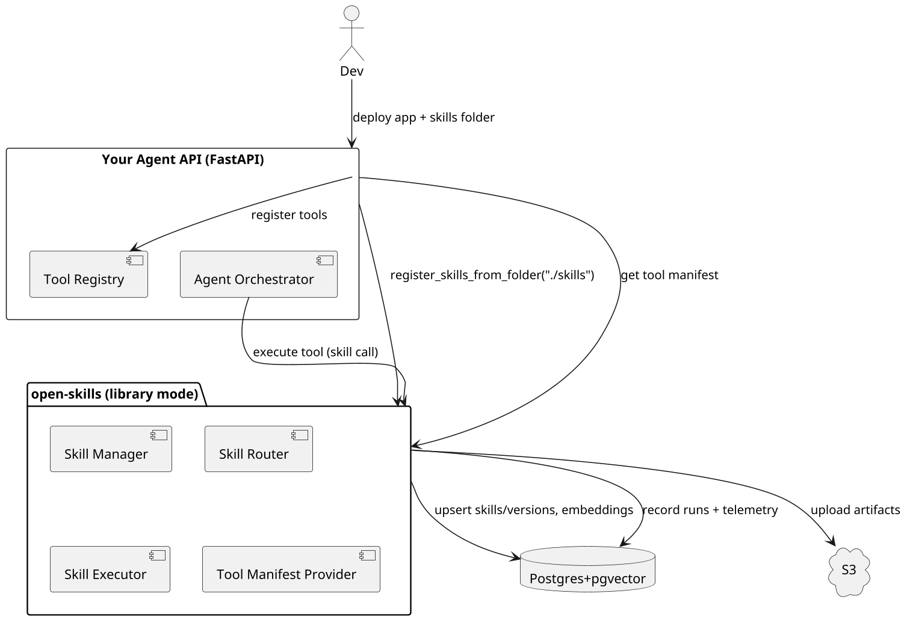
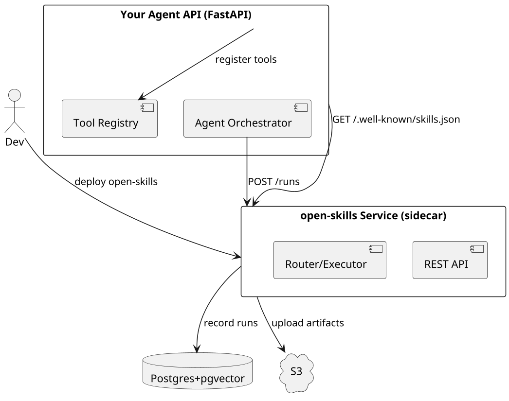

Here’s an **addendum** that extends the PRD + tech spec so `open-skills` can plug into **any** Python agent stack (not just Vel), with a clean registration/discovery model and minimal coupling.

---

# Addendum: Framework-Agnostic Integration & Auto-Registration

## A. Goals

- Make `open-skills` **package-agnostic** and **framework-agnostic**:

  - Drop-in for _any_ Python agent app (FastAPI, Flask, bare ASGI), regardless of orchestration (LangChain, LlamaIndex, custom, Vel, etc.).

- Separate **core package** from an **optional API surface** so devs can:

  1. embed `open-skills` **as a library** (in-process), or
  2. run `open-skills` **as a sidecar service** (out-of-process) and talk via REST.

- Provide **automatic skill discovery & registration** via a folder convention at app start (and optionally file-watch).
- Provide a **uniform Tool Manifest** and **tool invocation contract** so any agent runtime that supports “tools/function calling” can adopt skills without code changes.

---

## B. Packaging & Modules (Refactor)

```
open_skills/
  core/                 # pure library (no web/server assumptions)
    manager.py
    router.py
    executor.py
    artifacts.py
    packing.py
    crypto.py
    telemetry.py
    rbac.py
    adapters/
      agent_tool_api.py       # Generic tool contract (schema + runner)
      discovery.py            # Folder-based discovery + registration
  service/              # optional: FastAPI implementation of REST API
    api/
      router.py
      schemas.py
      deps.py
    main.py             # uvicorn entry
  integrations/
    fastapi_integration.py    # lightweight helper to mount router + register tools
    langchain_tool.py         # minimal adapter (optional sample)
    llamaindex_tool.py        # minimal adapter (optional sample)
  cli/
    main.py
```

- `open_skills.core.*` — **no web deps**, reusable anywhere.
- `open_skills.service.api.*` — **REST router** you can mount or deploy standalone.
- `open_skills.integrations.fastapi_integration` — sugar to mount API + register tools on app startup given a folder.

---

## C. Tool Contract (Universal)

### C.1 Tool Manifest (JSON)

A stable manifest format for agents to discover & call skills.

```json
{
  "version": "2025-10-01",
  "provider": "open-skills",
  "tools": [
    {
      "name": "skill:excel_to_pptx@1.0.0",
      "title": "Excel → PPTX",
      "description": "Converts Excel summaries to PowerPoint.",
      "args_schema": {
        "type": "object",
        "properties": {
          "input_file_url": { "type": "string" },
          "title": { "type": "string" }
        },
        "required": ["input_file_url"]
      },
      "io": {
        "inputs": [{ "type": "file", "mime": "application/vnd.ms-excel" }],
        "outputs": [{ "type": "file", "mime": "application/vnd.ms-powerpoint" }]
      },
      "skill_version_id": "uuid-here",
      "visibility": "user|org",
      "tags": ["excel", "pptx", "summarize"]
    }
  ]
}
```

- **Where served**: `GET /.well-known/skills.json` (library helper provided).
- **Agent usage**: add each entry as a tool/function for the LLM.

### C.2 Invocation Contract

- **Request**: `POST /runs` (or library `executor.execute_one()`), body:

  ```json
  { "skill_version_id": "uuid", "input": { "...": "..." } }
  ```

- **Response**:

  ```json
  { "run_id": "uuid", "status": "success|error", "outputs": {...}, "artifacts": [{"url": "...", "name": "..."}] }
  ```

- **Streaming** (optional): SSE/WebSocket messages with `event: log|file|status`.

---

## D. Auto-Registration via Folder Convention

### D.1 Folder Layout (per app)

```
app/
  skills/                     # default discover path
    sales_report/
      SKILL.md
      scripts/main.py
      resources/template.pptx
    csv_to_json/
      SKILL.md
      scripts/main.py
```

### D.2 Startup Registration (Library)

```python
# app/main.py
from fastapi import FastAPI
from open_skills.integrations.fastapi_integration import mount_open_skills
from open_skills.core.adapters.discovery import register_skills_from_folder

app = FastAPI()
skills_dir = "./skills"

# 1) register locally with core manager (DB + embeddings + versions)
await register_skills_from_folder(skills_dir)

# 2) optionally mount REST API under /skills
mount_open_skills(app, prefix="/skills")
```

- **Behavior**:

  - Parses each `SKILL.md`, creates/updates **immutable versions**.
  - Publishes versions if frontmatter sets `published: true` or via API/CLI.
  - Generates/updates **Tool Manifest** at `/.well-known/skills.json`.

### D.3 Live Watch (Optional)

- A file-watcher can detect changes and re-register on the fly (dev only).
- Production recommends **explicit publish** (CLI or API) for determinism.

---

## E. Using `open-skills` With Any Agent

### E.1 Minimal FastAPI Chat App (not Vel)

```python
# app/chat.py
from fastapi import FastAPI, Request
from sse_starlette.sse import EventSourceResponse
from open_skills.core.router import SkillRouter
from open_skills.core.executor import SkillExecutor
from open_skills.core.adapters.agent_tool_api import as_agent_tools

app = FastAPI()
router = SkillRouter(db=...)      # your db provider
executor = SkillExecutor(db=...)
tools = await as_agent_tools(db=...)  # Fetch tool specs from skill versions

@app.post("/chat")
async def chat(req: Request):
    data = await req.json()
    user_msg = data["message"]

    # (1) Decide tools: either let the LLM auto-select or pre-select from `tools`.
    # (2) If your agent framework supports function-calling, register `tools` there.
    # (3) When the model calls a tool named `skill:*`, route to executor:

    # PSEUDOCODE interface expected by most function-call agents:
    async def tool_handler(name, args):
        if name.startswith("skill:"):
            sv_id = args.get("skill_version_id")
            res = await executor.execute_one(await db.get_skill_version(sv_id), args)
            return res
        raise ValueError("Unknown tool")

    # stream response (depends on your agent lib)
    return EventSourceResponse(stream_agent(user_msg, tools, tool_handler))
```

- `as_agent_tools()` returns a list of tool descriptors with JSON Schemas that most function-calling LLM SDKs can accept directly (OpenAI, Anthropic, etc.).
- The **only** dependency your agent code needs is to **route** tool calls named `skill:*` to `executor.execute_one()`.

### E.2 LangChain / LlamaIndex (Optional Adapters)

- Provide tiny adapters in `open_skills.integrations.*` that:

  - Convert Tool Manifest → `Tool`/`FunctionSpec`.
  - Map tool callbacks → `executor.execute_one()`.

---

## F. Sidecar Mode (Out-of-Process)

If you prefer `open-skills` as a separate service:

- Deploy `open_skills.service.main:app` (FastAPI) behind `/skills`.
- Your chat API imports **no `open-skills` code**; it calls REST:

  - GET `/.well-known/skills.json` → register tools with your agent.
  - POST `/skills/runs` → on tool call, forward execution.

- **Pros**: process isolation, language-agnostic clients.
- **Cons**: network overhead vs in-process calls.

---

## G. Discovery & Registration Protocols

### G.1 Static Discovery

- Serve `/.well-known/skills.json` (manifest) from **either**:

  - your chat API (if embedding `open-skills` library), **or**
  - the `open-skills` service (if sidecar).

- Agents read this and register tools at startup.

### G.2 Dynamic Discovery

- Endpoint: `POST /skills/search` with `{ query, io_hints }`.
- Agents may pre-query to **reduce tool surface** per user/session.
- Auto-selection mirrors Anthropic’s progressive disclosure:

  1. Show **summaries** → LLM decides to call a skill.
  2. On call, fetch **full details** and run.

---

## H. Security & Multi-Tenancy for External Apps

- **User Context**: agent apps must forward **user/org context** (JWT claims) with each API call (or set a per-request context when using the library).
- **Scopes**:

  - `visibility=user`: accessible only to owner (and admins).
  - `visibility=org`: accessible to org members; mutations gated by roles.

- **RBAC**:

  - `viewer`: read/list/run
  - `author`: create skill + upload draft versions
  - `publisher`: publish/deprecate versions
  - `admin`: manage roles, delete

---

## I. Streaming Compatibility

- `open-skills` provides optional **SSE/WebSocket** run streams:

  - `event: log` `{ "line": "..." }`
  - `event: file` `{ "name": "result.pdf", "url": "..." }`
  - `event: status` `{ "status": "running|success|error" }`

- Any agent stack can forward these directly to clients or adapt to its stream protocol.
- Library mode exposes an **async iterator** over run events for maximum flexibility.

---

## J. CLI (Dev & CI)

```bash
# discover & validate bundles locally
open-skills validate ./skills

# publish (creates/updates versions in DB)
open-skills publish ./skills --org your-org --visibility org --publish

# pack/unpack bundles (future)
open-skills pack ./skills/sales_report -o sales_report.osb
open-skills unpack sales_report.osb -o ./skills/sales_report
```

---

## K. Minimal Code Paths for Codex

### K.1 Register skills on app boot (library)

```python
from open_skills.core.adapters.discovery import register_skills_from_folder
await register_skills_from_folder("./skills", db=...)
```

### K.2 Expose manifest in any API

```python
from fastapi import APIRouter
from open_skills.core.adapters.agent_tool_api import manifest_json

router = APIRouter()
@router.get("/.well-known/skills.json")
async def skills_manifest():
    return await manifest_json(db=...)
```

### K.3 Execute on tool call

```python
from open_skills.core.executor import SkillExecutor

executor = SkillExecutor(db=...)

async def handle_tool_call(name: str, args: dict):
    if name.startswith("skill:"):
        sv_id = args["skill_version_id"]
        sv = await db.get_skill_version(sv_id)
        return await executor.execute_one(sv, args)
    ...
```

---

## L. PlantUML: Any-Agent to open-skills (Library vs Sidecar)





---

## M. Summary

- `open-skills` now cleanly supports:

  - **Library mode** (embed directly in any app) **and** **Sidecar mode** (talk over REST).
  - **Auto-registration** from a **skills folder** at startup (plus live watch in dev).
  - A **universal tool manifest** and **invocation contract** compatible with any LLM that can call tools/functions.
  - **Minimal integration code**: expose `/.well-known/skills.json`, register tools, and route `skill:*` calls to `executor.execute_one()`.

If you want, I can generate a **starter repo skeleton** for both modes:

- `open-skills` (core + service + integrations)
- `example-any-agent` (FastAPI `/chat` app with folder-based skill auto-registration)

Yes — this addendum can be **dropped directly into the existing `open-skills` package** that Codex already built from the PRD + tech spec.
Here’s what that means concretely and what would need to be adjusted to satisfy the new design goals:

---

### ✅ **Already Aligned**

Codex’s original build already includes:

- Modular service architecture (`core`, `api`, `executor`, etc.)
- Skill registration and versioning system
- FastAPI integration points
- Postgres + pgvector backend
- SSE-based streaming for runs

That means the **core abstractions (Skill, Version, Run, Executor)** and **execution plumbing** don’t need a rewrite.

---

### 🔧 **Adjustments Required**

#### 1. Split the Package into Two Layers

**Goal:** Make `open-skills` usable both:

- as a library (embedded in any Python app), and
- as a service (standalone FastAPI deployment).

**Implementation:**

- Move the REST endpoints and app startup into `open_skills.service`.
- Keep the logic in `open_skills.core` pure (no FastAPI dependencies).
- Provide a helper `integrations.fastapi_integration.mount_open_skills(app)`.

#### 2. Add Discovery + Registration Layer

**Goal:** Let any API register skills from a folder.

**Implementation:**

- New module: `open_skills.core.adapters.discovery`

  - `register_skills_from_folder(folder_path, db)`
    → Parses each `SKILL.md`, registers/updates versions.
  - Optional `watch_skills_folder(folder_path)` for live reloads in dev.

#### 3. Add `.well-known/skills.json`

**Goal:** Agents discover tools automatically.

**Implementation:**

- New function: `manifest_json(db)` in `open_skills.core.adapters.agent_tool_api`.
- New FastAPI route or library call to serve this file.

#### 4. Create a Universal Tool Contract

**Goal:** Support any LLM with function/tool calling.

**Implementation:**

- JSON schema format for tool args and metadata (as in addendum).
- `as_agent_tools(db)` → returns a list of tool definitions for agent SDKs.
- `SkillExecutor.execute_one()` already satisfies runtime contract—just adapt outputs to the manifest spec.

#### 5. Enable Sidecar Mode

**Goal:** Make open-skills callable via REST by other APIs.

**Implementation:**

- Expose `POST /runs` endpoint in the `open_skills.service.api` router.
- Ensure all core logic is invoked via `SkillExecutor`.
- Agents can use this with simple HTTP calls instead of imports.

#### 6. Add CLI Helpers

**Goal:** Simple publish/validate commands for devs and CI.

**Implementation:**

- `open-skills validate ./skills`
- `open-skills publish ./skills`
- CLI wraps `register_skills_from_folder()` and metadata validation.

---

### 🧩 **Outcome**

After adjustments:

- Developers can add `open-skills` to _any_ FastAPI app with a single import.
- The same skill runtime can power Vel **and** independent agent endpoints.
- Tools become discoverable automatically by LLMs that support function calling.
- API and core layers stay cleanly separated for maintainability and reuse.
