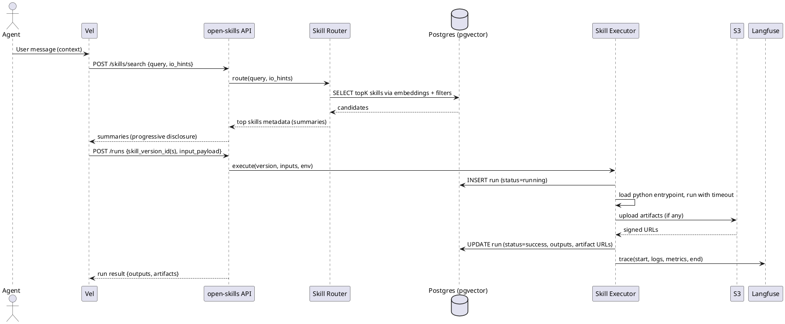
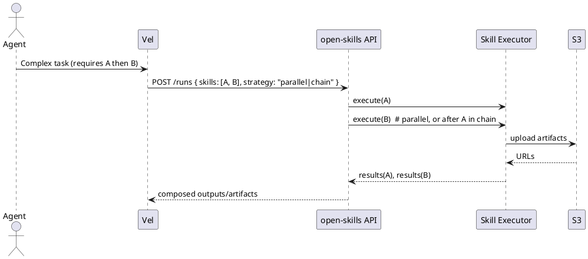

Here’s a **detailed, implementation-ready technical architecture** for `open-skills`, with PlantUML diagrams, schemas, interfaces, and scaffolding that a codegen tool (Claude Code) can run with immediately.

---

# 1) Component & Runtime Architecture (PlantUML C4)

```plantuml
@startuml
!include https://raw.githubusercontent.com/plantuml-stdlib/C4-PlantUML/master/C4_Container.puml

Person(user, "User/Developer")
System_Boundary(os, "open-skills Service") {
  Container(api, "FastAPI Router", "Python/FastAPI", "REST API for skills, versions, runs, artifacts")
  Container(exec, "Skill Executor Runtime", "Python", "Loads/executes Python entrypoints; manages I/O & artifacts")
  Container(router, "Skill Router", "Python", "Embedding + metadata based skill discovery & auto-selection")
  Container(manager, "Skill Manager", "Python", "CRUD, versioning, metadata, packaging/parsing SKILL.md")
}

System_Ext(vel, "Vel Agent Runtime", "Python", "LLM Orchestration & Tool Calls")
System_Ext(openai, "OpenAI Embeddings API", "SaaS", "Embedding generation for skill search/selection")
System_Ext(langfuse, "Langfuse", "SaaS", "Tracing/telemetry for runs")
System_Ext(s3, "S3-compatible Storage", "Object Store", "Artifacts store (stubbed config for keys)")
ContainerDb(db, "Postgres + pgvector", "RDBMS", "Skills, versions, runs, embeddings, RBAC, secrets")

Rel(user, vel, "Chat / Requests")
Rel(vel, api, "Tool calls (REST) for search/run/list")
Rel(api, manager, "CRUD & orchestration")
Rel(router, openai, "Create embeddings")
Rel(manager, db, "Read/Write")
Rel(router, db, "Vector search")
Rel(exec, db, "Log runs, artifacts metadata")
Rel(exec, s3, "Upload artifacts (signed URLs)")
Rel(exec, langfuse, "Trace run events")
Rel(api, router, "Auto-select skills")
Rel(api, exec, "Execute selected skill(s)")
@enduml
```

---

# 2) Execution & Selection Flow (Sequence Diagrams)

### 2.1 Auto-Selection + Execution



### 2.2 Multi-Skill Composition (Parallel/Chained)



---

# 3) Package Layout (Python)

```
open_skills/
  __init__.py
  config.py
  main.py                  # uvicorn entry
  api/
    __init__.py
    router.py              # FastAPI APIRouter
    deps.py                # auth, db session, rbac
    schemas.py             # Pydantic models
  core/
    manager.py             # SkillManager
    router.py              # SkillRouter (embeddings + filters)
    executor.py            # SkillExecutor
    artifacts.py           # S3 stub + local temp
    crypto.py              # JWT-based encryption utils
    telemetry.py           # Langfuse + logging
    packing.py             # SKILL.md parser, bundle validator
    rbac.py                # Roles/permissions
  db/
    base.py
    models.py              # SQLAlchemy models (pgvector)
    migrations/            # Alembic
  cli/
    __init__.py
    main.py                # click: init/validate/publish/run-local
```

---

# 4) Database Schema (Postgres + SQLAlchemy + Alembic)

### 4.1 DDL (SQL)

```sql
CREATE EXTENSION IF NOT EXISTS "uuid-ossp";
CREATE EXTENSION IF NOT EXISTS vector; -- pgvector

CREATE TABLE orgs (
  id UUID PRIMARY KEY DEFAULT uuid_generate_v4(),
  name TEXT NOT NULL,
  created_at TIMESTAMPTZ NOT NULL DEFAULT NOW()
);

CREATE TABLE users (
  id UUID PRIMARY KEY DEFAULT uuid_generate_v4(),
  org_id UUID REFERENCES orgs(id) ON DELETE SET NULL,
  email TEXT UNIQUE NOT NULL,
  created_at TIMESTAMPTZ NOT NULL DEFAULT NOW()
);

CREATE TABLE skills (
  id UUID PRIMARY KEY DEFAULT uuid_generate_v4(),
  name TEXT NOT NULL,
  owner_id UUID REFERENCES users(id) ON DELETE SET NULL,
  org_id UUID REFERENCES orgs(id) ON DELETE SET NULL,
  visibility TEXT NOT NULL CHECK (visibility IN ('user','org')),
  created_at TIMESTAMPTZ NOT NULL DEFAULT NOW()
);

-- immutable versions
CREATE TABLE skill_versions (
  id UUID PRIMARY KEY DEFAULT uuid_generate_v4(),
  skill_id UUID REFERENCES skills(id) ON DELETE CASCADE,
  version TEXT NOT NULL,             -- e.g., "1.0.0"
  entrypoint TEXT NOT NULL,          -- scripts/main.py
  description TEXT,
  metadata_yaml TEXT NOT NULL,       -- frontmatter
  embedding VECTOR(1536),            -- OpenAI embedding size (example)
  is_published BOOLEAN NOT NULL DEFAULT FALSE,
  created_at TIMESTAMPTZ NOT NULL DEFAULT NOW(),
  UNIQUE(skill_id, version)
);

CREATE TABLE skill_runs (
  id UUID PRIMARY KEY DEFAULT uuid_generate_v4(),
  skill_version_id UUID REFERENCES skill_versions(id) ON DELETE SET NULL,
  user_id UUID REFERENCES users(id) ON DELETE SET NULL,
  input_json JSONB,
  output_json JSONB,
  artifact_url TEXT,
  status TEXT NOT NULL CHECK (status IN ('queued','running','success','error','cancelled')),
  duration_ms INTEGER,
  logs TEXT,
  created_at TIMESTAMPTZ NOT NULL DEFAULT NOW()
);

CREATE TABLE skill_artifacts (
  id UUID PRIMARY KEY DEFAULT uuid_generate_v4(),
  run_id UUID REFERENCES skill_runs(id) ON DELETE CASCADE,
  s3_url TEXT,
  mime_type TEXT,
  checksum TEXT,
  size_bytes BIGINT,
  created_at TIMESTAMPTZ NOT NULL DEFAULT NOW()
);

CREATE TABLE skill_permissions (
  id UUID PRIMARY KEY DEFAULT uuid_generate_v4(),
  user_id UUID REFERENCES users(id) ON DELETE CASCADE,
  org_id UUID REFERENCES orgs(id) ON DELETE CASCADE,
  role TEXT NOT NULL CHECK (role IN ('viewer','author','publisher','admin'))
);
```

> Note: add GIN index on `skill_versions.embedding` (pgvector IVF/flat) and btree indexes on foreign keys.

---

# 5) Core Interfaces (Python)

### 5.1 Pydantic Schemas (API Contracts)

```python
# api/schemas.py
from pydantic import BaseModel, Field
from typing import List, Optional, Dict, Any
from uuid import UUID

class SkillCreate(BaseModel):
    name: str
    visibility: str = Field(pattern="^(user|org)$")

class Skill(BaseModel):
    id: UUID
    name: str
    visibility: str
    owner_id: Optional[UUID]
    org_id: Optional[UUID]

class SkillVersionCreate(BaseModel):
    version: str
    entrypoint: str
    metadata_yaml: str
    description: Optional[str]

class SkillVersion(BaseModel):
    id: UUID
    skill_id: UUID
    version: str
    is_published: bool
    description: Optional[str]

class RunCreate(BaseModel):
    skill_version_ids: List[UUID]
    input: Dict[str, Any] = {}
    strategy: Optional[str] = "parallel"  # or "chain"

class RunResult(BaseModel):
    run_id: UUID
    status: str
    outputs: Dict[str, Any] = {}
    artifacts: List[Dict[str, Any]] = []
```

### 5.2 Skill Router (Embeddings + Filters)

```python
# core/router.py
from typing import List, Dict, Any, Tuple
from .telemetry import tracer
from .config import settings
import httpx
import numpy as np

class SkillRouter:
    def __init__(self, db):
        self.db = db

    async def embed(self, text: str) -> List[float]:
        async with httpx.AsyncClient(timeout=30) as client:
            r = await client.post(
                "https://api.openai.com/v1/embeddings",
                headers={"Authorization": f"Bearer {settings.OPENAI_API_KEY}"},
                json={"input": text, "model": settings.EMBEDDING_MODEL},
            )
            r.raise_for_status()
            return r.json()["data"][0]["embedding"]

    async def search(self, query: str, io_hints: Dict[str, Any], top_k: int = 5):
        qvec = await self.embed(query)
        # pgvector cosine similarity search (pseudocode):
        rows = await self.db.search_skill_versions_by_vector(qvec, top_k=top_k, filters=io_hints)
        return [
            {"skill_version_id": r.id, "skill_id": r.skill_id, "name": r.name, "version": r.version,
             "summary": r.description}
            for r in rows
        ]
```

### 5.3 Skill Executor (In-Process Python)

```python
# core/executor.py
import asyncio, importlib.util, json, time, tempfile, os, traceback
from pathlib import Path
from typing import Dict, Any, List
from .artifacts import upload_artifact
from .telemetry import run_trace
from .config import settings

class SkillExecutor:
    def __init__(self, db):
        self.db = db

    async def _load_callable(self, bundle_root: Path, entrypoint: str):
        # entrypoint like "scripts/main.py:run"
        if ":" in entrypoint:
            mod_path, func_name = entrypoint.split(":")
        else:
            mod_path, func_name = entrypoint, "run"
        target = bundle_root / mod_path
        spec = importlib.util.spec_from_file_location("skill_mod", str(target))
        mod = importlib.util.module_from_spec(spec)
        spec.loader.exec_module(mod)  # noqa
        return getattr(mod, func_name)

    async def execute_one(self, skill_version, input_payload: Dict[str, Any], timeout_s=60):
        run_id = await self.db.create_run(skill_version.id, input_payload)
        start = time.perf_counter()
        with run_trace(run_id):
            try:
                bundle_root = await self.db.get_skill_bundle_path(skill_version.id)  # FS path
                func = await self._load_callable(Path(bundle_root), skill_version.entrypoint)

                # working dir for artifacts
                with tempfile.TemporaryDirectory() as workdir:
                    os.chdir(workdir)
                    # pass resources path via env, if needed
                    os.environ["OPEN_SKILLS_WORKDIR"] = workdir

                    result = await asyncio.wait_for(
                        func(input_payload), timeout=timeout_s
                    )
                    outputs = result.get("outputs", {})
                    files: List[str] = result.get("artifacts", [])

                    artifact_records = []
                    for f in files:
                        url = await upload_artifact(f)  # returns signed URL (stub)
                        artifact_records.append({"url": url, "name": os.path.basename(f)})

                    duration_ms = int((time.perf_counter() - start) * 1000)
                    await self.db.finish_run(run_id, "success", outputs, artifact_records, duration_ms)
                    return {"run_id": run_id, "status": "success", "outputs": outputs, "artifacts": artifact_records}
            except Exception as e:
                tb = traceback.format_exc()
                duration_ms = int((time.perf_counter() - start) * 1000)
                await self.db.finish_run(run_id, "error", {"error": str(e)}, [], duration_ms, logs=tb)
                return {"run_id": run_id, "status": "error", "error": str(e)}
```

### 5.4 Skill Manager (CRUD + Versioning)

```python
# core/manager.py
from typing import Optional
from pathlib import Path
import yaml, re, shutil, os

FRONTMATTER_RE = re.compile(r"^---\n(.*?)\n---\n", re.DOTALL)

class SkillManager:
    def __init__(self, db, storage_root: Path):
        self.db = db
        self.storage_root = storage_root

    def _parse_skill_md(self, text: str) -> dict:
        m = FRONTMATTER_RE.search(text)
        if not m:
            raise ValueError("SKILL.md missing YAML frontmatter")
        meta = yaml.safe_load(m.group(1))
        return meta

    async def create_version_from_bundle(self, skill_id, bundle_dir: Path):
        skill_md = (bundle_dir / "SKILL.md").read_text()
        meta = self._parse_skill_md(skill_md)
        version = meta["version"]
        entrypoint = meta["entrypoint"]
        description = meta.get("description", "")

        # copy bundle → storage
        target = self.storage_root / str(skill_id) / version
        target.mkdir(parents=True, exist_ok=True)
        shutil.copytree(bundle_dir, target, dirs_exist_ok=True)

        # index embedding
        embedding_text = f"{meta.get('name','')} {description} {skill_md}"
        embedding = await self.db.embed_and_store(embedding_text)

        return await self.db.insert_skill_version(
            skill_id=skill_id,
            version=version,
            entrypoint=entrypoint,
            description=description,
            metadata_yaml=meta,
            embedding=embedding,
            bundle_path=str(target),
        )
```

---

# 6) REST API (FastAPI)

```python
# api/router.py
from fastapi import APIRouter, UploadFile, File, Depends, HTTPException
from .schemas import *
from ..core.manager import SkillManager
from ..core.router import SkillRouter
from ..core.executor import SkillExecutor
from .deps import get_db, require_role

router = APIRouter(prefix="/api")

@router.post("/skills", response_model=Skill)
async def create_skill(payload: SkillCreate, db=Depends(get_db), _: None = Depends(require_role("author"))):
    return await db.create_skill(payload)

@router.get("/skills", response_model=list[Skill])
async def list_skills(db=Depends(get_db)):
    return await db.list_skills()

@router.post("/skills/{skill_id}/versions", response_model=SkillVersion)
async def upload_skill_version(skill_id: str, bundle: UploadFile = File(...), db=Depends(get_db), _: None = Depends(require_role("author"))):
    # unzip to temp dir, then manager.create_version_from_bundle
    ...

@router.post("/skill-versions/{version_id}/publish")
async def publish_version(version_id: str, db=Depends(get_db), _: None = Depends(require_role("publisher"))):
    return await db.publish_skill_version(version_id)

@router.post("/skills/search")
async def search_skills(body: dict, db=Depends(get_db)):
    router = SkillRouter(db)
    return await router.search(body.get("query",""), body.get("io_hints", {}))

@router.post("/runs", response_model=RunResult)
async def run_skills(payload: RunCreate, db=Depends(get_db)):
    exec_ = SkillExecutor(db)
    # parallel example; chain is similar with prior result passed along
    results = []
    for v_id in payload.skill_version_ids:
        sv = await db.get_skill_version(v_id)
        results.append(await exec_.execute_one(sv, payload.input))
    # merge results (simplified)
    return results[0] if len(results)==1 else {"runs": results}
```

---

# 7) RBAC & AuthN/Z

- **Roles**: `viewer`, `author`, `publisher`, `admin`.
- **Scopes**:

  - `viewer`: read skills/versions/runs
  - `author`: create/update skills, upload versions (draft)
  - `publisher`: publish versions, deprecate
  - `admin`: manage RBAC, delete

- **Org vs User**:

  - `visibility=user`: only owner (+admin) can read/run.
  - `visibility=org`: all org members can read/run; author/publisher/admin can modify.

`require_role()` can pull role claims from your existing auth JWT (Vel-compatible).

---

# 8) JWT-Based Encryption (Secrets)

```python
# core/crypto.py
from jose import jwt, JWTError

def encrypt_value(value: str, jwt_secret: str) -> str:
    # store as signed+encoded token
    return jwt.encode({"v": value}, jwt_secret, algorithm="HS256")

def decrypt_value(token: str, jwt_secret: str) -> str:
    data = jwt.decode(token, jwt_secret, algorithms=["HS256"])
    return data["v"]
```

Use for per-skill env vars or credentials stored in DB (field name e.g. `secret_encrypted`).

---

# 9) Artifacts & S3 Stub

```python
# core/artifacts.py
from pathlib import Path
import hashlib

async def upload_artifact(local_path: str) -> str:
    # STUB: compute checksum, return fake signed URL or preconfigured format.
    p = Path(local_path)
    data = p.read_bytes()
    checksum = hashlib.sha256(data).hexdigest()
    # Replace with real boto3 put_object and generate_presigned_url
    return f"https://s3.example.com/bucket/{p.name}?sig=stub&sha256={checksum}"
```

---

# 10) Skill Authoring (Bundle) — Minimal Entrypoint

```python
# scripts/main.py (inside a skill bundle)
from typing import Dict, Any
import json
from pathlib import Path

async def run(input_payload: Dict[str, Any]) -> Dict[str, Any]:
    # Read inputs, do work, write artifacts
    report = {"summary": "Processed!", "input_keys": list(input_payload.keys())}
    out = Path("result.json")
    out.write_text(json.dumps(report))
    return {
        "outputs": {"message": "done"},
        "artifacts": [str(out)]  # executor will upload and return URL
    }
```

---

# 11) Integration with Vel

- **Attach router/executor as a tool** in Vel:

  - Expose a tool name like `open_skills.run`.
  - Tool arguments: `{query?, io_hints?, skills?, inputs}`.
  - If `skills` unspecified → auto-select via `open-skills` search.
  - Emit Vel-compatible **file events** for artifacts.

**Adapter Sketch:**

```python
# vel_adapter.py
from open_skills.core.router import SkillRouter
from open_skills.core.executor import SkillExecutor

class OpenSkillsTool:
    name = "open_skills.run"
    schema = {...}  # JSON schema for args

    def __init__(self, db):
        self.db = db
        self.router = SkillRouter(db)
        self.exec = SkillExecutor(db)

    async def __call__(self, args, stream):
        if "skills" not in args:
            hits = await self.router.search(args.get("query",""), args.get("io_hints",{}))
            skill_version_ids = [h["skill_version_id"] for h in hits]
        else:
            skill_version_ids = args["skills"]
        results = []
        for v in skill_version_ids:
            sv = await self.db.get_skill_version(v)
            res = await self.exec.execute_one(sv, args.get("inputs", {}))
            # stream Vel events for artifacts
            for art in res.get("artifacts", []):
                await stream({"type": "file", "url": art["url"], "name": art["name"]})
            results.append(res)
        return {"results": results}
```

---

# 12) Web Console (React, not Next.js)

**Structure**

```
web/
  src/
    api/client.ts        # axios
    hooks/useQuery.ts
    pages/
      Dashboard.tsx
      SkillList.tsx
      SkillDetail.tsx
      UploadVersion.tsx
      Runs.tsx
    components/
      Table.tsx
      CodeBlock.tsx
      ArtifactList.tsx
  index.html
  main.tsx
  vite.config.ts
```

**Sample API Client**

```ts
// api/client.ts
import axios from "axios";
export const api = axios.create({ baseURL: "/api" });

export const listSkills = () => api.get("/skills").then((r) => r.data);
export const searchSkills = (query: string, io_hints?: any) =>
  api.post("/skills/search", { query, io_hints }).then((r) => r.data);
export const runSkills = (payload: any) =>
  api.post("/runs", payload).then((r) => r.data);
```

---

# 13) Config & Deployment

**Environment:**

- `POSTGRES_URL`
- `OPENAI_API_KEY`
- `LANGFUSE_API_KEY`
- `JWT_SECRET`
- `S3_BUCKET`, `S3_ENDPOINT`, `S3_ACCESS_KEY`, `S3_SECRET_KEY` (for real impl)

**Local Dev (no Docker):**

```bash
export POSTGRES_URL=postgresql+asyncpg://...
export OPENAI_API_KEY=sk-...
export JWT_SECRET=local-secret
uvicorn open_skills.main:app --reload --port 8000
```

**K8s Snippet (Deployment)**

```yaml
apiVersion: apps/v1
kind: Deployment
metadata:
  name: open-skills
spec:
  replicas: 2
  selector:
    matchLabels: { app: open-skills }
  template:
    metadata:
      labels: { app: open-skills }
    spec:
      containers:
        - name: api
          image: yourrepo/open-skills:latest
          env:
            - name: POSTGRES_URL
              valueFrom: { secretKeyRef: { name: db, key: url } }
            - name: OPENAI_API_KEY
              valueFrom: { secretKeyRef: { name: openai, key: key } }
            - name: JWT_SECRET
              valueFrom: { secretKeyRef: { name: app, key: jwt } }
          ports: [{ containerPort: 8000 }]
```

---

# 14) Testing & Telemetry Hooks

- **Unit**: `packing`, `manager` parsing SKILL.md; `executor` run with mock bundle.
- **Integration**: `/skills/search`, `/runs` end-to-end with sample skill.
- **Telemetry**:

```python
# core/telemetry.py
from contextlib import contextmanager
import time, logging
logger = logging.getLogger("open-skills")

@contextmanager
def run_trace(run_id: str):
    start = time.time()
    logger.info({"event": "run.start", "run_id": run_id})
    try:
        yield
        dur = time.time() - start
        logger.info({"event": "run.end", "run_id": run_id, "duration_s": dur})
    except Exception as e:
        logger.exception({"event": "run.error", "run_id": run_id, "error": str(e)})
        raise
```

(Integrate Langfuse by adding trace start/end & spans around executor + router calls.)

---

# 15) Guardrails (Stubbed)

- **Network**: `allow_network: bool` in SKILL.md (enforced later).
- **I/O caps**: `MAX_INPUT_BYTES`, `MAX_ARTIFACT_BYTES` (config).
- **Timeout**: default 60s per run (configurable).
- **Unsafe imports**: basic AST/static scan (future) — placeholder hook in `packing.py`.

---

# 16) Ready-to-Build Checklist

- [ ] Create SQLAlchemy models matching DDL; add pgvector type
- [ ] Implement `db.search_skill_versions_by_vector` with cosine similarity
- [ ] Implement `manager.create_version_from_bundle` (zip upload → temp → store)
- [ ] Finish FastAPI endpoints & deps (`require_role`, sessions)
- [ ] Wire `router.search` → OpenAI embeddings
- [ ] Wire `executor.execute_one` + S3 artifact stub
- [ ] Add CLI commands: `init`, `validate`, `publish`, `run-local`
- [ ] Add Langfuse instrumentation hooks
- [ ] Build minimal React console
