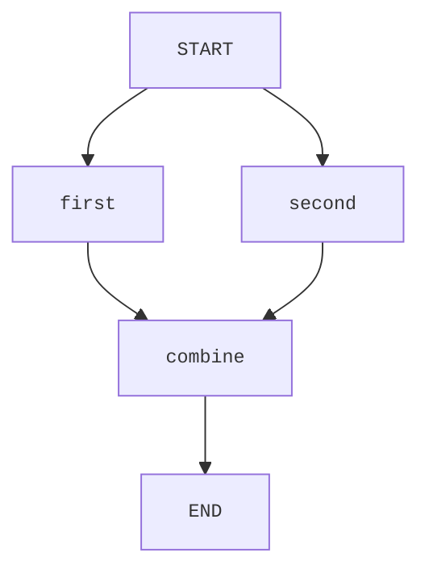

# Orcheo Python SDK

The Python SDK offers a strongly typed way to generate Orcheo workflow requests without forcing a specific HTTP client dependency.

## Server-side workflow execution

> **Breaking change:** The SDK no longer supports executing workflows locally within the client process. All executions now run on the
> Orcheo backend. To migrate, deploy your workflow as before and trigger runs via the HTTP API while streaming updates over a WebSocket
> connection. The new [`examples/quickstart/sdk_server_trigger.py`](../../examples/quickstart/sdk_server_trigger.py) script shows an end-to-end
> interaction pattern, including payload construction and streaming result handling.

High-level steps:

1. Model the workflow graph using the SDK types shown below.
2. Deploy the workflow to the Orcheo backend.
3. Trigger runs using `OrcheoClient.workflow_trigger_url()` or the `HttpWorkflowExecutor`.
4. Subscribe to live updates with `OrcheoClient.websocket_url()` and send the payload returned from `client.build_payload(...)`.

The sections that follow focus on authoring the graph configuration and preparing the payloads required by the server APIs.

## Workflow authoring

```python
from pydantic import BaseModel
from orcheo_sdk import OrcheoClient, Workflow, WorkflowNode


class UppercaseConfig(BaseModel):
    prefix: str


class UppercaseNode(WorkflowNode[UppercaseConfig]):
    type_name = "Uppercase"


workflow = Workflow(name="demo")
workflow.add_node(UppercaseNode("upper", UppercaseConfig(prefix="Result: ")))

# Prepare deployment request metadata for the Orcheo backend
client = OrcheoClient(base_url="http://localhost:8000")
request = client.build_deployment_request(workflow)
```

### Multi-node workflows

Edges between nodes are derived from the dependencies you provide when registering
each node. Every dependency is converted into an edge in the exported graph, so
you only need to describe how data should flow between nodes:



```python
workflow = Workflow(name="fan-in")

workflow.add_node(UppercaseNode("first", UppercaseConfig(prefix="A: ")))
workflow.add_node(UppercaseNode("second", UppercaseConfig(prefix="B: ")))
workflow.add_node(
    AppendNode("combine", AppendConfig(suffix="!")),
    depends_on=["first", "second"],
)

graph_config = workflow.to_graph_config()
assert graph_config["edges"] == [
    ("START", "first"),
    ("START", "second"),
    ("combine", "END"),
    ("first", "combine"),
    ("second", "combine"),
]
```

> **Note:** Workflows should be deployed to the managed Orcheo runtime for
> execution once you are happy with the authored graph configuration.

## Usage

```python
from orcheo_sdk import OrcheoClient

client = OrcheoClient(base_url="http://localhost:8000")
trigger_url = client.workflow_trigger_url("example-workflow")
ws_url = client.websocket_url("example-workflow")
payload = client.build_payload(graph_config, inputs={"name": "Ada"})
```

Refer to [`examples/quickstart/sdk_server_trigger.py`](../../examples/quickstart/sdk_server_trigger.py) for a complete async implementation
that streams updates, handles connection failures gracefully, and shuts down once the workflow run finishes.

## Development

```bash
uv sync --all-groups
uv run pytest tests/sdk -q
```
