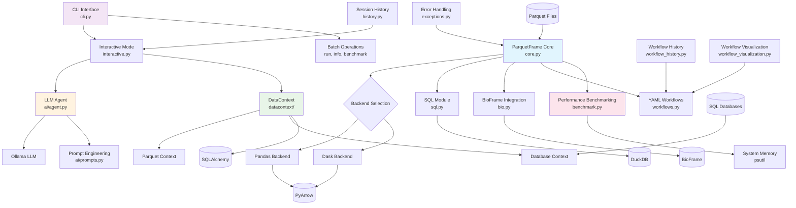

# ParquetFrame Architecture Diagram

## Architecture Summary

### Core Components

1. **ParquetFrame Core** (`core.py`)
   - Central DataFrame wrapper with intelligent backend switching
   - Automatic pandas/Dask selection based on file size and system memory
   - Property-based backend control with `islazy` flag

2. **CLI Interface** (`cli.py`)
   - Rich command-line interface with multiple commands
   - Batch processing (`run`), interactive mode, file info, benchmarking
   - Integration with all core features

3. **Interactive Mode** (`interactive.py`)
   - REPL-style interface for data exploration
   - AI-powered natural language queries
   - Session persistence and history tracking

4. **AI Integration** (`ai/`)
   - LLM agent for natural language to SQL conversion
   - Sophisticated prompt engineering with self-correction
   - Local inference via Ollama

5. **DataContext System** (`datacontext/`)
   - Unified abstraction for different data sources
   - Parquet data lakes and SQL database integration
   - Schema discovery and query execution

### Feature Modules

- **SQL Support** (`sql.py`) - DuckDB-based SQL queries on DataFrames
- **BioFrame Integration** (`bio.py`) - Genomic interval operations with parallel processing
- **YAML Workflows** (`workflows.py`) - Declarative data processing pipelines
- **Performance Benchmarking** (`benchmark.py`) - Comprehensive performance testing suite

### Supporting Infrastructure

- **Error Handling** (`exceptions.py`) - Comprehensive exception hierarchy
- **Session History** (`history.py`) - Command tracking and reproducibility
- **Workflow Management** (`workflow_history.py`, `workflow_visualization.py`)
