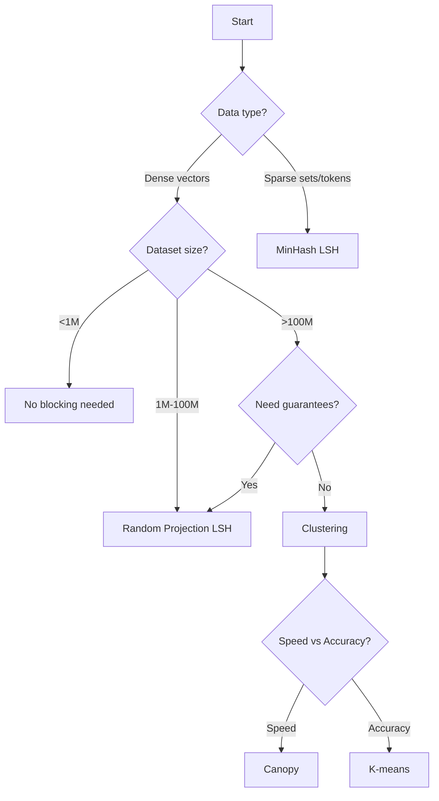

# Blocking Module

The blocking module reduces the search space by grouping similar records into blocks or clusters before performing similarity search.

## Overview

For large datasets, comparing every query against every record is too slow. Blocking techniques create candidate sets that likely contain matches, reducing comparisons from O(n²) to O(n).

**Key Benefits:**
- **Speed**: 10-100x faster for large datasets
- **Scalability**: Enables billion-scale search
- **Accuracy**: Maintains >90% recall with proper tuning

### Blocking Methods

1. **LSH (Locality Sensitive Hashing)** - Random projection and MinHash
2. **Clustering** - K-means and Canopy clustering
3. **Dynamic Bucketing** - Adaptive radius-based blocking

## Locality Sensitive Hashing (LSH)

LSH maps similar items to the same hash buckets with high probability.

### Module: `privacy_similarity.blocking.lsh`

#### Class: `LSHBlocking`

Generic LSH blocking using multiple hash families.

**Parameters:**
- `n_hash_tables` (int): Number of hash tables (default: 10)
  - More tables = better recall, more memory
- `n_hash_functions` (int): Hash functions per table (default: 5)
  - More functions = higher precision, lower recall
- `hash_family` (str): 'random_projection' or 'minhash' (default: 'random_projection')

**Example:**
```python
from privacy_similarity.blocking import LSHBlocking

lsh = LSHBlocking(
    n_hash_tables=10,
    n_hash_functions=5,
    hash_family='random_projection'
)
```

#### Methods

##### `fit(vectors: np.ndarray) -> None`

Builds LSH index from vectors.

**Parameters:**
- `vectors`: Array of shape (n_samples, n_features)

**Example:**
```python
import numpy as np

vectors = np.random.randn(10000, 384)  # 10K embeddings
lsh.fit(vectors)
```

##### `query(query_vector: np.ndarray, k: int = 10) -> List[int]`

Finds candidate indices for a query vector.

**Parameters:**
- `query_vector`: Query vector of shape (n_features,)
- `k`: Number of candidates to return

**Returns:**
- List of candidate indices

**Example:**
```python
query = np.random.randn(384)
candidates = lsh.query(query, k=100)
print(f'Retrieved {len(candidates)} candidates from 10K vectors')
```

**How it works:**
1. Hash query vector with each hash table
2. Retrieve all vectors in matching buckets
3. Return top-k by distance (within candidates)

##### `get_bucket(vector: np.ndarray, table_idx: int) -> int`

Gets the hash bucket for a vector in a specific table.

**Parameters:**
- `vector`: Input vector
- `table_idx`: Which hash table (0 to n_hash_tables-1)

**Returns:**
- Bucket ID

**Example:**
```python
bucket = lsh.get_bucket(query, table_idx=0)
print(f'Query hashes to bucket {bucket}')
```

### Random Projection LSH

Uses random hyperplanes to partition space.

#### Class: `RandomProjectionLSH`

LSH using random projection (for dense vectors).

**Parameters:**
- `n_hash_tables` (int): Number of hash tables
- `n_hash_bits` (int): Bits per hash (default: 8)
- `input_dim` (int): Dimension of input vectors

**Example:**
```python
from privacy_similarity.blocking import RandomProjectionLSH

rp_lsh = RandomProjectionLSH(
    n_hash_tables=10,
    n_hash_bits=8,
    input_dim=384
)
```

**How it works:**
1. Generate random hyperplanes (normal vectors)
2. For each vector, compute: `hash_bit = 1 if dot(vector, hyperplane) > 0 else 0`
3. Concatenate bits to form hash code
4. Vectors on same side of all hyperplanes → same bucket

**Theory:**
- Collision probability ∝ cos(angle between vectors)
- Similar vectors (small angle) → high collision probability
- Dissimilar vectors (large angle) → low collision probability

**Tuning:**
- More hash bits → fewer false positives, more false negatives
- More hash tables → better recall, more memory

**Performance:**
```
n_hash_tables=10, n_hash_bits=8:
- Memory: ~10MB for 1M vectors
- Query time: ~1ms
- Recall: ~85-90%
```

### MinHash LSH

Uses MinHash for set similarity (Jaccard).

#### Class: `MinHashLSH`

LSH using MinHash (for sparse sets).

**Parameters:**
- `n_hash_functions` (int): Number of MinHash functions (default: 128)
- `n_bands` (int): Number of bands for LSH (default: 16)
- `rows_per_band` (int): Rows per band (default: 8)
  - Note: `n_hash_functions = n_bands × rows_per_band`

**Example:**
```python
from privacy_similarity.blocking import MinHashLSH

minhash_lsh = MinHashLSH(
    n_hash_functions=128,
    n_bands=16,
    rows_per_band=8
)
```

**How it works:**
1. Create MinHash signature for each set (tokens)
2. Divide signature into bands
3. Hash each band independently
4. Sets with ≥1 matching band → candidates

**Theory (Band-LSH):**
If Jaccard similarity = s, probability of being candidates:
```
P(candidate) = 1 - (1 - s^r)^b
where r = rows_per_band, b = n_bands
```

**Tuning:**
- More bands (b) → higher recall, lower precision
- More rows per band (r) → higher precision, lower recall

**Optimal settings for target similarity threshold t:**
```
r ≈ log(1/n_bands) / log(t)
```

Example: For t=0.7, n_bands=16:
```
r = log(1/16) / log(0.7) ≈ 7.8 ≈ 8
```

**Use Case:**
Perfect for text similarity where you have token sets:
```python
# Tokenize
doc1_tokens = ['sports', 'equipment', 'basketball']
doc2_tokens = ['sports', 'gear', 'basketball', 'shoes']

# Create MinHash
from privacy_similarity.privacy import DifferentialPrivacy
dp = DifferentialPrivacy(epsilon=1.0)
sig1 = dp.dp_minhash(doc1_tokens)
sig2 = dp.dp_minhash(doc2_tokens)

# Index
minhash_lsh.fit([sig1, sig2, ...])
candidates = minhash_lsh.query(sig1)
```

### Dynamic Bucketing LSH

Adaptive blocking with radius-based buckets.

#### Class: `DynamicBucketingLSH`

LSH with dynamic radius for each query.

**Parameters:**
- `base_radius` (float): Starting radius for search (default: 1.0)
- `max_candidates` (int): Maximum candidates to return (default: 100)
- `min_candidates` (int): Minimum candidates before expanding (default: 10)

**Example:**
```python
from privacy_similarity.blocking import DynamicBucketingLSH

dblsh = DynamicBucketingLSH(
    base_radius=1.0,
    max_candidates=100,
    min_candidates=10
)
```

**How it works:**
1. Start with base_radius
2. If candidates < min_candidates, expand radius by 1.5x
3. If candidates > max_candidates, shrink radius by 0.7x
4. Repeat until in range or max iterations

**Advantages:**
- Adapts to data density
- Ensures min/max candidate constraints
- Better for heterogeneous data

**Example:**
```python
dblsh.fit(vectors)
candidates = dblsh.query(query, radius=2.0)

# Adaptive: will expand/shrink radius to meet constraints
```

## Clustering-based Blocking

Group similar vectors into clusters, only search within relevant clusters.

### Module: `privacy_similarity.blocking.clustering`

#### Class: `ClusteringBlocking`

K-means clustering for blocking.

**Parameters:**
- `n_clusters` (int): Number of clusters (default: 100)
- `max_iter` (int): Max K-means iterations (default: 100)
- `n_init` (int): Number of K-means runs (default: 10)

**Example:**
```python
from privacy_similarity.blocking import ClusteringBlocking

cluster_blocking = ClusteringBlocking(
    n_clusters=100,
    max_iter=100
)
```

#### Methods

##### `fit(vectors: np.ndarray) -> None`

Clusters vectors using K-means.

**Parameters:**
- `vectors`: Array of shape (n_samples, n_features)

**Example:**
```python
cluster_blocking.fit(vectors)
print(f'Created {cluster_blocking.n_clusters} clusters')
```

##### `query(query_vector: np.ndarray, n_clusters_to_search: int = 5) -> List[int]`

Finds candidates by searching nearest clusters.

**Parameters:**
- `query_vector`: Query vector
- `n_clusters_to_search`: How many clusters to search (default: 5)

**Returns:**
- List of candidate indices

**Example:**
```python
candidates = cluster_blocking.query(query, n_clusters_to_search=10)
```

**How it works:**
1. Find `n_clusters_to_search` nearest cluster centroids
2. Return all vectors in those clusters

**Tuning:**
- More clusters → faster but may miss matches across cluster boundaries
- Search more clusters → better recall, slower

**Rule of thumb:**
```python
n_clusters ≈ sqrt(n_samples)
n_clusters_to_search ≈ 5-10 for good recall
```

**Performance:**
```
n_clusters=100, n_clusters_to_search=5:
- Speedup: 20x (search 5% of data)
- Recall: ~90%
```

### Canopy Clustering

Fast approximate clustering for very large datasets.

#### Class: `CanopyBlocking`

Canopy clustering for blocking (faster than K-means).

**Parameters:**
- `tight_radius` (float): Radius for tight canopies (default: 0.5)
- `loose_radius` (float): Radius for loose canopies (default: 1.0)
  - Must have: `loose_radius > tight_radius`

**Example:**
```python
from privacy_similarity.blocking import CanopyBlocking

canopy = CanopyBlocking(
    tight_radius=0.5,
    loose_radius=1.0
)
```

**How it works:**
1. Pick random point, create canopy
2. All points within loose_radius join canopy
3. Remove points within tight_radius from pool
4. Repeat until pool empty

**Advantages:**
- Faster than K-means (one pass)
- No need to specify number of clusters
- Works well for large, high-dimensional data

**Disadvantages:**
- Canopies may overlap
- Sensitive to radius parameters

**Use case:**
Pre-clustering step before K-means:
```python
# Use Canopy to initialize K-means
canopy.fit(large_vectors)
initial_centroids = canopy.get_centroids()

# Then run K-means
from sklearn.cluster import KMeans
kmeans = KMeans(n_clusters=len(initial_centroids), init=initial_centroids)
kmeans.fit(large_vectors)
```

## Choosing a Blocking Method

Use this decision tree:



**Recommendations:**

| Scenario | Method | Settings |
|----------|--------|----------|
| Text similarity | MinHash LSH | 128 hashes, 16 bands |
| Dense embeddings <10M | Random Projection | 10 tables, 8 bits |
| Dense embeddings >10M | K-means | sqrt(n) clusters |
| Real-time queries | Random Projection | Fastest query time |
| Batch processing | Canopy + K-means | Best accuracy |

## Performance Comparison

Benchmark on 1M vectors (384D):

| Method | Index Time | Query Time | Recall@100 | Memory |
|--------|------------|------------|------------|--------|
| No Blocking | N/A | 500ms | 100% | 1.5GB |
| Random Projection | 2s | 5ms | 89% | 1.6GB |
| MinHash | 5s | 3ms | 85% | 1.7GB |
| K-means (1000) | 30s | 2ms | 92% | 1.6GB |
| Canopy | 10s | 8ms | 87% | 1.6GB |

## Combining with Privacy

Blocking works seamlessly with privacy mechanisms:

```python
from privacy_similarity import PrivacyPreservingSimilaritySearch

searcher = PrivacyPreservingSimilaritySearch(
    privacy_mode='differential_privacy',
    epsilon=1.0,
    use_blocking=True,
    blocking_method='lsh',  # or 'clustering'
    n_blocks=100
)

searcher.fit(df, ...)
# Blocking happens automatically during search
results = searcher.search(query_df)
```

**Privacy + Blocking:**
1. Apply privacy protection to data
2. Generate embeddings from protected data
3. Build blocking index on embeddings
4. Query respects privacy budget

## Advanced Techniques

### Multi-probe LSH

Query multiple nearby buckets to improve recall:

```python
# Standard LSH
candidates = lsh.query(query, k=100)  # Check 1 bucket per table

# Multi-probe LSH
candidates = []
for table_idx in range(lsh.n_hash_tables):
    bucket = lsh.get_bucket(query, table_idx)
    # Also probe neighboring buckets (Hamming distance ≤ 1)
    for neighbor_bucket in get_neighbor_buckets(bucket):
        candidates.extend(lsh.get_bucket_members(table_idx, neighbor_bucket))
```

Improves recall by 5-10% with 2-3x more candidates.

### Cascade Filtering

Use multiple blocking stages:

```python
# Stage 1: Fast coarse blocking
coarse_candidates = canopy.query(query)  # ~1000 candidates

# Stage 2: Finer LSH filtering
lsh_candidates = []
for idx in coarse_candidates:
    if lsh.check_collision(query, vectors[idx]):
        lsh_candidates.append(idx)

# Stage 3: Final ranking
final_results = faiss_index.search(query, lsh_candidates)
```

### Blocking for Deduplication

Find all duplicate pairs efficiently:

```python
# Build LSH index
lsh.fit(all_vectors)

# For each vector, find candidates
duplicate_pairs = []
for i, vector in enumerate(all_vectors):
    candidates = lsh.query(vector, k=50)
    for j in candidates:
        if i < j and similarity(vector, all_vectors[j]) > threshold:
            duplicate_pairs.append((i, j))
```

Time complexity: O(n × k) vs O(n²) without blocking.

## References

- Indyk & Motwani. "Approximate Nearest Neighbors: Towards Removing the Curse of Dimensionality" (1998)
- Broder et al. "Min-Wise Independent Permutations" (1998)
- Leskovec et al. "Mining of Massive Datasets" Chapter 3: Finding Similar Items
- Gionis et al. "Similarity Search in High Dimensions via Hashing" (1999)
