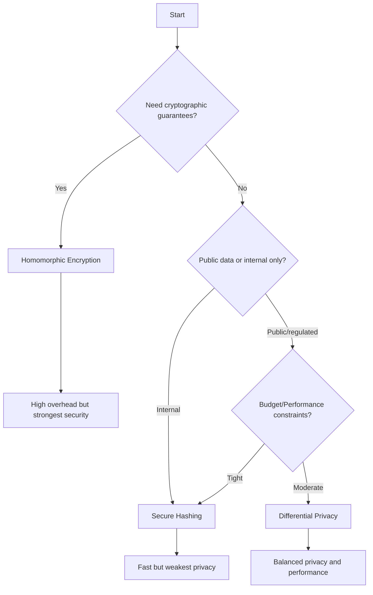

# Privacy Module

The privacy module provides three privacy-preserving techniques for protecting sensitive data during similarity search.

## Overview

Privacy is the foundation of this package. All sensitive data passes through the privacy layer before being used for similarity search, ensuring that PII is protected even if the search index is compromised.

### Privacy Modes

1. **Differential Privacy** - Statistical privacy guarantees
2. **Homomorphic Encryption** - Cryptographic privacy guarantees
3. **Secure Hashing** - Irreversible transformations

## Differential Privacy

Differential privacy provides mathematical guarantees that individual records cannot be identified from query results.

### Module: `privacy_similarity.privacy.differential_privacy`

#### Class: `DifferentialPrivacy`

Implements differential privacy mechanisms for similarity search.

**Parameters:**
- `epsilon` (float): Privacy budget. Lower values = more privacy, less accuracy
  - High privacy: 0.1 - 1.0
  - Medium privacy: 1.0 - 5.0
  - Low privacy: 5.0 - 10.0
- `delta` (float, optional): Failure probability (default: 1e-5)
- `mechanism` (str): Noise mechanism - 'laplace' or 'gaussian' (default: 'laplace')

**Example:**
```python
from privacy_similarity.privacy import DifferentialPrivacy

dp = DifferentialPrivacy(epsilon=1.0, mechanism='laplace')
protected_data = dp.protect(sensitive_data)
```

#### Methods

##### `protect(data: np.ndarray) -> np.ndarray`

Applies differential privacy protection to data.

**Parameters:**
- `data`: Input array to protect

**Returns:**
- Protected array with added noise

**Example:**
```python
import numpy as np

data = np.array([[1.0, 2.0, 3.0], [4.0, 5.0, 6.0]])
protected = dp.protect(data)
```

##### `dp_minhash(tokens: List[str], num_hashes: int = 128) -> np.ndarray`

Creates a differentially private MinHash sketch of tokens.

**Parameters:**
- `tokens`: List of tokens (words, n-grams, etc.)
- `num_hashes`: Number of hash functions (default: 128)

**Returns:**
- MinHash sketch array of shape (num_hashes,)

**How it works:**
1. Generates `num_hashes` hash values for each token
2. Takes minimum hash for each hash function
3. Adds Laplace noise scaled by epsilon
4. Returns normalized sketch in [0, 1]

**Example:**
```python
tokens = ['john', 'smith', '123', 'main', 'street']
sketch = dp.dp_minhash(tokens, num_hashes=128)
print(sketch.shape)  # (128,)
```

**Privacy guarantee:**
The sketch satisfies ε-differential privacy, meaning changing one token changes the output distribution by at most e^ε.

##### `dp_oph(tokens: List[str], num_hashes: int = 128) -> np.ndarray`

One Permutation Hashing with differential privacy.

**Parameters:**
- `tokens`: List of tokens
- `num_hashes`: Number of hash bins (default: 128)

**Returns:**
- OPH sketch array

**Advantages over MinHash:**
- More efficient (single permutation vs many)
- Better for sparse data
- Lower variance

**Example:**
```python
tokens = ['sports', 'technology', 'reading']
sketch = dp.dp_oph(tokens, num_hashes=128)
```

### Privacy-Accuracy Tradeoff

The epsilon parameter controls the privacy-accuracy tradeoff:

| Epsilon | Privacy Level | Use Case | Accuracy Impact |
|---------|---------------|----------|-----------------|
| 0.1 - 0.5 | Very High | Medical records, financial data | ~20-30% accuracy loss |
| 0.5 - 1.0 | High | PII, customer data | ~10-15% accuracy loss |
| 1.0 - 5.0 | Medium | Internal analytics | ~5-10% accuracy loss |
| 5.0 - 10.0 | Low | Public data with privacy | ~1-5% accuracy loss |

**Recommendation**: Start with epsilon=1.0 and adjust based on your privacy requirements and accuracy needs.

## Homomorphic Encryption

Homomorphic encryption allows computations on encrypted data without decrypting it.

### Module: `privacy_similarity.privacy.homomorphic`

#### Class: `HomomorphicEncryption`

Implements additively homomorphic encryption for secure similarity computation.

**Parameters:**
- `key_size` (int): Encryption key size in bits (default: 2048)
  - 1024: Fast but less secure
  - 2048: Balanced (recommended)
  - 4096: Highly secure but slow

**Example:**
```python
from privacy_similarity.privacy import HomomorphicEncryption

he = HomomorphicEncryption(key_size=2048)
encrypted = he.encrypt(sensitive_data)
```

#### Methods

##### `generate_keys() -> Tuple[PublicKey, PrivateKey]`

Generates a public/private key pair.

**Returns:**
- Tuple of (public_key, private_key)

**Example:**
```python
public_key, private_key = he.generate_keys()
```

##### `encrypt(data: np.ndarray) -> np.ndarray`

Encrypts data using the public key.

**Parameters:**
- `data`: Plaintext array

**Returns:**
- Encrypted array (much larger than input)

**Example:**
```python
plaintext = np.array([1.0, 2.0, 3.0])
ciphertext = he.encrypt(plaintext)
```

##### `decrypt(encrypted_data: np.ndarray) -> np.ndarray`

Decrypts data using the private key.

**Parameters:**
- `encrypted_data`: Ciphertext array

**Returns:**
- Decrypted plaintext array

**Example:**
```python
decrypted = he.decrypt(ciphertext)
```

##### `encrypted_inner_product(enc_vec1: np.ndarray, enc_vec2: np.ndarray) -> float`

Computes inner product of two encrypted vectors without decryption.

**Parameters:**
- `enc_vec1`: First encrypted vector
- `enc_vec2`: Second encrypted vector

**Returns:**
- Inner product result (in encrypted space)

**How it works:**
1. Performs element-wise multiplication of encrypted values
2. Sums the products (homomorphic addition)
3. Returns encrypted result that can be decrypted by key holder

**Example:**
```python
enc_v1 = he.encrypt(np.array([1, 2, 3]))
enc_v2 = he.encrypt(np.array([4, 5, 6]))
encrypted_result = he.encrypted_inner_product(enc_v1, enc_v2)
result = he.decrypt(encrypted_result)  # Should be ~32
```

**Use Case**: Allows a server to compute similarity between encrypted vectors without seeing the actual data.

### Performance Considerations

Homomorphic encryption is computationally expensive:

- **Encryption**: 100-1000x slower than plaintext
- **Operations**: 10-100x slower than plaintext
- **Memory**: 10-100x more memory required

**When to use:**
- Highly sensitive data (medical, financial)
- Compliance requirements (HIPAA, GDPR)
- Multi-party computation scenarios

**Optimization tips:**
- Use GPU acceleration if available
- Batch encrypt multiple records
- Consider hybrid approach (encrypt only most sensitive fields)

## Secure Hashing

Secure hashing provides one-way transformations that preserve similarity while preventing reversal.

### Module: `privacy_similarity.privacy.secure_hashing`

#### Class: `SecureHashing`

Implements secure hashing techniques for privacy protection.

**Parameters:**
- `salt` (str): Random salt for security
- `hash_function` (str): Hash algorithm - 'sha256', 'sha512', or 'blake2' (default: 'sha256')
- `k_anonymity` (int, optional): Minimum group size for k-anonymity

**Example:**
```python
from privacy_similarity.privacy import SecureHashing

sh = SecureHashing(salt='random-salt-12345', k_anonymity=5)
hashed = sh.hash_data(sensitive_data)
```

#### Methods

##### `hash_data(data: List[str]) -> np.ndarray`

Hashes a list of strings into fixed-size representations.

**Parameters:**
- `data`: List of strings to hash

**Returns:**
- Array of hash values

**Example:**
```python
names = ['John Smith', 'Jane Doe', 'Alice Johnson']
hashes = sh.hash_data(names)
```

##### `bloom_filter(tokens: List[str], size: int = 1024, num_hashes: int = 7) -> np.ndarray`

Creates a Bloom filter representation of tokens.

**Parameters:**
- `tokens`: List of tokens
- `size`: Bloom filter size in bits (default: 1024)
- `num_hashes`: Number of hash functions (default: 7)

**Returns:**
- Binary array of length `size`

**How it works:**
1. For each token, compute `num_hashes` hash values
2. Set corresponding bits in array to 1
3. Result is probabilistic set membership structure

**Properties:**
- No false negatives (if token is in set, it will be found)
- Small false positive rate (controlled by size and num_hashes)
- Preserves similarity via Jaccard similarity

**Example:**
```python
tokens = ['john', 'smith', 'engineer']
bloom = sh.bloom_filter(tokens, size=1024, num_hashes=7)
print(np.sum(bloom))  # Number of bits set
```

**False positive rate:**
```
FPR ≈ (1 - e^(-kn/m))^k
where k = num_hashes, n = num_tokens, m = size
```

For optimal parameters: `num_hashes ≈ (size / num_tokens) * ln(2) ≈ 0.693 * size / num_tokens`

##### `k_anonymize(data: pd.DataFrame, quasi_identifiers: List[str], k: int) -> pd.DataFrame`

Applies k-anonymity to ensure each record is indistinguishable from at least k-1 others.

**Parameters:**
- `data`: DataFrame to anonymize
- `quasi_identifiers`: Columns that could identify individuals
- `k`: Minimum group size

**Returns:**
- Anonymized DataFrame

**How it works:**
1. Groups records by quasi-identifiers
2. Generalizes values until each group has ≥ k members
3. Returns generalized dataset

**Example:**
```python
df = pd.DataFrame({
    'age': [25, 26, 27, 45, 46, 47],
    'zip': ['90210', '90211', '90210', '10001', '10002', '10001'],
    'salary': [50000, 51000, 52000, 80000, 81000, 82000]
})

anon_df = sh.k_anonymize(
    df,
    quasi_identifiers=['age', 'zip'],
    k=3
)
# age might become age ranges: [25-27], [45-47]
# zip might become prefixes: [902*], [100*]
```

**Privacy guarantee:**
Each record is indistinguishable from at least k-1 other records based on quasi-identifiers.

## Choosing a Privacy Mode

Use this decision tree:



**Recommendations:**

- **Healthcare/Finance**: Homomorphic Encryption (HIPAA, PCI-DSS compliance)
- **Customer Analytics**: Differential Privacy (good privacy, reasonable performance)
- **Internal Deduplication**: Secure Hashing (fast, sufficient for internal use)
- **Public Datasets**: Differential Privacy with low epsilon

## Privacy Composition

When running multiple queries, privacy budgets compose:

**Sequential Composition:**
```python
# Each query consumes epsilon
dp1 = DifferentialPrivacy(epsilon=1.0)
dp2 = DifferentialPrivacy(epsilon=1.0)

# Total privacy: epsilon = 1.0 + 1.0 = 2.0
```

**Advanced Composition:**
For many queries, use Rényi Differential Privacy for tighter bounds.

**Best Practice:**
- Track your privacy budget across queries
- Set a budget limit (e.g., total epsilon ≤ 10.0)
- Use privacy accountant for complex scenarios

## References

- Dwork, C. "Differential Privacy" (2006)
- Paillier, P. "Public-Key Cryptosystems Based on Composite Degree Residuosity Classes" (1999)
- Sweeney, L. "k-Anonymity: A Model for Protecting Privacy" (2002)
- Bloom, B. "Space/Time Trade-offs in Hash Coding with Allowable Errors" (1970)
