<div align="center">


<br>

*A declarative UI framework for Blender addons and much more*

</div>

<div align="center">

[](https://github.com/nicolaiprodromov/puree/releases)
[](https://www.blender.org/)
[](https://github.com/moderngl/moderngl)

</div>

*Puree UI* for Blender is a declarative framework that provides a web-inspired API for building user interfaces, addressing the limitations of Blender's native UI system in supporting complex interface architectures and providing enhanced flexibility.

It's meant for all Blender users that want to enhance their ability to present their creations, models, addons and products inside the software in a streamlined, easy & intuitive way, adaptable to causal users and powerful enough for seasoned programmers.

> Puree is built on top of **ModernGL**, **TinyCSS2**, and **Stretchable** to deliver a high-performance, GPU-accelerated UI engine with a familiar web development paradigm.

<div align="center">

## What is puree good for?

From addon user interfaces to complex object-based tracking in screen space, to interactive tutorials, to markdown-type (and soon true markdown rendering!) rendering directly in Blender, to simple drawing anywhere in Blender, in real-time, using the gpu. Check the [examples](/examples) folder for detailed examples of what can be accomplished with **puree**.

<div align="center">


</div>

## Key Features

| Feature | Description |
|---------|-------------|
| *Declarative UI Design* | Define your interface structure using YAML configuration files with HTML-like nesting |
| *GPU-Accelerated Rendering* | Leverages ModernGL compute shaders for real-time, high-performance UI rendering |
| *Responsive Layouts* | Automatic layout computation using the Stretchable flexbox engine |
| *Interactive Components* | Built-in support for hover states, click events, scrolling, and toggle interactions |
| *Web-Inspired Architecture* | Familiar paradigm for developers coming from web development |

</div>

<div align="center">

## Quick Start

</div>

Here's a minimal example to get you started with Puree:

> [!IMPORTANT]
> It's not recommend to install dependencies with pip in the blender python context, so better download the puree wheel and it's dependencies, and reference them in the `blender_manifest.toml` file of your addon.

1. **Download the package with pip or download the [latest release](https://github.com/nicolaiprodromov/puree/releases)**

    ```bash
    pip download --only-binary=:all: --python-version 3.11 --dest wheels puree-ui
    ```

2. **Create your project structure:**

    ```bash
    my_addon/x
        ├── static/
        │   ├── index.yaml
        │   └── style.css
        └── __init__.py <-- your addon entry point
    ```

3. **Define your addon manifest in `blender_manifest.toml`:**

    Rename the `blender_manifest.example.toml` to `blender_manifest.toml` and modify to fit your addons metadata.

    ```toml
    schema_version = "1.0.0"

    id         = "your_addon_id"
    version    = "your_addon_version"
    name       = "your_addon_name"
    tagline    = "your_addon_tagline"
    maintainer = "your_name"
    type       = "add-on"

    blender_version_min = "your_addon_version_blend_min"

    license = [
    "your_addon_license",
    ]

    platforms = [
    "windows-x64",
    "linux-x64",
    "macos-arm64",
    "macos-x64"
    ]

    wheels = [
    "./wheels/attrs-25.3.0-py3-none-any.whl",
    "./wheels/glcontext-3.0.0-cp311-cp311-win_amd64.whl",
    "./wheels/linkify_it_py-2.0.3-py3-none-any.whl",
    "./wheels/markdown_it_py-4.0.0-py3-none-any.whl",
    "./wheels/mdit_py_plugins-0.5.0-py3-none-any.whl",
    "./wheels/mdurl-0.1.2-py3-none-any.whl",
    "./wheels/moderngl-5.12.0-cp311-cp311-win_amd64.whl",
    "./wheels/platformdirs-4.5.0-py3-none-any.whl",
    "./wheels/puree_ui-0.0.8-py3-none-any.whl",
    "./wheels/pygments-2.19.2-py3-none-any.whl",
    "./wheels/PyYAML-6.0.2-cp311-cp311-win_amd64.whl",
    "./wheels/rich-14.1.0-py3-none-any.whl",
    "./wheels/stretchable-1.1.7-cp38-abi3-win_amd64.whl",
    "./wheels/textual-6.2.1-py3-none-any.whl",
    "./wheels/tinycss2-1.4.0-py3-none-any.whl",
    "./wheels/typing_extensions-4.15.0-py3-none-any.whl",
    "./wheels/uc_micro_py-1.0.3-py3-none-any.whl",
    "./wheels/webencodings-0.5.1-py2.py3-none-any.whl"
    ]

    [build]
    paths_exclude_pattern = [
    "__pycache__/",
    "*.zip",
    "*.pyc",
    ".gitignore",
    ".vscode/",
    ".git/",
    ]
    ```

4. **Define your addon entrypoint in `__init__.py`:**

    Rename the `__init__.example.py` to `__init__.py` and modify to fit your addons metadata.

    ```python
    import bpy
    import os
    from puree import register as xwz_ui_register, unregister as xwz_ui_unregister
    from puree import set_addon_root

    bl_info = {
        "name"       : "your_addon_name",
        "author"     : "your_name",
        "version"    : (1, 0, 0),
        "blender"    : (4, 2, 0),
        "location"   : "3D View > Sidebar > Your Addon",
        "description": "Your addon description",
        "category"   : "Your Addon Category"
    }

    def register():
        # Set the addon root directory so puree knows where to find resources
        set_addon_root(os.path.dirname(os.path.abspath(__file__)))
        # Register the framework
        xwz_ui_register()
        # Set default properties
        # ui_conf_path is relative to the addon root directory and
        # is required to point puree to the main configuration file of your UI
        wm = bpy.context.window_manager
        wm.xwz_ui_conf_path = "static/index.yaml"
        wm.xwz_debug_panel  = True
        wm.xwz_auto_start   = True

    def unregister():
        # Unregister the framework
        xwz_ui_unregister()
        
    if __name__ == "__main__":
        register()
    ```

5. **Define your UI in `index.yaml`:**

    ```yaml
    app:
      selected_theme: default
      default_theme: default
      theme:
        - name: default
          author: you
          version: 1.0.0
          default_font: NeueMontreal-Regular
          styles:
            - static/style.css
          scripts: []
          components: ""
          root:
            style: root
            hello:
              style: hello_box
              text: Hello, Puree!
    ```

6. **Style it in `style.css`:**

    ```css
    root {
        width          : 100%;
        height         : 100%;
        display        : flex;
        align-items    : center;
        justify-content: center;
    }

    hello_box {
        width           : 300px;
        height          : 100px;
        background-color: #3498db;
        border-radius   : 10px;
        text-color      : #ffffff;
        text-scale      : 24px;
    }
    ```

7. **Zip the files.**

8. **Install in Blender**: `Edit > Preferences > Add-ons > Install from disk`

9. Done. If you open the latest version of Blender you have installed on your system you should see a `puree` tab in the N-panel of the 3D Viewport - click the button and you will see a blue rectangle with text.

<div align="center">

## How it works

</div>

Puree follows a render pipeline inspired by modern web browsers:

1. **Parse** – YAML/CSS files are loaded and parsed into container tree with styles
2. **Layout** – Stretchable computes flexbox layouts with viewport-aware sizing
3. **Compile** – Optional Python scripts transform the UI tree
4. **Render** – ModernGL compute shader generates GPU texture with all visual effects
5. **Event** – Mouse/scroll events update container states and trigger re-renders

```mermaid
graph LR
    A[YAML + CSS] --> B[Parser]
    B --> C[Container Tree]
    C --> D[Stretchable Layout]
    D --> E[Flattened Data]
    E --> F[GPU Buffers]
    F --> G[Compute Shader]
    G --> H[UI Texture]
    
    I[Mouse/Scroll] --> J[Event Handlers]
    J --> K[Hit Detection]
    K --> C
    
    L[Python Scripts] --> M[Compiler]
    M --> C
    
    H --> N[Blender Viewport]
    
    style A fill:#000
    style C fill:#000
    style D fill:#000
    style G fill:#000
    style H fill:#000
    style K fill:#000
```



This architecture enables:
- **Reactive updates** – Layout recomputes on viewport resize
- **GPU acceleration** – All rendering in compute shaders
- **Script integration** – Python scripts can modify UI at runtime
- **Event propagation** – Interactions flow through container hierarchy

> Read the full [documentation](docs/DOCS.md) for detailed guides, API references, and examples.

<div align="center">

## Support & Issues

</div>

> [!WARNING]
> ### **puree is in beta - WIP**
> - puree currently works **only** with Blender's OpenGL backend because of the ModernGL dependency.
> - The API is not stable and **breaking changes are expected** in future releases.

### Getting Help

For questions and support, check out the [docs](docs/DOCS.md) or [support guide](docs/SUPPORT.md).

### Reporting Issues

Found a bug or have a feature request? [Open an issue](https://github.com/nicolaiprodromov/puree/issues) with:

- Clear description of the problem or feature
- Steps to reproduce (for bugs)
- Blender version and OS
- Relevant error messages or screenshots

<div align="center">

## Built With

</div>

<p align="center">
  <a href="https://www.blender.org/"></a>
  &nbsp;&nbsp;&nbsp;
  <a href="https://www.python.org/"></a>
</p>

<p align="center">
  <a href="https://github.com/moderngl/moderngl"></a>
  &nbsp;&nbsp;&nbsp;
  <a href="https://www.khronos.org/opengl/wiki/OpenGL_Shading_Language"></a>
</p>

<p align="center">
  <a href="https://github.com/vislyhq/stretchable"></a>
  &nbsp;&nbsp;&nbsp;
  <a href="https://github.com/Kozea/tinycss2"></a>
  &nbsp;&nbsp;&nbsp;
  <a href="https://yaml.org/"></a>
</p>

<div align="center">

*Special thanks to the open-source community and the developers behind the projects that make **puree** possible.*


</div>

</div>
