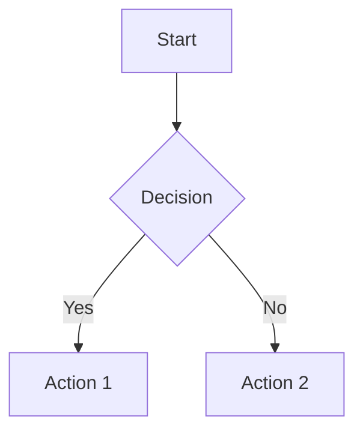
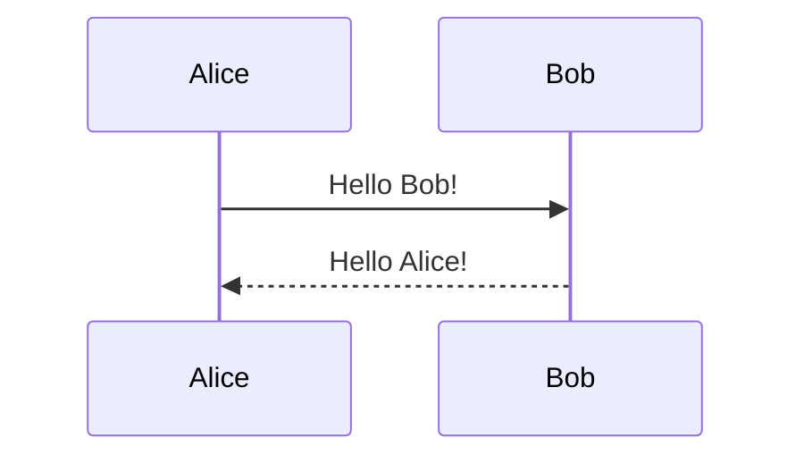

# PyMMDC - Pure Python Mermaid Diagram Converter

A robust, local-only Mermaid to PNG converter with comprehensive Markdown processing support. Convert Mermaid diagrams seamlessly without any web requests or external dependencies beyond your local Mermaid CLI installation.

## 🚀 Key Features

- **🔒 Pure Local Operation**: No web requests - exclusively uses local Mermaid CLI
- **🛡️ Robust Error Handling**: Comprehensive exception hierarchy with detailed error messages and validation
- **📄 Markdown File Processing**: Automatically detects and processes Mermaid code blocks in `.md` files
- **⚙️ Flexible Configuration**: Customizable diagram appearance (themes, sizes, backgrounds)
- **🔄 Batch Processing**: Convert multiple files and directories with single commands
- **📝 Metadata Support**: Configure diagrams using code block metadata
- **🧹 Resource Management**: Proper temporary file cleanup with context manager support
- **📊 Detailed Reporting**: Structured results with execution metrics and success rates

## 📦 Installation

### Prerequisites

1. **Node.js** (v14 or higher) - [Download here](https://nodejs.org/)
2. **Mermaid CLI**:
   ```bash
   npm install -g @mermaid-js/mermaid-cli
   ```

### Install PyMMDC

```bash
pip install pymmdc
```

## 🎯 Quick Start

### Command Line Interface

```bash
# Convert single Mermaid file
pymmdc diagram.mmd diagram.png

# Process Markdown file with Mermaid blocks
pymmdc document.md --output-dir ./images

# Batch process multiple Markdown files
pymmdc "docs/*.md" --batch --output-dir ./generated_images

# Replace Mermaid blocks with images in output
pymmdc README.md --replace-blocks --output-dir ./assets

# Custom theme and dimensions
pymmdc diagram.mmd --theme dark --width 1600 --height 1200
```

### Python API

```python
from pymmdc import EnhancedMermaidConverter

# Simple conversion
with EnhancedMermaidConverter() as converter:
    result = converter.convert_file("diagram.mmd", "output.png")

# Markdown processing
result = converter.convert_file(
    "document.md",
    process_markdown=True,
    output_dir="./images",
    replace_blocks=True
)

# Batch processing
results = converter.batch_convert(["file1.md", "file2.mmd"])
```

## 📝 Usage Examples

### Basic Mermaid Conversion

```bash
# Convert .mmd or .mermaid files to PNG
pymmdc flowchart.mmd flowchart.png
pymmdc sequence.mermaid sequence.png
```

### Markdown Processing

Process Markdown files containing Mermaid code blocks:

````markdown
# My Document

Here's a flowchart:



And a sequence diagram:


````

```bash
# Process all Mermaid blocks in Markdown
pymmdc document.md --output-dir ./diagrams

# Replace code blocks with images in new Markdown file
pymmdc document.md --replace-blocks --output-dir ./assets
```

### Advanced Configuration

Use metadata in code blocks for per-diagram settings:

````markdown
```mermaid { "theme": "dark", "width": 1600, "title": "System Architecture" }
graph TB
    subgraph Frontend
        A[Web App]
        B[Mobile App]
    end
    
    subgraph Backend
        C[API Server]
        D[Database]
    end
    
    A --> C
    B --> C
    C --> D
```
````

## ⚙️ Configuration Options

### Command Line Flags

| Flag | Description | Default |
|------|-------------|---------|
| `--timeout` | Conversion timeout in seconds | `60` |
| `--width` | Diagram width in pixels | `1200` |
| `--height` | Diagram height in pixels | `800` |
| `--theme` | Diagram theme (`default`, `dark`, `forest`, `neutral`) | `default` |
| `--bg-color` | Background color | `transparent` |
| `--output-dir` | Output directory for images | Current directory |
| `--replace-blocks` | Replace code blocks with images in Markdown | `False` |
| `--batch` | Process multiple files | `False` |
| `--verbose` | Enable detailed output | `False` |

### Supported Metadata

Configure diagrams using JSON metadata in code blocks:

```json
{
  "theme": "dark",
  "width": 1600,
  "height": 900,
  "title": "My Diagram",
  "bgcolor": "white"
}
```

## 🔧 Advanced Usage

### Batch Processing

```bash
# Process all Markdown files in a directory
pymmdc "project/docs/**/*.md" --batch --recursive --output-dir ./generated

# Dry run to see what would be processed
pymmdc "*.md" --batch --dry-run

# Custom output directory and theme
pymmdc "**/*.md" --batch --output-dir ./docs/assets --theme forest
```

### Integration with Documentation Pipelines

```bash
# Pre-process documentation before building
pymmdc "docs/**/*.md" --batch --replace-blocks --output-dir docs/assets

# CI/CD integration example
pymmdc README.md --output-dir ./badges || echo "Diagram generation failed"
```

## 🐛 Troubleshooting

### Common Issues

1. **Mermaid CLI not found**:
   ```bash
   npm install -g @mermaid-js/mermaid-cli
   ```

2. **Node.js version too old**:
   ```bash
   # Update Node.js
   npm install -g n
   n stable
   ```

3. **Permission errors**:
   ```bash
   # Ensure write permissions in output directory
   chmod +w ./output-directory
   ```

### Debug Mode

Enable verbose logging for troubleshooting:

```bash
pymmdc document.md --verbose --output-dir ./debug
```

## 📊 Output Examples

Successful processing provides detailed reports:

```shell
Markdown Processing Complete!
File: document.md
Blocks found: 3
Blocks converted: 3
Success rate: 100.0%
Output files:
  - document_architecture.png
  - document_flowchart.png
  - document_sequence.png
```

## 🤝 Contributing

We welcome contributions! Please see our contributing guidelines for details.

## 📄 License

This program is free software: you can redistribute it and/or modify
    it under the terms of the GNU General Public License as published by
    the Free Software Foundation, either version 3 of the License, or
    (at your option) any later version.

    This program is distributed in the hope that it will be useful,
    but WITHOUT ANY WARRANTY; without even the implied warranty of
    MERCHANTABILITY or FITNESS FOR A PARTICULAR PURPOSE.  See the
    GNU General Public License for more details.

    You should have received a copy of the GNU General Public License
    along with this program.  If not, see <https://www.gnu.org/licenses/>.
    
  See the LICENSE file for more details. See the [LICENSE](LICENSE) file for details.

## 🆘 Support

- 📚 [Documentation](https://github.com/skye-cyber/pymmdc/docs)
- 🐛 [Issue Tracker](https://github.com/skye-cyber/pymmdc/issues)
- 💬 [Discussions](https://github.com/skye-cyber/pymmdc/discussions)

---

**PyMMDC**: Making Mermaid diagram conversion reliable, fast, and completely local. 🚀
