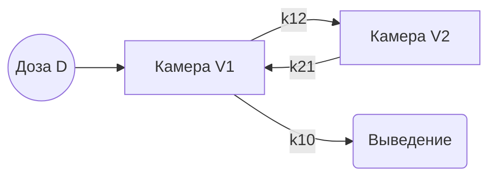
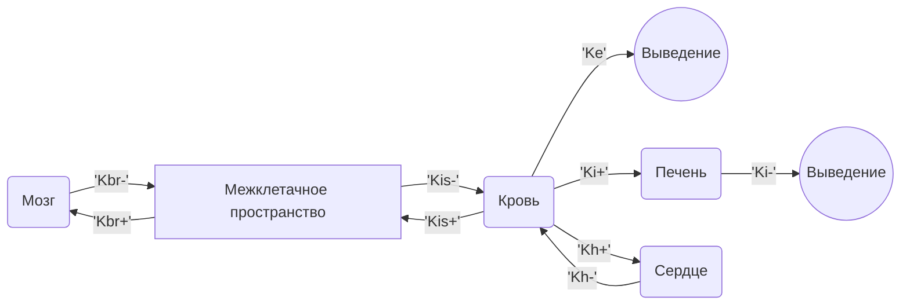
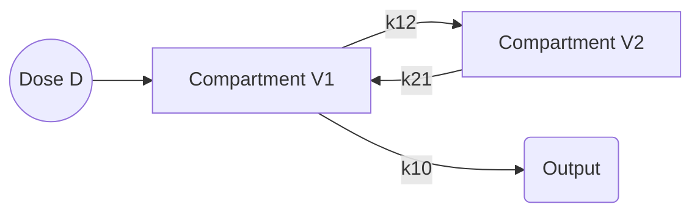
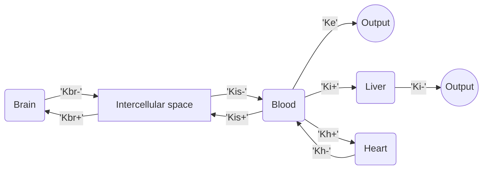

PyPharm  
----------  
  **1) Установка пакета**
  
```  
pip install pypharm  
```  
  
**2) Пример использования пакета для модели, где все параметры известны** 

Задана двухкамерная модель такого вида


При этом, нам известны параметры модели 
|  V1|V2  |k12 |K21 | K10
|--|--|--|--|--|
|  228| 629 |0.4586|0.1919|0.0309

Создание и расчет модели при помощи пакета PyPharm  
```python  
from PyPharm import BaseCompartmentModel  
  
model = BaseCompartmentModel([[0, 0.4586], [0.1919, 0]], [0.0309, 0], volumes=[228, 629])  
  
res = model(90, d=5700, compartment_number=0)  
```
res - Результат работы решателя scipy solve_iv

**3) Пример использования пакета для модели, где все параметры неизвестны** 

Задана многокамерная модель такого вида


При этом, известен лишь параметр Ke=0.077

Создание и расчет модели при помощи пакета PyPharm, используя метод minimize:
```python  
from PyPharm import BaseCompartmentModel
import numpy as np
matrix = [[0, None, 0, 0, 0],
[None, 0, None, 0, 0],
[0, None, 0, None, None],
[0, 0, 0, 0, 0],
[0, 0, None, 0, 0]]
outputs = [0, 0, 0.077, None, 0]

model = BaseCompartmentModel(matrix, outputs)

model.load_optimization_data(
	teoretic_x=[0.25, 0.5, 1, 4, 8, 24],
	teoretic_y=[[0, 0, 11.2, 5.3, 5.42, 3.2], [268.5, 783.3, 154.6, 224.2, 92.6, 0], [342, 637, 466, 235, 179, 158]],
	know_compartments=[0, 3, 4],
	c0=[0, 0, 20000, 0, 0]
)

x_min = [1.5, 0.01, 0.5, 0.0001, 0.1, 0.1, 4, 3]
x_max = [2.5, 0.7, 1.5, 0.05, 0.5, 0.5, 7, 5]
x0 = np.random.uniform(x_min, x_max)
bounds = ((1.5, 2.5), (0.01, 0.7), (0.5, 1.5), (0.0001, 0.05), (0.1, 0.5), (0.1, 0.5), (4, 7), (3, 5))

model.optimize(
	bounds=bounds,
	x0=x0,
	options={'disp': True}
)

print(model.configuration_matrix)
```
Или же при помощи алгоритма взаимодействующих стран
```python
from PyPharm import BaseCompartmentModel
import numpy as np
matrix = [[0, None, 0, 0, 0],
[None, 0, None, 0, 0],
[0, None, 0, None, None],
[0, 0, 0, 0, 0],
[0, 0, None, 0, 0]]
outputs = [0, 0, 0.077, None, 0]

model = BaseCompartmentModel(matrix, outputs)

model.load_optimization_data(
	teoretic_x=[0.25, 0.5, 1, 4, 8, 24],
	teoretic_y=[[0, 0, 11.2, 5.3, 5.42, 3.2], [268.5, 783.3, 154.6, 224.2, 92.6, 0], [342, 637, 466, 235, 179, 158]],
	know_compartments=[0, 3, 4],
	c0=[0, 0, 20000, 0, 0]
)

model.optimize(
	method='country_optimization',
	Xmin=[0.5, 0.001, 0.001, 0.00001, 0.01, 0.01, 1, 1],
	Xmax=[5, 2, 2.5, 0.3, 1, 1, 10, 10],
	M=10,
	N=25,
	n=[1, 10],
	p=[0.00001, 2],
	m=[1, 8],
	k=8,
	l=3,
	ep=[0.2, 0.4],
	tmax=300,
	printing=True,
)
```

При оптимизации, вектор неизвестных это
x = [configuration_matrix (неизвестные), outputs(неизвестные), volumes(неизвестные)]

Кроме того, вы можете использовать генетический алгоритм:
```python
model.optimize(
    method='GA',
    x_min=[0.00001, 0.001, 0.01, 1, 1],
    x_max=[1, 2, 1, 10, 3],
    genes=[16, 17, 16, 20, 16],
	n=100,
    child_percent=0.3,
    mutation_chance=0.5,
    max_mutation=5,
    t_max=300,
    max_step=0.5,
    printing=True,
)
```

Вы даже можете использовать свой собственный алгоритм, если это необходимо

```python
# CountriesAlgorithm - ваш класс алгоритма
# start - функция запуска алгоритма
# важно, чтобы ваша функция запуска возвращала numpy.array

model.optimize(
    user_method=CountriesAlgorithm,
    method_is_func=False,
    optimization_func_name='start',
    Xmin=[0.00001, 0.001, 0.01, 1, 1], #ваши настроечные параметры
    Xmax=[1, 2, 1, 10, 3],
    genes=[16, 17, 16, 20, 16],
    M=20,
    N=25,
    n=[1, 10],
    max_mutation=8,
    m=[1, 8],
    k=8,
    l=3,
    ep=[0.2, 0.4],
    tmax=200,
    max_step=0.5,
    printing=True
)
```

или

```python
# my_alg - ваша функция алгоритма, важно, чтобы она принимала только целевую функцию 

model.optimize(
    user_method=my_alg,
    Xmin=[0.00001, 0.001, 0.01, 1, 1], #ваши настроечные параметры
    Xmax=[1, 2, 1, 10, 3],
    genes=[16, 17, 16, 20, 16],
    M=20,
    N=25,
    n=[1, 10],
    max_mutation=8,
    m=[1, 8],
    k=8,
    l=3,
    ep=[0.2, 0.4],
    tmax=200,
    max_step=0.5,
    printing=True
)
```

**4) Модель MagicCompartmentModel** 

Данная модель необходима нам для тех случаев, 
когда мы не знаем как именно стоит переводить входные
единицы измерения в выходные.

В модель добавляется 2 дополнительных параметра:

* magic_coefficient - множитель преобразования входных единиц в выходные;
* exclude_compartments - список номеров камер, которые не 
подвергнутся преобразованию.

```python  
from PyPharm import MagicCompartmentModel  
  
model = MagicCompartmentModel([[0, 0.4586], [0.1919, 0]], [0.0309, 0], volumes=[228, 629], magic_coefficient=None, exclude_compartments=[2])  
  
res = model(90, d=5700, compartment_number=0)  
```

Параметр magic_coefficient может быть задан None,
в таком случае он будет подвергнут оптимизации, в таком 
случае он будет браться из последнего значения в векторе
переменных.
Если оба параметра не заданы, то модель выраздается 
в простую BaseCompartmentModel.

**5) Модель ReleaseCompartmentModel** 

Данная модель учитывает поправку на высвобождение
ЛВ в модель вводятся дополнительные параметры:
* v_release - Объем гепотетической камеры из которой происходит высвобождение
* release_parameters -  Параметры функции высвобождения
* release_compartment - Номер камеры в которую происходит высвобождение
* release_function - Функция высвобождения по умолчанию f(t,m,b,c) = c0 * c * t ** b / (t ** b + m)

При этом d и c0 теперь везде носят характер параметров камеры,
из которой происходит высвобождение
```python
from PyPharm import ReleaseCompartmentModel
import matplotlib.pyplot as plt

model = ReleaseCompartmentModel(
    6.01049235e+00,
    [4.56683781e-03, 1.36845756e+00, 5.61175978e-01],
    0,
    configuration_matrix=[[0, 1.18292665e+01], [3.02373800e-01, 0]],
    outputs=[5.00000000e+00, 0],
    volumes=[1.98530383e+01, 3.81007392e+02],
    numba_option=True
)
teoretic_t = [5/60, 0.25, 0.5, 1, 2, 4, 24, 48]
teoretic_c = [[3558.19,	508.49,	230.95,	52.05,	44.97,	36.52,	17.89,	10.36]]
d = 5 * 0.02 * 1000000
res = model(48, d=d)
plt.plot(teoretic_t, teoretic_c[0], 'r*')
plt.plot(res.t, res.y[0])
plt.grid()
plt.show()
```
Параметры release_parameters и v_release могут подвергаться оптимизации
в таком случае, искомое нужно просто задать как None. Тогда вектор неизвестных это
x = [configuration_matrix (неизвестные), outputs(неизвестные), volumes(неизвестные), release_parameters(неизвестные), v_release]

**6) Использование PBPK модели**

Вы можете использовать PBPK модель как для рассчёта по известным
данным так и для поиска параметров, исходя из ваших экспериментальных данных.

Чтобы задать исзвестные вам константы, при инициализации объекта следует использовать
параметры know_k и know_cl, которые содержат словари с известными параметрами, имена органов следует брать
из класса ORGAN_NAMES.

Ниже приведен пример поиска параметров и построение кривых распределения вещества
в органах с использованием генетического алгоритма.

```python
from PyPharm import PBPKmod
from PyPharm.constants import ORGAN_NAMES, MODEL_CONST

model = PBPKmod()
print(model.get_unknown_params())
model.load_optimization_data(
    time_exp=[12, 60, 3 * 60, 5* 60, 15 * 60, 24 * 60],
    dict_c_exp = {ORGAN_NAMES.LIVER: [103.2 * 1e-6, 134.54 * 1e-6, 87.89 * 1e-6, 81.87 * 1e-6, 45.83 * 1e-6, 28.48 * 1e-6],
              ORGAN_NAMES.LUNG: [26.96 * 1e-6, 22.67 * 1e-6, 15.51 * 1e-6, 12.07 * 1e-6, 4.53 * 1e-6, 0 * 1e-6],
              ORGAN_NAMES.SPLEEN: [11.84 * 1e-6, 12.22 * 1e-6, 8.52 * 1e-6, 7.01 * 1e-6, 3.65 * 1e-6, 2.16 * 1e-6]
    },
    start_c_in_venous=150 * 1e-3 / MODEL_CONST['rat']['venous_blood']['V']
)
result = model.optimize(
    method='GA',
    x_min=17 * [0.0001],
    x_max=17 * [5],
    genes=17 * [16],
	n=300,
    child_percent=0.3,
    mutation_chance=0.5,
    max_mutation=5,
    t_max=300,
    printing=True,
)
model.update_know_params(result)

result = model(max_time=24 * 60, start_c_in_venous=150 * 1e-3 / MODEL_CONST['rat']['venous_blood']['V'], step=0.1)
model.plot_last_result(
    organ_names=[ORGAN_NAMES.LUNG, ORGAN_NAMES.LIVER, ORGAN_NAMES.SPLEEN],
    user_names={
        ORGAN_NAMES.LUNG: 'Лёгкие',
        ORGAN_NAMES.LIVER: 'Печень',
        ORGAN_NAMES.SPLEEN: 'Селезёнка',
    },
    theoretic_data={
        ORGAN_NAMES.LIVER: {
            'x': [12, 60, 3 * 60, 5* 60, 15 * 60, 24 * 60],
            'y': [103.2 * 1e-6, 134.54 * 1e-6, 87.89 * 1e-6, 81.87 * 1e-6, 45.83 * 1e-6, 28.48 * 1e-6],
        },
        ORGAN_NAMES.LUNG: {
            'x': [12, 60, 3 * 60, 5* 60, 15 * 60, 24 * 60],
            'y': [26.96 * 1e-6, 22.67 * 1e-6, 15.51 * 1e-6, 12.07 * 1e-6, 4.53 * 1e-6, 0 * 1e-6],
        },
        ORGAN_NAMES.SPLEEN: {
            'x': [12, 60, 3 * 60, 5* 60, 15 * 60, 24 * 60],
            'y': [11.84 * 1e-6, 12.22 * 1e-6, 8.52 * 1e-6, 7.01 * 1e-6, 3.65 * 1e-6, 2.16 * 1e-6]
        }
    }
)
```

**7) Использование shared_memory** 

Начиная с версии 1.3.0, вы можете использовать **shared_memory** для получения текущих данных
оптимизации. Имя нужного вам участка памяти хранится в поле **memory_name**.

```python
from multiprocessing import shared_memory

c = shared_memory.ShareableList(name='<your model.memory_name>')
print(c)
# ShareableList([4, 3.5192100752465563, 1.4158559227257506, 1.7264077213115414, 0.008336751860551, 0.2549196311342251, 0.5160375718404234, 6.915499993374695, 2.944744649331201, 0.5, 1.907294741996761], name='wnsm_0c50aa90')
```

Данные хранятся в формате списка [текущая_итерация, x0, ... , xn, f], работает только для алгоритма country_optimization.

**ENG documentation**
----------

**1) Package Installation**

```
pip install pypharm
```

**2) An example of using a package for a model where all parameters are known**

A two-chamber model of this type is given


At the same time, we know the parameters of the model
| V1|V2 |k12 |K21 | K10
|--|--|--|--|--|
| 228| 629 |0.4586|0.1919|0.0309

Creating and calculating a model using the PyPharm package
```python
from PyPharm import BaseCompartmentModel

model = BaseCompartmentModel([[0, 0.4586], [0.1919, 0]], [0.0309, 0], volumes=[228, 629])

res = model(90, d=5700, compartment_number=0)
```
res is the result of the scipy solve_iv solver

**3) An example of using a package for a model where all parameters are unknown**

A multi-chamber model of this type is given


At the same time, only the parameter Ke=0 is known.077

Creating and calculating a model using the PyPharm package using the minimize method:
```python
from PyPharm import BaseCompartmentModel
import numpy as np
matrix = [[0, None, 0, 0, 0],
[None, 0, None, 0, 0],
[0, None, 0, None, None],
[0, 0, 0, 0, 0],
[0, 0, None, 0, 0]]
outputs = [0, 0, 0.077, None, 0]

model = BaseCompartmentModel(matrix, outputs)

model.load_optimization_data(
teoretic_x=[0.25, 0.5, 1, 4, 8, 24],
teoretic_y=[[0, 0, 11.2, 5.3, 5.42, 3.2], [268.5, 783.3, 154.6, 224.2, 92.6, 0], [342, 637, 466, 235, 179, 158]],
know_compartments=[0, 3, 4],
c0=[0, 0, 20000, 0, 0]
)

x_min = [1.5, 0.01, 0.5, 0.0001, 0.1, 0.1, 4, 3]
x_max = [2.5, 0.7, 1.5, 0.05, 0.5, 0.5, 7, 5]
x0 = np.random.uniform(x_min, x_max)
bounds = ((1.5, 2.5), (0.01, 0.7), (0.5, 1.5), (0.0001, 0.05), (0.1, 0.5), (0.1, 0.5), (4, 7), (3, 5))

model.optimize(
bounds=bounds,
x0=x0,
options={'disp': True}
)

print(model.configuration_matrix)
```
Or using the algorithm of interacting countries
```python
from PyPharm import BaseCompartmentModel
import numpy as np
matrix = [[0, None, 0, 0, 0],
[None, 0, None, 0, 0],
[0, None, 0, None, None],
[0, 0, 0, 0, 0],
[0, 0, None, 0, 0]]
outputs = [0, 0, 0.077, None, 0]

model = BaseCompartmentModel(matrix, outputs)

model.load_optimization_data(
teoretic_x=[0.25, 0.5, 1, 4, 8, 24],
teoretic_y=[[0, 0, 11.2, 5.3, 5.42, 3.2], [268.5, 783.3, 154.6, 224.2, 92.6, 0], [342, 637, 466, 235, 179, 158]],
know_compartments=[0, 3, 4],
c0=[0, 0, 20000, 0, 0]
)

model.optimize(
method='country_optimization',
Xmin=[0.5, 0.001, 0.001, 0.00001, 0.01, 0.01, 1, 1],
Xmax=[5, 2, 2.5, 0.3, 1, 1, 10, 10],
M=10,
N=25,
n=[1, 10],
p=[0.00001, 2],
m=[1, 8],
k=8,
l=3,
ep=[0.2, 0.4],
tmax=300,
printing=True,
)
```

When optimizing, the vector of unknowns is
x = [configuration_matrix (unknown), outputs(unknown), volumes(unknown)]

In addition, you can use a genetic algorithm:

```python 

model.optimize(
    method='GA',
    x_min=[0.00001, 0.001, 0.01, 1, 1],
    x_max=[1, 2, 1, 10, 3],
    genes=[16, 17, 16, 20, 16],
    n=100,
    percentage of descendants=0.3,
    the probability of mutation =0.5,
    max_mutation=5,
    t_max=300,
    max_step=0.5,
    print=True,
)
```

You can even use your own algorithm if necessary.

```python
# Countryalgorithm - your class is an algorithm
# start - start the algorithm
# it is important that your application aroused the interest of numpy.array

model.optimize(
    user_method=country Countryalgorithm,
    method_is_func=False,
    optimization_func_name='start',
    Xmin=[0.00001, 0.001, 0.01, 1, 1], # your desktop settings
    Xmax Max=[1, 2, 1, 10, 3],
    genes=[16, 17, 16, 20, 16],
    M=20,
    N=25,
    n=[1, 10],
    max_mutation=8,
    m=[1, 8],
    k=8,
    l=3,
    ep=[0,2, 0,4],
    tmax=200,
    max_step=0.5,
    print=True
)
```

or

```python
# my_alg is your algorithm function, it is important that it accepts only the target function

model.optimize(
    custom method=my_alg,
    Xmin=[0.00001, 0.001, 0.01, 1, 1], # your desktop settings
    Xmax Max=[1, 2, 1, 10, 3],
    genes=[16, 17, 16, 20, 16],
    M=20,
    N=25,
    n=[1, 10],
    max_mutation=8,
    m=[1, 8],
    k=8,
    l=3,
    ep=[0,2, 0,4],
    tmax=200,
    max_step=0.5,
    print=True
)
```

**4) The MagicCompartmentModel model**

We need this model for those cases
when we do not know exactly how to convert input
units of measurement into output units.

2 additional parameters are added to the model:

* magic_coefficient - multiplier for converting input units to output units;
* exclude_compartments - list of camera numbers that are not
they will undergo a transformation.

```python
from PyPharm import MagicCompartmentModel

model = MagicCompartmentModel([[0, 0.4586], [0.1919, 0]], [0.0309, 0], volumes=[228, 629], magic_coefficient=None, exclude_compartments=[2])

res = model(90, d=5700, compartment_number=0)
```

The magic_coefficient parameter can be set to None,
in which case it will be optimized, in
which case it will be taken from the last value in the vector
of variables.
If both parameters are not set, then the model is deleted
into a simple BaseCompartmentModel.

**5) The ReleaseCompartmentModel model**

This model takes into account the release adjustment
medicinal substance additional parameters are introduced into the model:
* v_release - The volume of the hepothetic chamber from which the release occurs
* release_parameters - Parameters of the release function
* release_compartment - The number of the camera into which the release takes place
* release_function - Default release function f(t,m,b,c) = c0 * c * t ** b / (t ** b + m)

At the same time, d and c0 are now everywhere in the nature of the parameters of the chamber
from which the release occurs
```python
from PyPharm import ReleaseCompartmentModel
import matplotlib.pyplot as plt

model = ReleaseCompartmentModel(
6.01049235e+00,
[4.56683781e-03, 1.36845756e+00, 5.61175978e-01],
0,
configuration_matrix=[[0, 1.18292665e+01], [3.02373800e-01, 0]],
outputs=[5.00000000e+00, 0],
volumes=[1.98530383e+01, 3.81007392e+02],
numba_option=True
)
teoretic_t = [5/60, 0.25, 0.5, 1, 2, 4, 24, 48]
teoretic_c = [[3558.19, 508.49, 230.95, 52.05, 44.97, 36.52, 17.89, 10.36]]
d = 5 * 0.02 * 1000000
res = model(48, d=d)
plt.plot(teoretic_t, teoretic_c[0], 'r*')
plt.plot(res.t, res.y[0])
plt.grid()
plt.show()
```
The release_parameters and v_release parameters can be optimized
in this case, you just need to set the desired value as None. Then the vector of unknowns is
x = [configuration_matrix (unknown), outputs(unknown), volumes(unknown), release_parameters(unknown), v_release]

**6) Using the PBPK model**

You can use the PBPK model both for calculations based on known
data and for searching for parameters based on your experimental data.

To set constants known to you, when initializing an object, you should use the
parameters know_k and know_cl, which contain dictionaries with known parameters, the names of organs should be taken
from the ORGAN_NAMES class.

Below is an example of searching for parameters and constructing distribution curves of a substance
in organs using a genetic algorithm.

```python
from PyPharm import PBPKmod
from PyPharm.constants import ORGAN_NAMES, MODEL_CONST

model = PBPKmod()
print(model.get_unknown_params())
model.load_optimization_data(
    time_exp=[12, 60, 3 * 60, 5* 60, 15 * 60, 24 * 60],
    dict_c_exp = {ORGAN_NAMES.LIVER: [103.2 * 1e-6, 134.54 * 1e-6, 87.89 * 1e-6, 81.87 * 1e-6, 45.83 * 1e-6, 28.48 * 1e-6],
              ORGAN_NAMES.LUNG: [26.96 * 1e-6, 22.67 * 1e-6, 15.51 * 1e-6, 12.07 * 1e-6, 4.53 * 1e-6, 0 * 1e-6],
              ORGAN_NAMES.SPLEEN: [11.84 * 1e-6, 12.22 * 1e-6, 8.52 * 1e-6, 7.01 * 1e-6, 3.65 * 1e-6, 2.16 * 1e-6]
    },
    start_c_in_venous=150 * 1e-3 / MODEL_CONST['rat']['venous_blood']['V']
)
result = model.optimize(
    method='GA',
    x_min=17 * [0.0001],
    x_max=17 * [5],
    genes=17 * [16],
	n=300,
    child_percent=0.3,
    mutation_chance=0.5,
    max_mutation=5,
    t_max=300,
    printing=True,
)
model.update_know_params(result)

result = model(max_time=24 * 60, start_c_in_venous=150 * 1e-3 / MODEL_CONST['rat']['venous_blood']['V'], step=0.1)
model.plot_last_result(
    organ_names=[ORGAN_NAMES.LUNG, ORGAN_NAMES.LIVER, ORGAN_NAMES.SPLEEN],
    user_names={
        ORGAN_NAMES.LUNG: 'Лёгкие',
        ORGAN_NAMES.LIVER: 'Печень',
        ORGAN_NAMES.SPLEEN: 'Селезёнка',
    },
    theoretic_data={
        ORGAN_NAMES.LIVER: {
            'x': [12, 60, 3 * 60, 5* 60, 15 * 60, 24 * 60],
            'y': [103.2 * 1e-6, 134.54 * 1e-6, 87.89 * 1e-6, 81.87 * 1e-6, 45.83 * 1e-6, 28.48 * 1e-6],
        },
        ORGAN_NAMES.LUNG: {
            'x': [12, 60, 3 * 60, 5* 60, 15 * 60, 24 * 60],
            'y': [26.96 * 1e-6, 22.67 * 1e-6, 15.51 * 1e-6, 12.07 * 1e-6, 4.53 * 1e-6, 0 * 1e-6],
        },
        ORGAN_NAMES.SPLEEN: {
            'x': [12, 60, 3 * 60, 5* 60, 15 * 60, 24 * 60],
            'y': [11.84 * 1e-6, 12.22 * 1e-6, 8.52 * 1e-6, 7.01 * 1e-6, 3.65 * 1e-6, 2.16 * 1e-6]
        }
    }
)
```

**7) Using shared_memory**

Since version 1.3.0, you can use **shared_memory** to get current data
optimization. The name of the memory location you need is stored in the **memory_name** field.
```python
from multiprocessing import shared_memory

c = shared_memory.ShareableList(name='<your model.memory_name>')
print(c)
# ShareableList([4, 3.5192100752465563, 1.4158559227257506, 1.7264077213115414, 0.008336751860551, 0.2549196311342251, 0.5160375718404234, 6.915499993374695, 2.944744649331201, 0.5, 1.907294741996761], name='wnsm_0c50aa90')
```

The data is stored in list format [current_iteration, x0, ... , xn, f], works only for the country_optimization algorithm.
