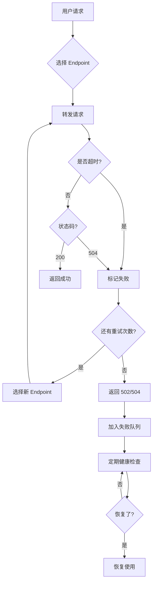

# HTTP 504 错误诊断指南

## 📖 什么是 504 错误？

**HTTP 504 Gateway Timeout** - 网关超时错误

### 错误含义
代理服务器（如 QCC Proxy）在等待上游服务器（如 Claude API endpoint）响应时**超时**了。

### 典型场景
```
用户请求 → QCC Proxy → 上游 API (jp.duckcoding.com)
                ↓              ↓
           等待响应          处理中...
                ↓              ↓
           等待超时！         还没完成
                ↓
         返回 504 给用户
```

## 🔍 QCC 中的超时配置

### 当前超时设置

根据代码分析，QCC 有以下超时配置：

#### 1. **代理请求超时** ([server.py:337-368](../fastcc/proxy/server.py#L337-L368))
```python
ClientTimeout(
    total=300,      # 总超时：5 分钟（300 秒）
    sock_read=60    # 单次读取超时：1 分钟
)
```

#### 2. **健康检查超时** ([conversational_checker.py:36](../fastcc/proxy/conversational_checker.py#L36))
```python
self.timeout = 30  # 30 秒
```

#### 3. **Endpoint 默认超时** ([endpoint.py](../fastcc/core/endpoint.py))
```python
timeout: int = 30  # 默认 30 秒
```

### 超时层次结构

```
┌─────────────────────────────────────────────────────┐
│ 用户请求超时（5 分钟）                               │
│  ┌───────────────────────────────────────────────┐  │
│  │ 上游 API 响应超时（取决于 endpoint 配置）     │  │
│  │                                                │  │
│  │  默认：30 秒                                   │  │
│  │  可配置：endpoint.timeout                     │  │
│  └───────────────────────────────────────────────┘  │
└─────────────────────────────────────────────────────┘
```

## 🚨 504 错误的常见原因

### 1. **上游服务器响应慢**
**特征**：
- AI 模型推理时间长（复杂请求可能需要 30-60 秒）
- 大量并发请求导致服务器排队
- 服务器负载过高

**在 QCC 中的表现**：
```log
[req-123] 请求超时
[req-123] 转发请求失败: TimeoutError
```

**解决方案**：
- ✅ 增加 endpoint 的 `timeout` 配置
- ✅ 使用更快的模型（如 `claude-3-5-haiku`）
- ✅ 减少 `max_tokens` 降低响应时间
- ✅ 启用流式响应（streaming）

### 2. **网络连接问题**
**特征**：
- 跨地域网络延迟高（如访问日本服务器）
- 网络不稳定、丢包
- 防火墙/NAT 限制

**在 QCC 中的表现**：
```log
[req-123] 转发请求失败: ClientConnectorError
[req-123] 响应失败: 502/504
```

**解决方案**：
- ✅ 选择地理位置更近的 endpoint
- ✅ 使用 VPN/代理优化网络路径
- ✅ 配置更长的超时时间
- ✅ 启用自动重试机制（QCC 默认重试 2 次）

### 3. **上游服务器故障**
**特征**：
- 服务器暂时不可用
- 正在维护/重启
- 资源耗尽（内存/CPU）

**在 QCC 中的表现**：
```log
🔍 开始验证失败的 endpoint (N 个)
❌ Endpoint xxx 验证失败: HTTP 504
```

**解决方案**：
- ✅ 启用多 endpoint 负载均衡
- ✅ 配置自动故障转移
- ✅ 使用健康检查机制（QCC 已支持）
- ✅ 查看失败队列状态：`qcc proxy status`

### 4. **超时配置过短**
**特征**：
- 请求实际需要 60 秒，但超时设置为 30 秒
- 大文件上传/下载场景
- 复杂的 AI 推理任务

**在 QCC 中的表现**：
```log
[req-123] Timeout after 30s
```

**解决方案**：
- ✅ 调整 endpoint 的 `timeout` 配置
- ✅ 针对不同场景使用不同配置
- ✅ 监控实际响应时间调整阈值

### 5. **请求队列积压**
**特征**：
- 上游服务器限流（rate limit）
- 大量并发请求超过服务器处理能力
- 排队等待时间过长

**在 QCC 中的表现**：
```log
⚠️ Endpoint xxx 被限流
HTTP 429: Rate limit exceeded
```

**解决方案**：
- ✅ 使用多个 endpoint 分散流量
- ✅ 实现客户端请求限流
- ✅ 监控 endpoint 的 QPS（每秒请求数）
- ✅ 配置合理的权重分配

## 🛠️ 诊断步骤

### 1. 查看 QCC 日志
```bash
# 查看代理日志
cat ~/.qcc/proxy.log

# 实时监控日志
tail -f ~/.qcc/proxy.log
```

**关键信息**：
- `[req-XXX] 请求超时` - 确认是超时问题
- `Endpoint xxx` - 定位是哪个 endpoint
- `耗时: XXXms` - 了解实际响应时间

### 2. 检查 endpoint 健康状态
```bash
# 查看代理状态
qcc proxy status

# 检查失败队列
qcc cluster list test2  # 查看 test2 集群状态
```

**关注点**：
- `失败的 endpoint 数量`
- `健康检查结果`
- `平均响应时间`

### 3. 手动测试 endpoint
```bash
# 使用测试脚本
python test_endpoint.py

# 或使用 curl
curl -X POST https://jp.duckcoding.com/v1/messages \
  -H "x-api-key: YOUR_KEY" \
  -H "Content-Type: application/json" \
  -d '{
    "model": "claude-3-5-haiku-20241022",
    "max_tokens": 10,
    "messages": [{"role": "user", "content": "test"}]
  }' \
  -w "\n总耗时: %{time_total}s\n"
```

**验证**：
- 是否能成功响应？
- 响应时间是多少？
- 是否出现 504/502？

### 4. 网络连接测试
```bash
# 测试网络延迟
ping jp.duckcoding.com

# 测试 TCP 连接
telnet jp.duckcoding.com 443

# 查看路由跳数
tracert jp.duckcoding.com  # Windows
traceroute jp.duckcoding.com  # Linux/Mac
```

**分析**：
- 延迟是否过高（>200ms）？
- 是否有丢包？
- 路由跳数是否过多？

## 🔧 解决方案速查表

| 问题类型 | 症状 | 快速解决方案 |
|---------|------|-------------|
| **上游慢** | 经常超时，但偶尔成功 | 增加 `timeout` 到 60-90 秒 |
| **网络差** | 连接时快时慢 | 更换地理位置更近的 endpoint |
| **服务器挂** | 持续失败，健康检查失败 | 添加备用 endpoint，启用自动故障转移 |
| **限流** | 返回 429 错误 | 使用多个 endpoint 负载均衡 |
| **配置错** | 所有请求都超时 | 检查 `base_url` 和 `api_key` |

## 📊 QCC 超时优化建议

### 针对不同场景的超时配置

#### 1. **快速查询场景**（简单问题、健康检查）
```yaml
endpoint:
  timeout: 30  # 30 秒足够
  model: claude-3-5-haiku-20241022
  max_tokens: 100
```

#### 2. **常规对话场景**（Claude Code 使用）
```yaml
endpoint:
  timeout: 60  # 1 分钟
  model: claude-sonnet-4-5
  max_tokens: 4096
```

#### 3. **复杂推理场景**（长文本、多步骤任务）
```yaml
endpoint:
  timeout: 120  # 2 分钟
  model: claude-sonnet-4-5
  max_tokens: 8192
```

#### 4. **大规模生成场景**（代码生成、长文档）
```yaml
endpoint:
  timeout: 180  # 3 分钟
  model: claude-sonnet-4-5
  max_tokens: 16384
  streaming: true  # 启用流式响应
```

### 配置示例

修改配置文件 `~/.qcc/config.yaml`：

```yaml
test2:
  endpoints:
    - base_url: https://jp.duckcoding.com
      api_key: sk-...
      weight: 100
      priority: 1
      timeout: 90  # ← 增加超时到 90 秒
      max_failures: 3

    # 添加备用 endpoint
    - base_url: https://backup.example.com
      api_key: sk-...
      weight: 50
      priority: 2
      timeout: 90
```

## 🎯 预防 504 错误的最佳实践

### 1. **多 Endpoint 容错**
```yaml
# 配置多个 endpoint，自动故障转移
endpoints:
  - primary_endpoint    # 主节点
  - auxiliary_1         # 辅助节点 1
  - auxiliary_2         # 辅助节点 2
```

✅ **好处**：一个失败自动切换到另一个

### 2. **合理的超时配置**
```python
# 不要一刀切，根据实际需求配置
快速查询：30s
常规对话：60s
复杂任务：90-120s
```

✅ **好处**：既不浪费时间等待，也不过早放弃

### 3. **启用重试机制**
```python
# QCC 默认配置：初始请求 + 2 次重试
max_retries = 2
```

✅ **好处**：临时性故障可以自动恢复

### 4. **监控和告警**
```bash
# 定期检查代理状态
qcc proxy status

# 查看失败队列
qcc cluster list <name>
```

✅ **好处**：及时发现问题，快速响应

### 5. **使用流式响应**
```python
# Claude API 支持 Server-Sent Events (SSE)
stream: true
```

✅ **好处**：
- 更快得到第一个响应
- 降低整体超时风险
- 更好的用户体验

## 📝 常见 504 错误日志示例

### 示例 1：上游超时
```log
[req-456] POST /v1/messages
[req-456] 选中 endpoint: 1e3e69eb (https://jp.duckcoding.com)
[req-456] 请求超时
[req-456] 转发请求失败: TimeoutError
[req-456] 重试 1/2, 选中 endpoint: 2f4g80fc
```

**分析**：上游服务器响应慢，QCC 自动重试到另一个 endpoint

### 示例 2：持续失败
```log
[req-789] POST /v1/messages
[req-789] 选中 endpoint: 1e3e69eb
[req-789] 响应失败: 504
[req-789] 重试 1/2, 选中 endpoint: 1e3e69eb
[req-789] 响应失败: 504
[req-789] 重试 2/2, 选中 endpoint: 1e3e69eb
[req-789] 重试 2 次后仍失败，状态码: 504
🔍 开始验证失败的 endpoint (1 个)
❌ Endpoint 1e3e69eb 验证失败: HTTP 504
```

**分析**：endpoint 持续失败，被加入失败队列等待恢复验证

### 示例 3：网络问题
```log
[req-101] POST /v1/messages
[req-101] 转发请求失败: ClientConnectorError: Cannot connect to host
```

**分析**：网络连接失败，可能是 DNS 解析问题或网络不通

## 🔄 504 错误处理流程



## 📚 相关资源

- [QCC Endpoint 配置文档](../README.md#endpoint-配置)
- [健康检查机制说明](./health_check_explained.md)
- [失败队列工作原理](./failure_queue_design.md)
- [负载均衡策略](./load_balancing_strategies.md)

---

**文档版本**: v1.0
**最后更新**: 2025-10-17
**适用版本**: QCC v0.4.2+
