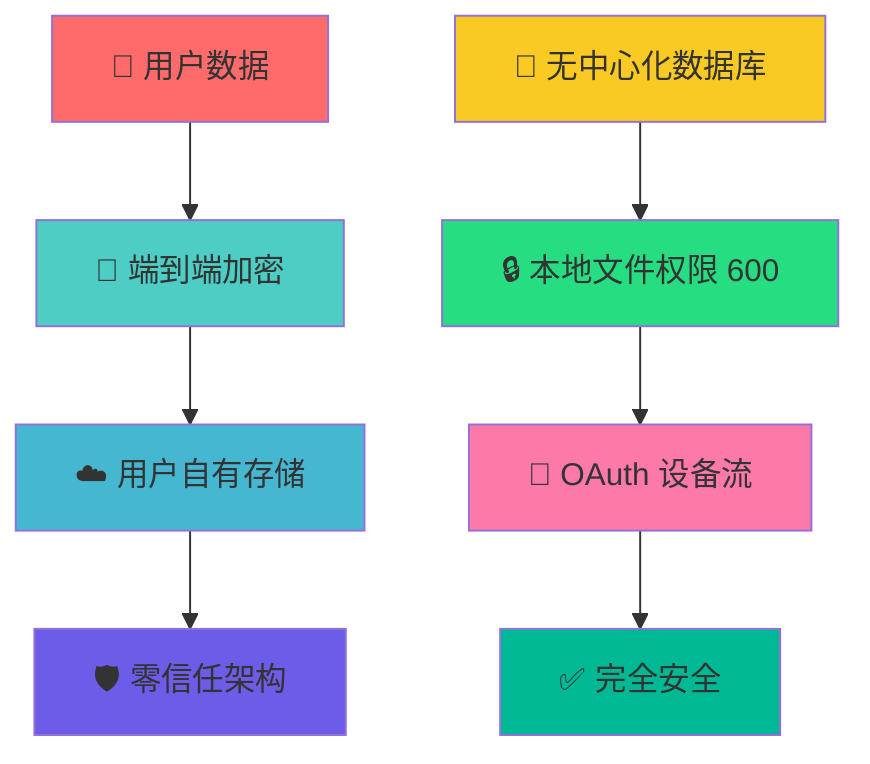

# 🚀 QCC - Quick Claude Config

<div align="center">

[](https://python.org)
[](https://pypi.org/project/qcc/)
[](LICENSE)
[](https://github.com/psf/black)

**🌟 现代化 Claude Code 配置管理神器 🌟**

*零配置启动 • 多端同步 • 安全加密 • 一键部署*

</div>

---

## ✨ 核心特性

<table>
<tr>
<td width="50%">

### 🎯 **智能启动**
- 🚀 零配置体验，3秒智能选择
- 🔄 自动同步，跨设备无缝切换
- 💡 智能默认，记住你的使用习惯

### 🔐 **安全可靠**
- 🛡️ 端到端加密存储
- 🔑 用户自主数据控制
- 🚫 无中心化存储风险
- 🔒 敏感信息保护，无硬编码密钥

### 🌐 **代理服务** (v0.4.0 新增)
- 🔄 本地 HTTP 代理服务器
- 🎯 多 Endpoint 负载均衡
- 🛡️ 三级故障转移机制
- 💚 智能健康检测

</td>
<td width="50%">

### ☁️ **多端同步**
- 📱 GitHub 跨平台同步
- 💾 iCloud/OneDrive/Dropbox 本地云盘
- 🏠 纯本地存储模式

### ⚡ **现代架构**
- 📦 支持 `uvx` 零安装运行
- 🎨 现代 Python 包管理
- 🔧 模块化设计，易于扩展
- 🖥️ Rich 终端UI，跨平台交互体验

### 🔧 **高可用性** (v0.4.0 新增)
- ⚡ 自动故障转移和恢复
- 📊 实时性能监控
- 📋 失败请求队列
- 🔍 详细日志追踪

</td>
</tr>
</table>

---

## 🎮 快速开始

### 🌟 零安装体验（推荐）

```bash
# 🔥 一行命令，立即体验
curl -LsSf https://astral.sh/uv/install.sh | sh && uvx qcc
```

<details>
<summary>💫 首次运行自动完成以下魔法</summary>

1. ⬇️ **自动下载**最新版本
2. 🔧 **智能选择**存储后端（GitHub/云盘/本地）
3. 🔐 **安全认证**（GitHub 设备流，无需本地服务器）
4. ☁️ **创建云存储**，安全加密
5. 🔄 **同步配置**档案
6. 🎯 **智能选择**配置（3秒超时）
7. 🚀 **启动** Claude Code

</details>

### 📦 传统安装

```bash
# 🛠️ 使用 uv（推荐）
uv tool install qcc

# 📎 或使用 pip
pip install qcc
```

---

## 🎪 厂商快速配置

### 🌈 一键配置任意 AI 厂商

```bash
qcc fc  # 🎭 Fast Config - 厂商配置向导
```

<div align="center">


</div>

#### 🎨 支持的厂商（云端实时更新）

- 🏢 **Anthropic 官方** - 原生 Claude API
- 🌟 **Claude Plus** - 第三方增强服务
- 🔄 **更多厂商** - 云端配置实时更新

---

## 🎯 核心命令

<table>
<tr>
<td width="50%">

### 🚀 **快速操作**
```bash
# 本地开发测试
uvx --from . qcc                    # 🌟 智能启动
uvx --from . qcc fc                 # 🎭 厂商快速配置
uvx --from . qcc init               # 🔧 初始化设置
uvx --from . qcc add work           # ➕ 添加配置

# 远程安装使用
uvx qcc                             # 🌟 智能启动
uvx qcc fc                          # 🎭 厂商快速配置
uvx qcc init                        # 🔧 初始化设置
uvx qcc add work                    # ➕ 添加配置
```

</td>
<td width="50%">

### 📋 **管理命令**
```bash
# 本地开发测试
uvx --from . qcc list               # 📜 查看所有配置
uvx --from . qcc use work           # 🎯 使用指定配置
uvx --from . qcc status             # 📊 系统状态
uvx --from . qcc sync               # 🔄 手动同步

# 远程安装使用
uvx qcc list                        # 📜 查看所有配置
uvx qcc use work                    # 🎯 使用指定配置
uvx qcc status                      # 📊 系统状态
uvx qcc sync                        # 🔄 手动同步
```

</td>
</tr>
</table>

### 🛠️ 高级管理

```bash
# 本地开发测试
uvx --from . qcc default work       # ⭐ 设置默认配置
uvx --from . qcc config             # ⚙️  配置管理（更改存储方式）
uvx --from . qcc remove old         # 🗑️  删除配置
uvx --from . qcc uninstall          # 🧹 清理本地数据（保留云端）

# 远程安装使用
uvx qcc default work                # ⭐ 设置默认配置
uvx qcc config                      # ⚙️  配置管理（更改存储方式）
uvx qcc remove old                  # 🗑️  删除配置
uvx qcc uninstall                   # 🧹 清理本地数据（保留云端）
```

### 🖥️ Web UI 管理界面 (v0.5.0 新增)

```bash
# 生产模式（推荐日常使用）
uvx qcc web start                       # 启动 Web UI
uvx qcc web status                      # 查看状态
uvx qcc web stop                        # 停止（自动清理代理和配置）

# 开发模式（推荐代码开发）
uvx qcc web start --dev                 # 前后端热重载
uvx qcc web stop --keep-proxy          # 保持代理运行
uvx qcc web stop --keep-config         # 保持配置不还原
```

**特性：**
- 🎨 现代化 React + TypeScript 界面
- ⚡ 一键启动，自动构建
- 🔥 开发模式支持前后端热重载
- 🧹 停止时自动清理（代理 + 配置）
- 📊 实时监控和管理

### 🌐 代理服务命令 (v0.4.0 新增)

<table>
<tr>
<td width="50%">

#### 🎯 **Endpoint 管理**
```bash
# 本地开发测试
uvx --from . qcc endpoint add <config>      # ➕ 添加 endpoint
uvx --from . qcc endpoint list <config>     # 📜 查看 endpoints
uvx --from . qcc endpoint remove <config> <id>  # 🗑️  删除 endpoint

# 远程安装使用
uvx qcc endpoint add production             # ➕ 添加 endpoint
uvx qcc endpoint list production            # 📜 查看 endpoints
uvx qcc endpoint remove production 1        # 🗑️  删除 endpoint
```

#### 🔄 **优先级管理**
```bash
# 本地开发测试
uvx --from . qcc priority set <config> <level>  # ⚙️  设置优先级
uvx --from . qcc priority list              # 📊 查看优先级
uvx --from . qcc priority switch <config>   # 🔄 手动切换
uvx --from . qcc priority history           # 📖 切换历史

# 远程安装使用
uvx qcc priority set production primary     # ⚙️  设置主配置
uvx qcc priority set backup secondary       # ⚙️  设置次配置
uvx qcc priority list                       # 📊 查看优先级
```

</td>
<td width="50%">

#### 🏥 **健康检测**
```bash
# 本地开发测试
uvx --from . qcc health test                # 🧪 执行健康测试
uvx --from . qcc health status              # 📊 查看健康状态
uvx --from . qcc health metrics             # 📈 查看性能指标

# 远程安装使用
uvx qcc health test -v                      # 🧪 详细测试
uvx qcc health status                       # 📊 健康状态
uvx qcc health metrics                      # 📈 性能指标
```

#### 🚀 **代理服务器**
```bash
# 本地开发测试
uvx --from . qcc proxy start                # ▶️  启动代理
uvx --from . qcc proxy stop                 # ⏹️  停止代理
uvx --from . qcc proxy status               # 📊 查看状态
uvx --from . qcc proxy logs                 # 📋 查看日志

# 远程安装使用
uvx qcc proxy start                         # ▶️  启动代理服务
uvx qcc proxy status                        # 📊 查看代理状态
uvx qcc queue status                        # 📋 查看失败队列
```

</td>
</tr>
</table>

---

## 🏗️ 存储后端

<div align="center">

| 🌐 GitHub | ☁️ 云盘同步 | 🏠 本地存储 |
|-----------|------------|------------|
| 🔄 全平台通用 | 📱 平台特定 | 🔒 完全私有 |
| 🛡️ 设备流认证 | 📁 文件同步 | 💾 本地缓存 |
| 🌍 随处可用 | ⚡ 快速同步 | 🚫 无需网络 |

</div>

### 🌟 GitHub 跨平台
- 🔐 **安全认证**：设备流，无需本地服务器
- 🌍 **全平台**：Windows、macOS、Linux 通用
- 📊 **数据主权**：存储在你的 GitHub 账户

### 📁 智能云盘检测
- 🍎 **macOS**：自动检测 iCloud Drive
- 🪟 **Windows**：自动检测 OneDrive
- 🐧 **Linux**：自动检测 Dropbox

### 🏠 本地模式
- 🔒 **完全私有**：无云端同步
- 📂 **本地存储**：`~/.fastcc/`
- 🚀 **极速启动**：无网络依赖

---

## 🛡️ 安全架构

<div align="center">



</div>

---

## 🏛️ 系统架构

<div align="center">

```
🏗️ QCC 模块化架构
┌─────────────────────────────────────┐
│  🎮 CLI Interface (Click)          │
├─────────────────────────────────────┤
│  🧠 Core Logic                     │
│   ├── 📋 ConfigManager             │
│   ├── 👤 ConfigProfile             │
│   ├── 🎯 PriorityManager (v0.4.0) │
│   └── 🔄 FailoverManager (v0.4.0) │
├─────────────────────────────────────┤
│  🌐 Proxy Services (v0.4.0 新增)   │
│   ├── 🚀 ProxyServer               │
│   ├── ⚖️  LoadBalancer             │
│   ├── 💚 HealthMonitor             │
│   ├── 📋 FailureQueue              │
│   └── 📊 WeightAdjuster            │
├─────────────────────────────────────┤
│  🎭 Providers                      │
│   ├── 🌐 ProvidersManager          │
│   └── 🔗 Browser Integration       │
├─────────────────────────────────────┤
│  💾 Storage Backends               │
│   ├── 🐙 GitHub (OAuth/Simple)     │
│   ├── ☁️  Cloud Files              │
│   └── 🏠 Local Storage             │
├─────────────────────────────────────┤
│  🔐 Security & Utils               │
│   ├── 🔑 Cryptography              │
│   ├── 🔐 OAuth Authentication      │
│   └── 🎨 UI Components             │
└─────────────────────────────────────┘
```

</div>

### 🎯 设计原则

- 🔌 **插件化**：存储后端可扩展
- 🛡️ **安全第一**：端到端加密，用户数据自主
- 🎨 **用户友好**：智能默认，最少交互
- 🚀 **现代化**：支持 uvx，零安装体验

---

## 🔧 开发指南

### 🏗️ 开发环境

```bash
# 🚀 快速搭建开发环境
git clone https://github.com/lghguge520/qcc.git
cd qcc

# 📦 创建虚拟环境（必须使用 virtualenv，命名为 venv）
python -m venv venv
source venv/bin/activate  # Windows: venv\Scripts\activate

# 📥 安装开发依赖
pip install -e ".[dev]"

# 🧪 运行开发版本
python -m fastcc.cli --help
```

### 🧪 测试套件

```bash
# ⚠️ 重要：必须先测试再发布，使用 uvx 进行测试
uvx --from . qcc --help               # 使用 uvx 测试本地包（推荐）

# 🔬 运行单元测试
pytest tests/ -v

# 🎯 单个测试文件
pytest tests/test_providers.py -v     # 厂商配置测试
pytest tests/test_fc_command.py -v    # FC 命令测试
pytest tests/test_simplified_fc.py -v # 简化流程测试
```

### 📦 构建发布

```bash
# ⚠️ 发布前必须完成测试
# 1️⃣ 使用 uvx 测试
uvx --from . qcc --help

# 2️⃣ 构建包
pip install build twine
python -m build

# 3️⃣ 发布到 PyPI
python -m twine upload dist/*
```

---

## 🎨 配置文件

| 📁 文件 | 📍 位置 | 📝 说明 |
|--------|---------|--------|
| 💾 **本地缓存** | `~/.fastcc/cache.json` | 配置档案缓存 |
| 🔑 **GitHub Token** | `~/.fastcc/github_token.json` | 认证令牌 |
| ⚙️ **Claude 设置** | `~/.claude/settings.json` | Claude Code 配置 |

---

## 📋 系统要求

<div align="center">

| 🐍 Python | 📦 依赖 | 🖥️ 平台 |
|-----------|---------|---------|
| **3.7+** | click, requests, cryptography, rich, prompt_toolkit | Windows, macOS, Linux |

</div>

---

## 🤝 贡献指南

<div align="center">

🎉 **欢迎贡献！** 🎉

[🐛 报告问题](../../issues) • [💡 功能建议](../../issues) • [🔀 提交 PR](../../pulls)

</div>

---

## 📄 开源协议

**MIT License** - 自由使用，欢迎贡献！

---

## 📚 详细文档

### 命令参考手册

- **[📖 CLI 命令参考](docs/CLI_REFERENCE.md)** - 所有可用命令的完整参考（基于当前实现）

### v0.5.0 Web UI 文档

想了解更多关于 v0.5.0 Web UI 的详细信息？查看完整文档：

- **[🚀 快速开始](docs/tasks/web-ui/快速开始.md)** - Web UI 安装和使用指南
- **[⚡ 一键启动](docs/tasks/web-ui-one-command-start.md)** - 开发模式和生产模式详解
- **[🧹 自动清理](docs/tasks/web-ui-stop-cleanup.md)** - 停止时的自动清理功能
- **[🔧 开发模式](docs/tasks/web-ui-dev-mode.md)** - 前后端热重载测试文档

**快速参考**:
- [📝 快速参考卡片](WEB_START_QUICK_REFERENCE.md) - 常用命令速查

### v0.4.0 代理服务文档

想了解更多关于 v0.4.0 代理服务的详细信息？查看完整文档：

- **[📖 开发计划](docs/tasks/v0.4.0-代理服务/设计文档/claude-code-proxy-development-plan.md)** - 完整的技术设计和实现方案
- **[✅ 完成报告](docs/tasks/v0.4.0-代理服务/COMPLETION_REPORT.md)** - 开发完成情况和使用指南
- **[📘 使用示例](docs/tasks/v0.4.0-代理服务/用户指南/USAGE_EXAMPLE.md)** - 详细的使用场景和示例
- **[🧪 测试指南](docs/tasks/v0.4.0-代理服务/用户指南/TESTING.md)** - 测试方法和验证步骤

**核心功能文档**:
- [🔄 自动故障转移机制](docs/tasks/v0.4.0-代理服务/设计文档/auto-failover-mechanism.md)
- [🔧 Endpoint 配置复用](docs/tasks/v0.4.0-代理服务/设计文档/endpoint-reuse-implementation.md)
- [💚 智能健康检测](docs/tasks/v0.4.0-代理服务/设计文档/intelligent-health-check.md)

> **注意**: docs/tasks 中的文档描述的是设计规划，部分功能可能与当前实现有差异。请以 [CLI 命令参考](docs/CLI_REFERENCE.md) 为准。

更多文档请查看 [docs/tasks](docs/tasks/) 目录。

---

<div align="center">

### 🌟 如果这个项目对你有帮助，请给个 Star！⭐

**让 AI 配置管理变得简单而优雅** ✨

</div>