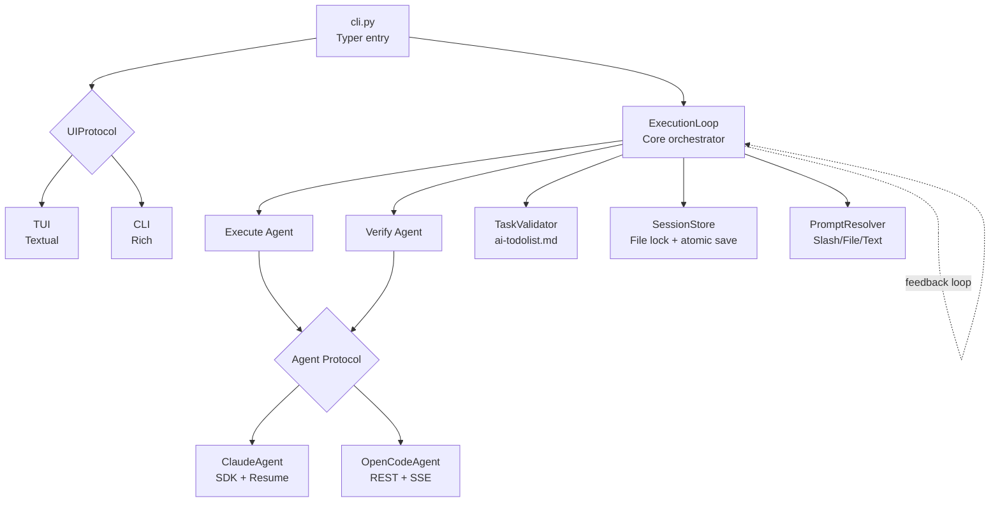
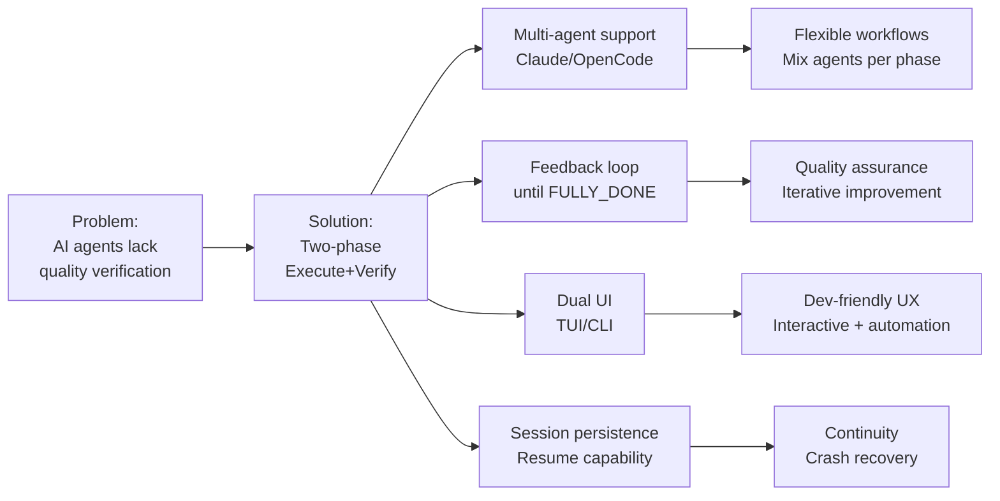

# PROJECT KNOWLEDGE BASE

**Generated:** 2025-10-12 19:28:01 KST
**Commit:** 0852b4f
**Branch:** master
**Repo:** No remote

## TECH STACK

**Language:** Python 3.12
**Async:** anyio 4.11+ → asyncio/trio compatibility
**CLI:** Typer 0.15+
**TUI:** Textual 1.0+ (asyncio only)
**CLI Output:** Rich 13+
**HTTP:** httpx 0.28+ → OpenCode REST API
**Agent SDK:** claude-agent-sdk 0.1+ → Claude official
**File I/O:** aiofiles 24+ → async file operations

**Key Dependencies:**
- trio 0.31+: Alternative async backend (anyio support)
- uvloop 0.21+: High-performance asyncio event loop
- pytest-anyio 0.0.0+: Auto-tests both asyncio/trio backends

**Why anyio?** Abstracts asyncio/trio → single codebase runs both backends, extensive test coverage (461 tests × 2)

## ARCHITECTURE



**Pattern:** Protocol-based (PEP 544) → Agent, UIProtocol decoupled
**Entry:** sisyphus/cli.py → creates agents + UI + ExecutionLoop
**Flow:** Execute → TaskValidator → Verify → Feedback Loop (until FULLY_DONE=TRUE)

**Core Components:**
- ExecutionLoop: 2-phase orchestrator (Execute → Verify), feedback injection, session resume
- Agent Protocol: `initialize()`, `start_session()`, `send()`, `stream()`, `close()`
- UIProtocol: `show_message()`, `show_status()`, `get_input()` (TUI only)
- SessionStore: Atomic writes (tmpfile+rename), file lock, corruption recovery (backup)
- TaskValidator: Checks `is_all_goals_accomplished=TRUE` + all checkboxes `[x]`

**Data Flow:**
1. CLI parses args → factory creates agents (ClaudeAgent, OpenCodeAgent)
2. UI renders messages from ExecutionLoop.stream()
3. ExecutionLoop: Execute phase → TaskValidator checks completion → Verify phase (new session) → Collects feedback
4. Feedback loop: `verify_feedback_history` injected into next Execute prompt as `<architect-feedback-history>`
5. SessionStore persists sessions (`./sessions/sessions.json`) with file lock

**Deviations from Standard:**
- **Verify always new session:** Independent verification, no conversation history from Execute
- **Feedback injection:** XML-tagged history (`<feedback iteration="N">`) appended to Execute extra prompt
- **ai-todolist.md:** External task source, not in-memory; system monitors checkbox completion
- **Unified mode:** Single `run()` method handles interactive agents (Claude/OpenCode)
- **anyio backend split:** TUI forces asyncio (Textual limitation), CLI auto-selects (anyio default)

## DEPENDENCIES

**External Services:**
- Claude API: ClaudeAgent → Anthropic SDK
- OpenCode server: OpenCodeAgent → REST API @ localhost:8080 (auto-start or external)

**Key Integrations:**
- ClaudeAgent: SDK session resume, interactive input via TUI
- OpenCodeAgent: SSE streaming, health check (5 retries × 2s), 60s idle timeout

**Session Storage:**
`./sessions/sessions.json` → `{"claude": {"session_id": "...", "updated": "..."}, ...}`

## PROJECT STRUCTURE

```
sisyphus/
├── sisyphus/               # Main package (not src/)
│   ├── cli.py             # Typer CLI, agent factory
│   ├── agents/            # Agent implementations
│   │   ├── base.py        # Protocol
│   │   ├── claude.py      # ClaudeAgent
│   │   └── opencode.py    # OpenCodeAgent
│   ├── core/              # Business logic
│   │   ├── loop.py        # ExecutionLoop
│   │   ├── prompts.py     # PromptResolver
│   │   ├── session.py     # SessionStore
│   │   └── tasks.py       # TaskValidator
│   ├── ui/                # UI layer
│   │   ├── base.py        # UIProtocol, create_ui()
│   │   ├── tui/           # Textual TUI
│   │   └── cli/           # Rich CLI
│   └── utils/             # Cross-cutting
│       ├── types.py       # AgentMessage, MessageRole
│       ├── logging.py     # LoggerFactory
│       ├── process.py     # ProcessManager
│       └── session_limit.py  # SessionLimitError handling
├── prompts/               # Default prompts
├── logs/                  # Auto-generated logs
└── sessions/              # Session storage
```

**Non-Standard:**
- `sisyphus/` package dir (not `src/sisyphus/`)
- `config/`, `prompts/`, `sessions/` at root level
- Heavy session logging → `logs/{agent}_{timestamp}_UTC.log`

## PRD



**Core Purpose:** Multi-agent orchestration system → Execute task + Verify quality in 2-phase loop

**Key Features:**
- 2 agents: Claude (SDK), OpenCode (REST)
- Execute-Verify phases: Different agents per phase, verify always new session
- Feedback loop: Architect reviews Execute output → feedback injected into next iteration
- Task validation: Monitors ai-todolist.md checkboxes (`- [x]`) + `is_all_goals_accomplished=TRUE`
- Dual UI: TUI (interactive, Textual), CLI (automation, Rich)
- Session management: Resume Execute (conversation history), fresh Verify (independent)
- Prompt system: Slash commands (`/execute`), file paths, plain text, direct input

**Target Users:** Developers needing multi-agent workflows with quality gates

**Unique Aspects:**
- Verify phase always new session (unlike typical chatbots → conversation continuity)
- XML-tagged feedback history (`<architect-feedback-history>`)
- External task source (ai-todolist.md) vs in-memory todos
- anyio abstraction → tests run asyncio + trio automatically (pytest-anyio)
- Protocol-based design → easy to add new agents (implement 5 methods)

## DEVELOPMENT COMMANDS

**Test:**
```bash
# Run all tests (461 tests × 2 backends = 922 assertions)
uv run pytest

# Single file
uv run pytest sisyphus/agents/tests/test_claude.py

# Verbose + stop on first failure
uv run pytest -v -x
```

**Type Check:**
```bash
uv run basedpyright
```

**Lint + Format:**
```bash
uv run ruff check        # Lint
uv run ruff check --fix  # Auto-fix
uv run ruff format       # Format
```

**Run:**
```bash
# Basic (Claude + TUI + default prompts)
uv run sisyphus run

# CLI mode (non-interactive)
uv run sisyphus run --no-tui

# Custom agents
uv run sisyphus run --execute claude:sonnet --verify opencode

# Custom prompts
uv run sisyphus run --execute-prompt prompts/custom.md --verify-prompt /architect
```

## CONVENTIONS

**Predicted Standard Conventions:**
Python 3.12 project → Expect: PEP 8, type hints, pytest, standard async patterns

**Actual Deviations:**
- **ANN001 enforced:** All function parameters MUST have type hints (ruff rule)
- **Protocol > Abstract classes:** Use `typing.Protocol` (PEP 544), not ABC
- **anyio > asyncio:** All async code uses anyio (`anyio.sleep`, `anyio.create_task_group`) for backend portability
- **Agent.stream() pattern:** Async generator, not callback → `async for message in agent.stream()`
- **Given-When-Then tests:** Test structure (not Arrange-Act-Assert), `pytest.mark.anyio` required
- **Session resume logic:** Execute resumes, Verify never resumes (business rule, not technical constraint)
- **Feedback injection:** XML tags required (`<architect-feedback-history>`, `<feedback iteration="N">`), not plain text
- **Task validation:** External file (ai-todolist.md), not in-memory state
- **Double quotes:** ruff enforces `"` over `'` (flake8-quotes)
- **Line length 119:** Not standard 88 (Black) or 120 (common)

**Import rules:**
- No nested imports (always top-level)
- Use `if TYPE_CHECKING:` for circular deps

**Test structure:**
```python
# imports
import pytest

# pytestmark
pytestmark = [pytest.mark.anyio]

# all test functions
async def test_foo__if_bar__returns_baz(): ...

# all fixtures at bottom (NOT mixed)
@pytest.fixture
def my_fixture(): ...
```

## NOTES

**Critical Non-Obvious Information:**

1. **Verify phase session independence:** Business requirement, not bug. Architect must evaluate Execute output without prior conversation context → prevents bias.

2. **TaskValidator optional:** If `ai-todolist.md` missing, Execute runs once, no loop. System assumes single-shot task.

3. **TUI asyncio-only:** Textual limitation, not choice. CLI mode supports trio via anyio auto-detect.

4. **Agent.supports_interactive unused:** Removed in recent refactor (commit 0852b4f). Interactive behavior now implicit (ClaudeAgent/OpenCodeAgent support `get_input()`).

5. **SessionLimitError special handling:** Rate limit → sleep until `reset_time` → retry same phase (not fail). Loop continues transparently.

6. **Prompt resolution order:**
   - Slash command (`/execute`) → reads `prompts/{command}.md`
   - File path → reads file
   - `plain-text` → uses `DEFAULT_EXECUTE_PROMPT` from code
   - Other → treats as direct text

7. **Feedback history grows unbounded:** No truncation. Long iterations may hit token limits. External LLM should warn user if `verify_feedback_history` > 5 iterations.

8. **Session file corruption recovery:** Automatic fallback to `.bak` file. If both corrupted → starts fresh sessions (logs warning, no crash).

9. **OpenCode auto-server:** Starts `opencode serve` subprocess unless `--opencode-server-url` provided. Health check timeout 10s (5 attempts × 2s).

10. **Log files not gitignored:** Many `.log` files in root (see ls output). Consider adding `*.log` to `.gitignore` unless intentional.

**Security:**
- No credential validation for external APIs (Claude, OpenCode)
- Session files world-readable (no encryption)

**Performance:**
- File lock (`anyio.Lock`) on SessionStore → single writer, blocks concurrent saves
- Textual TUI rendering may lag on large message streams (no pagination)
- No message history limits → memory grows unbounded in long sessions
