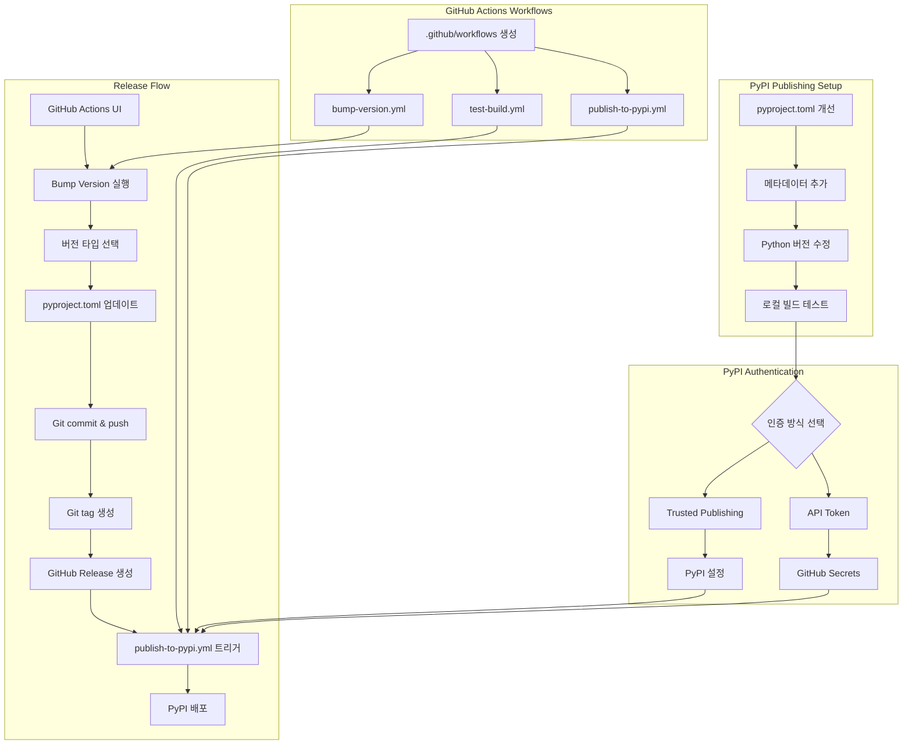
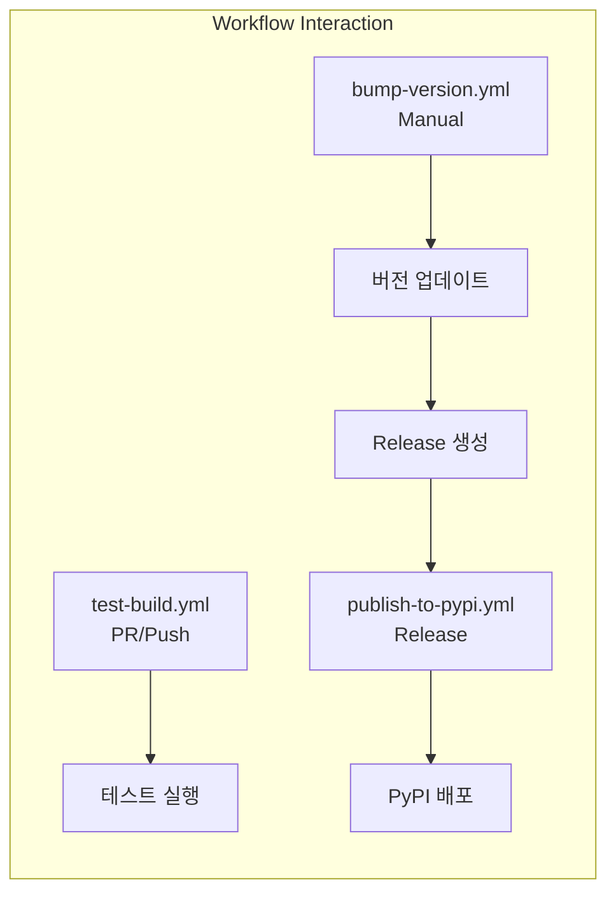

# 사용자의 최초 요청 (기록용)
i wanna upload this project to pip and plus github workflow for it like when i publish release it must released as new.

how can i setup this

## 사용자가 이후에 추가 요청한 내용들 (기록용)
- 버전 bump부터 Release 생성까지 자동화하는 GitHub Action 요청
- 버튼 클릭만으로 전체 릴리즈 프로세스를 실행할 수 있게 해달라는 요청
- 이 모든 내용을 ai-todolist.md 작업 계획서로 만들어달라는 요청
- actionlint를 사용해서 workflow YAML 파일 검증하도록 보강 요청
- 6번 작업(PyPI 계정 생성 및 배포)은 사용자가 직접 해야 하니 그때 요청하라고 적어달라는 요청

# 작업 목표
1. PyPI 배포를 위한 pyproject.toml 메타데이터 개선 (license, classifiers, URLs, keywords 추가)
2. Python 버전 제약 수정 (requires-python을 ">=3.12"로 변경)
3. GitHub Actions workflow 3개 생성:
   - Test Build workflow (PR/Push 시 빌드 테스트)
   - PyPI Publish workflow (Release 시 자동 배포)
   - Bump Version workflow (버전 업데이트 + Release 생성 자동화)
4. PyPI 인증 설정 (Trusted Publishing 또는 API Token)
5. 첫 배포 테스트 및 검증

# 작업 배경
현재 sisyphus 프로젝트는 PyPI 배포를 위한 기본 구조(hatchling 빌드 시스템, entry point)는 갖추고 있지만, 실제 배포에 필요한 메타데이터와 자동화 workflow가 없는 상태입니다.

**현재 상태:**
- ✅ pyproject.toml에 hatchling 빌드 시스템 설정됨
- ✅ Entry point 정의됨: `sisyphus = "sisyphus.cli:app"`
- ✅ GitHub repository 존재: `https://github.com/code-yeongyu/sisyphus.git`
- ❌ PyPI 메타데이터 누락 (license, classifiers, URLs, keywords)
- ❌ Python 버전 제약 불일치 (pyproject.toml: `~=3.12.0` vs README: "3.12 or higher")
- ❌ GitHub Actions workflows 없음 (`.github` 디렉토리 자체가 없음)
- ❌ PyPI 인증 미설정

**문제점:**
1. `requires-python = "~=3.12.0"`: Python 3.13+ 사용자 설치 불가
2. License 정보 없음: PyPI에서 라이선스 표시 안됨
3. Classifiers 없음: PyPI 검색/분류 어려움
4. 수동 배포 프로세스: 실수 가능성, 번거로움

**목표:**
- GitHub에서 버튼 클릭 → 자동으로 버전 업데이트 → Release 생성 → PyPI 배포
- 테스트 자동화로 품질 보증
- 메타데이터 개선으로 PyPI 검색 가능성 향상

# 작업 시작 여부
is_execution_started = TRUE

# 모든 목표 달성 여부
is_all_goals_accomplished = FALSE

# 병렬 실행 여부
parallel_requested = FALSE

# 현재 진행 중인 작업
- [ ] 5. Git push 및 GitHub Repository 설정 확인

# 필요한 사전 지식

## PyPI Publishing 기본 개념
- **PyPI (Python Package Index)**: Python 패키지 저장소
- **Build system**: hatchling (PEP 517/518 호환)
- **Distribution formats**: sdist (소스), wheel (바이너리)
- **Metadata**: pyproject.toml의 [project] 섹션
- **Classifiers**: PyPI 검색/분류 태그
- **Semantic Versioning**: MAJOR.MINOR.PATCH (예: 0.1.0)

## GitHub Actions 기본 개념
- **workflow_dispatch**: 수동 실행 트리거
- **on.release.published**: Release 생성 시 자동 트리거
- **permissions**: workflow가 필요한 권한 (contents: write, id-token: write)
- **secrets**: 민감한 정보 저장 (API tokens)

## PyPI 인증 방식
1. **Trusted Publishing (권장)**: OIDC 기반, 토큰 관리 불필요
2. **API Token**: 전통적 방식, GitHub Secrets에 저장

## 파일 구조 및 역할
### 1. pyproject.toml (프로젝트 루트)
- **역할**: 패키지 메타데이터, 빌드 설정, 의존성 정의
- **현재 상태**: 기본 메타데이터만 있음 (license, classifiers 등 누락)
- **수정 필요 섹션**:
  - `[project]` 섹션 (line 1-23)
  - `requires-python` (line 6): `~=3.12.0` → `>=3.12`
  - 추가 필요: `license`, `keywords`, `classifiers`, `[project.urls]`

### 2. .github/workflows/ (생성 필요)
- **역할**: GitHub Actions workflow 정의
- **현재 상태**: 디렉토리 자체가 없음
- **생성할 파일**:
  - `test-build.yml`: PR/Push 시 빌드 테스트
  - `publish-to-pypi.yml`: Release 시 PyPI 배포
  - `bump-version.yml`: 버전 업데이트 + Release 생성 자동화

### 3. README.md (프로젝트 루트)
- **역할**: 프로젝트 문서
- **현재 상태**: "uv tool install sisyphus" 언급 (PyPI 배포 암시)
- **업데이트 필요**: 설치 방법 섹션 (PyPI 배포 후)

### 4. LICENSE.md (프로젝트 루트)
- **역할**: 라이선스 전문
- **현재 상태**: Sustainable Use License 1.0 (커스텀 라이선스)
- **참고사항**: 상업적 사용 제한, PyPI는 허용하지만 명시 필요

# 작업 계획

## PRDs & Structures





## 구현 세부사항

### 1. pyproject.toml 메타데이터 개선
**파일**: `pyproject.toml`
**현재 상태** (line 1-23):
```toml
[project]
name = "sisyphus"
version = "0.1.0"
description = ""
authors = [{ name = "YeonGyu-Kim", email = "code.yeon.gyu@gmail.com" }]
requires-python = "~=3.12.0"
readme = "README.md"
dependencies = [...]
```

**변경 사항**:
1. `requires-python` 수정: `~=3.12.0` → `>=3.12`
2. `description` 개선: 현재 비어있음 → 의미있는 설명 추가
3. `license` 추가: `{text = "Sustainable Use License 1.0"}`
4. `keywords` 추가: PyPI 검색용
5. `classifiers` 추가: PyPI 분류용
6. `[project.urls]` 섹션 추가: repository, issues 링크

### 2. GitHub Actions Workflows
**디렉토리**: `.github/workflows/` (생성 필요)

#### 2.1 test-build.yml
**목적**: PR/Push 시 빌드 및 테스트 자동화
**트리거**: `pull_request`, `push.branches: [master]`
**주요 단계**:
1. Python 3.12, 3.13 matrix 테스트
2. uv 설치 및 의존성 설치
3. pytest, basedpyright, ruff 실행
4. 패키지 빌드 테스트

#### 2.2 publish-to-pypi.yml
**목적**: Release 시 PyPI 자동 배포
**트리거**: `release.types: [published]`
**주요 단계**:
1. 테스트 전체 실행 (품질 보증)
2. 패키지 빌드 (`uv build`)
3. PyPI 업로드 (Trusted Publishing 또는 API Token)

#### 2.3 bump-version.yml
**목적**: 버전 업데이트 및 Release 생성 자동화
**트리거**: `workflow_dispatch` (수동 실행)
**입력 파라미터**:
- `version_type`: major/minor/patch 선택
- `custom_version`: 직접 버전 지정 (선택)
**주요 단계**:
1. pyproject.toml 버전 읽기 및 bump
2. Git commit & push
3. Git tag 생성
4. Changelog 자동 생성
5. GitHub Release 생성

### 3. PyPI 인증 설정
**두 가지 방법 중 선택**:

#### 방법 A: Trusted Publishing (권장)
1. 최초 수동 배포: `uv publish`
2. PyPI에서 Trusted Publishing 설정
3. 이후 자동 배포

#### 방법 B: API Token
1. PyPI에서 API Token 생성
2. GitHub Secrets에 `PYPI_API_TOKEN` 추가
3. workflow에서 사용

### 4. 버전 관리 전략
**현재**: pyproject.toml에 수동 관리
**개선**: GitHub Actions로 자동화
**프로세스**:
1. Actions 탭에서 "Bump Version and Release" 실행
2. 버전 타입 선택 (major/minor/patch)
3. 자동으로:
   - pyproject.toml 업데이트
   - Git commit, tag, push
   - Release 생성
   - PyPI 배포

## 프로젝트 커밋 메시지 스타일
최근 10개 커밋 분석 결과:
- **형식**: `<action> <target>: <description>` 또는 `<action>: <description>`
- **특징**:
  - Lowercase 시작
  - Imperative mood
  - 간결함 (50자 이내)
- **예시**:
  - `fix: handle newline character from terminal keybinding`
  - `migrate input bar to textarea with multiline support`
  - `update todolist: mark all tasks complete`

**적용할 커밋 메시지**:
- `chore: improve pyproject.toml metadata for pypi`
- `ci: add github actions workflows for pypi publishing`
- `ci: add automated version bump and release workflow`
- `docs: update readme with pypi installation instructions`

# TODOs

- [x] 1. pyproject.toml 메타데이터 개선 및 로컬 빌드 테스트
   - [x] 1.1 구현: pyproject.toml의 [project] 섹션 수정
      - 파일: `pyproject.toml`
      - 현재 코드 (line 1-23):
        ```toml
        [project]
        name = "sisyphus"
        version = "0.1.0"
        description = ""
        authors = [{ name = "YeonGyu-Kim", email = "code.yeon.gyu@gmail.com" }]
        requires-python = "~=3.12.0"
        readme = "README.md"
        dependencies = [...]

        [project.scripts]
        sisyphus = "sisyphus.cli:app"
        test = "pytest:main"
        ```
      - 변경 내용:
        1. `requires-python = ">=3.12"` (line 6)
        2. `description` 개선: `"Natural Language Compiler - Multi-agent orchestration system that turns your words into production-ready code"`
        3. `license = {text = "Sustainable Use License 1.0"}` 추가 (line 7 다음)
        4. `keywords = ["llm", "ai", "agent", "orchestration", "automation", "compiler", "natural-language", "code-generation"]` 추가
        5. `classifiers` 추가:
           ```toml
           classifiers = [
               "Development Status :: 3 - Alpha",
               "Intended Audience :: Developers",
               "Topic :: Software Development :: Build Tools",
               "Topic :: Software Development :: Code Generators",
               "Topic :: Scientific/Engineering :: Artificial Intelligence",
               "Programming Language :: Python :: 3",
               "Programming Language :: Python :: 3.12",
               "Programming Language :: Python :: 3.13",
               "Operating System :: OS Independent",
               "Environment :: Console",
               "Typing :: Typed",
           ]
           ```
        6. `[project.urls]` 섹션 추가 (line 23 다음):
           ```toml
           [project.urls]
           Homepage = "https://github.com/code-yeongyu/sisyphus"
           Repository = "https://github.com/code-yeongyu/sisyphus"
           Issues = "https://github.com/code-yeongyu/sisyphus/issues"
           Documentation = "https://github.com/code-yeongyu/sisyphus#readme"
           ```
   - [x] 1.2 로컬 빌드 테스트
      - 명령어: `uv build`
      - 예상 결과: `dist/` 디렉토리에 `.whl`과 `.tar.gz` 파일 생성
      - 검증: `ls -la dist/`로 파일 확인
   - [x] 1.3 빌드 아티팩트 확인
      - 명령어: `tar tzf dist/sisyphus-*.tar.gz | head -20`
      - 검증: 패키지에 필요한 파일들이 포함되어 있는지 확인
   - [x] 1.4 린트 및 타입 체크
      - [x] `uv run ruff check pyproject.toml` (TOML 문법 오류 확인)
      - [x] `uv run basedpyright` (전체 프로젝트 타입 체크 여전히 통과하는지)
   - [x] 1.5 커밋
      - 명령어: `git add pyproject.toml && git commit -m "chore: improve pyproject.toml metadata for pypi"`
   - [x] 아래의 가이드대로 진행했을 때 Orchestrator 1번 작업 검증 성공 여부
      - [x] pyproject.toml의 `requires-python`이 `>=3.12`로 변경되었는가?
      - [x] `description` 필드가 의미있는 내용으로 채워졌는가?
      - [x] `license`, `keywords`, `classifiers`, `[project.urls]`가 모두 추가되었는가?
      - [x] `uv build` 명령어가 성공적으로 실행되고 dist/ 디렉토리에 파일이 생성되었는가?
      - [x] 생성된 .tar.gz 파일을 열어보았을 때 필요한 파일들이 포함되어 있는가?
      - [x] 커밋이 프로젝트 커밋 메시지 스타일에 맞게 작성되었는가?

- [x] 2. GitHub Actions workflows 생성 - test-build.yml
   - [x] 2.1 구현: .github/workflows 디렉토리 생성
      - 명령어: `mkdir -p .github/workflows`
   - [x] 2.2 구현: test-build.yml 파일 생성
      - 파일: `.github/workflows/test-build.yml`
      - 내용:
        ```yaml
        name: Test Build

        on:
          pull_request:
          push:
            branches: [master]

        jobs:
          test-build:
            runs-on: ubuntu-latest
            strategy:
              matrix:
                python-version: ["3.12", "3.13"]

            steps:
              - uses: actions/checkout@v4

              - name: Set up Python ${{ matrix.python-version }}
                uses: actions/setup-python@v5
                with:
                  python-version: ${{ matrix.python-version }}

              - name: Install uv
                uses: astral-sh/setup-uv@v4
                with:
                  enable-cache: true

              - name: Install dependencies
                run: uv sync

              - name: Run tests
                run: uv run pytest

              - name: Run type checker
                run: uv run basedpyright

              - name: Run linter
                run: uv run ruff check

              - name: Build package
                run: uv build

              - name: Check build artifacts
                run: |
                  ls -la dist/
                  echo "✅ Build successful"
        ```
   - [x] 2.3 YAML 문법 검증
      - 온라인 YAML validator 사용 또는 `python -c "import yaml; yaml.safe_load(open('.github/workflows/test-build.yml'))"`
   - [x] 2.4 actionlint로 workflow 검증
      - actionlint 설치 (없는 경우): `brew install actionlint` (macOS) 또는 `go install github.com/rhysd/actionlint/cmd/actionlint@latest`
      - 명령어: `actionlint .github/workflows/test-build.yml`
      - 검증: 오류가 없는지 확인, 경고는 검토 후 필요시 수정
   - [x] 2.5 커밋
      - 명령어: `git add .github/workflows/test-build.yml && git commit -m "ci: add test build workflow"`
   - [x] 아래의 가이드대로 진행했을 때 Orchestrator 2번 작업 검증 성공 여부
      - [x] `.github/workflows/test-build.yml` 파일이 생성되었는가?
      - [x] YAML 문법이 올바른가?
      - [x] actionlint 검증을 통과했는가? (오류 없음)
      - [x] workflow가 Python 3.12와 3.13 두 버전을 테스트하는가?
      - [x] 테스트, 타입 체크, 린트, 빌드를 모두 포함하는가?
      - [x] 커밋 메시지가 프로젝트 스타일에 맞는가?

- [x] 3. GitHub Actions workflows 생성 - publish-to-pypi.yml (Trusted Publishing 버전)
   - [x] 3.1 구현: publish-to-pypi.yml 파일 생성
      - 파일: `.github/workflows/publish-to-pypi.yml`
      - 내용:
        ```yaml
        name: Publish to PyPI

        on:
          release:
            types: [published]

        permissions:
          id-token: write  # Trusted Publishing을 위한 OIDC 권한
          contents: read

        jobs:
          publish:
            runs-on: ubuntu-latest

            steps:
              - uses: actions/checkout@v4

              - name: Set up Python
                uses: actions/setup-python@v5
                with:
                  python-version: "3.12"

              - name: Install uv
                uses: astral-sh/setup-uv@v4
                with:
                  enable-cache: true

              - name: Install dependencies
                run: uv sync

              - name: Run tests
                run: uv run pytest

              - name: Run type checker
                run: uv run basedpyright

              - name: Run linter
                run: uv run ruff check

              - name: Build package
                run: uv build

              - name: Verify build artifacts
                run: |
                  ls -la dist/
                  echo "Package contents:"
                  tar tzf dist/sisyphus-*.tar.gz | head -20

              - name: Publish to PyPI
                uses: pypa/gh-action-pypi-publish@release/v1
                with:
                  verbose: true
        ```
   - [x] 3.2 YAML 문법 검증
   - [x] 3.3 actionlint로 workflow 검증
      - 명령어: `actionlint .github/workflows/publish-to-pypi.yml`
      - 검증: 오류가 없는지 확인, 경고는 검토 후 필요시 수정
   - [x] 3.4 커밋
      - 명령어: `git add .github/workflows/publish-to-pypi.yml && git commit -m "ci: add pypi publishing workflow with trusted publishing"`
   - [x] 아래의 가이드대로 진행했을 때 Orchestrator 3번 작업 검증 성공 여부
      - [x] `.github/workflows/publish-to-pypi.yml` 파일이 생성되었는가?
      - [x] YAML 문법이 올바른가?
      - [x] actionlint 검증을 통과했는가? (오류 없음)
      - [x] `permissions`에 `id-token: write`가 포함되어 있는가? (Trusted Publishing 필수)
      - [x] Release published 이벤트에 트리거되는가?
      - [x] 배포 전 테스트를 실행하는가?
      - [x] 커밋 메시지가 프로젝트 스타일에 맞는가?

- [x] 4. GitHub Actions workflows 생성 - bump-version.yml (자동화된 버전 관리)
   - [x] 4.1 구현: bump-version.yml 파일 생성
      - 파일: `.github/workflows/bump-version.yml`
      - 내용:
        ```yaml
        name: Bump Version and Release

        on:
          workflow_dispatch:
            inputs:
              version_type:
                description: 'Version bump type'
                required: true
                default: 'patch'
                type: choice
                options:
                  - major
                  - minor
                  - patch
              custom_version:
                description: 'Custom version (leave empty for auto-bump)'
                required: false
                type: string

        permissions:
          contents: write  # Git push 및 Release 생성 권한

        jobs:
          bump-and-release:
            runs-on: ubuntu-latest

            steps:
              - name: Checkout code
                uses: actions/checkout@v4
                with:
                  fetch-depth: 0  # 전체 히스토리 가져오기

              - name: Set up Python
                uses: actions/setup-python@v5
                with:
                  python-version: "3.12"

              - name: Install toml package
                run: pip install toml

              - name: Get current version and bump
                id: version
                run: |
                  # Python 스크립트로 버전 읽기 및 bump
                  python << 'EOF'
                  import toml
                  import sys
                  import os

                  # pyproject.toml 읽기
                  with open('pyproject.toml', 'r') as f:
                      data = toml.load(f)

                  current_version = data['project']['version']
                  print(f"Current version: {current_version}")

                  # 버전 파싱
                  major, minor, patch = map(int, current_version.split('.'))

                  # Custom version이 제공되었는지 확인
                  custom_version = "${{ github.event.inputs.custom_version }}"

                  if custom_version:
                      new_version = custom_version
                      print(f"Using custom version: {new_version}")
                  else:
                      # 버전 bump
                      version_type = "${{ github.event.inputs.version_type }}"
                      if version_type == 'major':
                          major += 1
                          minor = 0
                          patch = 0
                      elif version_type == 'minor':
                          minor += 1
                          patch = 0
                      else:  # patch
                          patch += 1

                      new_version = f"{major}.{minor}.{patch}"
                      print(f"Bumped {version_type} version to: {new_version}")

                  # pyproject.toml 업데이트
                  data['project']['version'] = new_version
                  with open('pyproject.toml', 'w') as f:
                      toml.dump(data, f)

                  # GitHub Actions output 설정
                  with open(os.environ['GITHUB_OUTPUT'], 'a') as f:
                      f.write(f"old_version={current_version}\n")
                      f.write(f"new_version={new_version}\n")
                      f.write(f"tag=v{new_version}\n")
                  EOF

              - name: Configure Git
                run: |
                  git config user.name "github-actions[bot]"
                  git config user.email "github-actions[bot]@users.noreply.github.com"

              - name: Commit version bump
                run: |
                  git add pyproject.toml
                  git commit -m "chore: bump version to ${{ steps.version.outputs.new_version }}"
                  git push origin master

              - name: Create Git tag
                run: |
                  git tag ${{ steps.version.outputs.tag }}
                  git push origin ${{ steps.version.outputs.tag }}

              - name: Generate changelog
                id: changelog
                run: |
                  # 이전 태그부터 현재까지의 커밋 메시지 수집
                  PREVIOUS_TAG=$(git describe --tags --abbrev=0 HEAD^ 2>/dev/null || echo "")

                  if [ -z "$PREVIOUS_TAG" ]; then
                    # 첫 릴리즈인 경우
                    CHANGELOG=$(git log --pretty=format:"- %s (%h)" --no-merges)
                  else
                    # 이전 태그 이후의 커밋들
                    CHANGELOG=$(git log ${PREVIOUS_TAG}..HEAD --pretty=format:"- %s (%h)" --no-merges)
                  fi

                  # Changelog를 파일로 저장 (multiline string 처리)
                  cat > changelog.txt << 'CHANGELOG_EOF'
                  ## What's Changed

                  ${CHANGELOG}

                  **Full Changelog**: https://github.com/${{ github.repository }}/compare/${{ steps.version.outputs.old_version }}...${{ steps.version.outputs.tag }}
                  CHANGELOG_EOF

                  # GitHub output 설정
                  {
                    echo "changelog<<CHANGELOG_DELIMITER"
                    cat changelog.txt
                    echo "CHANGELOG_DELIMITER"
                  } >> $GITHUB_OUTPUT

              - name: Create GitHub Release
                env:
                  GH_TOKEN: ${{ github.token }}
                run: |
                  gh release create ${{ steps.version.outputs.tag }} \
                    --title "Release ${{ steps.version.outputs.tag }}" \
                    --notes "${{ steps.changelog.outputs.changelog }}" \
                    --verify-tag

              - name: Summary
                run: |
                  echo "## 🚀 Release Created Successfully!" >> $GITHUB_STEP_SUMMARY
                  echo "" >> $GITHUB_STEP_SUMMARY
                  echo "- **Old Version:** ${{ steps.version.outputs.old_version }}" >> $GITHUB_STEP_SUMMARY
                  echo "- **New Version:** ${{ steps.version.outputs.new_version }}" >> $GITHUB_STEP_SUMMARY
                  echo "- **Tag:** ${{ steps.version.outputs.tag }}" >> $GITHUB_STEP_SUMMARY
                  echo "" >> $GITHUB_STEP_SUMMARY
                  echo "The \`Publish to PyPI\` workflow will now automatically deploy to PyPI." >> $GITHUB_STEP_SUMMARY
                  echo "" >> $GITHUB_STEP_SUMMARY
                  echo "🔗 [View Release](https://github.com/${{ github.repository }}/releases/tag/${{ steps.version.outputs.tag }})" >> $GITHUB_STEP_SUMMARY
        ```
   - [x] 4.2 YAML 문법 검증
   - [x] 4.3 actionlint로 workflow 검증
      - 명령어: `actionlint .github/workflows/bump-version.yml`
      - 검증: 오류가 없는지 확인, 경고는 검토 후 필요시 수정
   - [x] 4.4 커밋
      - 명령어: `git add .github/workflows/bump-version.yml && git commit -m "ci: add automated version bump and release workflow"`
   - [x] 아래의 가이드대로 진행했을 때 Orchestrator 4번 작업 검증 성공 여부
      - [x] `.github/workflows/bump-version.yml` 파일이 생성되었는가?
      - [x] YAML 문법이 올바른가?
      - [x] actionlint 검증을 통과했는가? (오류 없음)
      - [x] `workflow_dispatch`로 수동 실행 가능한가?
      - [x] `version_type` input이 major/minor/patch 선택을 제공하는가?
      - [x] `custom_version` input이 있는가?
      - [x] pyproject.toml 버전 업데이트 로직이 포함되어 있는가?
      - [x] Git commit, tag 생성, GitHub Release 생성이 모두 포함되어 있는가?
      - [x] 커밋 메시지가 프로젝트 스타일에 맞는가?

- [x] 5. Git push 및 GitHub Repository 설정 확인
   - [x] 5.1 모든 변경사항 push
      - 명령어: `git push origin master`
      - 검증: GitHub repository에서 변경사항 확인
   - [ ] 5.2 GitHub Actions 권한 확인
      - GitHub repository → Settings → Actions → General
      - "Workflow permissions" 확인
      - "Read and write permissions" 활성화 확인 (bump-version.yml이 push/tag 생성 위해 필요)
   - [ ] 5.3 GitHub Actions 탭에서 workflows 확인
      - GitHub repository → Actions 탭
      - 3개 workflow가 표시되는지 확인:
        - Test Build
        - Publish to PyPI
        - Bump Version and Release
   - [ ] 아래의 가이드대로 진행했을 때 Orchestrator 5번 작업 검증 성공 여부
      - [x] 모든 workflow 파일이 GitHub에 push되었는가?
      - [ ] Actions 탭에서 3개 workflow가 모두 보이는가?
      - [ ] Repository Settings에서 Actions 권한이 "Read and write"로 설정되어 있는가?
      - [ ] test-build.yml workflow가 최근 push로 인해 자동 실행되었는가?
      - [ ] test-build workflow가 성공적으로 완료되었는가?

- [ ] 6. **[사용자 작업] PyPI 계정 생성 및 최초 수동 배포** (Trusted Publishing 설정 위함)

   **⚠️ 중요: 이 작업은 AI가 아닌 사용자가 직접 수행해야 합니다!**

   AI는 이 단계에서 멈추고, 사용자에게 다음 작업을 요청해야 합니다:

   ---

   **사용자님께 요청드립니다:**

   5번 작업까지 완료되었습니다. 이제 PyPI 배포를 위한 계정 설정 및 최초 배포가 필요합니다.
   다음 단계를 사용자님이 직접 수행해주셔야 합니다:

   ### 6.1 PyPI 계정 생성 (없는 경우)
   1. https://pypi.org/account/register/ 에서 계정 생성
   2. 이메일 인증 완료

   ### 6.2 TestPyPI에서 먼저 테스트 (권장)
   1. TestPyPI 계정 생성: https://test.pypi.org/account/register/
   2. 로컬에서 실행:
      ```bash
      uv publish --publish-url https://test.pypi.org/legacy/
      ```
   3. 검증: https://test.pypi.org/project/sisyphus/ 접속하여 확인
   4. 테스트 설치:
      ```bash
      pip install --index-url https://test.pypi.org/simple/ sisyphus
      ```

   ### 6.3 프로덕션 PyPI에 최초 배포
   1. 로컬에서 실행:
      ```bash
      uv publish
      ```
   2. PyPI username/password 입력
   3. 검증: https://pypi.org/project/sisyphus/ 접속하여 확인

   ### 6.4 PyPI에서 Trusted Publishing 설정
   1. PyPI project page → "Publishing" 탭 클릭
   2. "Add a new publisher" 클릭
   3. 다음 정보 입력:
      - **PyPI Project Name**: `sisyphus`
      - **Owner**: `code-yeongyu`
      - **Repository name**: `sisyphus`
      - **Workflow name**: `publish-to-pypi.yml`
      - **Environment name**: (비워둠)
   4. "Add" 버튼 클릭하여 저장

   ---

   **위 작업을 완료하신 후**, 다음과 같이 말씀해주세요:
   - "6번 작업 완료했습니다" 또는
   - "PyPI 설정 완료했습니다"

   그러면 7번 작업(전체 릴리즈 프로세스 테스트)을 진행하겠습니다.

   ---

   - [ ] 아래의 가이드대로 진행했을 때 Orchestrator 6번 작업 검증 성공 여부
      - [ ] **AI가 이 단계에서 멈추고 사용자에게 위 메시지를 전달했는가?**
      - [ ] **사용자가 작업 완료를 알릴 때까지 7번 작업을 시작하지 않았는가?**
      - [ ] (사용자 완료 후) PyPI 계정이 생성되고 이메일 인증이 완료되었는지 사용자에게 확인
      - [ ] (사용자 완료 후) TestPyPI에 성공적으로 배포되었는지 확인
      - [ ] (사용자 완료 후) 프로덕션 PyPI에 성공적으로 배포되었는지 확인
      - [ ] (사용자 완료 후) PyPI에서 Trusted Publishing 설정이 완료되었는지 확인

- [ ] 7. 전체 릴리즈 프로세스 테스트 (버전 0.1.1로 테스트)
   - [ ] 7.1 GitHub Actions UI에서 Bump Version workflow 실행
      - GitHub repository → Actions 탭
      - "Bump Version and Release" workflow 선택
      - "Run workflow" 버튼 클릭
      - 입력:
        - Branch: master
        - Version bump type: patch (0.1.0 → 0.1.1)
      - "Run workflow" 버튼 클릭
   - [ ] 7.2 Bump Version workflow 실행 완료 확인
      - Actions 탭에서 실행 상태 모니터링
      - 모든 step이 성공적으로 완료되는지 확인
      - Summary에서 새 버전 확인 (0.1.1)
   - [ ] 7.3 GitHub Release 생성 확인
      - GitHub repository → Releases 탭
      - "v0.1.1" release가 생성되었는지 확인
      - Changelog가 자동 생성되었는지 확인
   - [ ] 7.4 Publish to PyPI workflow 자동 트리거 확인
      - Actions 탭으로 돌아가기
      - "Publish to PyPI" workflow가 자동으로 실행되었는지 확인
      - 모든 step이 성공적으로 완료되는지 확인
   - [ ] 7.5 PyPI 배포 확인
      - PyPI project page 접속: https://pypi.org/project/sisyphus/
      - "Release history"에서 0.1.1 버전 확인
      - 메타데이터 (license, classifiers 등) 제대로 표시되는지 확인
   - [ ] 7.6 실제 설치 테스트
      - 새 터미널에서: `pip install sisyphus==0.1.1`
      - 설치 성공 확인
      - 실행 테스트: `sisyphus --help`
   - [ ] 아래의 가이드대로 진행했을 때 Orchestrator 7번 작업 검증 성공 여부
      - [ ] Bump Version workflow가 성공적으로 완료되었는가?
      - [ ] pyproject.toml의 버전이 0.1.1로 업데이트되었는가?
      - [ ] Git tag v0.1.1이 생성되었는가?
      - [ ] GitHub Release v0.1.1이 생성되었는가?
      - [ ] Publish to PyPI workflow가 자동으로 트리거되었는가?
      - [ ] Publish to PyPI workflow가 성공적으로 완료되었는가?
      - [ ] PyPI에서 0.1.1 버전이 보이는가?
      - [ ] `pip install sisyphus==0.1.1`이 성공하는가?
      - [ ] 설치 후 `sisyphus --help` 명령어가 작동하는가?

- [ ] 8. README.md 업데이트 및 문서화
   - [ ] 8.1 구현: README.md의 Installation 섹션 업데이트
      - 파일: `README.md`
      - 현재 내용 (line 94-108):
        ```markdown
        ### Installation

        Sisyphus requires Python 3.12 or higher. We recommend using the uv package manager.

        ```sh
        # Install uv (if you don't have it)
        curl -LsSf https://astral.sh/uv/install.sh | sh

        # Clone the project
        git clone <repository-url>
        cd sisyphus

        # Install dependencies
        uv sync
        ```
        ```
      - 변경 내용:
        ```markdown
        ### Installation

        #### From PyPI (Recommended)

        Sisyphus requires Python 3.12 or higher.

        ```sh
        # Using pip
        pip install sisyphus

        # Using uv (faster)
        uv tool install sisyphus
        ```

        #### From Source

        ```sh
        # Install uv (if you don't have it)
        curl -LsSf https://astral.sh/uv/install.sh | sh

        # Clone the project
        git clone https://github.com/code-yeongyu/sisyphus.git
        cd sisyphus

        # Install dependencies
        uv sync

        # Run directly in development mode
        uv run sisyphus work
        ```
        ```
   - [ ] 8.2 구현: 릴리즈 프로세스 문서 추가 (CONTRIBUTING.md 또는 README.md)
      - 선택: README.md에 "For Developers" 섹션 추가 또는 CONTRIBUTING.md 생성
      - 내용:
        ```markdown
        ## For Developers

        ### Release Process

        Sisyphus uses automated GitHub Actions for releases.

        1. Go to Actions tab in GitHub repository
        2. Select "Bump Version and Release" workflow
        3. Click "Run workflow"
        4. Choose version type:
           - **patch**: Bug fixes (0.1.0 → 0.1.1)
           - **minor**: New features (0.1.0 → 0.2.0)
           - **major**: Breaking changes (0.1.0 → 1.0.0)
        5. Click "Run workflow" button

        The workflow will:
        - Update version in pyproject.toml
        - Create git commit and tag
        - Create GitHub Release
        - Automatically publish to PyPI

        ### Manual Publishing (if needed)

        ```sh
        # Build package
        uv build

        # Publish to PyPI
        uv publish

        # Publish to TestPyPI (for testing)
        uv publish --publish-url https://test.pypi.org/legacy/
        ```
        ```
   - [ ] 8.3 린트 체크 (Markdown)
      - 명령어: `uv run ruff check README.md` (또는 Markdown linter 사용)
   - [ ] 8.4 커밋
      - 명령어: `git add README.md && git commit -m "docs: update installation instructions and add release process guide"`
   - [ ] 아래의 가이드대로 진행했을 때 Orchestrator 8번 작업 검증 성공 여부
      - [ ] README.md의 Installation 섹션이 PyPI 설치 방법을 포함하는가?
      - [ ] 소스에서 설치하는 방법도 여전히 문서화되어 있는가?
      - [ ] 릴리즈 프로세스가 문서화되어 있는가?
      - [ ] 문서가 명확하고 따라하기 쉬운가?
      - [ ] 커밋 메시지가 프로젝트 스타일에 맞는가?

- [ ] 9. 전체 테스트 및 최종 검증
   - [ ] 9.1 전체 테스트 스위트 실행
      - 명령어: `uv run pytest`
      - 예상 결과: 461 tests × 2 backends = 922 assertions pass
      - 검증: 기존 테스트들이 여전히 통과하는지 확인
   - [ ] 9.2 린트 및 타입 체크
      - [ ] `uv run ruff check`
      - [ ] `uv run basedpyright`
   - [ ] 9.3 로컬 빌드 재확인
      - 명령어: `uv build`
      - 검증: dist/ 디렉토리 정리 후 재빌드
   - [ ] 9.4 GitHub Actions workflows 상태 확인
      - Actions 탭에서 모든 workflow 실행 이력 확인
      - 실패한 workflow가 없는지 확인
   - [ ] 9.5 PyPI project page 최종 확인
      - https://pypi.org/project/sisyphus/ 접속
      - 메타데이터 확인:
        - License 표시
        - Keywords 표시
        - Classifiers 표시
        - Project URLs (Homepage, Repository, Issues) 작동
   - [ ] 9.6 변경사항 push
      - 명령어: `git push origin master`
   - [ ] 아래의 가이드대로 진행했을 때 Orchestrator 9번 작업 검증 성공 여부
      - [ ] 전체 테스트가 통과하는가?
      - [ ] Lint와 type check가 통과하는가?
      - [ ] 로컬 빌드가 성공하는가?
      - [ ] 모든 GitHub Actions workflows가 성공 상태인가?
      - [ ] PyPI project page에서 모든 메타데이터가 올바르게 표시되는가?
      - [ ] Project URLs가 모두 작동하는가?
      - [ ] 최신 변경사항이 GitHub에 push되었는가?

# 최종 작업 검증 체크리스트
- [ ] 1. PyPI에서 `pip install sisyphus` 명령어로 패키지 설치가 가능한가?
   - 검증: 새 Python 환경에서 `pip install sisyphus` 실행 후 `sisyphus --help` 확인
- [ ] 2. PyPI project page에서 모든 메타데이터가 올바르게 표시되는가?
   - 검증: https://pypi.org/project/sisyphus/ 에서 license, classifiers, keywords, URLs 확인
- [ ] 3. GitHub Actions의 Test Build workflow가 PR/Push 시 자동 실행되는가?
   - 검증: 테스트 commit 후 Actions 탭에서 workflow 실행 확인
- [ ] 4. GitHub에서 "Bump Version and Release" workflow를 실행하면 전체 릴리즈 프로세스가 자동으로 완료되는가?
   - 검증: patch 버전 bump 테스트 → Release 생성 → PyPI 배포까지 자동 완료 확인
- [ ] 5. pyproject.toml의 Python 버전 제약이 `>=3.12`로 변경되어 Python 3.13+에서도 설치 가능한가?
   - 검증: Python 3.13 환경에서 설치 테스트 (가능하다면)
- [ ] 6. 기존 테스트들이 여전히 모두 통과하는가?
   - 검증: `uv run pytest` 실행 결과 확인
- [ ] 7. README.md에 PyPI 설치 방법이 문서화되어 있는가?
   - 검증: README.md 파일 읽고 설치 섹션 확인
- [ ] 8. 릴리즈 프로세스가 문서화되어 있는가?
   - 검증: README.md 또는 CONTRIBUTING.md에서 릴리즈 가이드 확인
- [ ] 9. Trusted Publishing이 설정되어 API Token 없이도 배포가 가능한가?
   - 검증: PyPI project settings에서 Trusted Publishing 설정 확인
- [ ] 10. Git commit 메시지들이 프로젝트 컨벤션을 따르는가?
   - 검증: `git log -10 --oneline` 실행 후 commit 메시지 스타일 확인
