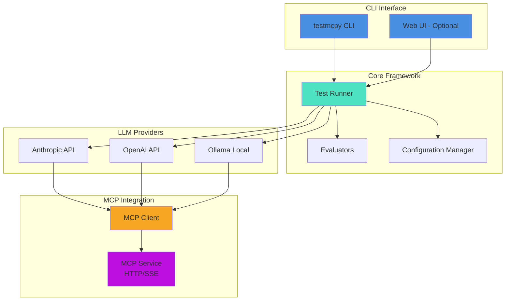

# testmcpy

> A comprehensive testing framework for validating LLM tool-calling capabilities with MCP (Model Context Protocol) services.

[](https://www.python.org/downloads/)
[](LICENSE)
[](https://pypi.org/project/testmcpy/)

Test and evaluate how different LLM models interact with MCP tools. Compare Claude, GPT-4, Llama, and other models' tool-calling accuracy, cost, and performance with any MCP service.

## Features

- **Multi-Provider Support**: Anthropic (Claude), OpenAI (GPT), Ollama (local models)
- **MCP Tool Testing**: Validate LLM interactions with any MCP service
- **Built-in Evaluators**: Test tool calling accuracy, response quality, performance, and cost
- **Beautiful CLI**: Rich terminal UI with progress bars and formatted output
- **Web Interface**: Optional React-based UI for visual testing and exploration
- **Test Suites**: YAML/JSON test definitions with comprehensive evaluation
- **Model Comparison**: Side-by-side benchmarking of different LLMs
- **Cost Tracking**: Monitor token usage and API costs across test runs

## Architecture



## Quick Start

### Installation

```bash
# Install base package
pip install testmcpy

# With web UI support
pip install 'testmcpy[server]'

# All optional features
pip install 'testmcpy[all]'
```

### First-Time Setup

```bash
# Interactive configuration wizard
testmcpy setup

# View current configuration
testmcpy config-cmd
```

### Basic Usage

```bash
# List available MCP tools
testmcpy tools

# Test LLM tool-calling capabilities
testmcpy research --model claude-haiku-4-5

# Run test suite
testmcpy run tests/ --model claude-haiku-4-5

# Interactive chat with MCP tools
testmcpy chat

# Start web UI
testmcpy serve
```

## Configuration

testmcpy uses a layered configuration system with clear priorities:

**Priority Order** (highest to lowest):
1. Command-line options
2. `.env` in current directory
3. `~/.testmcpy` user config
4. Environment variables
5. Built-in defaults

### Example Configuration (`~/.testmcpy`)

```bash
# MCP Service
MCP_URL=http://localhost:5008/mcp/
MCP_AUTH_TOKEN=your_bearer_token

# LLM Provider
DEFAULT_PROVIDER=anthropic
DEFAULT_MODEL=claude-haiku-4-5
ANTHROPIC_API_KEY=sk-ant-...

# Optional: Dynamic JWT for Preset/Superset
# MCP_AUTH_API_URL=https://api.app.preset.io/v1/auth/
# MCP_AUTH_API_TOKEN=your_api_token
# MCP_AUTH_API_SECRET=your_api_secret
```

## Test Cases

Define test cases in YAML:

```yaml
version: "1.0"
name: "Chart Operations Test Suite"

tests:
  - name: "test_create_chart"
    prompt: "Create a bar chart showing sales by region"
    evaluators:
      - name: "was_mcp_tool_called"
        args:
          tool_name: "create_chart"
      - name: "execution_successful"
      - name: "within_time_limit"
        args:
          max_seconds: 30
```

Run with:

```bash
testmcpy run tests/chart_tests.yaml --model claude-haiku-4-5
```

## LLM Providers

### Anthropic (Recommended)

Best tool-calling accuracy, supports HTTP MCP services:

```bash
# Add to ~/.testmcpy
ANTHROPIC_API_KEY=sk-ant-your-key
DEFAULT_PROVIDER=anthropic
DEFAULT_MODEL=claude-haiku-4-5  # Fast & cost-effective
```

**Models**: `claude-haiku-4-5`, `claude-sonnet-4-5`, `claude-opus-4-1`

### Ollama (Free, Local)

For development without API costs:

```bash
# Install and start Ollama
brew install ollama  # or: curl -fsSL https://ollama.com/install.sh | sh
ollama serve
ollama pull llama3.1:8b

# Configure testmcpy
echo "DEFAULT_PROVIDER=ollama" >> ~/.testmcpy
echo "DEFAULT_MODEL=llama3.1:8b" >> ~/.testmcpy
```

### OpenAI

```bash
OPENAI_API_KEY=sk-your-key
DEFAULT_PROVIDER=openai
DEFAULT_MODEL=gpt-4-turbo
```

## Built-in Evaluators

### Generic Evaluators
- `was_mcp_tool_called` - Verify specific MCP tool was invoked
- `execution_successful` - Check for errors or failures
- `final_answer_contains` - Validate response content
- `within_time_limit` - Performance testing
- `token_usage_reasonable` - Cost efficiency validation

### Superset/Preset Evaluators
- `was_superset_chart_created` - Verify chart creation
- `sql_query_valid` - Validate SQL syntax

**Extensible**: Add custom evaluators for your MCP service.

## Commands

| Command | Description |
|---------|-------------|
| `testmcpy setup` | Interactive configuration wizard |
| `testmcpy tools` | List available MCP tools |
| `testmcpy research` | Test LLM tool-calling capabilities |
| `testmcpy run` | Execute test suite |
| `testmcpy chat` | Interactive chat with MCP tools |
| `testmcpy serve` | Start web UI server |
| `testmcpy report` | Compare test results across models |
| `testmcpy config-cmd` | View current configuration |
| `testmcpy doctor` | Diagnose installation issues |
| `testmcpy --version` | Show version |

## Web Interface

The optional web UI provides:
- Visual MCP tool explorer
- Interactive chat interface
- Test management and execution
- Real-time results display

```bash
# Install web UI dependencies
pip install 'testmcpy[server]'

# Start server
testmcpy serve
```

Access at `http://localhost:8000`

## Use Cases

- **LLM Benchmarking**: Compare Claude, GPT-4, Llama tool-calling accuracy
- **MCP Service Testing**: Validate your MCP integrations
- **Cost Optimization**: Find the best price/performance balance
- **Regression Testing**: Ensure MCP tools work across updates
- **Model Selection**: Make data-driven decisions about which LLM to use

## Requirements

- **Python**: 3.9 - 3.12 (3.13+ not yet supported)
- **Virtual Environment**: Recommended
- **Operating Systems**: macOS, Linux, Windows (WSL recommended)

### Optional Dependencies

```bash
pip install 'testmcpy[server]'  # Web UI (FastAPI, uvicorn)
pip install 'testmcpy[sdk]'     # Claude Agent SDK
pip install 'testmcpy[dev]'     # Development tools
pip install 'testmcpy[all]'     # Everything
```

## Project Structure

```
testmcpy/
├── testmcpy/
│   ├── cli.py              # CLI interface
│   ├── config.py           # Configuration management
│   ├── src/                # Core modules
│   │   ├── mcp_client.py   # MCP protocol client
│   │   ├── llm_integration.py  # LLM provider abstraction
│   │   └── test_runner.py  # Test execution engine
│   ├── evals/              # Evaluation functions
│   │   └── base_evaluators.py
│   ├── server/             # Web UI backend (optional)
│   │   ├── api.py
│   │   └── websocket.py
│   └── ui/                 # React web UI (optional)
│       ├── src/
│       └── dist/
├── tests/                  # Test case definitions
├── reports/                # Test results
└── README.md
```

## Development

```bash
# Clone repository
git clone https://github.com/preset-io/testmcpy.git
cd testmcpy

# Create virtual environment
python3 -m venv venv
source venv/bin/activate  # Windows: venv\Scripts\activate

# Install in development mode
pip install -e '.[dev]'

# Run tests
pytest

# Format code
black .

# Type checking
mypy testmcpy
```

## Contributing

We welcome contributions! Please see [CONTRIBUTING.md](CONTRIBUTING.md) for guidelines.

When contributing:
- Use type hints and async/await patterns
- Follow Black code formatting
- Add tests for new features
- Document changes in README
- Ensure multi-provider compatibility

## License

Apache License 2.0 - See [LICENSE](LICENSE) for details.

## Support

- **Issues**: [GitHub Issues](https://github.com/preset-io/testmcpy/issues)
- **Discussions**: [GitHub Discussions](https://github.com/preset-io/testmcpy/discussions)
- **Documentation**: [docs/](docs/)

## Acknowledgments

Built by the team at [Preset](https://preset.io) for testing LLM integrations with Apache Superset and beyond.

---

**Made with ❤️ by Preset**
