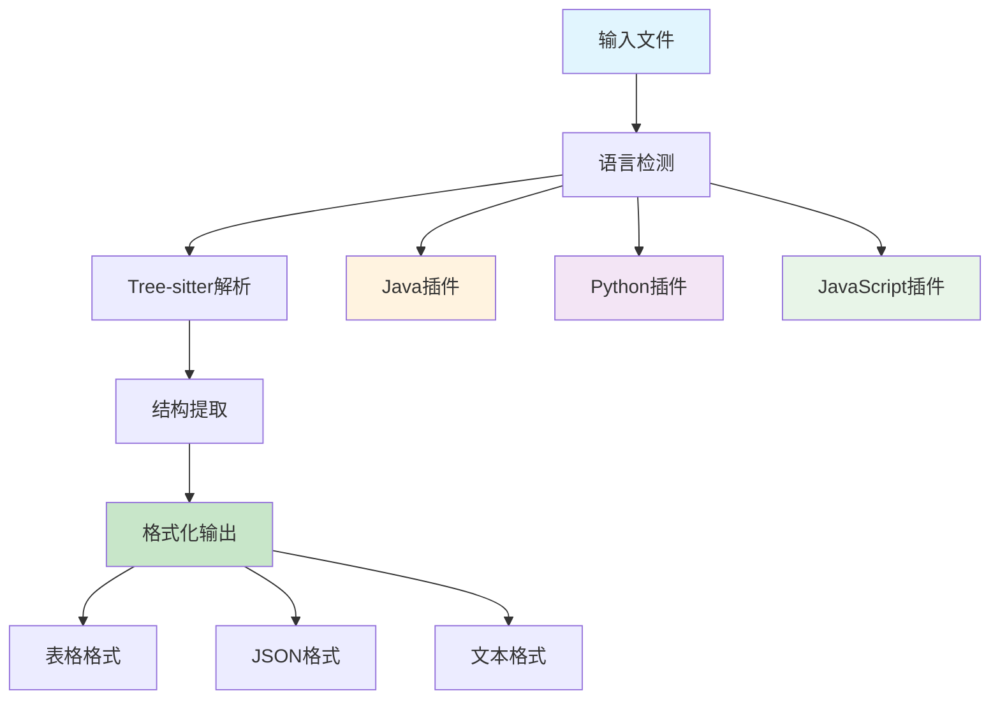

# 🚀 01 零基础快速上手

> **30分钟内从零到一，体验Tree-sitter Analyzer的强大功能**


## 🎯 学习目标

通过本教程，您将：
- ✅ **搭建完整开发环境**（5分钟）
- ✅ **运行第一个分析命令**（10分钟）
- ✅ **理解核心概念**（10分钟）
- ✅ **完成实战练习**（15分钟）
- ✅ **验证学习成果**（10分钟）

## 📋 前置要求

- 💻 **操作系统**：Windows 10+ / macOS 10.15+ / Linux
- 🐍 **Python**：3.10 - 3.12（推荐3.11）
- 🌐 **网络**：稳定的互联网连接
- 💡 **基础知识**：基本的命令行操作

## 🚀 第一步：环境搭建（5分钟）

### 1.1 安装包管理器

**Windows (PowerShell 7)**
```powershell
# 一键安装 uv 包管理器
powershell -c "irm https://astral.sh/uv/install.ps1 | iex"

# 验证安装
uv --version
```

**Linux/macOS**
```bash
# 安装 uv
curl -Ls https://astral.sh/uv/install.sh | sh

# 重新加载环境变量
source ~/.bashrc  # 或 source ~/.zshrc

# 验证安装
uv --version
```

> 💡 **小贴士**：uv是一个现代化的Python包管理器，比pip更快、更可靠。

### 1.2 获取项目代码

```bash
# 克隆项目仓库
git clone https://github.com/aimasteracc/tree-sitter-analyzer.git

# 进入项目目录
cd tree-sitter-analyzer

# 安装项目依赖
uv sync --extra popular --extra mcp
```

> 🎯 **验证点**：运行 `uv run python --version` 确认Python环境正常。

## 🎯 第二步：首次运行（10分钟）

### 2.1 分析示例代码

让我们从一个简单的Java文件开始：

```bash
# 分析示例Java文件
uv run python -m tree_sitter_analyzer examples/BigService.java --table=full --quiet
```

**期望输出示例**：
```
┌─────────────────────────────────────────────────────────────────────────────────┐
│ Tree-sitter Analyzer Results                                                    │
├─────────────────────────────────────────────────────────────────────────────────┤
│ File: examples/BigService.java                                                  │
│ Language: java                                                                  │
│ Summary: 1 class, 5 methods, 3 fields                                          │
├─────────────────────────────────────────────────────────────────────────────────┤
│ Classes:                                                                        │
│ ┌─────────────────┬─────────────┬─────────────┬─────────────────────────────┐   │
│ │ Name            │ Start Line  │ End Line    │ Methods                     │   │
│ ├─────────────────┼─────────────┼─────────────┼─────────────────────────────┤   │
│ │ BigService      │ 1           │ 45          │ 5                           │   │
│ └─────────────────┴─────────────┴─────────────┴─────────────────────────────┘   │
└─────────────────────────────────────────────────────────────────────────────────┘
```

### 2.2 探索不同输出格式

```bash
# JSON格式输出
uv run python -m tree_sitter_analyzer examples/BigService.java --summary

# 文本格式输出
uv run python -m tree_sitter_analyzer examples/BigService.java --advanced --output-format=text

# 提取特定行范围
uv run python -m tree_sitter_analyzer examples/BigService.java --partial-read --start-line 10 --end-line 20
```

## 🧠 第三步：核心概念理解（10分钟）

### 3.1 Tree-sitter是什么？

Tree-sitter是一个增量解析器生成工具和解析库，能够：
- 🔍 **精确解析**：理解代码的语法结构
- ⚡ **增量更新**：只重新解析修改的部分
- 🌍 **多语言支持**：支持多种编程语言
- 🎯 **错误恢复**：即使有语法错误也能继续解析

### 3.2 项目架构概览



### 3.3 关键目录结构

```
tree-sitter-analyzer/
├── tree_sitter_analyzer/
│   ├── cli_main.py          # CLI主入口
│   ├── core/                # 核心引擎
│   ├── languages/           # 语言插件
│   ├── queries/             # 查询库
│   └── mcp/                 # MCP服务
├── examples/                # 示例文件
├── tests/                   # 测试套件
└── training/                # 本教程系列
```

## 🎯 第四步：实战练习（15分钟）

### 练习1：分析Python文件

```bash
# 创建测试文件
echo 'def hello_world():
    print("Hello, World!")

class Calculator:
    def add(self, a, b):
        return a + b' > test_example.py

# 分析Python文件
uv run python -m tree_sitter_analyzer test_example.py --table=full
```

### 练习2：使用高级查询

```bash
# 查找所有方法
uv run python -m tree_sitter_analyzer examples/BigService.java --query-key methods

# 查找特定方法
uv run python -m tree_sitter_analyzer examples/BigService.java --query-key methods --filter "name=main"

# 查找认证相关方法
uv run python -m tree_sitter_analyzer examples/BigService.java --query-key methods --filter "name=~auth*"
```

### 练习3：分析不同的Java文件

```bash
# 分析多个文件
uv run python -m tree_sitter_analyzer examples/Sample.java --table=full
uv run python -m tree_sitter_analyzer examples/BigService.java --table=full

```

## ✅ 第五步：验证学习成果（10分钟）

### 5.1 运行测试套件

```bash
# 运行所有测试
uv run pytest -q

# 运行特定测试
uv run pytest tests/test_cli.py -v
```

### 5.2 质量检查

```bash
# 代码格式检查
uv run black . --check
uv run isort . --check

# 代码质量检查
uv run ruff check .

# 类型检查
uv run mypy tree_sitter_analyzer/
```

### 5.3 自我评估

请回答以下问题来验证您的学习：

- [ ] 我能够成功安装和配置开发环境
- [ ] 我能够运行基本的代码分析命令
- [ ] 我理解了Tree-sitter的基本概念
- [ ] 我能够使用不同的输出格式
- [ ] 我能够运行测试和质量检查

## 🎉 恭喜！您已完成快速上手

### 📊 学习成果

您现在已经掌握了：
- ✅ **环境搭建**：独立配置开发环境
- ✅ **基础操作**：运行代码分析命令
- ✅ **核心概念**：理解Tree-sitter原理
- ✅ **实用技能**：使用CLI工具分析代码

### 🚀 下一步

继续您的学习之旅：

1. **🏗️ [架构深度解析](02_architecture_map.md)** - 深入理解系统架构
2. **⚡ [CLI大师级速查](03_cli_cheatsheet.md)** - 掌握高级命令技巧
3. **🔌 [MCP集成专家](04_mcp_cheatsheet.md)** - 学习AI工具集成

### 💡 小贴士

- 🔄 **定期练习**：每天花10分钟练习不同的命令
- 📚 **查阅文档**：遇到问题时查看 `--help` 选项
- 🤝 **社区支持**：在GitHub上提问或讨论

---

**🎯 准备好进入下一个阶段了吗？**

**👉 继续学习：[02 架构深度解析](02_architecture_map.md)**
