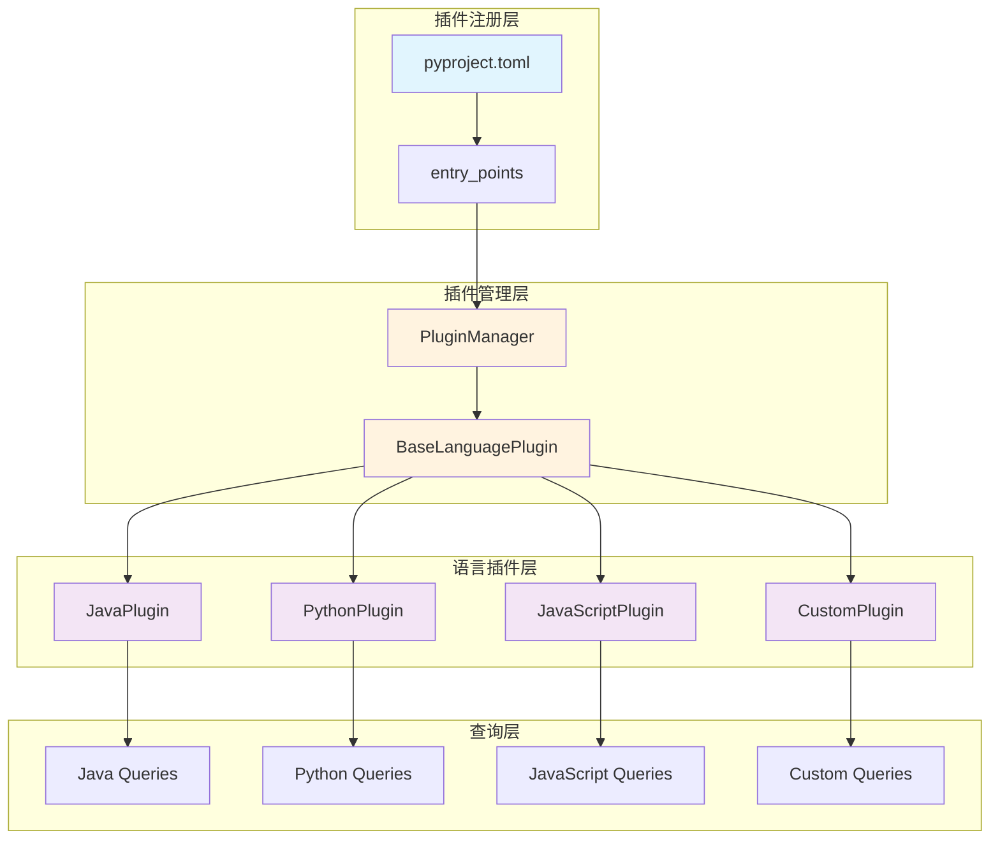
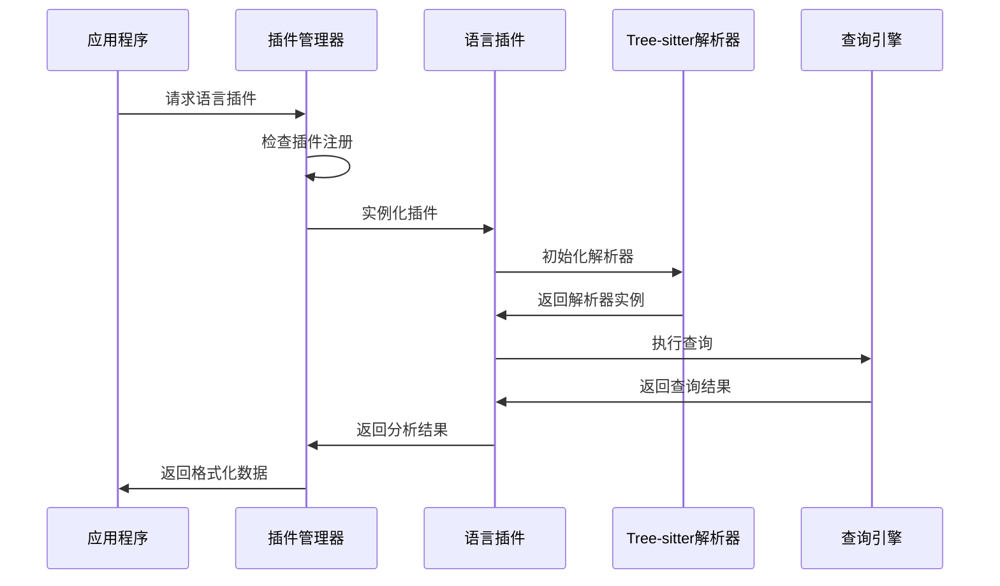

# 🔧 05 插件开发实战

> **从零开始开发Tree-sitter Analyzer插件，支持新的编程语言和自定义功能**


## 🎯 学习目标

通过本教程，您将：
- 🔧 **理解插件架构**：掌握插件系统的工作原理
- 🛠️ **开发语言插件**：为新的编程语言创建解析插件
- 🎯 **实现自定义功能**：添加特定的代码分析功能
- ✅ **通过质量检查**：确保插件符合项目标准
- 🚀 **部署和维护**：将插件集成到主项目中

## 🏗️ 插件系统架构

### 5.1 插件架构概览



### 5.2 插件生命周期



## 🛠️ 实战：创建Rust语言插件

### 6.1 项目准备

```bash
# 1. 确保在项目根目录
cd tree-sitter-analyzer

# 2. 创建插件目录结构
mkdir -p tree_sitter_analyzer/languages
mkdir -p tree_sitter_analyzer/queries

# 3. 安装Rust的Tree-sitter语法
pip install tree-sitter-rust
```

### 6.2 创建Rust插件

创建文件 `tree_sitter_analyzer/languages/rust_plugin.py`：

```python
from typing import Dict, List, Optional
from tree_sitter import Language, Parser, Node
from tree_sitter_analyzer.plugins.base import BaseLanguagePlugin
from tree_sitter_analyzer.models import ClassInfo, MethodInfo, FieldInfo, ImportInfo


class RustPlugin(BaseLanguagePlugin):
    """Rust语言插件"""
    
    key = "rust"
    extensions = [".rs"]
    name = "Rust"
    
    def __init__(self):
        super().__init__()
        self.parser = Parser()
        # 加载Rust语法
        try:
            rust_lang = Language("build/languages.so", "rust")
            self.parser.set_language(rust_lang)
        except Exception as e:
            # 如果编译的语法不存在，尝试使用pip安装的版本
            import tree_sitter_rust
            self.parser.set_language(tree_sitter_rust.language)
    
    def analyze(self, code: str, file_path: str) -> Dict:
        """分析Rust代码"""
        tree = self.parser.parse(code.encode('utf-8'))
        root_node = tree.root_node
        
        return {
            "language": self.key,
            "file_path": file_path,
            "summary": self._extract_summary(root_node),
            "elements": {
                "classes": self._extract_structs(root_node),
                "methods": self._extract_functions(root_node),
                "fields": self._extract_fields(root_node),
                "imports": self._extract_imports(root_node),
            }
        }
    
    def _extract_summary(self, root_node: Node) -> Dict:
        """提取代码摘要"""
        structs = self._extract_structs(root_node)
        functions = self._extract_functions(root_node)
        fields = self._extract_fields(root_node)
        
        return {
            "classes": len(structs),
            "methods": len(functions),
            "fields": len(fields),
            "imports": len(self._extract_imports(root_node)),
            "lines": root_node.end_point[0] + 1
        }
    
    def _extract_structs(self, root_node: Node) -> List[ClassInfo]:
        """提取结构体信息"""
        structs = []
        
        def find_structs(node: Node):
            if node.type == "struct_item":
                name_node = node.child_by_field_name("name")
                if name_node:
                    structs.append(ClassInfo(
                        name=name_node.text.decode('utf-8'),
                        start_line=node.start_point[0],
                        end_line=node.end_point[0],
                        methods=0,  # Rust结构体没有方法，方法在impl块中
                        fields=len([c for c in node.children if c.type == "field_declaration_list"])
                    ))
            
            for child in node.children:
                find_structs(child)
        
        find_structs(root_node)
        return structs
    
    def _extract_functions(self, root_node: Node) -> List[MethodInfo]:
        """提取函数信息"""
        functions = []
        
        def find_functions(node: Node):
            if node.type == "function_item":
                name_node = node.child_by_field_name("name")
                params_node = node.child_by_field_name("parameters")
                
                if name_node:
                    param_count = 0
                    if params_node:
                        param_count = len([c for c in params_node.children if c.type == "parameter"])
                    
                    functions.append(MethodInfo(
                        name=name_node.text.decode('utf-8'),
                        start_line=node.start_point[0],
                        end_line=node.end_point[0],
                        params=param_count,
                        public=self._is_public(node),
                        return_type=self._extract_return_type(node)
                    ))
            
            for child in node.children:
                find_functions(child)
        
        find_functions(root_node)
        return functions
    
    def _extract_fields(self, root_node: Node) -> List[FieldInfo]:
        """提取字段信息"""
        fields = []
        
        def find_fields(node: Node):
            if node.type == "field_declaration_list":
                for child in node.children:
                    if child.type == "field_declaration":
                        name_node = child.child_by_field_name("name")
                        if name_node:
                            fields.append(FieldInfo(
                                name=name_node.text.decode('utf-8'),
                                start_line=child.start_point[0],
                                end_line=child.end_point[0],
                                public=self._is_public(child),
                                field_type=self._extract_field_type(child)
                            ))
            
            for child in node.children:
                find_fields(child)
        
        find_fields(root_node)
        return fields
    
    def _extract_imports(self, root_node: Node) -> List[ImportInfo]:
        """提取导入信息"""
        imports = []
        
        def find_imports(node: Node):
            if node.type == "use_declaration":
                # 简化处理，实际应该解析use语句的完整路径
                imports.append(ImportInfo(
                    module="",  # 需要解析use语句
                    start_line=node.start_point[0],
                    end_line=node.end_point[0]
                ))
            
            for child in node.children:
                find_imports(child)
        
        find_imports(root_node)
        return imports
    
    def _is_public(self, node: Node) -> bool:
        """检查是否为公开成员"""
        for child in node.children:
            if child.type == "visibility_modifier":
                return True
        return False
    
    def _extract_return_type(self, node: Node) -> str:
        """提取返回类型"""
        return_type_node = node.child_by_field_name("return_type")
        if return_type_node:
            return return_type_node.text.decode('utf-8')
        return ""
    
    def _extract_field_type(self, node: Node) -> str:
        """提取字段类型"""
        type_node = node.child_by_field_name("type")
        if type_node:
            return type_node.text.decode('utf-8')
        return ""
```

### 6.3 创建Rust查询文件

创建文件 `tree_sitter_analyzer/queries/rust.py`：

```python
"""Rust语言的Tree-sitter查询"""

RUST_QUERIES = {
    "structs": """
    (struct_item
      name: (type_identifier) @struct.name
      body: (field_declaration_list) @struct.body
    )
    """,
    
    "functions": """
    (function_item
      name: (identifier) @function.name
      parameters: (parameters) @function.params
      body: (block) @function.body
    )
    """,
    
    "fields": """
    (field_declaration_list
      (field_declaration
        name: (field_identifier) @field.name
        type: (type_identifier) @field.type
      )
    )
    """,
    
    "imports": """
    (use_declaration
      (use_clause
        (identifier) @import.name
      )
    )
    """,
    
    "impl_blocks": """
    (impl_item
      type: (type_identifier) @impl.type
      body: (declaration_list) @impl.body
    )
    """,
    
    "traits": """
    (trait_item
      name: (type_identifier) @trait.name
      body: (trait_item_list) @trait.body
    )
    """
}
```

### 6.4 注册插件

在 `pyproject.toml` 中添加插件注册：

```toml
[project.entry-points."tree_sitter_analyzer.plugins"]
rust = "tree_sitter_analyzer.languages.rust_plugin:RustPlugin"
```

### 6.5 创建测试文件

创建 `examples/rust_example.rs`：

```rust
use std::collections::HashMap;

pub struct User {
    pub id: u64,
    pub name: String,
    pub email: String,
}

impl User {
    pub fn new(id: u64, name: String, email: String) -> Self {
        User { id, name, email }
    }
    
    pub fn get_id(&self) -> u64 {
        self.id
    }
    
    pub fn get_name(&self) -> &str {
        &self.name
    }
}

pub trait UserRepository {
    fn find_by_id(&self, id: u64) -> Option<User>;
    fn save(&self, user: User) -> Result<(), String>;
}

pub struct InMemoryUserRepository {
    users: HashMap<u64, User>,
}

impl InMemoryUserRepository {
    pub fn new() -> Self {
        InMemoryUserRepository {
            users: HashMap::new(),
        }
    }
}

impl UserRepository for InMemoryUserRepository {
    fn find_by_id(&self, id: u64) -> Option<User> {
        self.users.get(&id).cloned()
    }
    
    fn save(&self, user: User) -> Result<(), String> {
        // 实现保存逻辑
        Ok(())
    }
}

fn main() {
    let repo = InMemoryUserRepository::new();
    let user = User::new(1, "John Doe".to_string(), "john@example.com".to_string());
    println!("User: {}", user.get_name());
}
```

## 🧪 测试和验证

### 7.1 本地测试

```bash
# 1. 重新安装项目（包含新插件）
uv sync --extra popular --extra mcp

# 2. 创建测试文件
echo 'pub struct User {
    pub name: String,
    pub email: String,
}

impl User {
    pub fn new(name: String, email: String) -> Self {
        User { name, email }
    }
    
    pub fn get_name(&self) -> &str {
        &self.name
    }
}' > examples/rust_example.rs

# 3. 测试Rust插件
uv run python -m tree_sitter_analyzer examples/rust_example.rs --table=full

# 4. 测试不同输出格式
uv run python -m tree_sitter_analyzer examples/rust_example.rs --summary
uv run python -m tree_sitter_analyzer examples/rust_example.rs --structure

# 5. 测试查询功能
uv run python -m tree_sitter_analyzer examples/rust_example.rs --query-key structs
uv run python -m tree_sitter_analyzer examples/rust_example.rs --query-key functions
```

### 7.2 质量检查

```bash
# 1. 代码格式检查
uv run black tree_sitter_analyzer/languages/rust_plugin.py
uv run isort tree_sitter_analyzer/languages/rust_plugin.py

# 2. 代码质量检查
uv run ruff check tree_sitter_analyzer/languages/rust_plugin.py --fix

# 3. 类型检查
uv run mypy tree_sitter_analyzer/languages/rust_plugin.py

# 4. 运行测试
uv run pytest tests/ -k "rust" -v
```

### 7.3 创建测试用例

创建 `tests/test_rust_plugin.py`：

```python
import pytest
from tree_sitter_analyzer.languages.rust_plugin import RustPlugin


class TestRustPlugin:
    @pytest.fixture
    def plugin(self):
        return RustPlugin()
    
    @pytest.fixture
    def sample_code(self):
        return """
        pub struct User {
            pub id: u64,
            pub name: String,
        }
        
        impl User {
            pub fn new(id: u64, name: String) -> Self {
                User { id, name }
            }
        }
        """
    
    def test_plugin_initialization(self, plugin):
        assert plugin.key == "rust"
        assert ".rs" in plugin.extensions
        assert plugin.name == "Rust"
    
    def test_analyze_rust_code(self, plugin, sample_code):
        result = plugin.analyze(sample_code, "test.rs")
        
        assert result["language"] == "rust"
        assert result["file_path"] == "test.rs"
        assert "summary" in result
        assert "elements" in result
    
    def test_extract_structs(self, plugin, sample_code):
        tree = plugin.parser.parse(sample_code.encode('utf-8'))
        structs = plugin._extract_structs(tree.root_node)
        
        assert len(structs) == 1
        assert structs[0].name == "User"
        assert structs[0].fields == 1
    
    def test_extract_functions(self, plugin, sample_code):
        tree = plugin.parser.parse(sample_code.encode('utf-8'))
        functions = plugin._extract_functions(tree.root_node)
        
        assert len(functions) == 1
        assert functions[0].name == "new"
        assert functions[0].params == 2
        assert functions[0].public is True
```

## 🚀 高级插件功能

### 8.1 自定义查询功能

```python
class AdvancedRustPlugin(RustPlugin):
    """增强版Rust插件，支持更多功能"""
    
    def extract_traits(self, root_node: Node) -> List[Dict]:
        """提取trait信息"""
        traits = []
        
        def find_traits(node: Node):
            if node.type == "trait_item":
                name_node = node.child_by_field_name("name")
                if name_node:
                    traits.append({
                        "name": name_node.text.decode('utf-8'),
                        "start_line": node.start_point[0],
                        "end_line": node.end_point[0],
                        "methods": len([c for c in node.children if c.type == "function_item"])
                    })
            
            for child in node.children:
                find_traits(child)
        
        find_traits(root_node)
        return traits
    
    def extract_macros(self, root_node: Node) -> List[Dict]:
        """提取宏定义"""
        macros = []
        
        def find_macros(node: Node):
            if node.type == "macro_definition":
                name_node = node.child_by_field_name("name")
                if name_node:
                    macros.append({
                        "name": name_node.text.decode('utf-8'),
                        "start_line": node.start_point[0],
                        "end_line": node.end_point[0]
                    })
            
            for child in node.children:
                find_macros(child)
        
        find_macros(root_node)
        return macros
```

### 8.2 插件配置系统

```python
class ConfigurableRustPlugin(RustPlugin):
    """可配置的Rust插件"""
    
    def __init__(self, config: Dict = None):
        super().__init__()
        self.config = config or {}
        self.enable_advanced_features = self.config.get("enable_advanced_features", False)
        self.include_tests = self.config.get("include_tests", True)
    
    def analyze(self, code: str, file_path: str) -> Dict:
        result = super().analyze(code, file_path)
        
        if self.enable_advanced_features:
            tree = self.parser.parse(code.encode('utf-8'))
            result["elements"]["traits"] = self.extract_traits(tree.root_node)
            result["elements"]["macros"] = self.extract_macros(tree.root_node)
        
        return result
```

## 🛠️ 故障排除

### 9.1 常见问题

**问题1：Tree-sitter语法加载失败**
```bash
# 解决方案：安装对应的语法包
pip install tree-sitter-rust
# 或者编译语法
git clone https://github.com/tree-sitter/tree-sitter-rust
cd tree-sitter-rust
npm install
npm run build
```

**问题2：插件未被识别**
```bash
# 检查entry_points配置
cat pyproject.toml | grep -A 5 "tree_sitter_analyzer.plugins"

# 重新安装项目
uv sync --extra popular --extra mcp
```

**问题3：查询执行失败**
```python
# 检查查询语法
# 使用tree-sitter playground验证查询
# https://tree-sitter.github.io/tree-sitter/playground
```

### 9.2 调试技巧

```python
# 1. 启用调试模式
import logging
logging.basicConfig(level=logging.DEBUG)

# 2. 检查AST结构
def debug_ast(node, level=0):
    print("  " * level + f"{node.type}: {node.text.decode('utf-8')}")
    for child in node.children:
        debug_ast(child, level + 1)

# 3. 验证查询结果
def test_query(plugin, code, query_key):
    tree = plugin.parser.parse(code.encode('utf-8'))
    results = plugin.execute_query(tree.root_node, query_key)
    print(f"Query '{query_key}' results: {results}")
```

## ✅ 验证学习成果

### 自我评估

- [ ] 我能够创建新的语言插件
- [ ] 我理解插件系统的工作原理
- [ ] 我能够实现自定义的代码分析功能
- [ ] 我能够通过所有质量检查
- [ ] 我能够调试和解决插件问题

### 实战任务

1. **基础任务**：为Go语言创建插件
2. **进阶任务**：为C++创建插件，支持类和模板
3. **高级任务**：创建支持多语言的通用插件框架

## 🚀 下一步

继续您的插件开发之旅：

1. **✅ [质量保证体系](06_quality_workflow.md)** - 掌握完整的开发工作流
2. **🛠️ [故障排除指南](07_troubleshooting.md)** - 学习问题诊断和解决
3. **📋 [实战任务清单](09_tasks.md)** - 完成综合练习

---

**🔧 恭喜！您已经掌握了插件开发的核心技能！**

**👉 继续学习：[06 质量保证体系](06_quality_workflow.md)**


