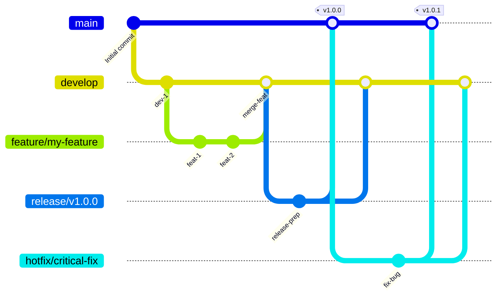

# GitFlow Branch Strategy

This document describes the GitFlow branch strategy implemented for the tree-sitter-analyzer project.

## GitFlow Diagram



## Branch Structure

### Main Branches

- **`main`**: Production-ready code. Always contains the latest stable release.
- **`develop`**: Integration branch for features. Contains the latest delivered development changes.

### Supporting Branches

- **`feature/*`**: Feature development branches. Branch from `develop`, merge back to `develop`.
- **`release/*`**: Release preparation branches. Branch from `develop`, merge to both `main` and `develop`.
- **`hotfix/*`**: Critical bug fixes for production. Branch from `main`, merge to both `main` and `develop`.

## Workflow

### Feature Development

1. **Create feature branch** from `develop`:
   ```bash
   git checkout develop
   git pull origin develop
   git checkout -b feature/your-feature-name
   ```

2. **Develop your feature** with regular commits:
   ```bash
   git add .
   git commit -m "feat: Add new feature"
   ```

3. **Push feature branch** and create pull request:
   ```bash
   git push origin feature/your-feature-name
   ```

4. **Merge to develop** after code review and CI passes.

### Release Process

#### Automated Release (Recommended)

The project now uses an **automated release process** from the `develop` branch:

1. **Develop branch updates** trigger automatic:
   - ✅ Test execution
   - ✅ PyPI deployment
   - ✅ README statistics update
   - ✅ Pull request creation to main

2. **Manual review and merge** of the automated PR to main

3. **GitHub release creation** with proper versioning

#### Manual Release Process

For manual releases:

1. **Create release branch** from `develop`:
   ```bash
   git checkout develop
   git pull origin develop
   git checkout -b release/v1.0.0
   ```

2. **Update version** in `pyproject.toml`:
   ```toml
   version = "1.0.0"
   ```

3. **Update documentation**:
   ```bash
   # Get current test count and coverage statistics:
   # Test count: uv run python -m pytest --collect-only -q | findstr /C:"collected"
   # Coverage: uv run python -m pytest --cov=tree_sitter_analyzer --cov-report=term-missing --cov-report=json -x -q | findstr "TOTAL"

   # Update README.md with new version, test counts, and coverage:
   #   - Version badges ([])
   #   - Test count badges ([])
   #   - Coverage badges ([])
   #   - "Latest Quality Achievements" section version references
   #   - Test environment section version references
   #   - All other version mentions throughout the document
   # Update README_zh.md and README_ja.md translations with same changes
   # Update GITFLOW_zh.md and GITFLOW_ja.md if workflow changes were made
   # Update CHANGELOG.md with release details
   # Update version references throughout all documentation files
   # Note: scripts/improved_readme_updater.py may not exist, do manual updates
   ```

4. **Commit changes**:
   ```bash
   git add .
   git commit -m "chore: Prepare release v1.0.0"
   ```

5. **Merge to main and develop**:
   ```bash
   git checkout main
   git merge release/v1.0.0
   git tag -a v1.0.0 -m "Release v1.0.0"
   git push origin main --tags

   git checkout develop
   git merge release/v1.0.0
   git push origin develop
   ```

6. **Delete release branch**:
   ```bash
   git branch -d release/v1.0.0
   git push origin --delete release/v1.0.0
   ```

### Hotfix Process

1. **Create hotfix branch** from `main`:
   ```bash
   git checkout main
   git pull origin main
   git checkout -b hotfix/critical-bug-fix
   ```

2. **Fix the issue** and commit:
   ```bash
   git add .
   git commit -m "fix: Critical bug fix"
   ```

3. **Update version** for hotfix:
   ```bash
   # Update pyproject.toml version (e.g., 1.0.0 -> 1.0.1)
   # Update server_version in pyproject.toml
   # Sync version to __init__.py
   uv run python scripts/sync_version_minimal.py
   ```

4. **Update documentation**:
   ```bash
   # Get current test count and coverage statistics:
   # Test count: uv run python -m pytest --collect-only -q | findstr /C:"collected"
   # Coverage: uv run python -m pytest --cov=tree_sitter_analyzer --cov-report=term-missing --cov-report=json -x -q | findstr "TOTAL"

   # Update CHANGELOG.md with hotfix details
   # Update README.md with new version, test counts, and coverage:
   #   - Version badges ([])
   #   - Test count badges ([])
   #   - Coverage badges ([])
   #   - "Latest Quality Achievements" section version references
   #   - Test environment section version references
   #   - All other version mentions throughout the document
   # Update README_zh.md and README_ja.md translations with same changes
   # Update GITFLOW_zh.md and GITFLOW_ja.md if workflow changes were made
   # Update version references throughout all documentation files
   ```

5. **Merge to main and develop**:
   ```bash
   git checkout main
   git merge hotfix/critical-bug-fix
   git tag -a v1.0.1 -m "Hotfix v1.0.1"
   git push origin main --tags

   git checkout develop
   git merge hotfix/critical-bug-fix
   git push origin develop
   ```

6. **Delete hotfix branch**:
   ```bash
   git branch -d hotfix/critical-bug-fix
   git push origin --delete hotfix/critical-bug-fix
   ```

## Automation Features

### Develop Branch Automation (`develop-automation.yml`)

When code is pushed to `develop`, the following happens automatically:

1. **Test Job**:
   - Run full test suite with pytest
   - Generate coverage reports
   - Upload coverage to Codecov

2. **Build Job**:
   - Build Python package with `python -m build`
   - Validate package with `twine check`
   - Upload build artifacts (retained for 1 day)

3. **Create Release PR Job**:
   - Automatically create PR from develop to main
   - Include quality metrics and test results
   - Set up for production deployment

**Important**: PyPI deployment is **NOT** triggered by develop branch pushes.

### Release Branch Automation (`release-automation.yml`)

When code is pushed to `release/v*` branches, the following happens automatically:

1. **Test Job**:
   - Run full test suite with pytest
   - Generate coverage reports
   - Upload coverage to Codecov

2. **Build and Deploy Job**:
   - Build Python package
   - Validate package with `twine check`
   - **Deploy to PyPI** using `twine upload`

3. **Create Main PR Job**:
   - Create PR to main branch after successful PyPI deployment
   - Include release details and deployment confirmation

### Hotfix Branch Automation (`hotfix-automation.yml`)

When code is pushed to `hotfix/*` branches, the following happens automatically:

1. **Test Job**:
   - Run full test suite with pytest
   - Generate coverage reports

2. **Build and Deploy Job**:
   - Build Python package
   - Validate package with `twine check`
   - **Deploy to PyPI** using `twine upload`

3. **Create Main PR Job**:
   - Create PR to main branch after successful PyPI deployment
   - Mark as critical hotfix ready for immediate production

### CI Workflow (`ci.yml`)

Runs on all branches (`main`, `develop`, `hotfix/*`, `feature/*`, `release/*`) and PRs:

1. **Quality Check Job**:
   - Multi-Python version testing (3.10, 3.11, 3.12, 3.13)
   - Code quality checks with `check_quality.py`

2. **Test Matrix Job**:
   - Cross-platform testing (Ubuntu, Windows, macOS)
   - Multi-Python version compatibility testing

**PyPI Deployment Strategy**: Only `release/*` and `hotfix/*` branches automatically deploy to PyPI, ensuring controlled and tested releases reach production.

### Main Branch Protection

The `main` branch is protected with:

- ✅ **Required status checks**: All CI jobs must pass
- ✅ **Required pull request reviews**: At least 1 approval required
- ✅ **Branch up-to-date requirement**: Must be up-to-date with base branch
- ✅ **Conversation resolution**: All review comments must be resolved

### Automated Release Script

Use the automated release script for manual releases:

```bash
# Dry run to see what would happen
uv run python scripts/automated_release.py --dry-run

# Execute release with new version
uv run python scripts/automated_release.py --version 1.1.0

# Execute release with current version
uv run python scripts/automated_release.py
```

## Best Practices

### Line Ending Configuration

To prevent mixed line ending errors in pre-commit hooks:

1. **Ensure `.gitattributes` exists** with proper configuration:
   ```
   * text=auto
   *.py text eol=lf
   *.md text eol=lf
   *.yml text eol=lf
   *.toml text eol=lf
   ```

2. **Configure Git locally**:
   ```bash
   git config core.autocrlf input
   ```

3. **Configure your editor** (VS Code example in `.vscode/settings.json`):
   ```json
   {
     "files.eol": "\n",
     "files.insertFinalNewline": true,
     "files.trimTrailingWhitespace": true
   }
   ```

4. **If you encounter mixed line ending errors**:
   ```bash
   # Re-normalize all files
   git rm --cached -r . && git reset --hard HEAD
   git add . && git commit -m "Normalize line endings"
   ```

### Commit Messages

Use conventional commit format:

- `feat:` New features
- `fix:` Bug fixes
- `docs:` Documentation changes
- `style:` Code style changes (formatting, etc.)
- `refactor:` Code refactoring
- `test:` Adding or updating tests
- `chore:` Maintenance tasks

### Branch Naming

- `feature/descriptive-name`: Feature branches
- `release/v1.0.0`: Release branches
- `hotfix/critical-fix`: Hotfix branches

### Quality Checks

Before merging to `develop`:

1. **Run tests locally**:
   ```bash
   uv run pytest tests/ -v
   ```

2. **Check code quality**:
   ```bash
   uv run python check_quality.py --new-code-only
   ```

3. **Update documentation** if needed:
   ```bash
   uv run python scripts/improved_readme_updater.py
   ```

### Version Management

- **Semantic Versioning**: MAJOR.MINOR.PATCH
- **Automatic versioning**: Managed by automated release process
- **Version consistency**: All files updated together

## CI/CD Integration

### GitHub Actions Workflows

1. **`ci.yml`**: Main CI pipeline for all branches
2. **`develop-automation.yml`**: Automated release from develop
3. **`branch-protection.yml`**: Main branch protection setup

### Required Secrets

- `PYPI_API_TOKEN`: For PyPI deployment
- `GITHUB_TOKEN`: For repository operations

## Troubleshooting

### Common Issues

1. **Branch protection errors**: Ensure all required checks pass
2. **PyPI deployment failures**: Check API token and package validity
3. **README update failures**: Verify test statistics are accurate

### Manual Override

For emergency situations, repository administrators can:

1. **Bypass branch protection** (use with caution)
2. **Manual PyPI deployment** if automated process fails
3. **Force push** to main (only in critical situations)

---

**Note**: This GitFlow implementation prioritizes automation and quality assurance while maintaining the flexibility for manual intervention when needed.
