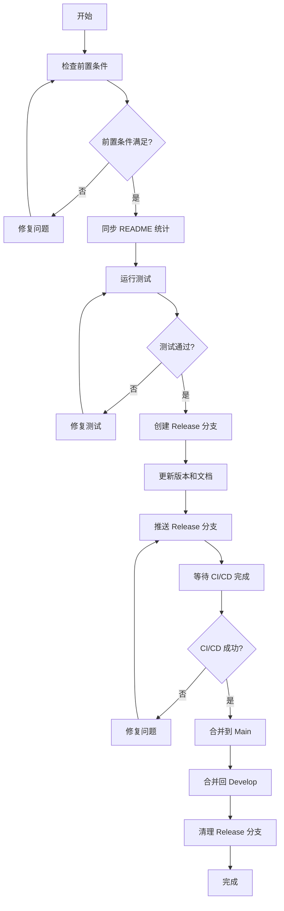

# GitFlow 最佳实践指南

## 🎯 **概述**

本文档详细说明了 `tree-sitter-analyzer` 项目中 GitFlow 分支策略的最佳实践，包括自动化脚本、流程优化和常见问题解决方案。

## 🚀 **优化后的 GitFlow 流程**

### **流程图**



### **阶段详解**

#### **阶段 1: 准备阶段 (Preparation)**

**目标**: 确保所有前置条件满足

**检查项目**:
- ✅ 当前在 `develop` 分支
- ✅ 工作目录干净（无未提交更改）
- ✅ 本地 `develop` 与远程同步
- ✅ 所有测试通过

**执行命令**:
```bash
# 检查当前分支
git branch --show-current

# 检查工作目录状态
git status --porcelain

# 同步远程更改
git fetch origin
git pull origin develop

# 运行测试
uv run pytest tests/ -v
```

#### **阶段 2: README 统计同步**

**目标**: 确保所有 README 文件统计信息一致

**执行步骤**:
1. 运行 README 更新脚本
2. 检查是否有更改
3. 如果有更改，提交并推送

**执行命令**:
```bash
# 运行 README 更新脚本
uv run python scripts/improved_readme_updater.py

# 检查更改
git status

# 提交更改（如果有）
git add README.md README_zh.md README_ja.md
git commit -m "docs: Sync README statistics before release"
git push origin develop
```

#### **阶段 3: Release 分支创建**

**目标**: 创建并准备 release 分支

**执行步骤**:
1. 从 `develop` 创建 release 分支
2. 更新 `pyproject.toml` 中的版本号
3. 更新 `CHANGELOG.md`
4. 提交更改

**执行命令**:
```bash
# 创建 release 分支
git checkout -b release/v1.1.0

# 更新版本号（手动编辑 pyproject.toml）
# version = "1.1.0"

# 更新 CHANGELOG.md（手动添加新版本条目）

# 提交更改
git add pyproject.toml CHANGELOG.md
git commit -m "chore: Prepare release v1.1.0"
```

#### **阶段 4: CI/CD 触发**

**目标**: 推送 release 分支触发自动化流程

**执行步骤**:
1. 推送 release 分支
2. 监控 GitHub Actions 执行状态

**执行命令**:
```bash
# 推送 release 分支
git push origin release/v1.1.0
```

**监控的 CI/CD 任务**:
- `test` - 运行所有测试
- `build-and-deploy` - 构建包并部署到 PyPI
- `create-main-pr` - 创建到 main 分支的 PR

#### **阶段 5: 合并流程**

**目标**: 完成 release 分支到 main 和 develop 的合并

**执行步骤**:
1. 等待 CI/CD 完成
2. 合并到 main 分支
3. 打版本标签
4. 合并回 develop 分支

**执行命令**:
```bash
# 切换到 main 分支
git checkout main
git pull origin main

# 合并 release 分支
git merge release/v1.1.0

# 打标签
git tag -a v1.1.0 -m "Release v1.1.0"

# 推送 main 和标签
git push origin main
git push origin --tags

# 切换到 develop 分支
git checkout develop

# 合并 release 分支
git merge release/v1.1.0

# 推送 develop
git push origin develop
```

#### **阶段 6: 清理**

**目标**: 清理 release 分支

**执行命令**:
```bash
# 删除本地 release 分支
git branch -d release/v1.1.0

# 删除远程 release 分支
git push origin --delete release/v1.1.0
```

## 🛠️ **自动化脚本使用**

### **完整自动化流程**

使用我们创建的自动化脚本可以一键完成整个流程：

```bash
# 运行完整的 GitFlow release 流程
python scripts/gitflow_release_automation.py --version v1.1.0
```

### **脚本功能**

- ✅ 自动检查前置条件
- ✅ 自动同步 README 统计
- ✅ 自动运行测试
- ✅ 自动创建和准备 release 分支
- ✅ 自动推送触发 CI/CD
- ✅ 提供完成后的手动步骤指导

## 🔧 **常见问题解决方案**

### **问题 1: README 统计检查失败**

**症状**: CI 中 "Validate final README content" 失败

**原因**: README 文件中的统计信息与实际项目状态不一致

**解决方案**:
```bash
# 运行 README 更新脚本
uv run python scripts/improved_readme_updater.py

# 检查更改
git status

# 提交更改
git add README.md README_zh.md README_ja.md
git commit -m "docs: Fix README statistics"
git push origin develop
```

### **问题 2: 版本号不一致**

**症状**: README 中显示的版本号与实际版本不符

**解决方案**:
```bash
# 检查当前版本
grep 'version = ' pyproject.toml

# 更新所有 README 文件中的版本号
# 搜索并替换 version-1.0.0 为 version-1.1.0
```

### **问题 3: CI/CD 失败**

**症状**: GitHub Actions 中的某个任务失败

**解决方案**:
1. 查看失败任务的日志
2. 修复问题
3. 重新推送 release 分支

## 📋 **检查清单**

### **Release 前检查**

- [ ] 当前在 `develop` 分支
- [ ] 工作目录干净
- [ ] 本地与远程同步
- [ ] 所有测试通过
- [ ] README 统计信息一致

### **Release 中检查**

- [ ] Release 分支创建成功
- [ ] 版本号更新正确
- [ ] CHANGELOG 更新完整
- [ ] 推送成功
- [ ] CI/CD 开始执行

### **Release 后检查**

- [ ] CI/CD 全部通过
- [ ] PR 创建成功
- [ ] 合并到 main 成功
- [ ] 版本标签创建成功
- [ ] 合并回 develop 成功
- [ ] Release 分支清理完成

## 🎯 **最佳实践总结**

1. **自动化优先**: 使用自动化脚本减少人为错误
2. **分步验证**: 每个阶段完成后都要验证
3. **统计同步**: 确保 README 统计信息始终一致
4. **测试先行**: 在创建 release 分支前确保所有测试通过
5. **监控 CI/CD**: 密切关注自动化流程的执行状态
6. **文档更新**: 及时更新 CHANGELOG 和版本信息
7. **清理及时**: 完成后及时清理临时分支

## 📚 **相关文档**

- [GitFlow 分支策略](GITFLOW.md)
- [CI/CD 配置](../.github/workflows/)
- [README 更新脚本](../scripts/improved_readme_updater.py)
- [GitFlow 辅助脚本](../scripts/gitflow_helper.py)

---

*本文档旨在确保 GitFlow 流程的一致性和可靠性，遵循行业最佳实践。*
