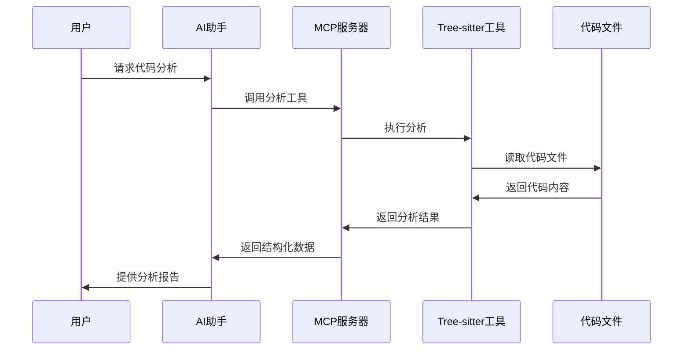

# 🔌 04 MCP 集成专家

> **掌握Model Context Protocol集成，让AI助手直接调用Tree-sitter Analyzer工具**


## 🎯 学习目标

通过本教程，您将：
- 🔌 **理解MCP协议**：掌握Model Context Protocol的核心概念
- ⚙️ **配置MCP服务器**：在不同环境中配置Tree-sitter Analyzer MCP服务
- 🛠️ **使用MCP工具**：熟练使用所有可用的MCP工具
- 🤖 **集成AI助手**：与Claude、Cursor等AI助手无缝集成
- 🚀 **优化工作流**：建立高效的AI辅助代码分析工作流

## 🔍 MCP协议简介

### 什么是MCP？

Model Context Protocol (MCP) 是一个开放协议，允许AI助手与外部工具和服务进行安全、结构化的交互。

### 核心优势

- 🔒 **安全性**：严格的安全边界和权限控制
- 🔄 **实时性**：AI助手可以实时调用外部工具
- 🎯 **精确性**：基于AST的精确代码分析
- 🌍 **通用性**：支持多种AI助手和开发环境

### 工作流程



## ⚙️ MCP服务器配置

### 1. Claude Desktop配置

#### 基础配置

在Claude Desktop的配置文件中添加：

```json
{
  "mcpServers": {
    "tree-sitter-analyzer": {
      "command": "uv",
      "args": [
        "run", "--with", "tree-sitter-analyzer[mcp]",
        "python", "-m", "tree_sitter_analyzer.mcp.server"
      ]
    }
  }
}
```

#### 高级配置（带项目根）

```json
{
  "mcpServers": {
    "tree-sitter-analyzer": {
      "command": "uv",
      "args": [
        "run", "--with", "tree-sitter-analyzer[mcp]",
        "python", "-m", "tree_sitter_analyzer.mcp.server"
      ],
      "env": {
        "TREE_SITTER_PROJECT_ROOT": "C:/path/to/your/project"
      }
    }
  }
}
```

#### 多环境配置

```json
{
  "mcpServers": {
    "tree-sitter-analyzer": {
      "command": "uv",
      "args": [
        "run", "--with", "tree-sitter-analyzer[mcp]",
        "python", "-m", "tree_sitter_analyzer.mcp.server"
      ],
      "env": {
        "TREE_SITTER_PROJECT_ROOT": "C:/path/to/your/project",
        "TREE_SITTER_MAX_FILE_SIZE": "10",
        "TREE_SITTER_DEBUG": "false"
      }
    }
  }
}
```

### 2. Cursor配置

#### 基础配置

在Cursor的设置中添加：

```json
{
  "mcp.servers": {
    "tree-sitter-analyzer": {
      "command": "uv",
      "args": [
        "run", "--with", "tree-sitter-analyzer[mcp]",
        "python", "-m", "tree_sitter_analyzer.mcp.server"
      ]
    }
  }
}
```

#### 工作区配置

在项目根目录创建 `.cursorrules` 文件：

```json
{
  "mcpServers": {
    "tree-sitter-analyzer": {
      "command": "uv",
      "args": [
        "run", "--with", "tree-sitter-analyzer[mcp]",
        "python", "-m", "tree_sitter_analyzer.mcp.server"
      ],
      "env": {
        "TREE_SITTER_PROJECT_ROOT": "."
      }
    }
  }
}
```

### 3. 其他AI助手配置

#### VS Code + GitHub Copilot

```json
{
  "mcp.servers": {
    "tree-sitter-analyzer": {
      "command": "uv",
      "args": [
        "run", "--with", "tree-sitter-analyzer[mcp]",
        "python", "-m", "tree_sitter_analyzer.mcp.server"
      ]
    }
  }
}
```

#### 自定义AI助手

```json
{
  "mcpServers": {
    "tree-sitter-analyzer": {
      "command": "uv",
      "args": [
        "run", "--with", "tree-sitter-analyzer[mcp]",
        "python", "-m", "tree_sitter_analyzer.mcp.server"
      ],
      "env": {
        "TREE_SITTER_PROJECT_ROOT": "/path/to/project",
        "TREE_SITTER_LOG_LEVEL": "INFO"
      }
    }
  }
}
```

## 🛠️ MCP工具详解

### 1. 代码规模分析工具

#### 工具名称：`check_code_scale`

**功能**：分析代码文件的规模和复杂度

**参数**：
- `file_path` (string): 文件路径（相对或绝对）

**使用示例**：

```json
{
  "name": "check_code_scale",
  "arguments": {
    "file_path": "examples/BigService.java"
  }
}
```

**AI提示词示例**：

```
请使用MCP工具check_code_scale分析文件规模
参数: {"file_path": "examples/BigService.java"}
```

**返回结果示例**：

```json
{
  "file_path": "examples/BigService.java",
  "language": "java",
  "lines": 45,
  "classes": 1,
  "methods": 5,
  "fields": 3,
  "complexity": "medium",
  "summary": "这是一个中等复杂度的Java类，包含5个方法和3个字段"
}
```

### 2. 代码结构分析工具

#### 工具名称：`analyze_code_structure`

**功能**：生成详细的代码结构分析

**参数**：
- `file_path` (string): 文件路径
- `analysis_type` (string, 可选): 分析类型（"full", "summary", "detailed"）

**使用示例**：

```json
{
  "name": "analyze_code_structure",
  "arguments": {
    "file_path": "examples/BigService.java",
    "analysis_type": "detailed"
  }
}
```

**AI提示词示例**：

```
请使用MCP工具analyze_code_structure生成详细结构分析
参数: {"file_path": "examples/BigService.java", "analysis_type": "detailed"}
```

**返回结果示例**：

```json
{
  "file_path": "examples/BigService.java",
  "language": "java",
  "structure": {
    "classes": [
      {
        "name": "BigService",
        "start_line": 1,
        "end_line": 45,
        "methods": [
          {
            "name": "main",
            "start_line": 5,
            "end_line": 8,
            "params": 1,
            "public": true
          }
        ],
        "fields": [
          {
            "name": "serviceName",
            "start_line": 3,
            "end_line": 3,
            "type": "String",
            "public": false
          }
        ]
      }
    ]
  }
}
```

### 3. 代码片段提取工具

#### 工具名称：`extract_code_section`

**功能**：提取指定行范围的代码片段

**参数**：
- `file_path` (string): 文件路径
- `start_line` (integer): 起始行号
- `end_line` (integer): 结束行号

**使用示例**：

```json
{
  "name": "extract_code_section",
  "arguments": {
    "file_path": "examples/BigService.java",
    "start_line": 10,
    "end_line": 20
  }
}
```

**AI提示词示例**：

```
请使用MCP工具extract_code_section提取指定代码段
参数: {"file_path": "examples/BigService.java", "start_line": 10, "end_line": 20}
```

**返回结果示例**：

```json
{
  "file_path": "examples/BigService.java",
  "start_line": 10,
  "end_line": 20,
  "content": "    public void processData(String data) {\n        if (data != null) {\n            // 处理数据\n            System.out.println(\"Processing: \" + data);\n        }\n    }",
  "language": "java"
}
```

### 4. 高级查询工具

#### 工具名称：`query_code_elements`

**功能**：执行高级代码查询和过滤

**参数**：
- `file_path` (string): 文件路径
- `query_key` (string): 查询键（"methods", "classes", "fields", "imports"）
- `filter` (string, 可选): 过滤条件

**使用示例**：

```json
{
  "name": "query_code_elements",
  "arguments": {
    "file_path": "examples/BigService.java",
    "query_key": "methods",
    "filter": "name=~get*,public=true"
  }
}
```

**AI提示词示例**：

```
请使用MCP工具query_code_elements查询公开的getter方法
参数: {"file_path": "examples/BigService.java", "query_key": "methods", "filter": "name=~get*,public=true"}
```

## 🚀 高级集成技巧

### 1. 工作流优化

#### 三步分析流程


**推荐工作流**：

1. **规模分析**：了解代码整体规模
2. **结构分析**：理解代码组织结构
3. **片段提取**：获取具体实现细节
4. **AI总结**：生成分析报告

#### 示例提示词

```
请帮我分析这个Java文件：
1. 首先使用check_code_scale分析文件规模
2. 然后使用analyze_code_structure生成详细结构
3. 最后提取main方法的代码片段
4. 基于以上信息，总结这个类的设计模式和潜在改进点

文件路径: examples/BigService.java
```

### 2. 批量分析

#### 多文件分析

```
请分析项目中的所有Java文件：
1. 使用check_code_scale分析每个文件的规模
2. 使用analyze_code_structure分析每个文件的结构
3. 生成项目整体的代码质量报告

文件列表: examples/*.java
```

#### 项目概览

```
请生成项目概览：
1. 分析所有主要源文件
2. 统计项目规模指标
3. 识别代码模式
4. 提出架构建议

项目路径: .
```

### 3. 代码审查

#### 自动化代码审查

```
请对这个代码文件进行审查：
1. 分析代码结构和复杂度
2. 检查潜在的设计问题
3. 提取关键方法进行详细分析
4. 提供改进建议

文件: examples/BigService.java
```

#### 重构建议

```
请分析这个类的重构机会：
1. 分析当前结构
2. 识别重构候选
3. 提取相关代码片段
4. 提供重构方案

文件: examples/BigService.java
```

## 🛡️ 安全配置

### 1. 项目根设置

```json
{
  "mcpServers": {
    "tree-sitter-analyzer": {
      "command": "uv",
      "args": [
        "run", "--with", "tree-sitter-analyzer[mcp]",
        "python", "-m", "tree_sitter_analyzer.mcp.server"
      ],
      "env": {
        "TREE_SITTER_PROJECT_ROOT": "/safe/project/path"
      }
    }
  }
}
```

### 2. 文件大小限制

```json
{
  "env": {
    "TREE_SITTER_MAX_FILE_SIZE": "10",
    "TREE_SITTER_SKIP_LARGE_FILES": "true"
  }
}
```

### 3. 调试模式

```json
{
  "env": {
    "TREE_SITTER_DEBUG": "true",
    "TREE_SITTER_LOG_LEVEL": "DEBUG"
  }
}
```

## 🔧 故障排除

### 1. 常见问题

#### 问题：MCP服务器启动失败

**症状**：AI助手无法连接到MCP服务器

**解决方案**：
```bash
# 1. 检查uv安装
uv --version

# 2. 检查依赖安装
uv sync --extra mcp

# 3. 手动测试MCP服务器
uv run python -m tree_sitter_analyzer.mcp.server
```

#### 问题：工具调用失败

**症状**：工具返回错误或超时

**解决方案**：
```bash
# 1. 检查文件路径
ls -la examples/BigService.java

# 2. 检查项目根设置
echo $TREE_SITTER_PROJECT_ROOT

# 3. 启用调试模式
export TREE_SITTER_DEBUG=true
```

#### 问题：权限错误

**症状**：无法访问文件或目录

**解决方案**：
```bash
# 1. 检查文件权限
ls -la examples/

# 2. 设置正确的项目根
export TREE_SITTER_PROJECT_ROOT=$(pwd)

# 3. 检查安全边界
python -c "from tree_sitter_analyzer.security.validator import validate_path; print(validate_path('examples/BigService.java'))"
```

### 2. 调试技巧

#### 启用详细日志

```json
{
  "env": {
    "TREE_SITTER_DEBUG": "true",
    "TREE_SITTER_LOG_LEVEL": "DEBUG",
    "TREE_SITTER_LOG_FILE": "/tmp/tree-sitter.log"
  }
}
```

#### 手动测试工具

```bash
# 测试规模分析
uv run python -m tree_sitter_analyzer examples/BigService.java --summary

# 测试结构分析
uv run python -m tree_sitter_analyzer examples/BigService.java --structure

# 测试片段提取
uv run python -m tree_sitter_analyzer examples/BigService.java --partial-read --start-line 10 --end-line 20
```

## 📊 性能优化

### 1. 缓存配置

```json
{
  "env": {
    "TREE_SITTER_USE_CACHE": "true",
    "TREE_SITTER_CACHE_DIR": "/tmp/tree-sitter-cache"
  }
}
```

### 2. 并发控制

```json
{
  "env": {
    "TREE_SITTER_MAX_WORKERS": "4",
    "TREE_SITTER_TIMEOUT": "30"
  }
}
```

### 3. 内存管理

```json
{
  "env": {
    "TREE_SITTER_MAX_MEMORY": "512",
    "TREE_SITTER_GC_THRESHOLD": "100"
  }
}
```

## ✅ 验证学习成果

### 自我评估

- [ ] 我能够配置MCP服务器
- [ ] 我理解所有MCP工具的功能
- [ ] 我能够编写有效的AI提示词
- [ ] 我能够解决常见的配置问题
- [ ] 我能够优化MCP工作流

### 实战练习

1. **基础配置**：在Claude Desktop中配置MCP服务器
2. **工具测试**：测试所有MCP工具的功能
3. **工作流练习**：建立三步分析工作流
4. **批量分析**：分析整个项目的代码
5. **故障排除**：解决配置和运行问题

## 🚀 下一步

继续您的MCP集成学习之旅：

1. **🔧 [插件开发实战](05_plugin_tutorial.md)** - 开发自定义插件
2. **✅ [质量保证体系](06_quality_workflow.md)** - 掌握开发工作流
3. **🛠️ [故障排除指南](07_troubleshooting.md)** - 学习问题诊断

---

**🔌 恭喜！您已经掌握了MCP集成的核心技能！**

**👉 继续学习：[05 插件开发实战](05_plugin_tutorial.md)**


