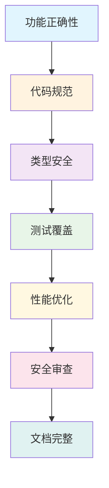

# ✅ 06 质量保证体系

> **建立完整的代码质量保证体系，确保每个改动都符合最高标准**


## 🎯 学习目标

通过本教程，您将：
- ✅ **建立质量意识**：理解代码质量的重要性和标准
- 🔧 **掌握质量工具**：熟练使用所有质量检查工具
- 🚀 **自动化流程**：建立自动化的质量检查流程
- 📊 **监控质量指标**：跟踪和改善代码质量指标
- 🎯 **持续改进**：建立持续的质量改进机制

## 🏗️ 质量保证体系架构

### 质量金字塔



### 质量检查流程


## 🔧 质量检查工具

### 1. 代码格式检查

#### Black - 代码格式化

```bash
# 检查代码格式
uv run black . --check

# 自动格式化代码
uv run black .

# 格式化特定文件
uv run black tree_sitter_analyzer/core/engine.py

# 显示差异
uv run black . --diff
```

**配置示例** (`pyproject.toml`)：
```toml
[tool.black]
line-length = 88
target-version = ['py310']
include = '\.pyi?$'
extend-exclude = '''
/(
  # directories
  \.eggs
  | \.git
  | \.hg
  | \.mypy_cache
  | \.tox
  | \.venv
  | build
  | dist
)/
'''
```

#### isort - 导入排序

```bash
# 检查导入排序
uv run isort . --check-only

# 自动排序导入
uv run isort .

# 显示差异
uv run isort . --diff

# 仅检查特定文件
uv run isort tree_sitter_analyzer/ --check-only
```

**配置示例** (`pyproject.toml`)：
```toml
[tool.isort]
profile = "black"
multi_line_output = 3
line_length = 88
known_first_party = ["tree_sitter_analyzer"]
```

### 2. 代码质量检查

#### Ruff - 快速代码检查

```bash
# 检查代码质量
uv run ruff check .

# 自动修复可修复的问题
uv run ruff check . --fix

# 显示详细错误信息
uv run ruff check . --output-format=text

# 检查特定规则
uv run ruff check . --select E,W,F

# 忽略特定规则
uv run ruff check . --ignore E501,W503
```

**配置示例** (`pyproject.toml`)：
```toml
[tool.ruff]
target-version = "py310"
line-length = 88
select = [
    "E",  # pycodestyle errors
    "W",  # pycodestyle warnings
    "F",  # pyflakes
    "I",  # isort
    "B",  # flake8-bugbear
    "C4", # flake8-comprehensions
    "UP", # pyupgrade
]
ignore = [
    "E501",  # line too long
    "B008",  # do not perform function calls in argument defaults
]

[tool.ruff.per-file-ignores]
"__init__.py" = ["F401"]
"tests/*" = ["B011"]
```

#### MyPy - 类型检查

```bash
# 严格类型检查
uv run mypy tree_sitter_analyzer/

# 显示错误详情
uv run mypy tree_sitter_analyzer/ --show-error-codes

# 生成类型检查报告
uv run mypy tree_sitter_analyzer/ --html-report mypy-report

# 检查特定文件
uv run mypy tree_sitter_analyzer/core/engine.py

# 忽略导入错误
uv run mypy tree_sitter_analyzer/ --ignore-missing-imports
```

**配置示例** (`pyproject.toml`)：
```toml
[tool.mypy]
python_version = "3.10"
warn_return_any = true
warn_unused_configs = true
disallow_untyped_defs = true
disallow_incomplete_defs = true
check_untyped_defs = true
disallow_untyped_decorators = true
no_implicit_optional = true
warn_redundant_casts = true
warn_unused_ignores = true
warn_no_return = true
warn_unreachable = true
strict_equality = true

[[tool.mypy.overrides]]
module = [
    "tree_sitter.*",
    "tree_sitter_analyzer.languages.*",
]
ignore_missing_imports = true
```

### 3. 测试和覆盖率

#### Pytest - 单元测试

```bash
# 运行所有测试
uv run pytest

# 运行特定测试文件
uv run pytest tests/test_core/

# 运行特定测试函数
uv run pytest tests/test_core/test_engine.py::test_analyze

# 显示详细输出
uv run pytest -v

# 显示覆盖率
uv run pytest --cov=tree_sitter_analyzer

# 生成HTML覆盖率报告
uv run pytest --cov=tree_sitter_analyzer --cov-report=html

# 生成XML覆盖率报告（CI用）
uv run pytest --cov=tree_sitter_analyzer --cov-report=xml
```

**配置示例** (`pytest.ini`)：
```ini
[tool:pytest]
testpaths = tests
python_files = test_*.py
python_classes = Test*
python_functions = test_*
addopts = 
    --strict-markers
    --strict-config
    --cov=tree_sitter_analyzer
    --cov-report=term-missing
    --cov-report=html:htmlcov
    --cov-report=xml
    --cov-fail-under=90
markers =
    slow: marks tests as slow (deselect with '-m "not slow"')
    integration: marks tests as integration tests
    unit: marks tests as unit tests
```

### 4. 自定义质量检查

#### 项目专用检查

```bash
# 运行项目质量检查
uv run python check_quality.py

# 仅检查新代码
uv run python check_quality.py --new-code-only

# 检查特定文件
uv run python check_quality.py --file tree_sitter_analyzer/core/engine.py

# 生成质量报告
uv run python check_quality.py --report
```

#### LLM代码检查

```bash
# 运行LLM代码检查
uv run python llm_code_checker.py --check-all

# 检查特定规则
uv run python llm_code_checker.py --rules naming,complexity

# 生成检查报告
uv run python llm_code_checker.py --report --output report.json
```

## 🚀 自动化质量流程

### 1. 预提交钩子

#### 安装预提交钩子

```bash
# 安装pre-commit
uv add pre-commit

# 初始化预提交配置
pre-commit install

# 运行所有钩子
pre-commit run --all-files
```

#### 预提交配置 (`.pre-commit-config.yaml`)

```yaml
repos:
  - repo: https://github.com/pre-commit/pre-commit-hooks
    rev: v4.4.0
    hooks:
      - id: trailing-whitespace
      - id: end-of-file-fixer
      - id: check-yaml
      - id: check-added-large-files
      - id: check-merge-conflict
      - id: check-case-conflict

  - repo: https://github.com/psf/black
    rev: 23.3.0
    hooks:
      - id: black
        language_version: python3.10

  - repo: https://github.com/pycqa/isort
    rev: 5.12.0
    hooks:
      - id: isort
        args: ["--profile", "black"]

  - repo: https://github.com/astral-sh/ruff-pre-commit
    rev: v0.0.270
    hooks:
      - id: ruff
        args: [--fix]
      - id: ruff-format

  - repo: local
    hooks:
      - id: mypy
        name: mypy
        entry: uv run mypy
        language: system
        types: [python]
        pass_filenames: false

      - id: pytest
        name: pytest
        entry: uv run pytest
        language: system
        types: [python]
        pass_filenames: false
```

### 2. 本地质量脚本

#### 创建质量检查脚本 (`scripts/quality_check.sh`)

```bash
#!/bin/bash

echo "🔍 开始质量检查..."

# 代码格式检查
echo "📝 检查代码格式..."
uv run black . --check || { echo "❌ 代码格式检查失败"; exit 1; }
uv run isort . --check-only || { echo "❌ 导入排序检查失败"; exit 1; }

# 代码质量检查
echo "🔧 检查代码质量..."
uv run ruff check . || { echo "❌ 代码质量检查失败"; exit 1; }

# 类型检查
echo "📊 检查类型安全..."
uv run mypy tree_sitter_analyzer/ || { echo "❌ 类型检查失败"; exit 1; }

# 运行测试
echo "🧪 运行测试..."
uv run pytest --cov=tree_sitter_analyzer --cov-fail-under=90 || { echo "❌ 测试失败"; exit 1; }

# 项目专用检查
echo "🎯 运行项目专用检查..."
uv run python check_quality.py --new-code-only || { echo "❌ 项目质量检查失败"; exit 1; }

echo "✅ 所有质量检查通过！"
```

#### 创建快速检查脚本 (`scripts/quick_check.sh`)

```bash
#!/bin/bash

echo "⚡ 快速质量检查..."

# 仅运行关键检查
uv run black . --check --quiet
uv run ruff check . --quiet
uv run pytest --tb=short -q

echo "✅ 快速检查完成！"
```

### 3. CI/CD配置

#### GitHub Actions配置 (`.github/workflows/quality.yml`)

```yaml
name: Quality Check

on:
  push:
    branches: [ main, develop ]
  pull_request:
    branches: [ main, develop ]

jobs:
  quality:
    runs-on: ubuntu-latest
    strategy:
      matrix:
        python-version: ["3.10", "3.11", "3.12"]

    steps:
    - uses: actions/checkout@v3

    - name: Set up Python ${{ matrix.python-version }}
      uses: actions/setup-python@v4
      with:
        python-version: ${{ matrix.python-version }}

    - name: Install uv
      uses: astral-sh/setup-uv@v1
      with:
        version: "latest"

    - name: Install dependencies
      run: |
        uv sync --extra dev --extra test --extra mcp

    - name: Check code formatting
      run: |
        uv run black . --check
        uv run isort . --check-only

    - name: Check code quality
      run: |
        uv run ruff check .

    - name: Check type safety
      run: |
        uv run mypy tree_sitter_analyzer/

    - name: Run tests
      run: |
        uv run pytest --cov=tree_sitter_analyzer --cov-report=xml

    - name: Upload coverage to Codecov
      uses: codecov/codecov-action@v3
      with:
        file: ./coverage.xml
        flags: unittests
        name: codecov-umbrella

    - name: Run project quality checks
      run: |
        uv run python check_quality.py --new-code-only
        uv run python llm_code_checker.py --check-all
```

## 📊 质量指标监控

### 1. 覆盖率监控

#### 覆盖率配置

```toml
[tool.coverage.run]
source = ["tree_sitter_analyzer"]
omit = [
    "*/tests/*",
    "*/test_*",
    "*/__pycache__/*",
    "*/migrations/*",
]

[tool.coverage.report]
exclude_lines = [
    "pragma: no cover",
    "def __repr__",
    "if self.debug:",
    "if settings.DEBUG",
    "raise AssertionError",
    "raise NotImplementedError",
    "if 0:",
    "if __name__ == .__main__.:",
    "class .*\\bProtocol\\):",
    "@(abc\\.)?abstractmethod",
]
```

#### 覆盖率报告示例

```bash
# 生成详细覆盖率报告
uv run pytest --cov=tree_sitter_analyzer --cov-report=html --cov-report=term-missing

# 查看覆盖率趋势
uv run coverage report --show-missing
```

### 2. 质量指标仪表板

#### 创建质量报告脚本 (`scripts/quality_report.py`)

```python
#!/usr/bin/env python3
"""生成质量报告"""

import subprocess
import json
import datetime
from pathlib import Path

def run_command(cmd):
    """运行命令并返回结果"""
    try:
        result = subprocess.run(cmd, shell=True, capture_output=True, text=True)
        return result.returncode == 0, result.stdout, result.stderr
    except Exception as e:
        return False, "", str(e)

def generate_quality_report():
    """生成质量报告"""
    report = {
        "timestamp": datetime.datetime.now().isoformat(),
        "metrics": {}
    }
    
    # 代码行数统计
    success, output, error = run_command("find tree_sitter_analyzer -name '*.py' | xargs wc -l")
    if success:
        report["metrics"]["total_lines"] = output.strip().split()[-2]
    
    # 测试覆盖率
    success, output, error = run_command("uv run pytest --cov=tree_sitter_analyzer --cov-report=json")
    if success:
        coverage_data = json.loads(output)
        report["metrics"]["coverage"] = coverage_data["totals"]["percent_covered"]
    
    # 代码质量检查
    success, output, error = run_command("uv run ruff check . --output-format=json")
    if success:
        issues = json.loads(output)
        report["metrics"]["ruff_issues"] = len(issues)
    
    # 类型检查
    success, output, error = run_command("uv run mypy tree_sitter_analyzer/ --json-report")
    if success:
        mypy_data = json.loads(output)
        report["metrics"]["mypy_errors"] = len(mypy_data.get("summary", {}).get("error", []))
    
    # 保存报告
    report_file = Path("quality_report.json")
    with open(report_file, "w") as f:
        json.dump(report, f, indent=2)
    
    print(f"📊 质量报告已生成: {report_file}")
    return report

if __name__ == "__main__":
    generate_quality_report()
```

## 🎯 质量最佳实践

### 1. 代码规范

#### 命名规范

```python
# ✅ 好的命名
class UserService:
    def get_user_by_id(self, user_id: int) -> User:
        pass

# ❌ 不好的命名
class user_service:
    def get_user_by_id(self, id: int) -> User:
        pass
```

#### 类型注解

```python
# ✅ 完整的类型注解
from typing import List, Optional, Dict, Any

def process_users(users: List[User], config: Optional[Dict[str, Any]] = None) -> List[ProcessedUser]:
    pass

# ❌ 缺少类型注解
def process_users(users, config=None):
    pass
```

#### 文档字符串

```python
# ✅ 完整的文档字符串
def analyze_code(file_path: str, language: Optional[str] = None) -> AnalysisResult:
    """
    分析代码文件的结构和复杂度。
    
    Args:
        file_path: 要分析的文件路径
        language: 编程语言（可选，自动检测）
    
    Returns:
        AnalysisResult: 包含分析结果的对象
    
    Raises:
        FileNotFoundError: 当文件不存在时
        LanguageNotSupportedError: 当语言不被支持时
    
    Example:
        >>> result = analyze_code("example.py")
        >>> print(result.summary)
    """
    pass
```

### 2. 错误处理

#### 使用自定义异常

```python
# ✅ 使用项目自定义异常
from tree_sitter_analyzer.exceptions import LanguageNotSupportedError, FileAnalysisError

def analyze_file(file_path: str) -> AnalysisResult:
    try:
        # 分析逻辑
        pass
    except UnsupportedLanguageError as e:
        raise LanguageNotSupportedError(f"Language not supported: {e.language}") from e
    except Exception as e:
        raise FileAnalysisError(f"Failed to analyze {file_path}") from e
```

#### 错误上下文

```python
# ✅ 提供错误上下文
def safe_analyze(file_path: str) -> AnalysisResult:
    try:
        return analyze_file(file_path)
    except Exception as e:
        logger.error(f"Analysis failed for {file_path}: {e}")
        raise AnalysisError(f"Failed to analyze {file_path}") from e
```

### 3. 测试策略

#### 测试金字塔

```python
# 单元测试（最多）
def test_analyze_method():
    """测试方法分析功能"""
    code = "def hello(): pass"
    result = analyze_method(code)
    assert result.name == "hello"
    assert result.params == 0

# 集成测试（中等）
def test_analyze_java_file():
    """测试Java文件分析"""
    result = analyze_file("test.java")
    assert result.language == "java"
    assert len(result.methods) > 0

# 端到端测试（最少）
def test_cli_analysis():
    """测试CLI分析功能"""
    result = subprocess.run(["python", "-m", "tree_sitter_analyzer", "test.java"])
    assert result.returncode == 0
```

## ✅ 验证学习成果

### 自我评估

- [ ] 我能够运行所有质量检查工具
- [ ] 我理解代码质量标准和最佳实践
- [ ] 我能够配置自动化质量流程
- [ ] 我能够监控和改善质量指标
- [ ] 我能够解决常见的质量问题

### 实战练习

1. **基础检查**：运行所有质量检查工具
2. **配置优化**：根据项目需求调整工具配置
3. **自动化设置**：配置预提交钩子和CI/CD
4. **质量监控**：建立质量指标监控系统
5. **持续改进**：分析质量报告并实施改进

## 🚀 下一步

继续您的质量保证学习之旅：

1. **🛠️ [故障排除指南](07_troubleshooting.md)** - 学习问题诊断和解决
2. **🤖 [AI提示词库](08_prompt_library.md)** - 掌握LLM集成技巧
3. **📋 [实战任务清单](09_tasks.md)** - 完成综合练习

---

**✅ 恭喜！您已经掌握了完整的质量保证体系！**

**👉 继续学习：[07 故障排除指南](07_troubleshooting.md)**


