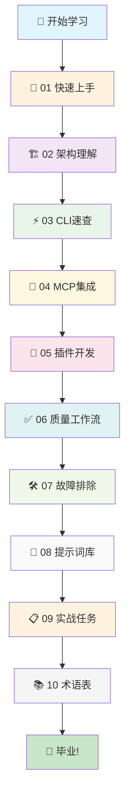

# 🚀 Tree-sitter Analyzer 大师级教程

> **从零基础到专家级，打造超越Udemy五星课程的学习体验**


## 📚 课程概览

本教程系列专为**零基础快速接管**与**新成员高效上手**设计，采用**渐进式学习**和**实践导向**的教学方法。通过精心设计的课程结构，您将在1-3天内完成初步接管，1-2周内达到高效开发与扩展水平。

### 🎯 学习目标

- ✅ **环境搭建**：30分钟内完成开发环境配置
- ✅ **核心概念**：掌握Tree-sitter解析原理和项目架构
- ✅ **实战技能**：熟练使用CLI和MCP工具进行代码分析
- ✅ **扩展开发**：能够开发新的语言插件和功能
- ✅ **质量保证**：掌握完整的开发工作流和测试方法

### 📊 学习路径图



## 📖 课程目录

| 章节 | 标题 | 难度 | 时间 | 重点 |
|------|------|------|------|------|
| [01](01_onboarding.md) | 🚀 零基础快速上手 | ⭐ | 30-60分钟 | 环境搭建、首次运行 |
| [02](02_architecture_map.md) | 🏗️ 架构深度解析 | ⭐⭐ | 45-90分钟 | 系统架构、数据流 |
| [03](03_cli_cheatsheet.md) | ⚡ CLI 大师级速查 | ⭐⭐ | 30-60分钟 | 命令组合、高级用法 |
| [04](04_mcp_cheatsheet.md) | 🔌 MCP 集成专家 | ⭐⭐⭐ | 45-75分钟 | AI集成、工具开发 |
| [05](05_plugin_tutorial.md) | 🔧 插件开发实战 | ⭐⭐⭐ | 60-120分钟 | 语言扩展、自定义功能 |
| [06](06_quality_workflow.md) | ✅ 质量保证体系 | ⭐⭐ | 30-60分钟 | 测试、代码质量 |
| [07](07_troubleshooting.md) | 🛠️ 故障排除指南 | ⭐⭐ | 20-40分钟 | 常见问题、解决方案 |
| [08](08_prompt_library.md) | 🤖 AI 提示词库 | ⭐⭐⭐ | 30-60分钟 | LLM集成、最佳实践 |
| [09](09_tasks.md) | 📋 实战任务清单 | ⭐⭐⭐⭐ | 2-4小时 | 综合练习、项目实战 |
| [10](10_glossary.md) | 📚 术语与概念 | ⭐ | 15-30分钟 | 核心概念、专业术语 |

## 🎯 推荐学习路径

### 🚀 快速入门路径（1-2天）
```
01 → 03 → 02 → 06 → 09(T1-T3)
```

### 🔧 开发者路径（3-5天）
```
01 → 02 → 03 → 04 → 05 → 06 → 07 → 09(全部)
```

### 🎓 专家路径（1-2周）
```
完整学习所有章节 → 完成所有实战任务 → 贡献代码或文档
```

## ⚡ 快速开始

### 🖥️ 环境准备

**Windows (PowerShell 7)**
```powershell
# 安装 uv 包管理器
powershell -c "irm https://astral.sh/uv/install.ps1 | iex"

# 克隆项目
git clone https://github.com/aimasteracc/tree-sitter-analyzer.git
cd tree-sitter-analyzer

# 安装依赖
uv sync --extra popular --extra mcp
```

**Linux/macOS**
```bash
# 安装 uv
curl -Ls https://astral.sh/uv/install.sh | sh

# 克隆项目
git clone https://github.com/aimasteracc/tree-sitter-analyzer.git
cd tree-sitter-analyzer

# 安装依赖
uv sync --extra popular --extra mcp
```

### 🎯 首次体验

```bash
# 分析示例代码
uv run python -m tree_sitter_analyzer examples/BigService.java --table=full --quiet

# 运行测试验证环境
uv run pytest -q
```

**期望输出**：您将看到一个结构化的表格，显示Java类的详细信息，包括方法数量、行号范围等。

## 🏆 学习成果

完成本教程后，您将能够：

- 🎯 **独立搭建**完整的开发环境
- 📊 **深度理解**Tree-sitter解析原理
- ⚡ **熟练使用**CLI和MCP工具
- 🔧 **开发扩展**新的语言插件
- ✅ **保证质量**完整的开发工作流
- 🚀 **实战应用**解决真实项目问题

## 🤝 社区支持

- 📖 **文档问题**：提交Issue或PR
- 💬 **技术讨论**：GitHub Discussions
- 🐛 **Bug报告**：GitHub Issues
- ✨ **功能建议**：GitHub Issues

## 📈 学习进度追踪

在每个章节完成后，请标记您的进度：

- [ ] 01 快速上手
- [ ] 02 架构理解  
- [ ] 03 CLI速查
- [ ] 04 MCP集成
- [ ] 05 插件开发
- [ ] 06 质量工作流
- [ ] 07 故障排除
- [ ] 08 提示词库
- [ ] 09 实战任务
- [ ] 10 术语表

---

**🎉 准备好开始您的Tree-sitter Analyzer学习之旅了吗？**

**👉 立即开始：[01 快速上手](01_onboarding.md)**


