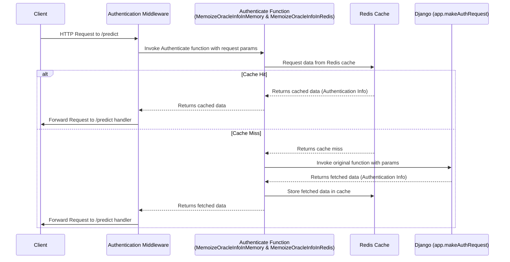
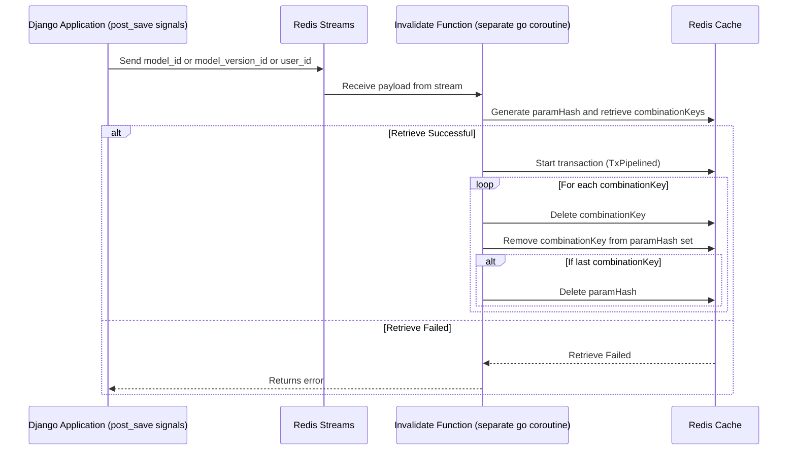

# Beefeater - Authentication & Model Prediction


Beefeater is a Golang application that handles authentication for model prediction requests. It integrates with Django
as the authentication backend and utilizes Redis for caching the authentication results. The application also uses Redis
streams for cache invalidation.

## Routes

The application exposes the following routes:

### Models

- `POST /models/{model_id}/predict`: Endpoint for predicting using a specific model.
- `POST /model_versions/{model_version_id}/predict`: Endpoint for predicting using a specific model version.
- `POST /models/{model_id}/predict_internal`: Endpoint for predicting using a specific model (invoked by pynodes).
- `POST /model_versions/{model_version_id}/predict_internal`: Endpoint for predicting using a specific model version (
  invoked by pynodes).
- `POST /model/{model_id}/{model_version_id}/predict_internal`: Endpoint for predicting using a specific model version (
  invoked by pynodes).
- `/*`: Catch-all route for handling other requests related to models. All non prediction routes are routed to Django.

## Middleware

- `authz.go`: Handles authentication and authorization
- `metrics.go`: Collects and surfaces request/model-specific metrics in Prometheus format.
- `predict.go`: Handles prediction requests, calling the Istio ingress and transforming output to consistent JSON
  format `PredictResponseWrapper`
- `redirect_to_django.go`: Redirects specific requests to Django based on conditions such as Truss version or model
  state. This utilizes a reverse proxying approach.
- `request_logger.go`: Logs incoming requests
- `segment.go`: Integrates with Segment analytics.
- `ratelimiter.go`: Enforces rate limiting policies per API key, currently set at 500 requests per second

The application utilizes several middleware functions for handling different aspects of the requests:

## Development

Build and run beefeater in a codespace environment:

```bash
make run-cs
```

## Caching Sequence Diagram



## Cache Invalidation Sequence Diagram



## Deployment

### Local Env

For running beefeater directly as a process: `make run-cs`
To run with dlv debugger server: `make run-debug` and then in VS Code attach to the configuration `Go Dlv Attach`

### All Internal Environments 

Beefeater deployment is managed by FluxCD, while the configuration (environment variables) is mostly managed by Terraform.

When a change is made to the `/go/beefeater` folder, and get pushed to either `development`, `master`, or `production` branch, the GH workflow `/.github/workflows/golang.yml` will be triggered and does the following
- Checks if the pushed code has any change comparing to the commit SHA of the last successful workflow run on the base (`production` branch). Exit if not
- Builds the app
- Push to docker registry

On the other hand, the FluxCD, managed [here](https://github.com/basetenlabs/flux-cd), will detect the new tag and updates the code based on the policy. The updated code will be pulled and applied to all clusters.

If additional env need to be added
- Env is cluster specific or derived from other TF resources/data sources, update the [configmap](cloud/beefeater/beefeater_configmap.tf) in the baseten-tf-modules repo, merge, create release tag
  - Update `install-modules.tf` on the baseten-deployment repo with the new tag

