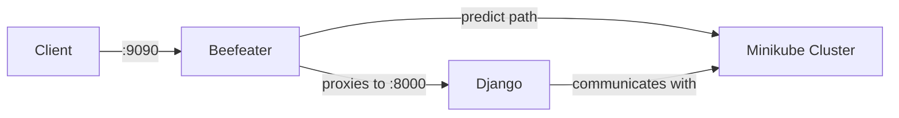

# Baseten Server

## Initial setup

See [instructions in the wiki](/docs/local-dev/Dev-setup.md)

## Running everything

To start all services, run the following script from the project root:

```sh
bin/run_everything.sh
```

You should now be able to access the baseten application at http://localhost:9090

## Prediction with Beefeater and Django

Django does not support calling model prediction directly. Instead, Beefeater acts as an intermediary:

- It sends all non-predict requests to Django
- When it receives a predict request, it calls Djangos `authz` endpoint to check if the user is allowed to make the request and if so calls the model in the minikube cluster.

Here's a flowchart illustrating the process:



## Running individual services
See [bin/run_everything.sh](bin/run_everything.sh) for how we run each service in the project.

### Running beefeater

```sh
cd ./go/beefeater
make run-cs
```

### Running the frontend

```sh
npm run start
```

### Running the Django backend
Run the backend, overriding the `HOST_URL` to point to the beefeater server:

```sh
HOST_URL=http://localhost:9090 uv run python manage.py runserver
```

You should now be able to access the baseten application at http://localhost:9090

### Starting the operator

See [operator/README.md](operator/README.md) for instructions on running the operator server locally.

### Running celery

See [docs/local-dev/how-to-run-celery-locally.md](docs/local-dev/how-to-run-celery-locally.md) for instructions on running celery locally.

### Running the async request service

See [async-request-service/README.md](async-request-service/README.md) for instructions on running the async request service locally.

### Starting the kube event watcher

To start the **kube-event-watcher**, run:

```sh
cd go/kube-watcher
make build
API_KEY=[your api key] HOST_URL=http://localhost:8000 ./event-watcher
```

The API used should be associated to a service account user. You can either change the super user to be one in billip or you create a service account user and an associated API key in `shell_plus`

```
service_user = User.objects.create(username="watcher_service_account", is_service_account=True, password="any password")
UserAPIKey.objects.create_key(user=service_user, name="kube-watcher-api-key")
```

The kube-event-watcher does not yet support live reload. It must be restarted when the code changes

## Testing
In the project root, run:
```
pytest backend/path/to/test_file.py
```

Note: many tests use fixtures that are defined in `backend/conftest.py`

## Pre-commit

Install the pre-commit hooks by running `uv run pre-commit install` on project root.

## More docs

Find them under [/docs](docs).
