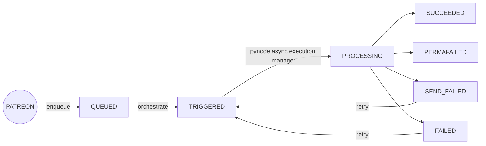

# Patreon Media Transcription

## Context

Patreon (`namespace=org-k9p2lbe`) uses this managed transcription service for transcription of creator media as an API endpoint. Baseten manages all of the inner workings of the application, postgres DB, model, and pynode. At steady state we should see ~500/600 requests per minute during business hours and around half otherwise (as of June 2023). Their pynode (id=`8qjAZ3P`) has a minScale of 10 and requests quite a bit of memory to be able to hold the media downloads. Their model (`model_id=WB5WeRP, model_version_id=w5d6v73`) scales from 1 to 20 replicas.

<details>
<summary>Full context</summary>

Let's go through the lifecycle of a transcription job.



### Enqueue 

Patreon hits the external API endpoint of an enqueue worklet to queue a job for processing, we save this object in the UDM with status `QUEUED`.

### Orchestrate

A scheduled worklet queries the DB for jobs to trigger for transcription, making an async request to the  `transcribe_single_job` worklet and marking with status `TRIGGERED`.
This is governed by the `MAX_CONCUCCRENT_TRANSCRIPTION_JOBS` in `orchestrate.py` that limits the number of new jobs to be triggered based on the number of in-flight jobs (those with status `TRIGGERED` or `PROCESSING`).

### Transcribe_single_job worklet

Downloads the media from the signed url, chunks it, and sends binary content as input to [`whisper_medium_raw_audio`](https://app.baseten.co/models/WB5WeRP/versions/w5d6v73/overview) using the `/predict_internal` enpoint make available by `context.invoke_model`

This job is processed until completion or failure and is marked `SUCCESSFUL` or `FAILED`, respectively. Failures are accompanied with a `failure_reason`. Failed jobs are retried – once they exhaust the retries they are marked as `PERMAFAILED`

### Webhook

We send the result of these jobs back to a Patreon webhook for ingestion. Upon failure, this job is marked as `SEND_FAILED` and retry is attempted.
</details>

## Issues + Mitigation

### Job Failures

`FAILED` or `PERMAFAILED` jobs will have a `failure_reason` associated with them in the DB. They can indicate one of two failures:
- Failure to download the media from the presigned url (Needs intervention from Patreon)
  - Expired presigned url (`403` status code)
  - Missing media asset (`404` status code)
- No audio found
  - This `failure_reason` is set when a job has made no progress (i.e. no chunks have been transcribed) but the media download is successful. This behavior can be mimiced if there is a large internal Baseten issue with model invocations.


### Queue growing too fast
- This application serves running traffic so the most common issue that arises is falling behind the queue, which can be queried with the query `Number of Queued Jobs`. This value is normally within the single digits.
- Mitigation: Patch the ksvc of the model and pynodes to increase the number of replicas

  > `kubectl edit ksvc baseten-model-w5d6v73`

  > `kubectl edit ksvc w-8qjaz3p-patreon-baseten-py-production`

  ```
  spec:
  template:
    metadata:
      annotations:
        autoscaling.knative.dev/maxScale: "20" # edit this value
        autoscaling.knative.dev/minScale: "1"
  ```
  

### Large number of `PERMAFAILED` jobs
- Many `PERMAFAILED` jobs can indicate that there is something wrong with invoking the model – specifically from the `/predict_internal` endpoint. This needs to be investigated as it is likely an internal error.
- Mitigation: After resolving the issue – these failed jobs can be requeued by running the query `Requeue Permafailed Jobs in Last Hour` or some variant of this query against the production environment. Jobs with `failure_reasons` that indicate some error with downloading the media file (response code `403/404`) should not be retried. Please be careful when using this query as it affects the running service and what Patreon sees from their webhook.

