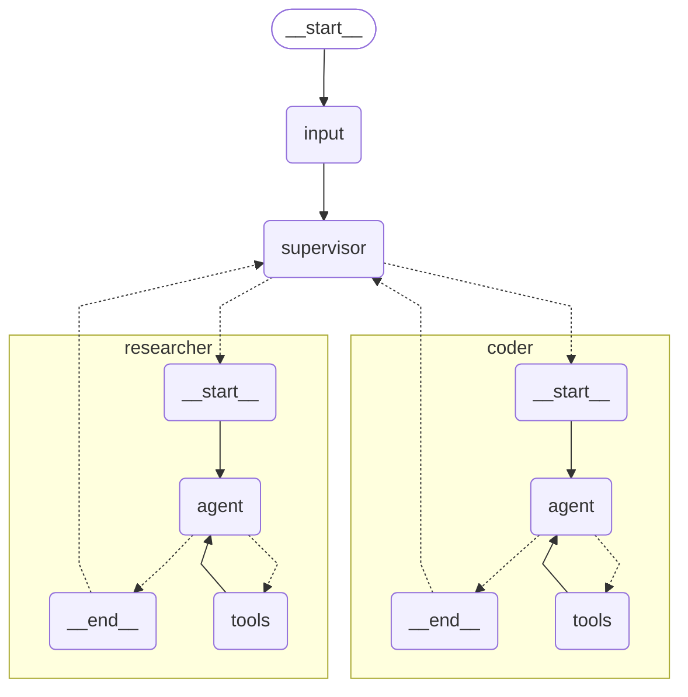

# Multi-Agent Supervisor System

This repository demonstrates a LangGraph-based multi-agent system where a supervisor coordinates between a researcher and a coder to solve complex tasks.

## Architecture

The system consists of three primary agents:
- **Supervisor**: Manages the conversation flow and determines which specialized agent should act next
- **Researcher**: Performs web searches using Tavily to gather information
- **Coder**: Executes Python code to perform calculations and analysis



## How It Works

1. The user provides a question or task
2. The supervisor evaluates the task and routes it to the appropriate specialized agent
3. The specialized agent (researcher or coder) processes the task using its tools
4. The specialized agent returns its results to the supervisor
5. The supervisor either routes to another agent or finalizes the response when the task is complete

## Features

- **Routing**: The supervisor dynamically decides which agent is best suited for each step
- **Web Search**: The researcher agent can search the web for up-to-date information using Tavily
- **Code Execution**: The coder agent can execute Python code to perform calculations and analysis
- **Structured I/O**: Uses Pydantic models for clean input/output interfaces

## Requirements

- Python 3.10+
- LangGraph
- Anthropic API key (for Claude)
- Tavily API key (for web search)

## Installation

```bash
uv venv -p 3.11 .venv
.venv\Scripts\activate
uv sync
```

Set your API keys as environment variables in .env

```bash
ANTHROPIC_API_KEY=your_anthropic_api_key
TAVILY_API_KEY=your_tavily_api_key
```

## Usage

### Command Line

You can run the agent directly using UiPath:

```bash
uipath run agent '{"question": "What is the square root of 42?"}'
```

### In Code

```python
from your_module import graph

# Create input in the expected format
input_data = {"question": "What is the square root of 42?"}

# Run the graph
result = graph.invoke(input_data)

# Access the answer
print(result["answer"])
```


## Safety Notes

The coder agent uses a Python REPL that executes code locally, which can be unsafe without proper sandboxing. This is intended for development and demonstration purposes only. In production, consider using a sandboxed execution environment.
