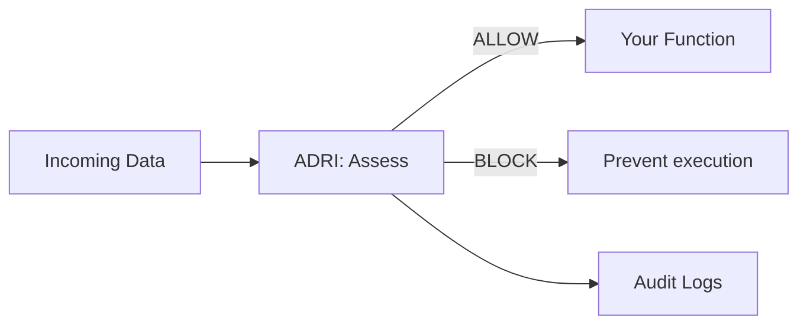

# ADRI Architecture Guide

Simple, clear explanations of how ADRI works and why each piece matters. This page is intended for maintainers and contributors; user-facing documentation lives under the Users section.

## ADRI in 30 Seconds

- The Problem: AI agents break when you feed them bad data.
- The Solution: One decorator that checks data quality before your function runs.
- The Result: Prevent failures and ship reliable agents faster.

```python
@adri_protected  # This line prevents most AI agent failures
def your_agent_function(data):
    return expensive_ai_call(data)  # Now protected from bad data
```

## How ADRI Works (The Flow)



### Five Dimensions

- Validity · Completeness · Consistency · Plausibility · Freshness

## Components Overview

### Guard Decorator (src/adri/decorator.py)
- Intercepts function calls and enforces on_failure: raise | warn | continue
- Visible, explicit configuration (standard, data_param, min_score, dimensions)

### Validator Engine (src/adri/validator/)
- Loads data, applies rules, returns AssessmentResult with dimension scores
- Multi-format loading (CSV/JSON/Parquet), detailed failure reporting
- **Pipeline Architecture**: ValidationPipeline coordinates dimension assessors

### Protection Modes (src/adri/guard/modes.py)
- FailFastMode, SelectiveMode, WarnOnlyMode orchestrated by DataProtectionEngine

### Standards System (src/adri/standards/)
- YAML rule loading via StandardsParser; schema.yaml drives structure

### Analysis (src/adri/analysis/)
- **Data Profiler**: Statistical analysis and profiling of datasets
- **Standard Generator**: Creates YAML standards from data analysis with modular architecture:
  - **Field Inference Engine** (field_inference.py): Field-level type and constraint inference
  - **Dimension Requirements Builder** (dimension_builder.py): Builds dimension scoring requirements
  - **Standard Builder** (standard_builder.py): Assembles complete ADRI standards
  - **Explanation Generator** (explanation_generator.py): Human-readable explanations
- **Rule Inference**: Advanced constraint inference with coverage strategies
- **Type Inference**: Smart data type detection with coercion handling

### Configuration (src/adri/config/)
- Creates `ADRI/<env>` paths, loads overrides, sane defaults

### Logging (src/adri/logging/)
- Local CSV/JSON logs and Enterprise streaming (Verodat MCP)

### CLI (src/adri/cli.py)
- setup, generate-standard, assess, list/show/validate-standard, show-config, list-assessments

## Helper Architecture Notes (v4.x refactor)

This section documents the internal helper responsibilities introduced to reduce cyclomatic complexity while preserving behavior and public APIs.

- Validator Engine (src/adri/validator/engine.py)
  - _compute_validity_rule_counts(data, field_requirements) -> (counts, per_field_counts)
    - Applies validity rules in strict order per value with short-circuit on first failure:
      type → allowed_values → length_bounds → pattern → numeric_bounds → date_bounds
    - Produces:
      - counts: `{rule: {"passed": int, "total": int}}`
      - per_field_counts: `{field: {rule: {"passed": int, "total": int}}}`
  - _apply_global_rule_weights(counts, rule_weights_cfg, RULE_KEYS) -> (Sg, Wg, applied_global)
    - Normalizes weights: clamp negatives to 0, drop unknown rules, filter to active rule-types (total > 0).
    - If the sum of active weights is 0, equalize per active rule-type and record a scoring warning.
  - _apply_field_overrides(per_field_counts, overrides_cfg, RULE_KEYS) -> (So, Wo, applied_overrides)
    - Per-field, per-rule-type overrides; unknown rules ignored; negatives clamped to 0 with a warning.
  - _assemble_validity_explain(counts, per_field_counts, applied_global, applied_overrides) -> dict
    - Produces the explain payload shape consumed by reports and tests:
      ```jsonc
      {
        "rule_counts": "…",
        "per_field_counts": "…",
        "applied_weights": {
          "global": "…",
          "overrides": "…"
        }
      }
      ```
  - _assess_validity_with_standard(...)
    - Orchestrates: compute counts → apply global weights → apply overrides.
    - Uses S = (Sg + So) / (Wg + Wo) on 0..1, then scales to 0..20.
    - If no applicable weighted components (W == 0), returns default 18.0/20 and records a warning.
    - Caches explain payload under metadata["explain"]["validity"] with stable schema.

- Standard Generator (src/adri/analysis/standard_generator.py)
  - Type/nullability and rule inference
    - _infer_type_and_nullability(...): strict nullability (nullable=False only if 0% nulls); type mapping prioritizes datetime → date hints → numeric coercion → boolean → string.
    - _infer_allowed_values(...): suppressed for PK/id-like columns; supports "coverage" and "tolerant" strategies with thresholds.
    - _infer_numeric_bounds(...): robust strategies (iqr/quantile/mad) or span margin; returns floats; coerces numeric where safe.
    - _infer_length_and_pattern(...): min/max length; regex pattern only when enabled and coverage is 100%.
    - _infer_date_or_datetime_bounds(...): emits correct key names for date vs datetime bounds.
  - Training-pass guarantee
    - _prepare_observed_stats(...): precomputes min/max length and numeric min/max to support safe widening.
    - _validate_value_against_rules(...): strict rule order to identify the failing rule key.
    - _relax_constraint_for_failure(...): relaxes only the failing rule and logs under `metadata.explanations.<column>.adjustments` with before/after where applicable.
    - _enforce_training_pass(...): iterates up to 2 passes to converge; ensures training data passes while preserving explain logging.
  - Explanations
    - _build_explanations composes per-rule helpers (_explain_type/_nullable/_allowed_values/_length/_range/_date/_pattern) without affecting enforcement.

Explain payload skeleton for validity in engine:
```json
{
  "validity": {
    "rule_counts": { "type": {"passed": 10, "total": 12}, "...": "..." },
    "per_field_counts": { "fieldA": { "type": {"passed": 5, "total": 6}, "...": "..." } },
    "applied_weights": {
      "global": { "type": 1.0, "allowed_values": 1.0, "...": 1.0 },
      "overrides": { "fieldA": { "pattern": 2.0 } }
    }
  }
}
```

Invariants preserved by the refactor:
- Public APIs unchanged; same score scaling (0..20 per dimension; overall scaled to 0..100).
- Explain payload keys and shapes unchanged.
- Weighted scoring semantics (global + per-field overrides) unchanged.
- Training-pass relaxation logs adjustments with the same structure.

## Quality and Testing

We implement comprehensive testing beyond basic line coverage:

### Testing Approach ✅ IMPLEMENTED
- **Unit Tests**: 21 comprehensive unit test files covering all major components
- **Integration Tests**: 4 integration test files validating component interactions
- **Performance Tests**: 2 benchmark suites for optimization and regression prevention
- **Functional Tests**: 40+ end-to-end scenario validations across the entire system
- **Quality Framework**: Centralized testing utilities and modern fixture patterns

### Multi-Dimensional Quality Metrics
- **Line Coverage**: Comprehensive test coverage across all modules
- **Integration Tests**: Cross-component interaction validation
- **Error Handling**: Edge case and failure path testing
- **Performance**: Benchmark baselines and regression testing

### Test Quality Validation ✅ COMPLETE
- **Helper-Level Stability Tests**: Added for refactored components (StandardGenerator, ValidationEngine)
- **No Test Redundancy**: Systematic analysis confirmed no duplicate coverage
- **Current Test Coverage**: All tests updated to match refactored code architecture
- **Edge Case Coverage**: Comprehensive error path and boundary condition testing
- **Integration Scenarios**: Cross-component interaction validation complete

Quality gates for release ensure critical components are robust and meet Business Critical classification requirements.

## Developer Notes

- Keep user-facing docs in Users section.
- Keep contributor docs in Contributors; link from README to this page.
- Prefer Mermaid diagrams for reviewable architecture visuals.
