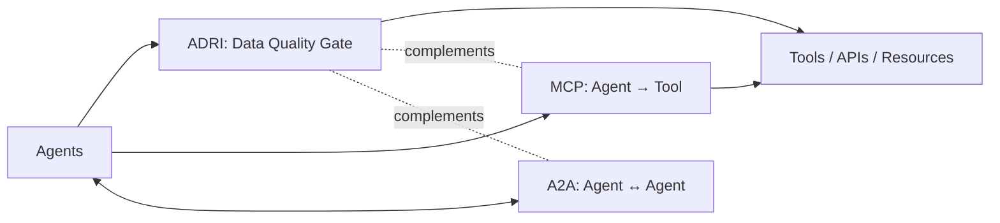

# ADRI Documentation

**Agent Data Readiness Index – Stop AI agents from breaking on bad data**

ADRI is an open-source data quality validation framework built for AI agents. Generate a standard from good data once, wrap your functions with `@adri_protected`, and block dirty payloads before they crash your agents.

## ADRI System Overview

ADRI provides a complete data quality validation system with two entry points: CLI commands for standalone use and the `@adri_protected` decorator for function protection.

```mermaid
flowchart TB
    subgraph Entry["🚪 Entry Points"]
        CLI[CLI Commands<br/>assess, generate, setup]
        DEC[@adri_protected<br/>Decorator]
    end

    subgraph Data["📊 Data Ingestion"]
        LOAD[Data Loaders<br/>CSV, JSON, Parquet]
        PROF[Data Profiler<br/>Pattern Analysis]
    end

    subgraph Standards["📋 Standards System"]
        PARSE[Standards Parser<br/>YAML Loading]
        VALID[StandardValidator<br/>Schema Validation]
        GEN[Standard Generator<br/>Auto-Creation]
        CACHE[Standards Cache]
    end

    subgraph Validation["🔍 Validation Engine"]
        RULES[Validation Rules<br/>Field-Level Checks]
        ENGINE[Assessment Engine<br/>5-Dimension Scoring]
        RESULT[Assessment Result<br/>Score + Failures]
    end

    subgraph Protection["🛡️ Protection Layer"]
        MODES[Protection Modes<br/>raise/warn/continue]
        DECIDE{Decision<br/>Allow or Block?}
    end

    subgraph Output["📝 Output & Logging"]
        LOGS[Audit Logs<br/>5-File Trail]
        REPORT[Assessment Reports<br/>JSON/CSV]
    end

    %% CLI Flow
    CLI --> LOAD
    CLI --> GEN
    LOAD --> PROF
    PROF --> GEN
    GEN --> PARSE

    %% Decorator Flow
    DEC --> LOAD
    DEC --> PARSE

    %% Common Flow
    PARSE --> VALID
    VALID --> CACHE
    CACHE --> RULES
    LOAD --> ENGINE
    RULES --> ENGINE
    ENGINE --> RESULT

    %% Protection Decision
    RESULT --> MODES
    MODES --> DECIDE
    DECIDE -->|Score ≥ min| ALLOW[✅ Function Runs]
    DECIDE -->|Score < min| BLOCK[❌ Protection Error]

    %% Logging
    RESULT --> LOGS
    RESULT --> REPORT
    ALLOW --> LOGS
    BLOCK --> LOGS

    style Entry fill:#e3f2fd,stroke:#2196f3,stroke-width:2px
    style Data fill:#f3e5f5,stroke:#9c27b0,stroke-width:2px
    style Standards fill:#fff3e0,stroke:#ff9800,stroke-width:2px
    style Validation fill:#e8f5e9,stroke:#4caf50,stroke-width:2px
    style Protection fill:#ffebee,stroke:#f44336,stroke-width:2px
    style Output fill:#fafafa,stroke:#757575,stroke-width:2px
    style ALLOW fill:#c8e6c9,stroke:#4caf50,stroke-width:3px
    style BLOCK fill:#ffcdd2,stroke:#f44336,stroke-width:3px
```

## ADRI in your stack

ADRI is a data quality gate for agent workflows. It complements related standards you may already use:

- **ADRI**: Validate inputs and enforce a quality contract before tools/actions run (fail-fast, warn, or continue)
- **MCP**: Agent-to-tool connectivity (standard way to connect agents to tools, APIs, and resources). See https://modelcontextprotocol.io/
- **A2A**: Agent-to-agent interoperability (standard messaging between agents across frameworks/vendors). See https://a2a-protocol.org/latest/

Use ADRI with or without MCP/A2A — the goal is to stop bad data from breaking agents right at the boundary.




## Choose Your Path

### 🚀 **Put ADRI to Work**
*Package consumer documentation – ship reliable agents fast*

```bash
pip install adri
adri setup --guide
adri generate-standard examples/data/invoice_data.csv \
  --output examples/standards/invoice_data_ADRI_standard.yaml
adri assess examples/data/test_invoice_data.csv \
  --standard examples/standards/invoice_data_ADRI_standard.yaml
```

```python
from adri import adri_protected

@adri_protected(standard="invoice_data_standard", data_param="invoice_rows")
def your_agent_function(invoice_rows):
    return agent_pipeline(invoice_rows)
```

**📚 User Documentation:**
- **[Getting Started](users/getting-started)** – Installation, walkthrough, and first success
- **[FAQ](users/faq)** – Answers for agent engineers, data teams, and compliance
- **[Framework Playbooks](users/frameworks)** – LangChain, CrewAI, LlamaIndex, LangGraph, Semantic Kernel
- **[Adoption Journey](users/adoption-journey)** – When to switch on Verodat-managed data supply
- **[API Reference](users/API_REFERENCE)** – Complete decorator, CLI, and configuration details
- **[Why Open Source](users/WHY_OPEN_SOURCE)** – Strategy and licensing

### 🛠️ **Contribute to ADRI Community**
*Developer documentation – improve ADRI itself*

**🔧 Contributor Documentation:**
- **[Development Workflow](contributors/development-workflow)** – Local testing and CI setup
- **[Framework Extension Pattern](contributors/framework-extension-pattern)** – Adding new framework support
- **[Code Style Guide](https://github.com/adri-standard/adri/blob/main/CONTRIBUTING.md)** – Contribution guidelines
- **[GitHub Repository](https://github.com/adri-standard/adri)** – Source code and issues

## Key Features

- **🛡️ One-Decorator Protection** – Add `@adri_protected` to any function
- **🤖 Framework Agnostic** – Works with LangChain, CrewAI, AutoGen, LlamaIndex, etc.
- **🚀 Smart Defaults** – Zero-config start with optional tuning
- **📊 Five Dimensions** – Validity, completeness, consistency, plausibility, freshness
- **📋 Flexible Modes** – Fail-fast, warn, or continue for selective flows
- **⚡ Enterprise Ready** – Local-first with a clear path to Verodat MCP

---

**Ready to start?** Hit the getting started guide, then follow the adoption journey when you need shared compliance logging and managed data supply.
