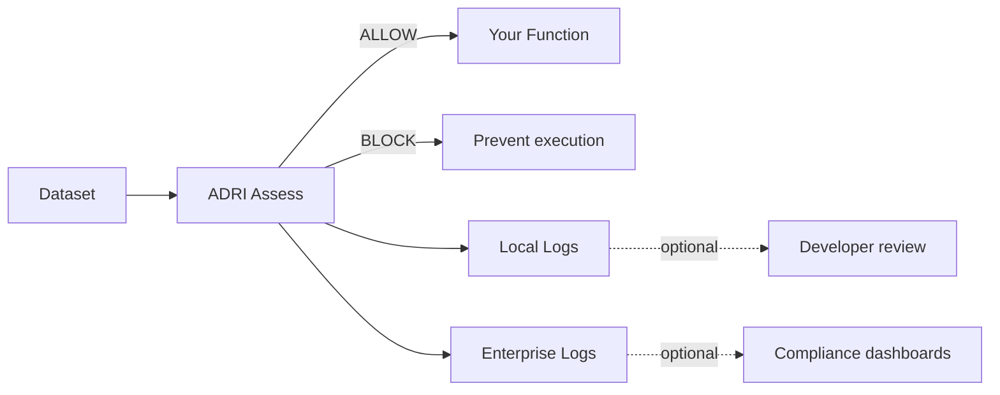

# ADRI Adoption Journey

**Take AI agents from local protection to governed enterprise data supply.** This guide connects the open-source toolkit to Verodat MCP so you know exactly when to switch on managed services.

## Overview

| Step | Outcome | ADRI OSS | Verodat MCP / Enterprise | What to show | Revenue Model |
|------|---------|----------|---------------------------|--------------|---------------|
| 1 | Define data need | ✅ | – | Run `adri setup --guide` and capture "good" data | OSS – Free |
| 2 | Block bad data | ✅ | – | `@adri_protected(..., on_failure="raise")` blocks failures | OSS – Free |
| 3 | Handle error data | ✅ | – | Review JSON reports in `ADRI/dev/assessments` | OSS – Free |
| 4 | Log for dev (local) | ✅ | – | Enable local audit in config, tail CSV logs | OSS – Free |
| 5 | Log for prod | ✅ | ✅ | Send audit events to Verodat workspace | Token burn-down (single app) |
| 6 | Analyse performance & compliance | ✅ | ✅* | Use Claude project connected to Verodat ADRI | Token burn-down |
| 7 | Publish to datasets | ✅ | ✅* | Publish standards to Verodat datasets | Token burn-down + Dataset licence |
| 8 | Prove enterprise scope | ✅ | ✅ | Configure agent tools in `tools.verodat.io` | Token burn-down + Dataset licence |
| 9 | Meet compliance requirements | ✅ | ✅ | Replay logs + controlled data supply | Token burn-down + Dataset licence |
| 10 | Ship AI solutions | ✅ | ✅ | Share ADRI standards in marketplace | Token burn-down + Dataset licence |

> ✅* indicates the open-source edition makes it possible, but Verodat MCP reduces the effort to near-zero.

## Data flow and logging

## Stage 1 – Local Wins (Steps 1–4)

1. **Create standards quickly** – `adri generate-standard` gives you a YAML contract in minutes. Store it in git with your agent code.
2. **Block bad inputs immediately** – Use `@adri_protected(standard="...", data_param="...", on_failure="raise")` in production pathways.
3. **Understand failures** – Inspect the JSON report or call `adri show-standard` to see which rule fired.
4. **Capture local evidence** – Flip the `adri.protection.verbose_protection` flag or enable local audit logs when you need traceability during development.

👉 Deliverable: reliable agents, developer trust, no platform commitment yet.

## Stage 2 – Shared Visibility (Steps 5–7) {#stage-2}

5. **Stream logs to Verodat** – Configure enterprise logging so assessments land in a governed workspace (`adri.logging.enterprise` with Verodat credentials). Product teams and compliance view the same evidence.
6. **Analyse trends with Claude projects** – Use Verodat’s MCP integration to benchmark failure patterns, drill into compliance questions, and auto-generate remediation tickets.
7. **Publish standards as datasets** – Promote validated ADRI standards into Verodat datasets so downstream teams query the same definitions via managed endpoints.

👉 Outcome: single-source-of-truth for standards + logs, lightweight governance, usage-based billing.

## Stage 3 – Enterprise Delivery (Steps 8–10)

8. **Expose agent configuration** – Manage tool access, rate limits, and data supply governance in `tools.verodat.io` so every agent run is compliant by default.
9. **Prove compliance** – Use replayable logs, deterministic data supply, and Verodat audit views to satisfy ISO/SOC/HIPAA reviews.
10. **Ship packaged AI solutions** – Publish ADRI-backed standards to the marketplace so partners consume the same high-quality data contracts.

👉 Outcome: production-grade data supply for AI agents with revenue alignment to usage.

## Implementation Checklist

- [ ] Follow the [Getting Started guide](getting-started.md) to complete Steps 1–4.
- [ ] Enable local audit logging when stakeholders ask for evidence.
- [ ] Schedule a Verodat MCP onboarding session before promoting to production (Steps 5–7).
- [ ] Connect enterprise logging and Claude analysis before compliance reviews (Steps 8–9).
- [ ] Package your standards for marketplace distribution (Step 10).

## How to Talk About the Journey

| Persona | Why it matters | Message |
|---------|----------------|---------|
| Agent engineer | Needs confidence that agents won’t crash on bad data | “Guard your function with one decorator, see the pass/fail score instantly.” |
| Data platform team | Must provide governed data supply | “Publish ADRI standards to Verodat once, let every agent reuse them.” |
| Compliance lead | Requires replayable evidence | “Every assessment is logged locally and can be streamed into your controlled workspace.” |
| Business owner | Wants measurable reliability | “Scorecard every dataset before the agent runs; share dashboards via Verodat MCP.” |

## Ready to Scale?

- Stay in OSS while you iterate quickly and build proof with local auditing.
- When you need shared compliance logging or managed data supply, reach out at [thomas@verodat.com](mailto:thomas@verodat.com) to activate Steps 5–10.

Your first win should happen locally. The adoption journey shows stakeholders how to expand that win into an enterprise deployment without rewriting your agent workflows.
