# Getting Started with ADRI

<p>
  <a href="https://pypi.org/project/adri/" target="_blank" rel="noopener noreferrer">PyPI</a>
  •
  <a href="https://github.com/adri-standard/adri" target="_blank" rel="noopener noreferrer">GitHub</a>
</p>

**Stop AI agents from breaking on bad data in under 5 minutes**


## Step 1 – Install & Bootstrap {#step-install}

```bash
pip install adri

# Create ADRI project folders and sample data
adri setup --guide
```

The guided setup creates `ADRI/dev` and `ADRI/prod` folders plus a sample invoice dataset so you can see ADRI working before wiring it into your own data.

## Step 2 – Generate a Standard from Good Data {#step-generate}

```bash
adri generate-standard examples/data/invoice_data.csv \
  --output examples/standards/invoice_data_ADRI_standard.yaml --guide
```

This command profiles your clean dataset and writes a YAML standard that encodes required fields, value ranges, and freshness expectations. The `--guide` flag explains what ADRI is doing at each step.

## Step 3 – Validate New Data with the Standard {#step-assess}

```bash
adri assess examples/data/test_invoice_data.csv \
  --standard examples/standards/invoice_data_ADRI_standard.yaml --guide
```

What you should see:
- Allowed ✅ when data complies with the generated standard
- Blocked ❌ with a summary of failed checks when the test data violates the standard

```
🛡️ ADRI Protection: BLOCKED ❌
📊 Quality Score: 62.4/100 (Required: 80.0/100)
⚠️ Issues: amount must be > 0, status must be lowercase paid/pending/...
```

When the score is above the threshold ADRI prints `ALLOWED ✅` so you know the data is safe for your agent.

## Step 4 – Protect a Function {#step-protect}

```python
from adri import adri_protected

@adri_protected(standard="invoice_data_standard", data_param="invoice_rows")
def process_invoices(invoice_rows):
    # Your existing agent logic
    return ai_agent(invoice_rows)
```

### What Happens at Runtime

When you call your protected function, ADRI automatically intercepts and validates the data:

```mermaid
flowchart LR
    A[Function Called] --> B[🛡️ ADRI Intercepts]
    B --> C[Load Standard]
    C --> D[Assess Data<br/>5 Dimensions]
    D --> E{Score Check}
    E -->|Pass| F[✅ Run Function]
    E -->|Fail| G[❌ Block/Warn]
    F --> H[Log Result]
    G --> H

    style A fill:#e3f2fd,stroke:#2196f3,stroke-width:2px
    style B fill:#fff3e0,stroke:#ff9800,stroke-width:2px
    style D fill:#f3e5f5,stroke:#9c27b0,stroke-width:2px
    style E fill:#fff9c4,stroke:#fbc02d,stroke-width:2px
    style F fill:#e8f5e9,stroke:#4caf50,stroke-width:2px
    style G fill:#ffebee,stroke:#f44336,stroke-width:2px
```



### Key Parameters

- `standard` – Name of the YAML standard (without `.yaml`) you generated or stored in `ADRI/**/standards`
- `data_param` – The function argument that contains the data you want ADRI to validate
- `min_score` (optional) – Override the required score (default comes from config)
- `on_failure` (optional) – Choose how to respond: `"raise"`, `"warn"`, or `"continue"`

See [Core Concepts](core-concepts.md) for protection modes and the five dimensions.

### Change Failure Handling

```python
# Warn-only: log issues but keep running (great for pilots)
@adri_protected(standard="invoice_data_standard", data_param="invoice_rows", on_failure="warn")

# Selective mode: continue but mark the run
@adri_protected(standard="invoice_data_standard", data_param="invoice_rows", on_failure="continue")

# Strict mode: raise ProtectionError when data fails validation (default)
@adri_protected(standard="invoice_data_standard", data_param="invoice_rows")
```

## Common Framework Patterns

```python
# LangChain
@adri_protected(standard="invoice_data_standard", data_param="invoice_rows")
def langchain_support_agent(invoice_rows):
    chain = prompt | model | parser
    return chain.invoke(invoice_rows)

# CrewAI
@adri_protected(standard="invoice_data_standard", data_param="invoice_rows")
def crewai_market_analysis(invoice_rows):
    crew = Crew(agents=[analyst], tasks=[analysis_task])
    return crew.kickoff(inputs=invoice_rows)

# Generic Python function
@adri_protected(standard="invoice_data_standard", data_param="invoice_rows")
def your_agent_function(invoice_rows):
    return your_ai_framework(invoice_rows)
```

## Configure ADRI (Optional)

Create `ADRI/config.yaml` (or edit the generated one) to customise defaults:

```yaml
adri:
  project_name: "invoice-agents"
  default_environment: "development"

  protection:
    default_min_score: 80
    default_failure_mode: "raise"   # raise | warn | continue
    cache_duration_hours: 1
    auto_generate_standards: true
    verbose_protection: false

  environments:
    development:
      paths:
        standards: "./ADRI/dev/standards"
        assessments: "./ADRI/dev/assessments"
        training_data: "./ADRI/dev/training-data"
      protection:
        default_min_score: 75
        default_failure_mode: "warn"
    production:
      paths:
        standards: "./ADRI/prod/standards"
        assessments: "./ADRI/prod/assessments"
        training_data: "./ADRI/prod/training-data"
      protection:
        default_min_score: 90
        default_failure_mode: "raise"
```

## What ADRI Validates

ADRI automatically checks **five dimensions**:
- **Validity** – Correct formats (emails, dates, enumerations)
- **Completeness** – Required fields populated
- **Consistency** – Data types and formats aligned
- **Plausibility** – Realistic value ranges
- **Freshness** – Data recency and relevance

## Logs & Audit Trail

Every assessment captures:
- Console summary (success/failure + score)
- JSON reports in `ADRI/**/assessments`
- Optional CSV audit trail when enabled
- Enterprise mode streaming to Verodat MCP (see [Adoption Journey](adoption-journey.md))

## Troubleshooting

**`ValueError: Could not find data parameter`** – Make sure `data_param` matches the name of the argument in your protected function.

**`Standard file not found`** – Confirm the path you pass to `--standard` exists. Use `adri list-standards` to see registered files.

**Validation too strict?** – Lower the threshold temporarily:
```python
@adri_protected(standard="your_data_standard", data_param="invoice_rows", min_score=60)
```

**See what ADRI is checking** – Inspect the YAML:
```bash
adri show-standard invoice_data_standard
```

## Next Steps

1. **[Work through a framework playbook](frameworks.md)** – Copy/paste solutions for LangChain, CrewAI, LlamaIndex, and more.
2. **[Review the FAQ](faq.md)** – Understand logging, standards, and roadmap.
3. **[Explore real examples](https://github.com/adri-standard/adri/tree/main/examples/use_cases)** – Business scenarios and walkthroughs.
4. **[Follow the Adoption Journey](adoption-journey.md)** – Know when to turn on Verodat-managed supply.

---

Need help? Open an [issue on GitHub](https://github.com/adri-standard/adri/issues) or join the discussion.

## Next steps

<p>
  <a class="button button--primary button--sm" href="frameworks">Framework Playbooks</a>
  <a class="button button--secondary button--sm margin-left--sm" href="core-concepts">Core Concepts</a>
  <a class="button button--secondary button--sm margin-left--sm" href="API_REFERENCE">API Reference</a>
  <a class="button button--outline button--sm margin-left--sm" href="adoption-journey">Adoption Journey</a>
</p>
