# VoiceType Architecture

This document describes the architecture of VoiceType, a voice-to-text application built on a pipeline architecture.

## System Overview

VoiceType uses a **pipeline-based architecture** where user actions (hotkey presses) trigger pipelines consisting of sequential stages. The system supports concurrent pipeline execution through resource-based locking.

## Architecture Diagram

```mermaid
classDiagram
    %% Main Application Entry Point
    class main {
        +load_settings()
        +get_platform_listener()
        +create managers and services
        +run()
    }

    %% Core Pipeline System
    class PipelineManager {
        -resource_manager: ResourceManager
        -icon_controller: IconController
        -executor: PipelineExecutor
        -pipelines: Dict[str, PipelineConfig]
        -hotkey_to_pipeline: Dict[str, str]
        +load_pipelines(config)
        +get_pipeline_by_name(name)
        +get_pipeline_by_hotkey(hotkey)
        +trigger_pipeline(name, event, metadata)
        +shutdown()
    }

    class PipelineExecutor {
        -resource_manager: ResourceManager
        -icon_controller: IconController
        -executor: ThreadPoolExecutor
        -active_pipelines: Dict[str, Future]
        +execute_pipeline(name, stages, trigger, metadata)
        -_execute_pipeline()
        +cancel_pipeline(id)
        +shutdown()
    }

    class PipelineConfig {
        +name: str
        +enabled: bool
        +hotkey: str
        +stages: List[Dict]
    }

    %% Resource Management
    class ResourceManager {
        -_locks: Dict[Resource, Lock]
        -_pipeline_resources: Dict[str, Set[Resource]]
        +get_required_resources(stages)
        +can_acquire(pipeline_id, resources)
        +acquire(pipeline_id, resources, blocking, timeout)
        +release(pipeline_id)
        +get_blocked_by(resources)
    }

    class Resource {
        <<enumeration>>
        AUDIO_INPUT
        KEYBOARD
        CLIPBOARD
    }

    %% Hotkey Management
    class HotkeyDispatcher {
        -pipeline_manager: PipelineManager
        -active_events: Dict[str, HotkeyTriggerEvent]
        -hotkey_listener: HotkeyListener
        -default_metadata: Dict
        +register_hotkey(hotkey, on_press, on_release)
        +set_hotkey_listener(listener)
        -_on_press(hotkey)
        -_on_release(hotkey)
        +register_all_pipelines()
    }

    class HotkeyListener {
        <<interface>>
        +set_hotkey(hotkey)
        +start_listening()
        +stop_listening()
    }

    class PynputHotkeyListener {
        -on_hotkey_press: Callable
        -on_hotkey_release: Callable
        -hotkey_string: str
        -listener: pynput.Listener
        +set_hotkey(hotkey)
        +start_listening()
        +stop_listening()
    }

    %% Pipeline Context and Triggers
    class PipelineContext {
        +config: Dict[str, Any]
        +icon_controller: IconController
        +trigger_event: TriggerEvent
        +cancel_requested: Event
        +metadata: Dict[str, Any]
    }

    class TriggerEvent {
        <<abstract>>
        +wait_for_completion(timeout)
        +is_complete()
    }

    class HotkeyTriggerEvent {
        -_release_event: Event
        +signal_release()
        +wait_for_completion(timeout)
        +is_complete()
    }

    %% Stage Registry and Stages
    class StageRegistry {
        -_stages: Dict[str, StageMetadata]
        +register(name, input_type, output_type, description, resources)
        +get(name)
        +validate_pipeline(stage_names)
    }

    class StageMetadata {
        +name: str
        +function: Callable
        +input_type: Type
        +output_type: Type
        +description: str
        +required_resources: Set[Resource]
    }

    class record_audio {
        <<stage function>>
        +record_audio(input, context) → TemporaryAudioFile
    }

    class transcribe {
        <<stage function>>
        +transcribe(audio_file, context) → str
    }

    class type_text_stage {
        <<stage function>>
        +type_text_stage(text, context) → None
    }

    %% Audio Processing
    class SpeechProcessor {
        -device_id: int
        -sample_rate: int
        -stream: InputStream
        -is_recording: bool
        +start_recording()
        +stop_recording() → (filename, duration)
        +transcribe_audio(audio_file, provider)
    }

    class TemporaryAudioFile {
        +filepath: str
        +duration: float
        +cleanup()
    }

    %% User Interface
    class TrayIconController {
        -icon: pystray.Icon
        -_flashing: bool
        -_flash_thread: Thread
        +set_icon(state, duration)
        +start_flashing(state)
        +stop_flashing()
    }

    class IconController {
        <<protocol>>
        +set_icon(state, duration)
        +start_flashing(state)
        +stop_flashing()
    }

    %% Application Context
    class AppContext {
        +state: AppState
        +speech_processor: SpeechProcessor
        +hotkey_listener: HotkeyListener
    }

    class AppState {
        -_state: State
        +state: State
    }

    class State {
        <<enumeration>>
        IDLE
        LISTENING
        RECORDING
        PROCESSING
    }

    %% Relationships - Pipeline System
    main --> PipelineManager : creates
    main --> ResourceManager : creates
    main --> HotkeyDispatcher : creates
    main --> SpeechProcessor : creates
    main --> TrayIconController : creates
    main --> AppContext : creates

    PipelineManager --> PipelineExecutor : owns
    PipelineManager --> PipelineConfig : manages
    PipelineManager --> ResourceManager : uses
    PipelineManager --> IconController : uses

    PipelineExecutor --> ResourceManager : uses
    PipelineExecutor --> IconController : uses
    PipelineExecutor --> PipelineContext : creates
    PipelineExecutor --> StageRegistry : queries

    HotkeyDispatcher --> PipelineManager : triggers
    HotkeyDispatcher --> HotkeyListener : uses
    HotkeyDispatcher --> HotkeyTriggerEvent : creates

    ResourceManager --> Resource : manages

    PipelineContext --> IconController : uses
    PipelineContext --> TriggerEvent : contains

    TriggerEvent <|-- HotkeyTriggerEvent : implements

    HotkeyListener <|-- PynputHotkeyListener : implements

    IconController <|-- TrayIconController : implements

    StageRegistry --> StageMetadata : stores
    StageMetadata --> Resource : specifies

    %% Relationships - Stages
    record_audio --> SpeechProcessor : uses
    record_audio --> PipelineContext : receives
    record_audio --> TemporaryAudioFile : returns

    transcribe --> SpeechProcessor : uses
    transcribe --> TemporaryAudioFile : receives
    transcribe --> PipelineContext : receives

    type_text_stage --> PipelineContext : receives

    %% Relationships - Application Context
    AppContext --> AppState : contains
    AppContext --> SpeechProcessor : contains
    AppContext --> HotkeyListener : contains

    AppState --> State : uses
```



## Component Descriptions

### Main Application (`__main__.py`)

The application entry point that:
- Loads configuration from `settings.toml`
- Initializes all core services and managers
- Creates the platform-specific hotkey listener
- Sets up the system tray icon
- Runs the main event loop

### Pipeline System

#### PipelineManager
Central coordinator for pipeline configuration and execution. It:
- Loads pipeline configurations from settings
- Validates pipeline compatibility and hotkey uniqueness
- Routes trigger events to the appropriate pipeline
- Manages pipeline lifecycle

#### PipelineExecutor
Handles the actual execution of pipeline stages. It:
- Runs pipelines on a thread pool (non-blocking)
- Acquires and releases resources atomically
- Creates and manages `PipelineContext` for each execution
- Handles errors and triggers cleanup of temporary resources
- Updates the system tray icon based on pipeline state

#### PipelineConfig
Data class representing a configured pipeline with:
- Unique name
- Enabled/disabled state
- Associated hotkey
- List of stage configurations

### Resource Management

#### ResourceManager
Provides fine-grained resource locking to enable concurrent pipeline execution:
- Manages locks for `AUDIO_INPUT`, `KEYBOARD`, and `CLIPBOARD`
- Acquires resources atomically (all-or-nothing)
- Tracks which resources each pipeline holds
- Prevents resource conflicts between concurrent pipelines

#### Resource (Enum)
Defines the system resources that can be locked:
- `AUDIO_INPUT`: Microphone/audio capture device
- `KEYBOARD`: Virtual keyboard for typing
- `CLIPBOARD`: System clipboard

### Hotkey Management

#### HotkeyDispatcher
Bridges hotkey events to pipeline execution:
- Registers hotkeys for enabled pipelines
- Creates `HotkeyTriggerEvent` instances on key press
- Signals trigger completion on key release
- Passes default metadata (like `speech_processor`) to pipelines

#### HotkeyListener (Interface)
Platform-agnostic hotkey listening interface. Implementations:
- `PynputHotkeyListener`: Uses pynput for Linux/Windows/macOS

### Pipeline Context and Triggers

#### PipelineContext
Shared state passed to all stages in a pipeline execution:
- `config`: Stage-specific configuration from settings
- `icon_controller`: Interface to update system tray icon
- `trigger_event`: Optional trigger event (e.g., hotkey)
- `cancel_requested`: Event for pipeline cancellation
- `metadata`: Shared data between stages (e.g., `speech_processor`)

#### TriggerEvent (Abstract)
Represents an event that started a pipeline. Implementations:
- `HotkeyTriggerEvent`: Tracks hotkey press/release lifecycle

### Stage Registry

#### StageRegistry
Global registry of all available pipeline stages:
- Registers stages with metadata (name, types, resources)
- Validates type compatibility between stages
- Provides stage lookup for pipeline execution

#### StageMetadata
Metadata about a registered stage:
- Function reference
- Input/output types for validation
- Required resources for locking
- Human-readable description

### Pipeline Stages

Stages are pure functions with signature: `(input_data, context) -> output_data`

#### record_audio
- **Input**: `None` (first stage)
- **Output**: `Optional[TemporaryAudioFile]`
- **Resources**: `AUDIO_INPUT`
- Records audio until trigger completes or timeout
- Filters out recordings shorter than minimum duration

#### transcribe
- **Input**: `TemporaryAudioFile`
- **Output**: `Optional[str]`
- **Resources**: None
- Transcribes audio file using OpenAI Whisper (local or API)
- Returns transcribed text or None if empty

#### type_text_stage
- **Input**: `str`
- **Output**: `None`
- **Resources**: `KEYBOARD`
- Types the text into the active application using virtual keyboard

### Audio Processing

#### SpeechProcessor
Handles audio recording and transcription:
- Records audio from microphone using `sounddevice`
- Saves recordings to temporary WAV files
- Transcribes audio using Whisper (local or litellm)
- Provides real-time RMS monitoring (for future use)

#### TemporaryAudioFile
Wrapper for temporary audio files with automatic cleanup:
- Stores file path and duration
- Implements `cleanup()` method called by PipelineExecutor
- Ensures temporary files are always cleaned up

### User Interface

#### TrayIconController
System tray icon implementation:
- Displays different icons for different states (idle, recording, processing, error)
- Supports flashing for visual feedback
- Implements the `IconController` protocol
- Provides menu for enabling/disabling and viewing logs

#### IconController (Protocol)
Interface for controlling the system tray icon:
- `set_icon(state)`: Change icon to idle/recording/processing/error
- `start_flashing(state)`: Flash icon for attention
- `stop_flashing()`: Stop flashing

### Application Context

#### AppContext
Legacy context for tray icon compatibility:
- Stores application state (`IDLE`, `LISTENING`, `RECORDING`, `PROCESSING`)
- Holds references to `SpeechProcessor` and `HotkeyListener`
- Used primarily by tray icon menu

## Execution Flow

### Startup Sequence

1. **Load Settings**
   - Parse `settings.toml` for configuration
   - Load pipeline configurations

2. **Initialize Services**
   - Create `SpeechProcessor` for audio handling
   - Create `ResourceManager` for resource locking
   - Create `TrayIconController` for UI

3. **Initialize Pipeline System**
   - Create `PipelineManager` with resource manager and icon controller
   - Load and validate all pipeline configurations
   - Create `HotkeyDispatcher` with default metadata

4. **Setup Hotkeys**
   - Create platform-specific `HotkeyListener`
   - Register hotkey callbacks that delegate to `HotkeyDispatcher`
   - Start listening for hotkeys

5. **Run**
   - Start system tray icon (blocks until user quits)

### Pipeline Execution Flow

1. **Hotkey Press**
   - User presses configured hotkey
   - `HotkeyListener` calls `on_hotkey_press()`
   - `HotkeyDispatcher._on_press()` is called
   - System plays START_RECORD_SOUND
   - Creates `HotkeyTriggerEvent`
   - Triggers pipeline via `PipelineManager`

2. **Pipeline Startup**
   - `PipelineManager` looks up pipeline configuration
   - Passes to `PipelineExecutor.execute_pipeline()`
   - `ResourceManager` checks if required resources are available
   - If available: acquires resources and submits to thread pool
   - If blocked: logs warning and returns None

3. **Stage Execution** (on worker thread)
   - Create `PipelineContext` with config, icon controller, trigger event
   - For each stage in pipeline:
     - Check for cancellation
     - Get stage function from `StageRegistry`
     - Update context config with stage-specific settings
     - Execute stage function: `result = stage_func(input_data, context)`
     - Track any cleanup tasks from returned objects
     - Pass result to next stage
   - On error: log error, set icon to "error", raise exception

4. **Hotkey Release**
   - User releases hotkey
   - `HotkeyListener` calls `on_hotkey_release()`
   - `HotkeyDispatcher._on_release()` signals the trigger event
   - Recording stage completes and returns audio file

5. **Pipeline Completion**
   - Final stage completes
   - `finally` block runs cleanup tasks
   - `ResourceManager` releases acquired resources
   - Icon controller resets to "idle"

### Example: Voice-to-Text Pipeline

```
User presses <pause>
    ↓
HotkeyListener detects press
    ↓
HotkeyDispatcher creates HotkeyTriggerEvent
    ↓
PipelineManager triggers "voice_to_text" pipeline
    ↓
PipelineExecutor acquires AUDIO_INPUT and KEYBOARD
    ↓
record_audio stage:
    - Starts recording
    - Sets icon to "recording"
    - Waits for trigger completion
    ↓
User releases <pause>
    ↓
HotkeyDispatcher signals trigger event
    ↓
record_audio stage:
    - Stops recording
    - Returns TemporaryAudioFile(path, duration)
    ↓
transcribe stage:
    - Calls SpeechProcessor.transcribe_audio()
    - Returns transcribed text
    ↓
type_text_stage:
    - Uses pynput to type text
    - Returns None
    ↓
PipelineExecutor cleanup:
    - Calls TemporaryAudioFile.cleanup()
    - Releases AUDIO_INPUT and KEYBOARD
    - Sets icon to "idle"
```

## Design Principles

### 1. Pipeline Architecture
Stages are composable, pure functions that can be chained together. Each stage:
- Has well-defined input and output types
- Declares required resources
- Receives context for configuration and services
- Returns data for the next stage or cleanup objects

### 2. Resource-Based Concurrency
Instead of a global lock, fine-grained resource locking allows multiple pipelines to run concurrently when they don't conflict. For example:
- A voice-to-text pipeline (uses AUDIO_INPUT + KEYBOARD)
- Can run alongside a clipboard-to-speech pipeline (uses CLIPBOARD only)

### 3. Separation of Concerns
- **PipelineManager**: Configuration and routing
- **PipelineExecutor**: Execution and resource management
- **HotkeyDispatcher**: Trigger event handling
- **ResourceManager**: Resource locking
- **StageRegistry**: Stage registration and validation

### 4. Non-Blocking Execution
Pipelines run on a thread pool, keeping the hotkey listener responsive:
- Hotkey press → immediate return
- Pipeline execution → worker thread
- Hotkey release → signal event
- Icon updates → main thread via IconController

### 5. Type Safety
The `StageRegistry` validates pipeline compatibility at startup:
- Checks output type of stage N matches input type of stage N+1
- Detects type mismatches before runtime
- Provides clear error messages

### 6. Automatic Resource Cleanup
`PipelineExecutor` ensures cleanup always happens:
- Temporary files are deleted even on errors
- Resources are released even on exceptions
- `finally` block guarantees cleanup

## Configuration

Pipelines are configured in `settings.toml`:

```toml
[[pipelines]]
name = "voice_to_text"
enabled = true
hotkey = "<pause>"

[[pipelines.stages]]
func = "record_audio"
max_duration = 60.0
minimum_duration = 0.25

[[pipelines.stages]]
func = "transcribe"
provider = "local"  # or "litellm"

[[pipelines.stages]]
func = "type_text"
```

## Extension Points

### Adding a New Stage

1. Define stage function:
   ```python
   @STAGE_REGISTRY.register(
       name="my_stage",
       input_type=str,
       output_type=str,
       description="My custom stage",
       required_resources={Resource.CLIPBOARD}
   )
   def my_stage(input_data: str, context: PipelineContext) -> str:
       # Process input_data
       # Use context.config for stage-specific settings
       # Use context.icon_controller to update UI
       return processed_data
   ```

2. Import in `voicetype/pipeline/stages/__init__.py`

3. Add to pipeline configuration in `settings.toml`

### Adding a New Resource

1. Add to `Resource` enum in `resource_manager.py`:
   ```python
   class Resource(Enum):
       AUDIO_INPUT = "audio_input"
       KEYBOARD = "keyboard"
       CLIPBOARD = "clipboard"
       MY_RESOURCE = "my_resource"  # New resource
   ```

2. ResourceManager will automatically create a lock for it

3. Stages can now declare `required_resources={Resource.MY_RESOURCE}`

### Adding a New Trigger Type

1. Subclass `TriggerEvent`:
   ```python
   class TimerTriggerEvent(TriggerEvent):
       def __init__(self, duration: float):
           self._timer = threading.Timer(duration, self._on_timeout)

       def wait_for_completion(self, timeout: float) -> bool:
           # Implementation
   ```

2. Create a dispatcher (like `HotkeyDispatcher`)

3. Register with `PipelineManager`

## Future Enhancements

1. **Multi-Hotkey Support**: Extend `HotkeyListener` to support multiple simultaneous hotkeys
2. **Pipeline Chaining**: Allow pipelines to trigger other pipelines
3. **Conditional Stages**: Support branching logic in pipelines
4. **Stage Configuration UI**: GUI for configuring pipeline stages
5. **Metrics and Monitoring**: Track pipeline execution times and resource usage
6. **Error Sound**: Add error sound playback to pipeline error handling (currently missing)
